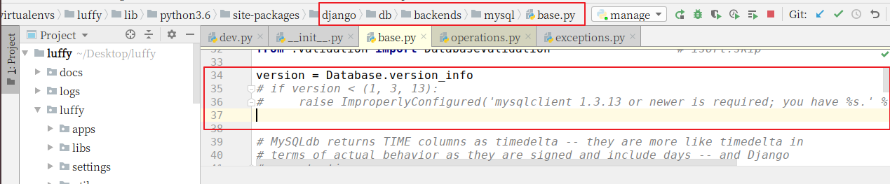

# 荏苒资讯后端项目搭建

## 创建项目

项目所在路径不要使用中文或者空格或者除了下划线的其它特殊符号

```bash
cd ~/Desktop
mkdir renran
cd renran
django-admin startproject renranapi
```

## 打开项目

在 PyCharm 中打开项目


选择菜单 file, 点选 settings... 设置虚拟环境


点击右边的齿轮，选择 Add...


选择已存在的虚拟环境，并选择正确的 python 文件


启动 django 项目中的 `manage.py`


因为仅启动 manage.py，所以项目不会运行，所以需要配置启动 `manage.py` 的参数。


点选 `Edit Configurations`，在新窗口中的 Parammeters 中加上以下内容：

```bash
runserver 0.0.0.0:8000
```


再次运行 `manage.py`


效果：


提示：

在 PyCharm 中如果要使用已经创建好的虚拟环境，则必须设置 PyCharm 中的 Python 解释器，设置为虚拟环境中的 python。


## 调整目录

```
reran/
  ├── docs/          # 项目相关资料保存目录
  ├── reran_pc/     # 前端项目目录
  ├── reranapi/      # api服务端项目目录
       ├── logs/          # 项目运行时/开发时日志目录
       ├── manage.py
       ├── reranapi/      # 项目主应用，开发时的代码保存
       │    ├── apps/      # 开发者的代码保存目录，以模块[子应用]为目录保存
       │    ├── libs/      # 第三方类库的保存目录[第三方组件、模块]
       │    ├── settings/
       │         ├── dev.py   # 项目开发时的本地配置[不需要上传到线上或者服务器]
       │         ├── prod.py  # 项目上线时的运行配置
       │    ├── urls.py    # 总路由
       │    ├── utils/     # 多个模块[子应用]的公共函数类库[自己开发的组件]
       └── scripts/       # 保存项目运营时的脚本文件
```

在编辑中开发项目时，必须指定项目目录才能运行。例如，开发后端项目，则必须选择的目录是 renranapi

### 分不同环境进行项目配置

开发者本地的环境、目录、数据库密码和线上的服务器都会不一样,所以我们的配置文件可以针对不同的系统分成多分.

1. 在项目主应用下,创建一个 settings 的配置文件存储目录
2. 根据线上线下两种情况分别创建 2 个配置文件 `dev.py` 和 `prod.py`
3. 把原来项目主应用的 `settings.py` 配置内容复制 2 份到 `dev.py` 和 `prod.py` 里面
4. 把原来的 `settings.py` 配置文件修改文件名，例如 `settings_old.py` 或者直接删除 `settings.py`

新的配置文件目录 settings：


接下来就可以在 `manage.py` 中根据不同的开发环境导入对应的配置文件了.


## 创建代码版本

cd 进入到自己希望存储代码的目录路径，并创建本地仓库 `.git`【pycharm直接打开终端就是项目根目录了。无须cd了】
新创建的本地仓库.git是个空仓库

```bash
cd 目录路径
git init
```

### 配置用户名和邮箱

用户姓名和邮箱写真实的即可。

```bash
git config --global user.name 'Shuo Liu'
git config --global user.email 'liushuo432@outlook.com'
```

## 在 Gitee 平台创建工程

公司一般都会有自己的代码仓库，一般都是自己搭建，也有使用第三方提供代码管理平台。

常用的代码管理平台：GitHub、Gitee（码云）、GitLab。

如果公司自己搭建的代码管理平台，往往使用 GitLab 框架。

### 创建私有项目库

创建一个名为 renran 的仓库，基本啥也不用选，建立个空白仓库就行。


创建私有/公有空仓库以后的界面：


### 克隆项目到本地

注意：我们当前项目不需要这个步骤，这个步骤当以后我们进入公司里面，参与人家已经在做的项目时会用到。别人已经有仓库了，但是我们是新人加入项目中，那么我们不需要在自己本地进行 `git init`，直接 `git clone` 复制别人的仓库代码就好。

注意：如果当前目录下出现git仓库同名目录时，会克隆失败。

```bash
git clone 仓库地址
```

### 编辑 `.gitignore`

编辑项目版本根目录的 `.gitignore` 把一些不需要版本控制的文件过滤掉。

```bash
vim .gitignore
```

向其中写入如下内容：

```
.git
.idea
__pycache__
db.sqlite3
node_modules
```

### git 提交

直接使用命令即可

```shell
git add 代码目录   # 添加代码到上传队列  多个目录或文件  git add 文件1 文件2 目录1 目录2....
git status        # 查看当前项目的版本状态
git commit -m '添加项目代码'  # 提交代码到本地仓库， -m 表示本次提交的描述
```

### 创建并切换分支到 dev

```
# git branch dev      # 创建本地分支dev,dev是自定义
# git checkout dev    # 切换本地分支代码
git checkout -b dev   # 这里是上面两句代码的简写
git branch -d dev     # 删除分支
```

### 推送到远端

```shell
git remote add origin https://gitee.com/mooluo/renran.git
git push origin dev:dev
```

如果推送代码时，出现这样的提示：`git pull ....`，则表示当前本地的代码和线上的代码版本不同。要解决这个问题，可以按照以下两个步骤尝试解决：

1. 把线上的代码执行以下命令,拉取到本地,进行同步

   ```bash
   git pull
   ```

2. 根据提示，移除多余的冲突的文件，也可以删除。完成这些步骤以后，再次 add，commit，push 即可。

### 上传代码至远程仓库

接下来，我们就把上面创建好的本地项目提交到 Gitee 码云上面

```bash
# .表示当前目录下所有的文件或目录提交到上传队列[上传队列也叫"暂存区"]
# 切换当前工作目录到项目根目录 cd ~/Desktop/renran/
git add .

# 把本地上传队列的代码提交到本地仓库
git commit -m "项目初始化搭建"

# 给本地的git版本控制软件设置项目的远程仓库地址
git remote add origin https://gitee.com/moluo/renran.git

# 提交代码给远程仓库
git push -u origin master
```

扩展：

```
通过 git status 可以查看当前项目的代码版本状态
通过 git reflog 可以查看代码版本日志[简单格式]
通过 git log    可以查看代码版本日志[详细格式]
```

最终就可以成功提交代码版本到 Gitee 平台。

### 从 git 中删除文件

上面虽然成功移交了代码版本，但是一些不需要的文件也被提交上去了。

所以，我们针对一些不需要的文件，可以选择从代码版本中删除，并且使用 `.gitignore` 把这些垃圾文件过滤掉。

```bash
git rm 文件  # 删除单个文件
git rm -rf 目录  # 递归删除目录

# 以下操作建议通过ubuntu的终端来完成，不要使用pycharm提供，否则删除.idea还会继续生成。
git rm -rf .idea
git rm db.sqlite3
# 注意，上面的操作只是从项目的源代码中删除，但是git是不知情的，所以我们需要同步。
git add .
git commit -m "删除不必要的文件或目录"
git push -u origin master
```

### 使用 PyCharm 管理 git

开发时我们经常会使用 PyCharm 的提供的 git 管理工具来完成代码的拉取和推送。


## 日志配置

日志等级说明：

- DEBUG，开发人员用于测试
- INFO，运行项目时的基本提示信息
- WARNING，警告，代码会继续往下执行，如果解析器没有执行到这行代码，则不会报错
- ERROR，严重错误，代码不会继续往下执行，如果解析器没有执行到当前代码，则不会报错
- CRITICAL，致命错误，代码不会往下执行，在运行程序之初，还没有开始执行代码之前，解析器会先进行语法检测，在语法检测的时候，程序已经终止了

在 `settings/dev.py` 文件中追加如下配置：

```python
# 日志配置
LOGGING = {
    'version': 1,
    'disable_existing_loggers': False,
    'formatters': { # 日志的处理格式
        'verbose': {
            'format': '%(levelname)s %(asctime)s %(module)s %(lineno)d %(message)s'
        },
        'simple': {
            'format': '%(levelname)s %(module)s %(lineno)d %(message)s'
        },
    },
    'filters': {
        'require_debug_true': {
            '()': 'django.utils.log.RequireDebugTrue',
        },
    },
    'handlers': {
        'console': {
            'level': 'DEBUG',
            'filters': ['require_debug_true'],
            'class': 'logging.StreamHandler',
            'formatter': 'simple'
        },
        'file': {
            'level': 'INFO',
            'class': 'logging.handlers.RotatingFileHandler',
            # 日志位置,日志文件名,日志保存目录必须手动创建
            'filename': os.path.join(os.path.dirname(BASE_DIR), "logs/renran.log"),
            # 单个日志文件的最大值,这里我们设置300M
            'maxBytes': 300 * 1024 * 1024,
            # 备份日志文件的数量,设置最大日志数量为10
            'backupCount': 10,
            # 日志格式:详细格式
            'formatter': 'verbose'
        },
    },
    # 日志对象
    'loggers': {
        'django': { # 固定，将来django内部也会有异常的处理，只会调用django下标的日志对象
            'handlers': ['console', 'file'],
            'propagate': True, # 是否让日志信息继续冒泡给其他的日志处理系统
        },
    }
}
```

## 异常处理

新建 `utils/exceptions.py` 文件，并在其中写入下面的代码：

```python
from rest_framework.views import exception_handler

from django.db import DatabaseError
from rest_framework.response import Response
from rest_framework import status

import logging
logger = logging.getLogger('django')


def custom_exception_handler(exc, context):
    """
    自定义异常处理
    :param exc: 异常类
    :param context: 抛出异常的上下文
    :return: Response响应对象
    """
    # 调用drf框架原生的异常处理方法
    response = exception_handler(exc, context)

    if response is None:
        view = context['view']
        if isinstance(exc, DatabaseError):
            # 数据库异常
            logger.error('[%s] %s' % (view, exc))
            response = Response({'message': '服务器内部错误'}, status=status.HTTP_507_INSUFFICIENT_STORAGE)

    return response
```

然后在 `settings/dev.py` 配置文件中添加异常处理的句柄：

```python
REST_FRAMEWORK = {
    # 异常处理
    'EXCEPTION_HANDLER': 'renranapi.utils.exceptions.custom_exception_handler',
}
```

## 创建数据库

先登录数据库：

```bash
mysql -uroot -p
```

然后创建数据库：

```mysql
create database renran default charset=utf8mb4;
```

为当前项目创建数据库用户（这个用户只能看到这个数据库）：

```mysql
create user renran_user identified by 'renran';
grant all privileges on renran.* to 'renran_user'@'%';
flush privileges;
```

## 配置数据库连接

打开 `settings/dev.py` 文件，并配置：

```python
DATABASES = {
    "default": {
        "ENGINE": "django.db.backends.mysql",
        "HOST": "127.0.0.1",
        "PORT": 3306,
        "USER": "renran_user",
        "PASSWORD": "renran",
        "NAME": "renran",
    }
}
```

在项目主模块的 `__init__.py` 中导入 pymysql：

```python
import pymysql

pymysql.install_as_MySQLdb()
```

#### 调整错误

因为我们用的是 Django 2.2.0 版本，启动项目时会导致错误，所以需要修改一下源代码。

数据库版本检测导致的错误：


数据库的版本检测代码注释掉：



重启项目，又出现了另一个关于 bytes 转换编码的问题，错误如下：


第二个错误也是因为数据库版本的默认编码导致，query 返回的内容格式使用有误。

修改一行代码，把 query 查询结果转换格式改为 bytes类型

```python
query = query.decode(errors='replace')
# 改为下面：
query = query.encode(errors='replace')
```

此时，先不要执行数据库迁移指令，因为我们后面要创建认证信息的数据表，可能会与系统自动生成的产生冲突，未来会造成各种各样的问题。
