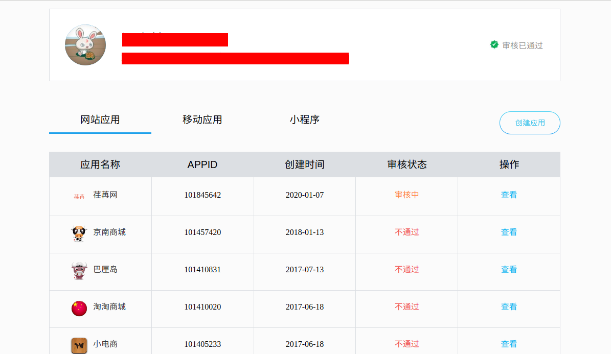
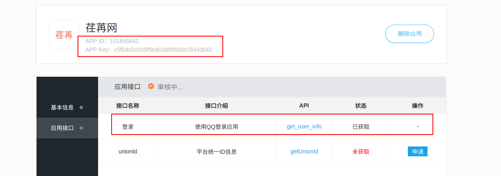
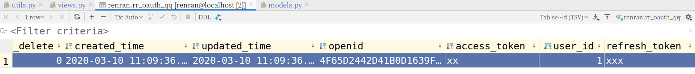

## 荏苒资讯 QQ 第三方登录实现

### 前期准备

我们所说的第三方登录，是指用户可以不在本项目中输入密码，而直接通过第三方的验证，成功登录荏苒网。

要开发第三方登录功能，必须要成为 QQ 互联开发者。然后创建应用，即获取当前项目与 QQ 互联的应用 ID，创建应用的方法参考链接 http://wiki.connect.qq.com/__trashed-2



申请创建开发应用以后, 需要经过人工审核,这个时间一般是一个工作日或者半个工作日。

审核的状态会影响我们开发者开发第三方登录,状态有三种:

```
1. 不通过和未审核的应用，是无法开发QQ第三方登录功能的
2. 只有已通过的应用才可以开发
```

点击刚才申请的应用，进入到项目里面获取 APPID 和 APP KEY。



QQ 登录开发文档连接：http://wiki.connect.qq.com/%E5%87%86%E5%A4%87%E5%B7%A5%E4%BD%9C_oauth2-0

### QQ 第三方登录的实现流程


### 创建模型类

创建一个新的应用 oauth，用来实现 QQ 第三方认证登录。

```bash
cd renranapi/apps
python ../../manage.py startapp oauth
```

注册子应用到 `settings/dev.py` 中，代码:

```python
INSTALLED_APPS = [
    'django.contrib.admin',
    'django.contrib.auth',
    'django.contrib.contenttypes',
    'django.contrib.sessions',
    'django.contrib.messages',
    'django.contrib.staticfiles',

    'corsheaders',
    'xadmin',
    'crispy_forms',
    'reversion',
    'rest_framework',
    
    'users',
    'oauth',
]
```

在 `models.py` 中定义 QQ 身份（openid）与用户模型类 User 的关联关系类：

```python
from django.db import models

from renranapi.utils.models import BaseModel
from users.models import User

# Create your models here.

class OAuthQQUser(BaseModel):
    """
    QQ登录用户数据
    """
    qq_user = models.OneToOneField(to=User, on_delete=models.CASCADE, verbose_name='QQ 用户名')
    qq_openid = models.CharField(max_length=64, verbose_name='QQ 账号 openid', db_index=True)
    qq_access_token = models.CharField(max_length=500, verbose_name="临时访问票据", help_text="有效期:3个月")
    class Meta:
        db_table = 'rr_oauth_qq'
        verbose_name = 'QQ 登录用户数据'
        verbose_name_plural = verbose_name
```

在项目目录下的 `renranapi/utils/models.py` 中，创建项目的公共模型（如果还没有创建的话）：

```python
from django.db import models

class BaseModel(models.Model):
    """基本公共模型"""
    orders = models.IntegerField(default=0, null=True, blank=True, verbose_name="排序")
    is_show = models.BooleanField(default=True, verbose_name="是否展示")
    is_deleted = models.BooleanField(default=False, verbose_name="是否删除")
    created_time = models.DateTimeField(auto_now_add=True, verbose_name="创建时间")
    updated_time = models.DateTimeField(auto_now=True, verbose_name="更新时间")

    class Meta:
        abstract = True
```

进行数据库迁移

```shell
python manage.py makemigrations
python manage.py migrate
```

### urllib 使用说明

在后端接口中，我们需要向 QQ 服务器发送请求，查询用户的QQ信息。Python 提供了标准模块 urllib 可以帮助我们发送 http 请求：

- `urllib.parse.urlencode(query)`

  将 query 字典转换为 url 路径中的查询字符串

- `urllib.parse.parse_qs(qs)`

  将 qs 查询字符串格式数据转换为 python 的字典。注意：转换后的字典，值是列表格式

- `urllib.request.urlopen(url, data=None)`

  发送 http 请求，如果 data 为 None，发送 GET 请求；如果 data 不为 None，发送 POST 请求

  返回 response 响应对象，可以通过 `read()` 读取响应体数据。需要注意读取出的响应体数据为 bytes 类型

### 客户端请求获取 QQ 第三方登录地址

1. 在 `settings/dev.py` 中增加 QQ 登录相关配置：

   ```python
   # QQ登录参数
   QQ_APP_ID = '101403367'
   QQ_APP_KEY = '93112df14c10d6fde74baa62f5de95ab'
   QQ_REDIRECT_URL = 'http://www.moluo.net:8080/oauth_callback.html'
   QQ_STATE = "/"    # 用于保存登录成功后的跳转页面路径
   ```

2. 在 oauth 子应用下，创建 `utils.py` 文件，编写 QQ 登录的辅助类：

   ```python
   from urllib.parse import urlencode
   
   from django.conf import settings
   
   class OAuthQQ(object):
       """QQ第三方登录的辅助类"""
       def __init__(self, app_id=None, app_key=None, redirect_uri=None, state=None):
           self.app_id = app_id or settings.QQ_APP_ID     # 应用ID
           self.app_key = app_key or settings.QQ_APP_KEY  #　应用秘钥　
           self.redirect_url = redirect_uri or settings.QQ_REDIRECT_URL # 回调域名
           self.state = state or settings.QQ_STATE  # 用于保存登录成功后的跳转页面路径
   
       def get_auth_url(self):
           """生成QQ第三方登录的链接"""
           params = {
               'response_type': 'code', # 授权类型
               'client_id': self.app_id,
               'redirect_uri': self.redirect_url, # 回调域名
               'state': self.state,     # 自定义状态
               'scope': 'get_user_info', # 可选，可以不填
           }
           url = f'https://graph.qq.com/oauth2.0/authorize?{urlencode(params)}'
           return url
   ```
   
3. 视图 `oauth/views.py` 代码：

   ```python
   from django.shortcuts import render
   from rest_framework.views import APIView
   from rest_framework.response import Response
   
   from .utils import OAuthQQ
   
   # Create your views here.
   
   class OAuthQQAPIView(APIView):
       """获取QQ登录的网页地址"""
       def get(self, request):
           # 接收客户端指定的状态参数，决定登录成功后跳转回的页面
           state = request.query_params.get('state')
           oauth_qq = OAuthQQ(state=state)
           url = oauth_qq.get_auth_url()
           return Response(url)
   ```

4. 路由代码：

   ```python
   # 子应用代码:
   from django.urls import path
   from . import views
   urlpatterns = [
       path("qq/url/", views.OAuthQQAPIView.as_view() ),
   ]
   
   # 总路由:
   	path('oauth/', include("oauth.urls")),
   ```

5. 修改 `Login.vue` 登录组件，在 methods 中增加 qq_login 方法：

   ```vue
   <template>
       <div class="sign">
       <div class="logo"><router-link to="/"></router-link></div>
       <div class="main">
   
   
   <h4 class="title">
     <div class="normal-title">
       <router-link class="active" to="/user/login">登录</router-link>
       <b>·</b>
       <router-link id="js-sign-up-btn" class="" to="/user/register">注册</router-link>
     </div>
   </h4>
   <div class="js-sign-in-container">
     <form id="new_session" action="" method="post">
         <div class="input-prepend restyle js-normal">
           <input placeholder="手机号或邮箱" type="text" v-model="username" id="session_email_or_mobile_number">
           <i class="iconfont ic-user"></i>
         </div>
       <!-- 海外登录登录名输入框 -->
   
       <div class="input-prepend">
         <input placeholder="密码" type="password" v-model="password" id="session_password">
         <i class="iconfont ic-password"></i>
       </div>
       <div class="remember-btn">
         <input type="checkbox" value="true" checked="checked" v-model="remember_me" id="session_remember_me"><span>记住我</span>
       </div>
       <div class="forget-btn">
         <a class="" data-toggle="dropdown" href="">登录遇到问题?</a>
       </div>
       <button class="sign-in-button" id="sign-in-form-submit-btn" type="button" @click="show_captcha">
         <span id="sign-in-loading"></span>
         登录
       </button>
   </form>
     <!-- 更多登录方式 -->
     <div class="more-sign">
       <h6>社交帐号登录</h6>
       <ul>
     <li id="weibo-link-wrap" class="">
       <a class="weibo" id="weibo-link">
         <i class="iconfont ic-weibo"></i>
       </a>
     </li>
     <li><a id="weixin" class="weixin" target="_blank" href=""><i class="iconfont ic-wechat"></i></a></li>
     <li><a id="qq" class="qq" target="_blank" href="" @click.prevent="qq_login"><i class="iconfont ic-qq_connect"></i></a></li>
   </ul>
     </div>
   </div>
   
       </div>
     </div>
   </template>
   
   <script>
       export default {
           name: "Login",
           data(){
               return {
                   username:"",
                   password:"",
                   remember_me: false,
               }
           },
           methods:{
               loginHandler(){
                   // 1. 验证数据[账号密码]
                   if(this.username.length<1 || this.password.length<1){
                       this.$message.error("对不起,账号或密码不能为空!");
                       return ;
                   }
   
                   // 2. 发送ajax请求服务端
                   this.$axios.post(`http://api.renran.cn:8000/users/login/`,{
                       username: this.username,
                       password: this.password,
                   }).then(response=>{ // javascript最新语法中, 可以使用箭头函数
                       // 3. 接收服务端返回的结果[jwt]
                       // 根据用户是否勾选了remember_me[记住我]来使用本地存储保存用户的jwt
                       if(this.remember_me){
                           // 永久存储[一天]
                           localStorage.user_token = response.data.token;
                           localStorage.user_name = response.data.username;
                           localStorage.user_id = response.data.id;
                           localStorage.user_nickname = response.data.nickname;
                           localStorage.user_avatar = response.data.avatar;
                           sessionStorage.removeItem("user_token");
                           sessionStorage.removeItem("user_name");
                           sessionStorage.removeItem("user_id");
                           sessionStorage.removeItem("user_nickname");
                           sessionStorage.removeItem("user_avatar");
                       }else{
                           // 临时存储
                           sessionStorage.user_token = response.data.token;
                           sessionStorage.user_name = response.data.username;
                           sessionStorage.user_id = response.data.id;
                           sessionStorage.user_nickname = response.data.nickname;
                           sessionStorage.user_avatar = response.data.avatar;
                           localStorage.removeItem("user_token");
                           localStorage.removeItem("user_name");
                           localStorage.removeItem("user_id");
                           localStorage.removeItem("user_nickname");
                           localStorage.removeItem("user_avatar");
                       }
   
                       // 登录跳转
                       this.$confirm(`${response.data.nickname},欢迎回到荏苒~`, '登录成功', {
                         confirmButtonText: '去个人中心',
                         cancelButtonText: '返回上一页',
                         type: 'success'
                       }).then(() => {
                         // 跳转到个人中心
                         this.$router.push("/user");
                       }).catch(() => {
                         // 跳转到上一页
                         this.$router.back(); // this.$router.go(-1);
                       });
   
                   }).catch(error=>{
                       if(error.response){
                           if(error.response.status==400){
                               this.$message.error("提交数据有误,请检查您输入的账号密码是否正确!");
                           }
                       }else{
                           console.log(error);
                       }
   
                   });
   
               },
               show_captcha(){
                   // 显示验证码
   
                   if(this.username.length<1 || this.password.length<1){
                       this.$message.error("对不起,账号或密码不能为空!");
                       return ;
                   }
   
                   var captcha1 = new TencentCaptcha(this.$settings.TC_captcha.app_id, res=>{
                       if(res.ret === 0){
                         this.$axios.post(`${this.$settings.Host}/users/captcha/`,{
                             ret: res.ret,
                             ticket: res.ticket,
                             randstr: res.randstr,
                         }).then(response=>{
                             if(response.data.message && response.data.randstr === res.randstr){
                                 // 验证成功
                                 this.loginHandler();
                             }else{
                                 this.$meesage.error("验证码验证失败!请重新操作验证码");
                                 captcha1.destroy();
                             }
                         }).catch(error=>{
                             console.log("发生错误!", error);
                         })
                       }
   
                   });
                   captcha1.show();
               },
               qq_login(){
                   // 跳转到QQ第三方登录页面
                   this.$axios.get(`${this.$settings.Host}/oauth/qq/url/`,{
                       params: {
                           state: "/",
                       }
                   }).then(response=>{
                       let url = response.data;
                       // 跳转到登录页面
                       location.href = url;
                   }).catch(error=>{
                       this.$message.error("网络错误!无法使用QQ登录!");
                   });
               }
           }
       }
   </script>
   ```

然后用户此时就可以在页面中通过点击跳转到 QQ 第三方登录页面了。

#### BUG

如果实现上面代码以后 QQ 页面出现如下错误信息：

```
对不起，该网站尚未开通QQ帐号登录（错误码：100008）
```

则表示当前站点应用没有通过审核。这表示我们的代码没有问题，但是注册的应用是没通过或者审核中的。

解决方案：使用以下 QQ 登录应用进行测试开发。

1. 在settings/dev.py文件中修改QQ第三方登录配置。

   ```python
   # QQ登录参数
   QQ_APP_ID = '101403367'
   QQ_APP_KEY = '93112df14c10d6fde74baa62f5de95ab'
   QQ_REDIRECT_URL = 'http://www.moluo.net:8080/oauth_callback.html'
   QQ_STATE = "/" # 用于保存登录成功后的跳转页面路径
   ```

2. 在 `/etc/hosts` 文件中添加如下配置信息：

   ```bash
   # sudo vim /etc/hosts
   127.0.0.1   www.moluo.net
   ```

3. 在客户端项目中临时修改 `config/index.js` 中的 host 域名为 `www.moluo.net` 并重启客户端项目

4. 在 api 服务端项目的配置文件 `settings/dev.py` 中，添加 `www.moluo.net` 到 CORS_ORIGIN_WHITELIST 列表中，并重启服务端项目：

   ```python
   CORS_ORIGIN_WHITELIST = (
       'http://www.moluo.net:8080',
   )
   ```

### 客户端 QQCallBack 组件获取 code 并发送至后端

经过上面的提供的操作，用户在 QQ 登录成功后，QQ 会将用户重定向回我们配置的回调域网址。我们申请 QQ 登录开发资质时配置的回调地址为：`http://www.renran.cn:8080/login/qq_callback` 或者`http://www.moluo.net:8080/oauth_callback.html`。接下来，我们要在客户端对提供一个 QQCallBack 组件页面，地址绑定为 `oauth_callback.html`。

```vue
<template>
    <div>QQ 回调地址</div>
</template>

<script>
    export default {
        name: "QQCallBack"
    }
</script>

<style scoped>

</style>

```

路由 `router/index.js` 中绑定路由

```javascript
import Vue from 'vue'
import Router from 'vue-router'

Vue.use(Router);

import QQCallBack from "@/components/QQCallBack"


export default new Router({
  mode: "history",
  routes: [
 	// .....
      {
       name:"QQCallBack",
       path:"/oauth_callback.html",// 改成自己注册QQ登录时的地址,不是一定要.html,只是我当初不小心加了而已
       component: QQCallBack,
     },
  ]
})

```

接收地址栏上面的 code 参数转发到服务端，服务端将凭此请求 QQ 服务器提取访问 QQ 用户信息的access_token。

客户端 `QQCallBack.vue` 代码（`/oauth/qq/info` 接口还没写好，接下来就写）：

```vue
<template>
    <div>
      QQ回调地址
    </div>
</template>

<script>
    export default {
        name: "QQCallBack",
        data(){

        },
        created(){
            this.get_user_info();
        },
        methods:{
            get_user_info(){

                // 转发code提供给服务端
                this.$axios.get(`${this.$settings.Host}/oauth/qq/info/`+location.search
                ).then(response=>{
                   //
                    console.log("ok");
                }).catch(error=>{
                   this.$message.error("网络错误!无法使用QQ第三方登陆");
                });
            }
        }
    }
</script>

<style scoped>

</style>

```

### 服务端获取 access_token 和 openid

服务端在 `uauth/utils.py` 的 OAuthQQ 辅助类中新增获取 access_token 和根据 access_token 提取 openid 的方法：

```python
import logging
import json

from urllib.parse import urlencode, parse_qs
from urllib.request import urlopen

from django.conf import settings

logger = logging.getLogger('django')

class OAuthQQError(Exception):
    pass

class OAuthQQ:
    """QQ第三方登录的辅助类"""
    def __init__(self, app_id=None, app_key=None, redirect_uri=None, state=None):
        self.app_id = app_id or settings.QQ_APP_ID     # 应用ID
        self.app_key = app_key or settings.QQ_APP_KEY    #　应用秘钥　
        self.redirect_url = redirect_uri or settings.QQ_REDIRECT_URL    # 回调域名
        self.state = state or settings.QQ_STATE    # 用于保存登录成功后的跳转页面路径

    def get_auth_url(self):
        """
        生成用来获取qq登录网址的链接
        :return: url网址
        """
        params = {
            'response_type': 'code', # 授权类型
            'client_id': self.app_id,
            'redirect_uri': self.redirect_url, # 回调域名
            'state': self.state,     # 自定义状态
            'scope': 'get_user_info', # 可选，可以不填
        }
        url = f'https://graph.qq.com/oauth2.0/authorize?{urlencode(params)}'
        return url
    
    def get_access_token(self, code):
        """通过授权码获取临时票据access_token"""
        params = {
            'grant_type': 'authorization_code',
            'client_id': self.app_id,
            'client_secret': self.app_key,
            'redirect_uri': self.redirect_url,
            'code': code,
        }
        # # urlencode 把字典转换成查询字符串的格式
        url = f'https://graph.qq.com/oauth2.0/me?access_token={urlencode(params)}'
        try:
            response = urlopen(url)
            response_data = response.read().decode()
            # parse_qs　把查询字符串格式的内容转换成字典。注意：转换后的字典，值是列表格式
            data = parse_qs(response_data)
            access_token = data.get('access_token')[0]
            return access_token
        except Exception:
            logger.error(f'访问 {url} 失败')
            raise OAuthQQError(f'访问 {url} 失败')
        
    def get_openid(self, access_token):
        """根据access_token获取openID"""
        url = f'https://graph.qq.com/oauth2.0/me?access_token={access_token}'
        try:
            response = urlopen(url).read().decode()
            data = json.loads(response[10, -4])
            openid = data.get('openid')
            return openid
        except Exception:
            logger.error(f'访问 {url} 失败')
            raise OAuthQQError(f'访问 {url} 失败')
        
    def get_qq_user_info(self, access_token, openid):
        # 使用access_token和openid获取用户身份信息
        params = {
            'access_token': access_token,
            'oauth_consumer_key': self.app_id,
            'openid': openid,
        }
        url = f'https://graph.qq.com/user/get_user_info?{urlencode(params)}'
        try:
            response = urlopen(url).read().encode()
            data = json.loads(response)
            return data
        except Exception:
            logger.error(f'访问 {url} 失败')
            raise OAuthQQError(f'访问 {url} 失败')
```

视图调用辅助类完成获取QQ用户信息的逻辑:

```python
from django.shortcuts import render
from rest_framework.views import APIView
from rest_framework.response import Response
from .models import OAuthUser
# Create your views here.
from .utils import OAuthQQUser,OAuthQQTokenError,OAuthQQErrorOpenID,OAuthQQErrorUserInfo
class OAuthQQAPIView(APIView):
    def get(self,request):
        """生成QQ登录地址"""
        # 接受来自客户端的状态参数[表示要这个状态信息,希望保留到将来QQ登录成功]
        state = request.query_params.get("state")
        oauth = OAuthQQUser(state=state)
        url = oauth.get_auth_url()
        return Response(url)

class QQUserInfoAPIView(APIView):
    def get(self,request):
        """获取用户信息"""
        # 1. 接受响应回来的code和state
        code = request.query_params.get("code")
        state = request.query_params.get("state")

        if not code:
            return Response("QQ登录异常！请重新尝试登录！")

        try:
            oauth = OAuthQQUser()
            # 2. 使用code获取access_token
            token = oauth.get_access_token(code)

            # 3. 使用access_token获取当前QQ用户对应的openID
            openid = oauth.get_open_id(token)

        except OAuthQQTokenError:
            return Response({"message":"获取access_token错误!"})
        except OAuthQQErrorOpenID:
            return Response({"message":"获取openid错误!"})
        except OAuthQQErrorUserInfo:
            return Response({"message": "获取用户信息失败!!"})
        except:
            return Response({"message": "网络错误!QQ登陆失败!"})

        # 4. 识别用户是否曾注册过账号
        try:
            qq_user = OAuthUser.objects.get(openid=openid)
            # 如果查找到用户,则表示用户属于有账号非第一次QQ登陆,直接记录登陆状态

        except OAuthQQUser:
            # 如果没有查到用户,则表示用户属于第一次QQ登陆,接下来就要进入账号绑定阶段
            pass

        return Response(openid)
```

接下来根据 openID 是否保存在数据库中，用户会存在以下三种情况：

1. 用户有账号，也非第一次使用 QQ 登录，则直接保存用户的登录状态完成 QQ 登录即可
2. 用户有账号，属于第一次使用 QQ 登录，则直接进入用户账号和 QQ 的绑定阶段
3. 用户没有账号，则直接进入用户账号和 QQ 的绑定阶段，并且需要根据用户信息创建一个用户出来

接下来，我们可以先到数据表 rr_auth_qq 里面创建一个数据记录。模拟用户已经有账号并且非第一次使用QQ登录。

```bash
openid   4F65D2442D41B0D1639FD7FC14123B11
user_id  1

# 这里的数据自己在视图中打印并修改成自己的。
```

效果：


### 服务端对 QQ 用户生成登录的 jwt

```python
from django.shortcuts import render
from rest_framework.views import APIView
from rest_framework.response import Response
from .models import OAuthUser
# Create your views here.
from .utils import OAuthQQUser,OAuthQQTokenError,OAuthQQErrorOpenID,OAuthQQErrorUserInfo
class OAuthQQAPIView(APIView):
    def get(self,request):
        """生成QQ登录地址"""
        # 接受来自客户端的状态参数[表示要这个状态信息,希望保留到将来QQ登录成功]
        state = request.query_params.get("state")
        oauth = OAuthQQUser(state=state)
        url = oauth.get_auth_url()
        return Response(url)

class QQUserInfoAPIView(APIView):
    def get(self,request):
        """获取用户信息"""
        # 1. 接受响应回来的code和state
        code = request.query_params.get("code")
        state = request.query_params.get("state")

        if not code:
            return Response("QQ登录异常！请重新尝试登录！")

        try:
            oauth = OAuthQQUser()
            # 2. 使用code获取access_token
            token = oauth.get_access_token(code)

            # 3. 使用access_token获取当前QQ用户对应的openID
            openid = oauth.get_open_id(token)

        except OAuthQQTokenError:
            return Response({"message":"获取access_token错误!"})
        except OAuthQQErrorOpenID:
            return Response({"message":"获取openid错误!"})
        except OAuthQQErrorUserInfo:
            return Response({"message": "获取用户信息失败!!"})
        except:
            return Response({"message": "网络错误!QQ登陆失败!"})

        # 4. 识别用户是否曾注册过账号
        try:
            qq_user = OAuthUser.objects.get(openid=openid)
            # 如果查找到用户,则表示用户属于有账号非第一次QQ登陆, 直接记录登陆状态
            user = qq_user.user
            from rest_framework_jwt.settings import api_settings
            jwt_payload_handler = api_settings.JWT_PAYLOAD_HANDLER
            jwt_encode_handler = api_settings.JWT_ENCODE_HANDLER

            payload = jwt_payload_handler(user)
            token = jwt_encode_handler(payload)
            return Response({
                "token":token,
                'id': user.id,
                'username': user.username,
                'avatar': "" if not user.avatar else user.avatar.url,
                'nickname': user.nickname,
            })

        except OAuthUser.DoesNotExist:
            # 如果没有查到用户,则表示用户属于第一次QQ登陆,接下来就要进入账号绑定阶段
            pass

        return Response(openid)
```

### 客户端实现用户拥有平台账号而且非第一次QQ登录的情况.

callbcak.vue 组件代码：

```vue
<template>
    <div v-show="show_page">
      QQ回调地址
    </div>
</template>

<script>
    export default {
        name: "QQCallBack",
        data(){
          return {
              show_page: false,
          }
        },
        created(){
            this.get_user_info();
        },
        methods:{
            get_user_info(){
                // 转发code提供给服务端
                this.$axios.get(`${this.$settings.Host}/oauth/qq/info/`+location.search
                ).then(response=>{
                   if(response.data.token){
                      // 当前用户有账号并且属于非第一次QQ登陆
                      this.$settings.save_user(sessionStorage, response.data);

                      this.$confirm(`${response.data.nickname},欢迎回到荏苒~`, '登录成功', {
                        confirmButtonText: '去个人中心',
                        cancelButtonText: '返回上一页',
                        type: 'success'
                      }).then(() => {
                        // 跳转到个人中心
                        this.$router.push("/user");
                      }).catch(() => {
                        // 跳转到上一页
                        this.$router.back();
                      });
                   }
                }).catch(error=>{
                   this.$message.error("网络错误!无法使用QQ第三方登陆");
                });
            }
        }
    }
</script>

<style scoped>

</style>

```

因为下来我们需要保存用户的登录状态和页面都是比较常用，所以我们可以它们封装起来。

`src/settings.js`，代码：

```js
export default {
  Host: 'http://api.renran.cn:8000',
  TC_captcha:{
    app_id: "2098330852",
  },
  save_user_info (data, storage=sessionStorage) {
    console.log(1111, data);
    if (storage === localStorage) {
      var rm_storage = sessionStorage
    } else {
      var rm_storage = localStorage
    }
    let user_info_array = ["user_token", "user_name", "user_id", "user_nickname", "user_avatar"];
    let user_data_array = ["token", "username", "id", "nickname", "avatar"];
    for (let i in user_info_array) {
      storage[user_info_array[i]] = data[user_data_array[i]];
      rm_storage.removeItem(user_info_array[i])
    }
  },
}
```

接下来,我们实现用户没有绑定QQ账号的情况.

### 实现用户已有账号，第一次使用 QQ 登录的账号绑定

客户端显示提供页面

```vue
<template>
    <div v-show="show_page">
      <div class="sign">
        <div class="logo"><a href="/"></a></div>
        <div class="main">
          <h4 class="title">
            <div class="normal-title">
                <a :class="status==1?'active':''" @click="status=1">已有账号</a>
                <b>·</b>
                <a :class="status==2?'active':''" @click="status=2">没有账号</a>
            </div>
          </h4>
          <div class="js-sign-in-container" v-if="status==1">
            <form action="" method="post">
                <div class="input-prepend restyle js-normal">
                  <input placeholder="登录账号或手机号或邮箱" type="text" v-model="username">
                  <i class="iconfont ic-user"></i>
                </div>
                <div class="input-prepend">
                  <input placeholder="密码" type="password" v-model="password">
                  <i class="iconfont ic-password"></i>
                </div>
                <div class="forget-btn">
                  <router-link to="/find_password">通过邮箱找回密码?</router-link>
                </div>
                <button class="sign-in-button" type="button" @click.prevent="show_captcha">
                  <span></span>登录
                </button>
            </form>
          </div>
          <div class="js-sign-in-container" v-if="status==2">
            <form class="new_user" id="new_user" action="" accept-charset="UTF-8" method="post">
              <div class="input-prepend restyle">
                  <input placeholder="你的昵称" type="text" value="" v-model="nickname" id="user_nickname">
                <i class="iconfont ic-user"></i>
              </div>
                <div class="input-prepend restyle no-radius js-normal">
                    <input placeholder="手机号" type="tel" v-model="mobile" id="user_mobile_number">
                  <i class="iconfont ic-phonenumber"></i>
                </div>
              <div class="input-prepend restyle no-radius security-up-code js-security-number" v-if="is_show_sms_code">
                  <input type="text" v-model="sms_code" id="sms_code" placeholder="手机验证码">
                <i class="iconfont ic-verify"></i>
                <a tabindex="-1" class="btn-up-resend js-send-code-button"  href="javascript:void(0);" id="send_code" @click.prevent="send_sms">{{sms_code_text}}</a>
              </div>
              <input type="hidden" name="security_number" id="security_number">
              <div class="input-prepend">
                <input placeholder="设置密码" type="password" v-model="password" id="user_password">
                <i class="iconfont ic-password"></i>
              </div>
              <input type="submit" name="commit" value="注册" class="sign-up-button" id="sign_up_btn" @click.prevent="registerHandler">
              <p class="sign-up-msg">点击 “注册” 即表示您同意并愿意遵守荏苒<br> <a target="_blank" href="">用户协议</a> 和 <a target="_blank" href="">隐私政策</a> 。</p>
            </form>
          </div>
        </div>
      </div>
    </div>
</template>

<script>
    export default {
        name: "QQCallBack",
        data(){
          return {
              show_page: false,
              status: 1, // 当前用户是否拥有了平台账号
              username: "",
              password: "",
              nickname:"",
              mobile:"",
              sms_code:"",
              sms_code_text:"发送验证码",
              is_show_sms_code:false,
              openid:"", // 用户的openid
          }
        },
        created(){
            this.get_user_info();
        },
        methods:{
            get_user_info(){
                // 转发code提供给服务端
                this.$axios.get(`${this.$settings.Host}/oauth/qq/info/`+location.search
                ).then(response=>{
                   if(response.data.token){
                      // 当前用户有账号并且属于非第一次QQ登陆
                      this.$settings.save_user(sessionStorage, response.data);
                      this.$settings.jump_page(this, response.data.nickname);
                   }else{
                       // 当前用户属于第一次QQ登陆,显示账号绑定页面
                       this.show_page = true; // 界面内容显示出来
                       
                   }
                }).catch(error=>{
                   this.$message.error("网络错误!无法使用QQ第三方登陆");
                });
            },
            show_captcha(){
                // 显示验证码

                if(this.username.length<1 || this.password.length<1){
                    this.$message.error("对不起,账号或密码不能为空!");
                    return ;
                }

                var captcha1 = new TencentCaptcha(this.$settings.TC_captcha.app_id, res=>{
                    /*
                    * ret	      Int	      验证结果，0：验证成功。2：用户主动关闭验证码。
                      ticket	  String	  验证成功的票据，当且仅当 ret = 0 时 ticket 有值。
                      appid	    String	  场景 ID。
                      bizState	Any	      自定义透传参数。
                      randstr	  String	 本次验证的随机串，请求后台接口时需带上。
                    *
                    * */
                    if(res.ret === 0){
                      this.$axios.post(`${this.$settings.Host}/users/captcha/`,{
                          ret: res.ret,
                          ticket: res.ticket,
                          randstr: res.randstr,
                      }).then(response=>{
                          if(response.data.message && response.data.randstr === res.randstr){
                              // 验证成功
                              this.loginHandler();
                          }else{
                              this.$meesage.error("验证码验证失败!请重新操作验证码");
                              captcha1.destroy();
                          }
                      }).catch(error=>{
                          console.log("发生错误!", error);
                      })
                    }
                });
                captcha1.show();
            },
            loginHandler(){
                // 登陆账号完成QQ的绑定
                
            }
        }
    }
</script>

<style scoped>
input{
  outline: none;
}
*, :after, :before {
    box-sizing: border-box;
}
.sign {
	height: 100%;
	min-height: 750px;
	text-align: center;
	font-size: 14px;
	background-color: #f1f1f1
}

.sign:before {
	content: "";
	display: inline-block;
	height: 85%;
	vertical-align: middle
}

.sign .disable,.sign .disable-gray {
	opacity: .5;
	pointer-events: none
}

.sign .disable-gray {
	background-color: #969696
}

.sign .tooltip-error {
	font-size: 14px;
	line-height: 25px;
	white-space: nowrap;
	background: none
}

.sign .tooltip-error .tooltip-inner {
	max-width: 280px;
	color: #333;
	border: 1px solid #ea6f5a;
	background-color: #fff
}

.sign .tooltip-error .tooltip-inner i {
	position: static;
	margin-right: 5px;
	font-size: 20px;
	color: #ea6f5a;
	vertical-align: middle
}

.sign .tooltip-error .tooltip-inner span {
	vertical-align: middle;
	display: inline-block;
	white-space: normal;
	max-width: 230px
}

.sign .tooltip-error.right .tooltip-arrow-border {
	border-right-color: #ea6f5a
}

.sign .tooltip-error.right .tooltip-arrow-bg {
	left: 2px;
	border-right-color: #fff
}

.sign .slide-error {
	position: relative;
	padding: 10px 0;
	border: 1px solid #c8c8c8;
	border-radius: 4px
}

.sign .slide-error i {
	position: static!important;
	margin-right: 10px;
	color: #ea6f5a!important;
	vertical-align: middle
}

.sign .slide-error span {
	font-size: 15px;
	vertical-align: middle
}

.sign .slide-error div {
	margin-top: 10px;
	font-size: 13px
}

.sign .slide-error a {
	color: #3194d0
}

.sign .js-sign-up-forbidden {
	color: #999;
	padding: 80px 0 100px
}

.sign .js-sign-up-container .slide-error {
	border-bottom: none;
	border-radius: 0
}

.sign .logo {
	position: absolute;
	top: 56px;
	margin-left: 50px
}

.sign .logo img {
	width: 100px
}

.sign .main {
	width: 400px;
	margin: 60px auto 0;
	padding: 50px 50px 30px;
	background-color: #fff;
	border-radius: 4px;
	box-shadow: 0 0 8px rgba(0,0,0,.1);
	vertical-align: middle;
	display: inline-block
}

.sign .reset-title,.sign .title {
	margin: 0 auto 50px;
	padding: 10px;
	font-weight: 400;
	color: #969696
}

.sign .reset-title a,.sign .title a {
	padding: 10px;
	color: #969696
}

.sign .reset-title a:hover,.sign .title a:hover {
	border-bottom: 2px solid #ea6f5a
}

.sign .reset-title .active,.sign .title .active {
	font-weight: 700;
	color: #ea6f5a;
	border-bottom: 2px solid #ea6f5a
}

.sign .reset-title b,.sign .title b {
	padding: 10px
}

.sign .reset-title {
	color: #333;
	font-weight: 700
}

.sign form {
	margin-bottom: 30px
}

.sign form .input-prepend {
	position: relative;
	width: 100%
}

.sign form .input-prepend input {
	width: 100%;
	height: 50px;
	margin-bottom: 0;
	padding: 4px 12px 4px 35px;
	border: 1px solid #c8c8c8;
	border-radius: 0 0 4px 4px;
	background-color: hsla(0,0%,71%,.1);
	vertical-align: middle
}

.sign form .input-prepend i {
	position: absolute;
	top: 14px;
	left: 10px;
	font-size: 18px;
	color: #969696
}

.sign form .input-prepend span {
	color: #333
}

.sign form .input-prepend .ic-show {
	top: 18px;
	left: auto;
	right: 8px;
	font-size: 12px
}

.sign form .geetest-placeholder {
	height: 44px;
	border-radius: 4px;
	background-color: hsla(0,0%,71%,.1);
	text-align: center;
	line-height: 44px;
	font-size: 14px;
	color: #999
}

.sign form .restyle {
	margin-bottom: 0
}

.sign form .restyle input {
	border-bottom: none;
	border-radius: 4px 4px 0 0
}

.sign form .no-radius input {
	border-radius: 0
}

.sign form .slide-security-placeholder {
	height: 32px;
	background-color: hsla(0,0%,71%,.1);
	border-radius: 4px
}

.sign form .slide-security-placeholder p {
	padding-top: 7px;
	color: #999;
	margin-right: -7px
}

.sign .overseas-btn {
	font-size: 14px;
	color: #999
}

.sign .overseas-btn:hover {
	color: #2f2f2f
}

.sign .remember-btn {
	float: left;
	margin: 15px 0
}

.sign .remember-btn span {
	margin-left: 5px;
	font-size: 15px;
	color: #969696;
	vertical-align: middle
}

.sign .forget-btn {
	float: right;
	position: relative;
	margin: 15px 0;
	font-size: 14px
}

.sign .forget-btn a {
	color: #999
}

.sign .forget-btn a:hover {
	color: #333
}

.sign .forget-btn .dropdown-menu {
	top: 20px;
	left: auto;
	right: 0;
	border-radius: 4px
}

.sign .forget-btn .dropdown-menu a {
	padding: 10px 20px;
	color: #333
}

.sign #sign-in-loading {
	position: relative;
	width: 20px;
	height: 20px;
	vertical-align: middle;
	margin-top: -4px;
	margin-right: 2px;
	display: none
}

.sign #sign-in-loading:after {
	content: "";
	position: absolute;
	left: 0;
	top: 0;
	width: 100%;
	height: 100%;
	background-color: transparent
}

.sign #sign-in-loading:before {
	content: "";
	position: absolute;
	top: 50%;
	left: 50%;
	width: 20px;
	height: 20px;
	margin: -10px 0 0 -10px;
	border-radius: 10px;
	border: 2px solid #fff;
	border-bottom-color: transparent;
	vertical-align: middle;
	-webkit-animation: rolling .8s infinite linear;
	animation: rolling .8s infinite linear;
	z-index: 1
}

.sign .sign-in-button,.sign .sign-up-button {
	margin-top: 20px;
	width: 100%;
	padding: 9px 18px;
	font-size: 18px;
	border: none;
	border-radius: 25px;
	color: #fff;
	background: #42c02e;
	cursor: pointer;
	outline: none;
	display: block;
	clear: both
}

.sign .sign-in-button:hover,.sign .sign-up-button:hover {
	background: #3db922
}

.sign .sign-in-button {
	background: #3194d0
}

.sign .sign-in-button:hover {
	background: #187cb7
}

.sign .btn-in-resend,.sign .btn-up-resend {
	position: absolute;
	top: 7px;
	right: 7px;
	width: 100px;
	height: 36px;
	font-size: 13px;
	color: #fff;
	background-color: #42c02e;
	border-radius: 20px;
	line-height: 36px
}

.sign .btn-in-resend {
	background-color: #3194d0
}

.sign .sign-up-msg {
	margin: 10px 0;
	padding: 0;
	text-align: center;
	font-size: 12px;
	line-height: 20px;
	color: #969696
}

.sign .sign-up-msg a,.sign .sign-up-msg a:hover {
	color: #3194d0
}

.sign .overseas input {
	padding-left: 110px!important
}

.sign .overseas .overseas-number {
	position: absolute;
	top: 0;
	left: 0;
	width: 100px;
	height: 50px;
	font-size: 18px;
	color: #969696;
	border-right: 1px solid #c8c8c8
}

.sign .overseas .overseas-number span {
	margin-top: 17px;
	padding-left: 35px;
	text-align: left;
	font-size: 14px;
	display: block
}

.sign .overseas .dropdown-menu {
	width: 100%;
	max-height: 285px;
	font-size: 14px;
	border-radius: 0 0 4px 4px;
	overflow-y: auto
}

.sign .overseas .dropdown-menu li .nation-code {
	width: 65px;
	display: inline-block
}

.sign .overseas .dropdown-menu li a {
	padding: 6px 20px;
	font-size: 14px;
	line-height: 20px
}

.sign .overseas .dropdown-menu li a::hover {
	color: #fff;
	background-color: #f5f5f5
}

.sign .more-sign {
	margin-top: 50px
}

.sign .more-sign h6 {
	position: relative;
	margin: 0 0 10px;
	font-size: 12px;
	color: #b5b5b5
}

.sign .more-sign h6:before {
	left: 30px
}

.sign .more-sign h6:after,.sign .more-sign h6:before {
	content: "";
	border-top: 1px solid #b5b5b5;
	display: block;
	position: absolute;
	width: 60px;
	top: 5px
}

.sign .more-sign h6:after {
	right: 30px
}

.sign .more-sign ul {
	margin-bottom: 10px;
	list-style: none
}

.sign .more-sign ul li {
	margin: 0 5px;
	display: inline-block
}

.sign .more-sign ul a {
	width: 50px;
	height: 50px;
	line-height: 50px;
	display: block
}

.sign .more-sign ul i {
	font-size: 28px
}

.sign .more-sign .ic-weibo {
	color: #e05244
}

.sign .more-sign .ic-wechat {
	color: #00bb29
}

.sign .more-sign .ic-qq_connect {
	color: #498ad5
}

.sign .more-sign .ic-douban {
	color: #00820f
}

.sign .more-sign .ic-more {
	color: #999
}

.sign .more-sign .weibo-loading {
	pointer-events: none;
	cursor: pointer;
	position: relative
}

.sign .more-sign .weibo-loading:after {
	content: "";
	position: absolute;
	left: 0;
	top: 0;
	width: 100%;
	height: 100%;
	background-color: #fff
}

body.reader-night-mode .sign .more-sign .weibo-loading:after {
	background-color: #3f3f3f
}

.sign .more-sign .weibo-loading:before {
	content: "";
	position: absolute;
	top: 50%;
	left: 50%;
	width: 20px;
	height: 20px;
	margin: -10px 0 0 -10px;
	border-radius: 10px;
	border: 2px solid #e05244;
	border-bottom-color: transparent;
	vertical-align: middle;
	-webkit-animation: rolling .8s infinite linear;
	animation: rolling .8s infinite linear;
	z-index: 1
}

@keyframes rolling {
	0% {
		-webkit-transform: rotate(0deg);
		transform: rotate(0deg)
	}

	to {
		-webkit-transform: rotate(1turn);
		transform: rotate(1turn)
	}
}

@-webkit-keyframes rolling {
	0% {
		-webkit-transform: rotate(0deg)
	}

	to {
		-webkit-transform: rotate(1turn)
	}
}

.sign .reset-password-input {
	border-radius: 4px!important
}

.sign .return {
	margin-left: -8px;
	color: #969696
}

.sign .return:hover {
	color: #333
}

.sign .return i {
	margin-right: 5px
}

.sign .icheckbox_square-green {
	display: inline-block;
	*display: inline;
	vertical-align: middle;
	margin: 0;
	padding: 0;
	width: 18px;
	height: 18px;
	background: url(/static/image/green.png) no-repeat;
	border: none;
	cursor: pointer;
	background-position: 0 0
}

.sign .icheckbox_square-green.hover {
	background-position: -20px 0
}

.sign .icheckbox_square-green.checked {
	background-position: -40px 0
}

.sign .icheckbox_square-green.disabled {
	background-position: -60px 0;
	cursor: default
}

.sign .icheckbox_square-green.checked.disabled {
	background-position: -80px 0
}


.geetest_panel_box>* {
	box-sizing: content-box
}

@media (max-width:768px) {
	body {
		min-width: 0
	}

	.sign {
		height: auto;
		min-height: 0;
		background-color: transparent
	}

	.sign .logo {
		display: none
	}

	.sign .main {
		position: absolute;
		left: 50%;
		margin: 0 0 0 -200px;
		box-shadow: none
	}
}
</style>
```

客户端接收服务端因为没有绑定QQ账号而返回的QQ用户信息,里面隐藏了一个data标识openid

服务端代码，提供openid返回客户端。

```python
from django.shortcuts import render
from rest_framework.views import APIView
from rest_framework.response import Response
from .models import OAuthUser
# Create your views here.
from .utils import OAuthQQUser,OAuthQQTokenError,OAuthQQErrorOpenID,OAuthQQErrorUserInfo
class OAuthQQAPIView(APIView):
    def get(self,request):
        """生成QQ登录地址"""
        # 接受来自客户端的状态参数[表示要这个状态信息,希望保留到将来QQ登录成功]
        state = request.query_params.get("state")
        oauth = OAuthQQUser(state=state)
        url = oauth.get_auth_url()
        return Response(url)

class QQUserInfoAPIView(APIView):
    def get(self,request):
        """获取用户信息"""
        # 1. 接受响应回来的code和state
        code = request.query_params.get("code")
        state = request.query_params.get("state")

        if not code:
            return Response("QQ登录异常！请重新尝试登录！")

        try:
            oauth = OAuthQQUser()
            # 2. 使用code获取access_token
            token = oauth.get_access_token(code)

            # 3. 使用access_token获取当前QQ用户对应的openID
            openid = oauth.get_open_id(token)

        except OAuthQQTokenError:
            return Response({"message":"获取access_token错误!"})
        except OAuthQQErrorOpenID:
            return Response({"message":"获取openid错误!"})
        except OAuthQQErrorUserInfo:
            return Response({"message": "获取用户信息失败!!"})
        except:
            return Response({"message": "网络错误!QQ登陆失败!"})

        # 4. 识别用户是否曾注册过账号
        try:
            qq_user = OAuthUser.objects.get(openid=openid)
            # 如果查找到用户,则表示用户属于有账号非第一次QQ登陆, 直接记录登陆状态
            user = qq_user.user
            from rest_framework_jwt.settings import api_settings
            jwt_payload_handler = api_settings.JWT_PAYLOAD_HANDLER
            jwt_encode_handler = api_settings.JWT_ENCODE_HANDLER

            payload = jwt_payload_handler(user)
            token = jwt_encode_handler(payload)
            return Response({
                "token":token,
                'id': user.id,
                'username': user.username,
                'avatar': "" if not user.avatar else user.avatar.url,
                'nickname': user.nickname,
            })

        except OAuthUser.DoesNotExist:
            # 如果没有查到用户,则表示用户属于第一次QQ登陆,接下来就要前端页面让用户进入账号绑定阶段
            # todo 先提供openid,后面对openID进行加密
            return Response({"user": openid})

```

客户端，保存openID

```vue
<template>
    <div v-show="show_page">
      <div class="sign">
        <div class="logo"><a href="/"></a></div>
        <div class="main">
          <h4 class="title">
            <div class="normal-title">
                <a :class="status==1?'active':''" @click="status=1">已有账号</a>
                <b>·</b>
                <a :class="status==2?'active':''" @click="status=2">没有账号</a>
            </div>
          </h4>
          <div class="js-sign-in-container" v-if="status==1">
            <form action="" method="post">
                <div class="input-prepend restyle js-normal">
                  <input placeholder="登录账号或手机号或邮箱" type="text" v-model="username">
                  <i class="iconfont ic-user"></i>
                </div>
                <div class="input-prepend">
                  <input placeholder="密码" type="password" v-model="password">
                  <i class="iconfont ic-password"></i>
                </div>
                <div class="forget-btn">
                  <router-link to="/find_password">通过邮箱找回密码?</router-link>
                </div>
                <button class="sign-in-button" type="button" @click.prevent="show_captcha">
                  <span></span>登录
                </button>
            </form>
          </div>
          <div class="js-sign-in-container" v-if="status==2">
            <form class="new_user" id="new_user" action="" accept-charset="UTF-8" method="post">
              <div class="input-prepend restyle">
                  <input placeholder="你的昵称" type="text" value="" v-model="nickname" id="user_nickname">
                <i class="iconfont ic-user"></i>
              </div>
                <div class="input-prepend restyle no-radius js-normal">
                    <input placeholder="手机号" type="tel" v-model="mobile" id="user_mobile_number">
                  <i class="iconfont ic-phonenumber"></i>
                </div>
              <div class="input-prepend restyle no-radius security-up-code js-security-number" v-if="is_show_sms_code">
                  <input type="text" v-model="sms_code" id="sms_code" placeholder="手机验证码">
                <i class="iconfont ic-verify"></i>
                <a tabindex="-1" class="btn-up-resend js-send-code-button"  href="javascript:void(0);" id="send_code" @click.prevent="send_sms">{{sms_code_text}}</a>
              </div>
              <input type="hidden" name="security_number" id="security_number">
              <div class="input-prepend">
                <input placeholder="设置密码" type="password" v-model="password" id="user_password">
                <i class="iconfont ic-password"></i>
              </div>
              <input type="submit" name="commit" value="注册" class="sign-up-button" id="sign_up_btn" @click.prevent="registerHandler">
              <p class="sign-up-msg">点击 “注册” 即表示您同意并愿意遵守荏苒<br> <a target="_blank" href="">用户协议</a> 和 <a target="_blank" href="">隐私政策</a> 。</p>
            </form>
          </div>
        </div>
      </div>
    </div>
</template>

<script>
    export default {
        name: "QQCallBack",
        data(){
          return {
              show_page: false,
              status: 1, // 当前用户是否拥有了平台账号
              username: "",
              password: "",
              nickname:"",
              mobile:"",
              sms_code:"",
              sms_code_text:"发送验证码",
              is_show_sms_code:false,
              openid:"", // 用户的openid
          }
        },
        created(){
            this.get_user_info();
        },
        methods:{
            get_user_info(){
                // 转发code提供给服务端
                this.$axios.get(`${this.$settings.Host}/oauth/qq/info/`+location.search
                ).then(response=>{
                   if(response.data.token){
                      // 当前用户有账号并且属于非第一次QQ登陆
                      this.$settings.save_user(sessionStorage, response.data);
                      this.$settings.jump_page(this, response.data.nickname);
                   }else{
                       // 当前用户属于第一次QQ登陆,显示账号绑定页面
                       this.show_page = true; // 界面内容显示出来
                       this.openid = response.data.user;
                   }
                }).catch(error=>{
                   this.$message.error("网络错误!无法使用QQ第三方登陆");
                });
            },
            show_captcha(){
                // 显示验证码

                if(this.username.length<1 || this.password.length<1){
                    this.$message.error("对不起,账号或密码不能为空!");
                    return ;
                }

                var captcha1 = new TencentCaptcha(this.$settings.TC_captcha.app_id, res=>{
                    /*
                    * ret	      Int	      验证结果，0：验证成功。2：用户主动关闭验证码。
                      ticket	  String	  验证成功的票据，当且仅当 ret = 0 时 ticket 有值。
                      appid	    String	  场景 ID。
                      bizState	Any	      自定义透传参数。
                      randstr	  String	 本次验证的随机串，请求后台接口时需带上。
                    *
                    * */
                    if(res.ret === 0){
                      this.$axios.post(`${this.$settings.Host}/users/captcha/`,{
                          ret: res.ret,
                          ticket: res.ticket,
                          randstr: res.randstr,
                      }).then(response=>{
                          if(response.data.message && response.data.randstr === res.randstr){
                              // 验证成功
                              this.loginHandler();
                          }else{
                              this.$meesage.error("验证码验证失败!请重新操作验证码");
                              captcha1.destroy();
                          }
                      }).catch(error=>{
                          console.log("发生错误!", error);
                      })
                    }
                });
                captcha1.show();
            },
            loginHandler(){
                // 登陆账号完成QQ的绑定

            }
        }
    }
</script>
```

客户端发送ajax请求服务端绑定QQ用户

```vue
<template>
    <div v-show="show_page">
      <div class="sign">
        <div class="logo"><a href="/"></a></div>
        <div class="main">
          <h4 class="title">
            <div class="normal-title">
                <a :class="status==1?'active':''" @click="status=1">已有账号</a>
                <b>·</b>
                <a :class="status==2?'active':''" @click="status=2">没有账号</a>
            </div>
          </h4>
          <div class="js-sign-in-container" v-if="status==1">
            <form action="" method="post">
                <div class="input-prepend restyle js-normal">
                  <input placeholder="登录账号或手机号或邮箱" type="text" v-model="username">
                  <i class="iconfont ic-user"></i>
                </div>
                <div class="input-prepend">
                  <input placeholder="密码" type="password" v-model="password">
                  <i class="iconfont ic-password"></i>
                </div>
                <div class="forget-btn">
                  <router-link to="/find_password">通过邮箱找回密码?</router-link>
                </div>
                <button class="sign-in-button" type="button" @click.prevent="show_captcha">
                  <span></span>登录
                </button>
            </form>
          </div>
          <div class="js-sign-in-container" v-if="status==2">
            <form class="new_user" id="new_user" action="" accept-charset="UTF-8" method="post">
              <div class="input-prepend restyle">
                  <input placeholder="你的昵称" type="text" value="" v-model="nickname" id="user_nickname">
                <i class="iconfont ic-user"></i>
              </div>
                <div class="input-prepend restyle no-radius js-normal">
                    <input placeholder="手机号" type="tel" v-model="mobile" id="user_mobile_number">
                  <i class="iconfont ic-phonenumber"></i>
                </div>
              <div class="input-prepend restyle no-radius security-up-code js-security-number" v-if="is_show_sms_code">
                  <input type="text" v-model="sms_code" id="sms_code" placeholder="手机验证码">
                <i class="iconfont ic-verify"></i>
                <a tabindex="-1" class="btn-up-resend js-send-code-button"  href="javascript:void(0);" id="send_code" @click.prevent="send_sms">{{sms_code_text}}</a>
              </div>
              <input type="hidden" name="security_number" id="security_number">
              <div class="input-prepend">
                <input placeholder="设置密码" type="password" v-model="password" id="user_password">
                <i class="iconfont ic-password"></i>
              </div>
              <input type="submit" name="commit" value="注册" class="sign-up-button" id="sign_up_btn" @click.prevent="registerHandler">
              <p class="sign-up-msg">点击 “注册” 即表示您同意并愿意遵守荏苒<br> <a target="_blank" href="">用户协议</a> 和 <a target="_blank" href="">隐私政策</a> 。</p>
            </form>
          </div>
        </div>
      </div>
    </div>
</template>

<script>
    export default {
        name: "QQCallBack",
        data(){
          return {
              show_page: false,
              status: 1, // 当前用户是否拥有了平台账号
              username: "",
              password: "",
              nickname:"",
              mobile:"",
              sms_code:"",
              sms_code_text:"发送验证码",
              is_show_sms_code:false,
              openid:"", // 用户的openid
          }
        },
        created(){
            this.get_user_info();
        },
        methods:{
            get_user_info(){
                // 转发code提供给服务端
                this.$axios.get(`${this.$settings.Host}/oauth/qq/info/`+location.search
                ).then(response=>{
                   if(response.data.token){
                      // 当前用户有账号并且属于非第一次QQ登陆
                      this.$settings.save_user(sessionStorage, response.data);
                      this.$settings.jump_page(this, response.data.nickname);
                   }else{
                       // 当前用户属于第一次QQ登陆,显示账号绑定页面
                       this.show_page = true; // 界面内容显示出来
                       this.openid = response.data.user;
                   }
                }).catch(error=>{
                   this.$message.error("网络错误!无法使用QQ第三方登陆");
                });
            },
            show_captcha(){
                // 显示验证码

                if(this.username.length<1 || this.password.length<1){
                    this.$message.error("对不起,账号或密码不能为空!");
                    return ;
                }

                var captcha1 = new TencentCaptcha(this.$settings.TC_captcha.app_id, res=>{
                    /*
                    * ret	      Int	      验证结果，0：验证成功。2：用户主动关闭验证码。
                      ticket	  String	  验证成功的票据，当且仅当 ret = 0 时 ticket 有值。
                      appid	    String	  场景 ID。
                      bizState	Any	      自定义透传参数。
                      randstr	  String	 本次验证的随机串，请求后台接口时需带上。
                    *
                    * */
                    if(res.ret === 0){
                      this.$axios.post(`${this.$settings.Host}/users/captcha/`,{
                          ret: res.ret,
                          ticket: res.ticket,
                          randstr: res.randstr,
                      }).then(response=>{
                          if(response.data.message && response.data.randstr === res.randstr){
                              // 验证成功
                              this.loginHandler();
                          }else{
                              this.$meesage.error("验证码验证失败!请重新操作验证码");
                              captcha1.destroy();
                          }
                      }).catch(error=>{
                          console.log("发生错误!", error);
                      })
                    }
                });
                captcha1.show();
            },
            loginHandler(){
                // 登陆账号完成QQ的绑定
                this.$axios.put(`${this.$settings.Host}/oauth/qq/info/`,{
                    username: this.username,
                    password: this.password,
                    openid: this.openid,
                }).then(response=>{
                    this.$settings.save_user(sessionStorage, response.data);
                    this.$settings.jump_page(this, response.data.nickname);
                });
            }
        }
    }
</script>

```

服务端提供绑定QQ用户的API接口

```python
from django.shortcuts import render
from rest_framework.views import APIView
from rest_framework.response import Response
from .models import OAuthUser
# Create your views here.
from .utils import OAuthQQUser,OAuthQQTokenError,OAuthQQErrorOpenID,OAuthQQErrorUserInfo
class OAuthQQAPIView(APIView):
    def get(self,request):
        """生成QQ登录地址"""
        # 接受来自客户端的状态参数[表示要这个状态信息,希望保留到将来QQ登录成功]
        state = request.query_params.get("state")
        oauth = OAuthQQUser(state=state)
        url = oauth.get_auth_url()
        return Response(url)

from .models import User
from rest_framework import status
class QQUserInfoAPIView(APIView):
    def get(self,request):
        """获取用户信息"""
        # 1. 接受响应回来的code和state
        code = request.query_params.get("code")
        state = request.query_params.get("state")

        if not code:
            return Response("QQ登录异常！请重新尝试登录！")

        try:
            oauth = OAuthQQUser()
            # 2. 使用code获取access_token
            token = oauth.get_access_token(code)

            # 3. 使用access_token获取当前QQ用户对应的openID
            openid = oauth.get_open_id(token)

        except OAuthQQTokenError:
            return Response({"message":"获取access_token错误!"})
        except OAuthQQErrorOpenID:
            return Response({"message":"获取openid错误!"})
        except OAuthQQErrorUserInfo:
            return Response({"message": "获取用户信息失败!!"})
        except:
            return Response({"message": "网络错误!QQ登陆失败!"})

        # 4. 识别用户是否曾注册过账号
        try:
            qq_user = OAuthUser.objects.get(openid=openid)
            # 如果查找到用户,则表示用户属于有账号非第一次QQ登陆, 直接记录登陆状态
            return self.response_token(qq_user.user)

        except OAuthUser.DoesNotExist:
            # 如果没有查到用户,则表示用户属于第一次QQ登陆,接下来就要前端页面让用户进入账号绑定阶段
            # todo 先提供openid,后面对openID进行加密
            return Response({"user": openid})

    def put(self,request):
        """已有平台账号,属于第一次QQ登陆,账号绑定QQ"""
        # 1. 获取客户端提交的账号信息
        username = request.data.get("username")
        password = request.data.get("password")
        # todo 将来open加密了,这里需要解密
        openid = request.data.get("openid")
        try:
            user = User.objects.get(username=username)
            ret = user.check_password(password)
            if not ret:
                return Response("对不起, 账号或密码错误!", status=status.HTTP_400_BAD_REQUEST)
        except User.DoesNotExist:
            return Response("对不起,当前账号不存在!", status=status.HTTP_400_BAD_REQUEST)

        # 2. 添加账号和QQ的绑定记录
        try:
            OAuthUser.objects.create(
                name="QQ用户",
                orders=1,
                user=user,
                openid=openid,
                access_token="",
                refresh_token="",
            )
        except:
            return Response("QQ和账号绑定失败!请联系客服工作人员!", status=status.HTTP_500_INTERNAL_SERVER_ERROR)

        # 3. 返回jwt
        return self.response_token(user)

    def post(self,request):
        """把用户注册的新账号和QQ用户进行绑定"""
        pass

    def response_token(self,user):
        """返回jwt"""
        from rest_framework_jwt.settings import api_settings
        jwt_payload_handler = api_settings.JWT_PAYLOAD_HANDLER
        jwt_encode_handler = api_settings.JWT_ENCODE_HANDLER

        payload = jwt_payload_handler(user)
        token = jwt_encode_handler(payload)
        return Response({
            "token": token,
            'id': user.id,
            'username': user.username,
            'avatar': "" if not user.avatar else user.avatar.url,
            'nickname': user.nickname,
        })

```

### 用户没有账号但是使用QQ登录

服务端提供注册平台账号并让新账号绑定QQ的api接口

```python
from django.shortcuts import render
from rest_framework.views import APIView
from rest_framework.response import Response
from .models import OAuthUser
# Create your views here.
from .utils import OAuthQQUser,OAuthQQTokenError,OAuthQQErrorOpenID,OAuthQQErrorUserInfo
class OAuthQQAPIView(APIView):
    def get(self,request):
        """生成QQ登录地址"""
        # 接受来自客户端的状态参数[表示要这个状态信息,希望保留到将来QQ登录成功]
        state = request.query_params.get("state")
        oauth = OAuthQQUser(state=state)
        url = oauth.get_auth_url()
        return Response(url)

from .models import User
from rest_framework import status
class QQUserInfoAPIView(APIView):
    def get(self,request):
        """获取用户信息"""
        # 1. 接受响应回来的code和state
        code = request.query_params.get("code")
        state = request.query_params.get("state")

        if not code:
            return Response("QQ登录异常！请重新尝试登录！")

        try:
            oauth = OAuthQQUser()
            # 2. 使用code获取access_token
            token = oauth.get_access_token(code)

            # 3. 使用access_token获取当前QQ用户对应的openID
            openid = oauth.get_open_id(token)

        except OAuthQQTokenError:
            return Response({"message":"获取access_token错误!"})
        except OAuthQQErrorOpenID:
            return Response({"message":"获取openid错误!"})
        except OAuthQQErrorUserInfo:
            return Response({"message": "获取用户信息失败!!"})
        except:
            return Response({"message": "网络错误!QQ登陆失败!"})

        # 4. 识别用户是否曾注册过账号
        try:
            qq_user = OAuthUser.objects.get(openid=openid)
            # 如果查找到用户,则表示用户属于有账号非第一次QQ登陆, 直接记录登陆状态
            return self.response_token(qq_user.user)

        except OAuthUser.DoesNotExist:
            # 如果没有查到用户,则表示用户属于第一次QQ登陆,接下来就要前端页面让用户进入账号绑定阶段
            # todo 先提供openid,后面对openID进行加密
            return Response({"user": openid})

    def put(self,request):
        """已有平台账号,属于第一次QQ登陆,账号绑定QQ"""
        # 1. 获取客户端提交的账号信息
        username = request.data.get("username")
        password = request.data.get("password")
        # todo 将来open加密了,这里需要解密
        openid = request.data.get("openid")
        try:
            user = User.objects.get(username=username)
            ret = user.check_password(password)
            if not ret:
                return Response("对不起, 账号或密码错误!", status=status.HTTP_400_BAD_REQUEST)
        except User.DoesNotExist:
            return Response("对不起,当前账号不存在!", status=status.HTTP_400_BAD_REQUEST)

        # 2. 添加账号和QQ的绑定记录
        try:
            OAuthUser.objects.create(
                name="QQ用户",
                orders=1,
                user=user,
                openid=openid,
                access_token="",
                refresh_token="",
            )
        except:
            return Response("QQ和账号绑定失败!请联系客服工作人员!", status=status.HTTP_500_INTERNAL_SERVER_ERROR)

        # 3. 返回jwt
        return self.response_token(user)

    def post(self,request):
        """把用户注册的新账号和QQ用户进行绑定"""
        # 1. 接受数据[账号,手机,验证码和密码]
        nickname = request.data.get("nickname")
        mobile = request.data.get("mobile")
        sms_code = request.data.get("sms_code")
        password = request.data.get("password")
        # todo 将来open加密了,这里需要解密
        openid = request.data.get("openid")
        # 2. 验证数据
        try:
            User.objects.get(mobile=mobile)
            return Response("手机号已经被注册!", status=status.HTTP_400_BAD_REQUEST)
        except User.DoesNotExist:
            pass

        try:
            User.objects.get(nickname=nickname)
            return Response("当前昵称已经被使用!", status=status.HTTP_400_BAD_REQUEST)
        except User.DoesNotExist:
            pass

        if len(openid) < 1:
            return Response("openID丢失!", status=status.HTTP_400_BAD_REQUEST)

        # todo 2.1 校验sms_code验证码是否正确
        # 3. 添加用户
        try:
            user = User.objects.create_user(
                nickname=nickname,
                username=mobile,
                password=password,
                mobile=mobile,
            )
        except:
            return Response("注册失败!", status=status.HTTP_500_INTERNAL_SERVER_ERROR)

        # 4. 绑定QQ
        try:
            OAuthUser.objects.create(
                name="QQ用户",
                orders=1,
                user=user,
                openid=openid,
                access_token="",
                refresh_token="",
            )
        except:
            return Response("QQ和账号绑定失败!请联系客服工作人员!", status=status.HTTP_500_INTERNAL_SERVER_ERROR)

        # 5. 返回jwt
        return self.response_token(user)

    def response_token(self,user):
        """返回jwt"""
        from rest_framework_jwt.settings import api_settings
        jwt_payload_handler = api_settings.JWT_PAYLOAD_HANDLER
        jwt_encode_handler = api_settings.JWT_ENCODE_HANDLER

        payload = jwt_payload_handler(user)
        token = jwt_encode_handler(payload)
        return Response({
            "token": token,
            'id': user.id,
            'username': user.username,
            'avatar': "" if not user.avatar else user.avatar.url,
            'nickname': user.nickname,
        })

```

前端发送ajax，提供注册信息和openID。代码：

```vue
hi<template>
    <div v-show="show_page">
      <div class="sign">
        <div class="logo"><a href="/"></a></div>
        <div class="main">
          <h4 class="title">
            <div class="normal-title">
                <a :class="status==1?'active':''" @click="status=1">已有账号</a>
                <b>·</b>
                <a :class="status==2?'active':''" @click="status=2">没有账号</a>
            </div>
          </h4>
          <div class="js-sign-in-container" v-if="status==1">
            <form action="" method="post">
                <div class="input-prepend restyle js-normal">
                  <input placeholder="登录账号或手机号或邮箱" type="text" v-model="username">
                  <i class="iconfont ic-user"></i>
                </div>
                <div class="input-prepend">
                  <input placeholder="密码" type="password" v-model="password">
                  <i class="iconfont ic-password"></i>
                </div>
                <div class="forget-btn">
                  <router-link to="/find_password">通过邮箱找回密码?</router-link>
                </div>
                <button class="sign-in-button" type="button" @click.prevent="show_captcha">
                  <span></span>登录
                </button>
            </form>
          </div>
          <div class="js-sign-in-container" v-if="status==2">
            <form class="new_user" id="new_user" action="" accept-charset="UTF-8" method="post">
              <div class="input-prepend restyle">
                  <input placeholder="你的昵称" type="text" value="" v-model="nickname" id="user_nickname">
                <i class="iconfont ic-user"></i>
              </div>
                <div class="input-prepend restyle no-radius js-normal">
                    <input placeholder="手机号" type="tel" v-model="mobile" id="user_mobile_number">
                  <i class="iconfont ic-phonenumber"></i>
                </div>
              <div class="input-prepend restyle no-radius security-up-code js-security-number" v-if="is_show_sms_code">
                  <input type="text" v-model="sms_code" id="sms_code" placeholder="手机验证码">
                <i class="iconfont ic-verify"></i>
                <a tabindex="-1" class="btn-up-resend js-send-code-button"  href="javascript:void(0);" id="send_code" @click.prevent="send_sms">{{sms_code_text}}</a>
              </div>
              <input type="hidden" name="security_number" id="security_number">
              <div class="input-prepend">
                <input placeholder="设置密码" type="password" v-model="password" id="user_password">
                <i class="iconfont ic-password"></i>
              </div>
              <input type="submit" name="commit" value="注册" class="sign-up-button" id="sign_up_btn" @click.prevent="registerHandler">
              <p class="sign-up-msg">点击 “注册” 即表示您同意并愿意遵守荏苒<br> <a target="_blank" href="">用户协议</a> 和 <a target="_blank" href="">隐私政策</a> 。</p>
            </form>
          </div>
        </div>
      </div>
    </div>
</template>

<script>
    export default {
        name: "QQCallBack",
        data(){
          return {
              show_page: false,
              status: 1, // 当前用户是否拥有了平台账号
              username: "",
              password: "",
              nickname:"",
              mobile:"",
              sms_code:"",
              sms_code_text:"发送验证码",
              is_show_sms_code:false,
              openid:"", // 用户的openid
          }
        },
        created(){
            this.get_user_info();
        },
        methods:{
            get_user_info(){
                // 转发code提供给服务端
                this.$axios.get(`${this.$settings.Host}/oauth/qq/info/`+location.search
                ).then(response=>{
                   if(response.data.token){
                      // 当前用户有账号并且属于非第一次QQ登陆
                      this.$settings.save_user(sessionStorage, response.data);
                      this.$settings.jump_page(this, response.data.nickname);
                   }else{
                       // 当前用户属于第一次QQ登陆,显示账号绑定页面
                       this.show_page = true; // 界面内容显示出来
                       this.openid = response.data.user;
                   }
                }).catch(error=>{
                   this.$message.error("网络错误!无法使用QQ第三方登陆");
                });
            },
            show_captcha(){
                // 显示验证码

                if(this.username.length<1 || this.password.length<1){
                    this.$message.error("对不起,账号或密码不能为空!");
                    return ;
                }

                var captcha1 = new TencentCaptcha(this.$settings.TC_captcha.app_id, res=>{
                    /*
                    * ret	      Int	      验证结果，0：验证成功。2：用户主动关闭验证码。
                      ticket	  String	  验证成功的票据，当且仅当 ret = 0 时 ticket 有值。
                      appid	    String	  场景 ID。
                      bizState	Any	      自定义透传参数。
                      randstr	  String	 本次验证的随机串，请求后台接口时需带上。
                    *
                    * */
                    if(res.ret === 0){
                      this.$axios.post(`${this.$settings.Host}/users/captcha/`,{
                          ret: res.ret,
                          ticket: res.ticket,
                          randstr: res.randstr,
                      }).then(response=>{
                          if(response.data.message && response.data.randstr === res.randstr){
                              // 验证成功
                              this.loginHandler();
                          }else{
                              this.$meesage.error("验证码验证失败!请重新操作验证码");
                              captcha1.destroy();
                          }
                      }).catch(error=>{
                          console.log("发生错误!", error);
                      })
                    }
                });
                captcha1.show();
            },
            loginHandler(){
                // 登陆账号完成QQ的绑定
                this.$axios.put(`${this.$settings.Host}/oauth/qq/info/`,{
                    username: this.username,
                    password: this.password,
                    openid: this.openid,
                }).then(response=>{
                    this.$settings.save_user(sessionStorage, response.data);
                    this.$settings.jump_page(this, response.data.nickname);
                }).catch(error=>{
                    this.$message.error(error.response.data);
                });
            },
            registerHandler(){
                // 注册账号完成QQ的绑定
                this.$axios.post(`${this.$settings.Host}/oauth/qq/info/`,{
                    nickname: this.nickname,
                    password: this.password,
                    mobile: this.mobile,
                    sms_code: this.sms_code,
                    openid: this.openid,
                }).then(response=>{
                    this.$settings.save_user(sessionStorage, response.data);
                    this.$settings.jump_page(this, response.data.nickname);
          s      }).catch(error=>{
                    this.$message.error("绑定QQ账号失败!"+error.response.data);
                });
            }
        }
    }
</script>

```

上面的绑定QQ过程过程中， 我们需要发送关于QQ用户的一些信息到客户端中， 所以为了保证信息安装不会被客户端篡改，我们可以选择使用itsdangerours模块来把数据进行加密。

itsdangerours模块，常用于对数据进行加密和解密。工作中，有时表单里面有些信息是服务器提供，不希望被客户端传单，可以设置使用该模块加密或者也可以用于完成一些例如找回密码等功能。

官网：`https://itsdangerous.palletsprojects.com/en/1.1.x/`

使用文档：`https://itsdangerous.palletsprojects.com/en/1.1.x/jws/`

```bash
pip install itsdangerous
```

接下来我们就可以根据文档使用itsdangerous对openID，access_token等数据进行加密返回给客户端保存。

oauth/utils.py代码：

```python
from django.conf import settings
from urllib.parse import urlencode,parse_qs
from urllib.request import  urlopen
import logging,json

logger = logging.getLogger("django")

class OAuthQQTokenError(Exception):
    pass

class OAuthQQErrorOpenID(Exception):
    pass

class OAuthQQErrorUserInfo(Exception):
    pass

class OAuthQQUser(object):
    """QQ第三方登陆工具类"""
    def __init__(self, app_id=None, app_key=None, redirect_uri=None, state=None):
        self.app_id = app_id or settings.QQ_APP_ID
        self.app_key = app_key or settings.QQ_APP_KEY
        self.redirect_url = redirect_uri or settings.QQ_REDIRECT_URL
        self.state = state or settings.QQ_STATE  # 用于保存登录成功后的跳转页面路径

    def get_auth_url(self):
        """提供QQ登录地址"""
        params = {
            'response_type': 'code',
            'client_id': self.app_id,
            'redirect_uri': self.redirect_url,
            'state': self.state,
            'scope': 'get_user_info',
        }

        url = "https://graph.qq.com/oauth2.0/authorize?" + urlencode(params)

        return url

    def get_access_token(self,code):
        """获取access token"""
        params = {
            'grant_type': 'authorization_code',
            'client_id': self.app_id,
            'client_secret': self.app_key,
            'redirect_uri': self.redirect_url,
            'code': code,
        }

        # urlencode 把字典转换成查询字符串的格式
        url = 'https://graph.qq.com/oauth2.0/token?' + urlencode(params)

        try:
            response = urlopen(url)
            response_data = response.read().decode()
            # parse_qs　把查询字符串格式的内容转换成字典[注意：转换后的字典，值是列表格式]
            data = parse_qs(response_data)
            if data.get('access_token') != None:
                access_token = data.get('access_token')[0]
                refresh_token = data.get('refresh_token')[0]
            else:
                raise OAuthQQTokenError("code已经过期了")
        except:
            logger.error('code=%s msg=%s' % (data.get('code'), data.get('msg')))
            raise OAuthQQTokenError

        return access_token,refresh_token

    def get_open_id(self, access_token):
        """获取用户的openID"""
        url = 'https://graph.qq.com/oauth2.0/me?access_token=' + access_token
        try:
            response = urlopen(url)
            response_data = response.read().decode()
            data = json.loads(response_data[10:-4])
            openid = data.get('openid')
        except:
            logger.error('code=%s msg=%s' % (data.get('code'), data.get('msg')))
            raise OAuthQQErrorOpenID

        return openid

    def get_user_info(self,access_token,openid):
        """获取QQ用户的信息"""
        params = {
            'access_token': access_token,
            'oauth_consumer_key': self.app_id,
            'openid': openid,
        }

        url = 'https://graph.qq.com/user/get_user_info?' + urlencode(params)
        try:
            response = urlopen(url)
            response_data = response.read().decode()
            data = json.loads(response_data)
            return data
        except:
            logger.error('code=%s msg=%s' % (data.get('code'), data.get('msg')))
            raise OAuthQQErrorUserInfo

```

oatuh/views.py代码：

```python
from django.shortcuts import render
from rest_framework.views import APIView
from rest_framework.response import Response
from .models import OAuthUser
# Create your views here.
from .utils import OAuthQQUser,OAuthQQTokenError,OAuthQQErrorOpenID,OAuthQQErrorUserInfo
class OAuthQQAPIView(APIView):
    def get(self,request):
        """生成QQ登录地址"""
        # 接受来自客户端的状态参数[表示要这个状态信息,希望保留到将来QQ登录成功]
        state = request.query_params.get("state")
        oauth = OAuthQQUser(state=state)
        url = oauth.get_auth_url()
        return Response(url)

from .models import User
from rest_framework import status
class QQUserInfoAPIView(APIView):
    def get(self,request):
        """获取用户信息"""
        # 1. 接受响应回来的code和state
        code = request.query_params.get("code")
        state = request.query_params.get("state")

        if not code:
            return Response("QQ登录异常！请重新尝试登录！")

        try:
            oauth = OAuthQQUser()
            # 2. 使用code获取access_token
            access_token,refresh_token = oauth.get_access_token(code)

            # 3. 使用access_token获取当前QQ用户对应的openID
            openid = oauth.get_open_id(access_token)

        except OAuthQQTokenError:
            return Response({"message":"获取access_token错误!"})
        except OAuthQQErrorOpenID:
            return Response({"message":"获取openid错误!"})
        except OAuthQQErrorUserInfo:
            return Response({"message": "获取用户信息失败!!"})
        except:
            return Response({"message": "网络错误!QQ登陆失败!"})

        # 4. 识别用户是否曾注册过账号
        try:
            qq_user = OAuthUser.objects.get(openid=openid)

            # 修改openid对应用户的access_token以及refresh_token的值
            qq_user.access_token = access_token
            qq_user.refresh_token = refresh_token
            qq_user.save()
            # 如果查找到用户,则表示用户属于有账号非第一次QQ登陆, 直接记录登陆状态
            return self.response_token(qq_user.user)

        except OAuthUser.DoesNotExist:
            # 如果没有查到用户,则表示用户属于第一次QQ登陆,接下来就要前端页面让用户进入账号绑定阶段
            # 使用itsdangerours对openID进行加密
            data = {
                "openid": openid,
                "access_token": access_token,
                "refresh_token": refresh_token,
            }
            from itsdangerous import TimedJSONWebSignatureSerializer as TJWSerializer
            from django.conf import settings
            ts = TJWSerializer(secret_key=settings.SECRET_KEY, expires_in=300)
            result = ts.dumps(data)
            return Response(result)

    def put(self,request):
        """已有平台账号,属于第一次QQ登陆,账号绑定QQ"""
        # 1. 获取客户端提交的账号信息
        username = request.data.get("username")
        password = request.data.get("password")
        # 解密获取qq用户的相关信息
        qq_user = request.data.get("qq_user")
        from itsdangerous import TimedJSONWebSignatureSerializer as TJWSerializer
        from django.conf import settings
        ts = TJWSerializer(secret_key=settings.SECRET_KEY, expires_in=300)
        data = ts.loads(qq_user)
        access_token = data.get("access_token")
        refresh_token = data.get("refresh_token")
        openid = data.get("openid")

        try:
            user = User.objects.get(username=username)
            ret = user.check_password(password)
            if not ret:
                return Response("对不起, 账号或密码错误!", status=status.HTTP_400_BAD_REQUEST)
        except User.DoesNotExist:
            return Response("对不起,当前账号不存在!", status=status.HTTP_400_BAD_REQUEST)

        # 2. 添加账号和QQ的绑定记录
        try:
            OAuthUser.objects.create(
                name="QQ用户",
                orders=1,
                user=user,
                openid=openid,
                access_token=access_token,
                refresh_token=refresh_token,
            )
        except:
            return Response("QQ和账号绑定失败!请联系客服工作人员!", status=status.HTTP_500_INTERNAL_SERVER_ERROR)

        # 3. 返回jwt
        return self.response_token(user)

    def post(self,request):
        """把用户注册的新账号和QQ用户进行绑定"""
        # 1. 接受数据[账号,手机,验证码和密码]
        nickname = request.data.get("nickname")
        mobile = request.data.get("mobile")
        sms_code = request.data.get("sms_code")
        password = request.data.get("password")
        # 解密获取qq用户的相关信息
        qq_user = request.data.get("qq_user")
        from itsdangerous import TimedJSONWebSignatureSerializer as TJWSerializer
        from django.conf import settings
        ts = TJWSerializer(secret_key=settings.SECRET_KEY, expires_in=300)
        data = ts.loads(qq_user)
        access_token = data.get("access_token")
        refresh_token = data.get("access_token")
        openid = data.get("openid")

        # 2. 验证数据
        try:
            User.objects.get(mobile=mobile)
            return Response("手机号已经被注册!", status=status.HTTP_400_BAD_REQUEST)
        except User.DoesNotExist:
            pass

        try:
            User.objects.get(nickname=nickname)
            return Response("当前昵称已经被使用!", status=status.HTTP_400_BAD_REQUEST)
        except User.DoesNotExist:
            pass

        if len(openid) < 1:
            return Response("openID丢失!", status=status.HTTP_400_BAD_REQUEST)

        # todo 2.1 校验sms_code验证码是否正确
        # 3. 添加用户
        try:
            user = User.objects.create_user(
                nickname=nickname,
                username=mobile,
                password=password,
                mobile=mobile,
            )
        except:
            return Response("注册失败!", status=status.HTTP_500_INTERNAL_SERVER_ERROR)

        # 4. 绑定QQ
        try:
            OAuthUser.objects.create(
                name="QQ用户",
                orders=1,
                user=user,
                openid=openid,
                access_token=access_token,
                refresh_token=refresh_token,
            )
        except:
            return Response("QQ和账号绑定失败!请联系客服工作人员!", status=status.HTTP_500_INTERNAL_SERVER_ERROR)

        # 5. 返回jwt
        return self.response_token(user)

    def response_token(self,user):
        """返回jwt"""
        from rest_framework_jwt.settings import api_settings
        jwt_payload_handler = api_settings.JWT_PAYLOAD_HANDLER
        jwt_encode_handler = api_settings.JWT_ENCODE_HANDLER

        payload = jwt_payload_handler(user)
        token = jwt_encode_handler(payload)
        return Response({
            "token": token,
            'id': user.id,
            'username': user.username,
            'avatar': "" if not user.avatar else user.avatar.url,
            'nickname': user.nickname,
        })

```

调整oauth/utils.py代码：

```python
from django.conf import settings
from urllib.parse import urlencode,parse_qs
from urllib.request import  urlopen
import logging,json

logger = logging.getLogger("django")

class OAuthQQTokenError(Exception):
    pass

class OAuthQQErrorOpenID(Exception):
    pass

class OAuthQQErrorUserInfo(Exception):
    pass

class OAuthQQUser(object):
    """QQ第三方登陆工具类"""
    def __init__(self, app_id=None, app_key=None, redirect_uri=None, state=None):
        self.app_id = app_id or settings.QQ_APP_ID
        self.app_key = app_key or settings.QQ_APP_KEY
        self.redirect_url = redirect_uri or settings.QQ_REDIRECT_URL
        self.state = state or settings.QQ_STATE  # 用于保存登录成功后的跳转页面路径

    def get_auth_url(self):
        """提供QQ登录地址"""
        params = {
            'response_type': 'code',
            'client_id': self.app_id,
            'redirect_uri': self.redirect_url,
            'state': self.state,
            'scope': 'get_user_info',
        }

        url = "https://graph.qq.com/oauth2.0/authorize?" + urlencode(params)

        return url

    def get_access_token(self,code):
        """获取access token"""
        params = {
            'grant_type': 'authorization_code',
            'client_id': self.app_id,
            'client_secret': self.app_key,
            'redirect_uri': self.redirect_url,
            'code': code,
        }

        # urlencode 把字典转换成查询字符串的格式
        url = 'https://graph.qq.com/oauth2.0/token?' + urlencode(params)

        try:
            response = urlopen(url)
            response_data = response.read().decode()
            # parse_qs　把查询字符串格式的内容转换成字典[注意：转换后的字典，值是列表格式]
            data = parse_qs(response_data)
            if data.get('access_token') != None:
                access_token = data.get('access_token')[0]
                refresh_token = data.get('refresh_token')[0]
            else:
                raise OAuthQQTokenError("code已经过期了")
        except:
            logger.error('code=%s msg=%s' % (data.get('code'), data.get('msg')))
            raise OAuthQQTokenError

        return access_token,refresh_token

    def get_open_id(self, access_token):
        """获取用户的openID"""
        url = 'https://graph.qq.com/oauth2.0/me?access_token=' + access_token
        try:
            response = urlopen(url)
            response_data = response.read().decode()
            data = json.loads(response_data[10:-4])
            openid = data.get('openid')
        except:
            logger.error('code=%s msg=%s' % (data.get('code'), data.get('msg')))
            raise OAuthQQErrorOpenID

        return openid

    def get_user_info(self,access_token,openid):
        """获取QQ用户的信息"""
        params = {
            'access_token': access_token,
            'oauth_consumer_key': self.app_id,
            'openid': openid,
        }

        url = 'https://graph.qq.com/user/get_user_info?' + urlencode(params)
        try:
            response = urlopen(url)
            response_data = response.read().decode()
            data = json.loads(response_data)
            return data
        except:
            logger.error('code=%s msg=%s' % (data.get('code'), data.get('msg')))
            raise OAuthQQErrorUserInfo

```

客户端修改代码：

```vue
<template>
    <div v-show="show_page">
      <div class="sign">
        <div class="logo"><a href="/"></a></div>
        <div class="main">
          <h4 class="title">
            <div class="normal-title">
                <a :class="status==1?'active':''" @click="status=1">已有账号</a>
                <b>·</b>
                <a :class="status==2?'active':''" @click="status=2">没有账号</a>
            </div>
          </h4>
          <div class="js-sign-in-container" v-if="status==1">
            <form action="" method="post">
                <div class="input-prepend restyle js-normal">
                  <input placeholder="登录账号或手机号或邮箱" type="text" v-model="username">
                  <i class="iconfont ic-user"></i>
                </div>
                <div class="input-prepend">
                  <input placeholder="密码" type="password" v-model="password">
                  <i class="iconfont ic-password"></i>
                </div>
                <div class="forget-btn">
                  <router-link to="/find_password">通过邮箱找回密码?</router-link>
                </div>
                <button class="sign-in-button" type="button" @click.prevent="show_captcha">
                  <span></span>登录
                </button>
            </form>
          </div>
          <div class="js-sign-in-container" v-if="status==2">
            <form class="new_user" id="new_user" action="" accept-charset="UTF-8" method="post">
              <div class="input-prepend restyle">
                  <input placeholder="你的昵称" type="text" value="" v-model="nickname" id="user_nickname">
                <i class="iconfont ic-user"></i>
              </div>
                <div class="input-prepend restyle no-radius js-normal">
                    <input placeholder="手机号" type="tel" v-model="mobile" id="user_mobile_number">
                  <i class="iconfont ic-phonenumber"></i>
                </div>
              <div class="input-prepend restyle no-radius security-up-code js-security-number" v-if="is_show_sms_code">
                  <input type="text" v-model="sms_code" id="sms_code" placeholder="手机验证码">
                <i class="iconfont ic-verify"></i>
                <a tabindex="-1" class="btn-up-resend js-send-code-button"  href="javascript:void(0);" id="send_code" @click.prevent="send_sms">{{sms_code_text}}</a>
              </div>
              <input type="hidden" name="security_number" id="security_number">
              <div class="input-prepend">
                <input placeholder="设置密码" type="password" v-model="password" id="user_password">
                <i class="iconfont ic-password"></i>
              </div>
              <input type="submit" name="commit" value="注册" class="sign-up-button" id="sign_up_btn" @click.prevent="registerHandler">
              <p class="sign-up-msg">点击 “注册” 即表示您同意并愿意遵守荏苒<br> <a target="_blank" href="">用户协议</a> 和 <a target="_blank" href="">隐私政策</a> 。</p>
            </form>
          </div>
        </div>
      </div>
    </div>
</template>

<script>
    export default {
        name: "QQCallBack",
        data(){
          return {
              show_page: false,
              status: 1, // 当前用户是否拥有了平台账号
              username: "",
              password: "",
              nickname:"",
              mobile:"",
              sms_code:"",
              sms_code_text:"发送验证码",
              is_show_sms_code:false,
              qq_user:"", // qq用户的相关信息
          }
        },
        created(){
            this.get_user_info();
        },
        methods:{
            get_user_info(){
                // 转发code提供给服务端
                this.$axios.get(`${this.$settings.Host}/oauth/qq/info/`+location.search
                ).then(response=>{
                   if(response.data.token){
                      // 当前用户有账号并且属于非第一次QQ登陆
                      this.$settings.save_user(sessionStorage, response.data);
                      this.$settings.jump_page(this, response.data.nickname);
                   }else{
                       // 当前用户属于第一次QQ登陆,显示账号绑定页面
                       this.show_page = true; // 界面内容显示出来
                       this.qq_user = response.data;
                   }
                }).catch(error=>{
                   this.$message.error("网络错误!无法使用QQ第三方登陆");
                });
            },
            show_captcha(){
                // 显示验证码

                if(this.username.length<1 || this.password.length<1){
                    this.$message.error("对不起,账号或密码不能为空!");
                    return ;
                }

                var captcha1 = new TencentCaptcha(this.$settings.TC_captcha.app_id, res=>{
                    /*
                    * ret	      Int	      验证结果，0：验证成功。2：用户主动关闭验证码。
                      ticket	  String	  验证成功的票据，当且仅当 ret = 0 时 ticket 有值。
                      appid	    String	  场景 ID。
                      bizState	Any	      自定义透传参数。
                      randstr	  String	 本次验证的随机串，请求后台接口时需带上。
                    *
                    * */
                    if(res.ret === 0){
                      this.$axios.post(`${this.$settings.Host}/users/captcha/`,{
                          ret: res.ret,
                          ticket: res.ticket,
                          randstr: res.randstr,
                      }).then(response=>{
                          if(response.data.message && response.data.randstr === res.randstr){
                              // 验证成功
                              this.loginHandler();
                          }else{
                              this.$meesage.error("验证码验证失败!请重新操作验证码");
                              captcha1.destroy();
                          }
                      }).catch(error=>{
                          console.log("发生错误!", error);
                      })
                    }
                });
                captcha1.show();
            },
            loginHandler(){
                // 登陆账号完成QQ的绑定
                this.$axios.put(`${this.$settings.Host}/oauth/qq/info/`,{
                    username: this.username,
                    password: this.password,
                    qq_user: this.qq_user,
                }).then(response=>{
                    this.$settings.save_user(sessionStorage, response.data);
                    this.$settings.jump_page(this, response.data.nickname);
                }).catch(error=>{
                    this.$message.error(error.response.data);
                });
            },
            registerHandler(){
                // 注册账号完成QQ的绑定
                this.$axios.post(`${this.$settings.Host}/oauth/qq/info/`,{
                    nickname: this.nickname,
                    password: this.password,
                    mobile: this.mobile,
                    sms_code: this.sms_code,
                    qq_user: this.qq_user,
                }).then(response=>{
                    this.$settings.save_user(sessionStorage, response.data);
                    this.$settings.jump_page(this, response.data.nickname);
                }).catch(error=>{
                    this.$message.error("绑定QQ账号失败!"+error.response.data);
                });
            }
        }
    }
</script>

```


找回密码的实现思路：

```python
第1种思路：
1. django发送邮件，邮件里面的内容，是一个重新生成的密码。
2. 后面用户查看自己的邮件，即可根据新密码进行登录。

发邮件：django内置有发送邮件的工具类，
       from django.core.mail import send_mail
       需要配置下邮箱，settings/dev.py中配置邮箱的参数【官网上面有说明】

第3种思路：
1. 发送短信，通过短信进入修改密码的页面。需要新提供一个修改密码的页面。

第3种思路：
1. 通过发送邮件，在邮件内容，保存一个链接地址，这个地址的查询字符串中附带一个使用itsdangerous加密的信息，通过加密信息，保存要找回的账号[邮箱]，新提供一个页面，然后让用户点击连接就可以跳转回到荏苒的修改密码页面，然后用户直接修改。

```

