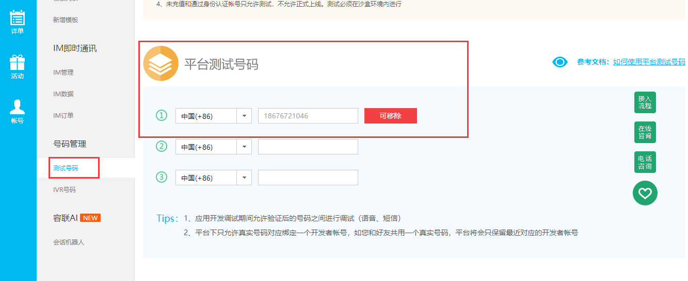

# 用户的注册认证

前端显示注册页面并调整首页头部和登陆页面的注册按钮的链接。

注册页面 `Register.vue`，主要是通过登录页面进行改进而成：

```vue
<template>
<div class="sign">
    <div class="logo"><a href="/"></a></div>
    <div class="main">
      <h4 class="title">
        <div class="normal-title">
          <router-link to="/user/login">登录</router-link>
          <b>·</b>
          <router-link id="js-sign-up-btn" class="active" to="/user/register">注册</router-link>
        </div>
      </h4>

      <div class="js-sign-up-container">
        <form class="new_user" id="new_user" action="" accept-charset="UTF-8" method="post">
          <div class="input-prepend restyle">
              <input placeholder="你的昵称" type="text" value="" v-model="nickname" id="user_nickname">
            <i class="iconfont ic-user"></i>
          </div>
            <div class="input-prepend restyle no-radius js-normal">
                <input placeholder="手机号" type="tel" v-model="mobile" id="user_mobile_number">
              <i class="iconfont ic-phonenumber"></i>
            </div>
          <div class="input-prepend restyle no-radius security-up-code js-security-number" v-if="is_show_sms_code">
              <input type="text" v-model="sms_code" id="sms_code" placeholder="手机验证码">
            <i class="iconfont ic-verify"></i>
            <a tabindex="-1" class="btn-up-resend js-send-code-button disable" href="javascript:void(0);" id="send_code">{{sms_code_text}}</a>
          </div>
          <input type="hidden" name="security_number" id="security_number">
          <div class="input-prepend">
            <input placeholder="设置密码" type="password" v-model="password" id="user_password">
            <i class="iconfont ic-password"></i>
          </div>
          <input type="submit" name="commit" value="注册" class="sign-up-button" id="sign_up_btn" data-disable-with="注册">
          <p class="sign-up-msg">点击 “注册” 即表示您同意并愿意遵守荏苒<br> <a target="_blank" href="">用户协议</a> 和 <a target="_blank" href="">隐私政策</a> 。</p>
        </form>
        <!-- 更多注册方式 -->
        <div class="more-sign">
          <h6>社交帐号直接注册</h6>
            <ul>
            <li><a id="weixin" class="weixin" target="_blank" href=""><i class="iconfont ic-wechat"></i></a></li>
            <li><a id="qq" class="qq" target="_blank" href=""><i class="iconfont ic-qq_connect"></i></a></li>
          </ul>

        </div>
      </div>

    </div>
  </div>
</template>

<script>
    export default {
        name: "Register",
        data(){
          return {
            nickname:"",
            mobile:"",
            sms_code:"",
            password:"",
            sms_code_text:"发送验证码",
            is_show_sms_code:false,
          }
        },
        watch:{
          mobile(){
            if(/^1[3-9]\d{9}$/.test(this.mobile)){
              this.is_show_sms_code = true;
            }else{
              this.is_show_sms_code = false;
            }
          }
        }
    }
</script>

<style scoped>
input{
  outline: none;
}
*, :after, :before {
    box-sizing: border-box;
}
.sign {
	height: 100%;
	min-height: 750px;
	text-align: center;
	font-size: 14px;
	background-color: #f1f1f1
}

.sign:before {
	content: "";
	display: inline-block;
	height: 85%;
	vertical-align: middle
}

.sign .disable,.sign .disable-gray {
	opacity: .5;
	pointer-events: none
}

.sign .disable-gray {
	background-color: #969696
}

.sign .tooltip-error {
	font-size: 14px;
	line-height: 25px;
	white-space: nowrap;
	background: none
}

.sign .tooltip-error .tooltip-inner {
	max-width: 280px;
	color: #333;
	border: 1px solid #ea6f5a;
	background-color: #fff
}

.sign .tooltip-error .tooltip-inner i {
	position: static;
	margin-right: 5px;
	font-size: 20px;
	color: #ea6f5a;
	vertical-align: middle
}

.sign .tooltip-error .tooltip-inner span {
	vertical-align: middle;
	display: inline-block;
	white-space: normal;
	max-width: 230px
}

.sign .tooltip-error.right .tooltip-arrow-border {
	border-right-color: #ea6f5a
}

.sign .tooltip-error.right .tooltip-arrow-bg {
	left: 2px;
	border-right-color: #fff
}

.sign .slide-error {
	position: relative;
	padding: 10px 0;
	border: 1px solid #c8c8c8;
	border-radius: 4px
}

.sign .slide-error i {
	position: static!important;
	margin-right: 10px;
	color: #ea6f5a!important;
	vertical-align: middle
}

.sign .slide-error span {
	font-size: 15px;
	vertical-align: middle
}

.sign .slide-error div {
	margin-top: 10px;
	font-size: 13px
}

.sign .slide-error a {
	color: #3194d0
}

.sign .js-sign-up-forbidden {
	color: #999;
	padding: 80px 0 100px
}

.sign .js-sign-up-container .slide-error {
	border-bottom: none;
	border-radius: 0
}

.sign .logo {
	position: absolute;
	top: 56px;
	margin-left: 50px
}

.sign .logo img {
	width: 100px
}

.sign .main {
	width: 400px;
	margin: 60px auto 0;
	padding: 50px 50px 30px;
	background-color: #fff;
	border-radius: 4px;
	box-shadow: 0 0 8px rgba(0,0,0,.1);
	vertical-align: middle;
	display: inline-block
}

.sign .reset-title,.sign .title {
	margin: 0 auto 50px;
	padding: 10px;
	font-weight: 400;
	color: #969696
}

.sign .reset-title a,.sign .title a {
	padding: 10px;
	color: #969696
}

.sign .reset-title a:hover,.sign .title a:hover {
	border-bottom: 2px solid #ea6f5a
}

.sign .reset-title .active,.sign .title .active {
	font-weight: 700;
	color: #ea6f5a;
	border-bottom: 2px solid #ea6f5a
}

.sign .reset-title b,.sign .title b {
	padding: 10px
}

.sign .reset-title {
	color: #333;
	font-weight: 700
}

.sign form {
	margin-bottom: 30px
}

.sign form .input-prepend {
	position: relative;
	width: 100%
}

.sign form .input-prepend input {
	width: 100%;
	height: 50px;
	margin-bottom: 0;
	padding: 4px 12px 4px 35px;
	border: 1px solid #c8c8c8;
	border-radius: 0 0 4px 4px;
	background-color: hsla(0,0%,71%,.1);
	vertical-align: middle
}

.sign form .input-prepend i {
	position: absolute;
	top: 14px;
	left: 10px;
	font-size: 18px;
	color: #969696
}

.sign form .input-prepend span {
	color: #333
}

.sign form .input-prepend .ic-show {
	top: 18px;
	left: auto;
	right: 8px;
	font-size: 12px
}

.sign form .geetest-placeholder {
	height: 44px;
	border-radius: 4px;
	background-color: hsla(0,0%,71%,.1);
	text-align: center;
	line-height: 44px;
	font-size: 14px;
	color: #999
}

.sign form .restyle {
	margin-bottom: 0
}

.sign form .restyle input {
	border-bottom: none;
	border-radius: 4px 4px 0 0
}

.sign form .no-radius input {
	border-radius: 0
}

.sign form .slide-security-placeholder {
	height: 32px;
	background-color: hsla(0,0%,71%,.1);
	border-radius: 4px
}

.sign form .slide-security-placeholder p {
	padding-top: 7px;
	color: #999;
	margin-right: -7px
}

.sign .overseas-btn {
	font-size: 14px;
	color: #999
}

.sign .overseas-btn:hover {
	color: #2f2f2f
}

.sign .remember-btn {
	float: left;
	margin: 15px 0
}

.sign .remember-btn span {
	margin-left: 5px;
	font-size: 15px;
	color: #969696;
	vertical-align: middle
}

.sign .forget-btn {
	float: right;
	position: relative;
	margin: 15px 0;
	font-size: 14px
}

.sign .forget-btn a {
	color: #999
}

.sign .forget-btn a:hover {
	color: #333
}

.sign .forget-btn .dropdown-menu {
	top: 20px;
	left: auto;
	right: 0;
	border-radius: 4px
}

.sign .forget-btn .dropdown-menu a {
	padding: 10px 20px;
	color: #333
}

.sign #sign-in-loading {
	position: relative;
	width: 20px;
	height: 20px;
	vertical-align: middle;
	margin-top: -4px;
	margin-right: 2px;
	display: none
}

.sign #sign-in-loading:after {
	content: "";
	position: absolute;
	left: 0;
	top: 0;
	width: 100%;
	height: 100%;
	background-color: transparent
}

.sign #sign-in-loading:before {
	content: "";
	position: absolute;
	top: 50%;
	left: 50%;
	width: 20px;
	height: 20px;
	margin: -10px 0 0 -10px;
	border-radius: 10px;
	border: 2px solid #fff;
	border-bottom-color: transparent;
	vertical-align: middle;
	-webkit-animation: rolling .8s infinite linear;
	animation: rolling .8s infinite linear;
	z-index: 1
}

.sign .sign-in-button,.sign .sign-up-button {
	margin-top: 20px;
	width: 100%;
	padding: 9px 18px;
	font-size: 18px;
	border: none;
	border-radius: 25px;
	color: #fff;
	background: #42c02e;
	cursor: pointer;
	outline: none;
	display: block;
	clear: both
}

.sign .sign-in-button:hover,.sign .sign-up-button:hover {
	background: #3db922
}

.sign .sign-in-button {
	background: #3194d0
}

.sign .sign-in-button:hover {
	background: #187cb7
}

.sign .btn-in-resend,.sign .btn-up-resend {
	position: absolute;
	top: 7px;
	right: 7px;
	width: 100px;
	height: 36px;
	font-size: 13px;
	color: #fff;
	background-color: #42c02e;
	border-radius: 20px;
	line-height: 36px
}

.sign .btn-in-resend {
	background-color: #3194d0
}

.sign .sign-up-msg {
	margin: 10px 0;
	padding: 0;
	text-align: center;
	font-size: 12px;
	line-height: 20px;
	color: #969696
}

.sign .sign-up-msg a,.sign .sign-up-msg a:hover {
	color: #3194d0
}

.sign .overseas input {
	padding-left: 110px!important
}

.sign .overseas .overseas-number {
	position: absolute;
	top: 0;
	left: 0;
	width: 100px;
	height: 50px;
	font-size: 18px;
	color: #969696;
	border-right: 1px solid #c8c8c8
}

.sign .overseas .overseas-number span {
	margin-top: 17px;
	padding-left: 35px;
	text-align: left;
	font-size: 14px;
	display: block
}

.sign .overseas .dropdown-menu {
	width: 100%;
	max-height: 285px;
	font-size: 14px;
	border-radius: 0 0 4px 4px;
	overflow-y: auto
}

.sign .overseas .dropdown-menu li .nation-code {
	width: 65px;
	display: inline-block
}

.sign .overseas .dropdown-menu li a {
	padding: 6px 20px;
	font-size: 14px;
	line-height: 20px
}

.sign .overseas .dropdown-menu li a::hover {
	color: #fff;
	background-color: #f5f5f5
}

.sign .more-sign {
	margin-top: 50px
}

.sign .more-sign h6 {
	position: relative;
	margin: 0 0 10px;
	font-size: 12px;
	color: #b5b5b5
}

.sign .more-sign h6:before {
	left: 30px
}

.sign .more-sign h6:after,.sign .more-sign h6:before {
	content: "";
	border-top: 1px solid #b5b5b5;
	display: block;
	position: absolute;
	width: 60px;
	top: 5px
}

.sign .more-sign h6:after {
	right: 30px
}

.sign .more-sign ul {
	margin-bottom: 10px;
	list-style: none
}

.sign .more-sign ul li {
	margin: 0 5px;
	display: inline-block
}

.sign .more-sign ul a {
	width: 50px;
	height: 50px;
	line-height: 50px;
	display: block
}

.sign .more-sign ul i {
	font-size: 28px
}

.sign .more-sign .ic-weibo {
	color: #e05244
}

.sign .more-sign .ic-wechat {
	color: #00bb29
}

.sign .more-sign .ic-qq_connect {
	color: #498ad5
}

.sign .more-sign .ic-douban {
	color: #00820f
}

.sign .more-sign .ic-more {
	color: #999
}

.sign .more-sign .weibo-loading {
	pointer-events: none;
	cursor: pointer;
	position: relative
}

.sign .more-sign .weibo-loading:after {
	content: "";
	position: absolute;
	left: 0;
	top: 0;
	width: 100%;
	height: 100%;
	background-color: #fff
}

body.reader-night-mode .sign .more-sign .weibo-loading:after {
	background-color: #3f3f3f
}

.sign .more-sign .weibo-loading:before {
	content: "";
	position: absolute;
	top: 50%;
	left: 50%;
	width: 20px;
	height: 20px;
	margin: -10px 0 0 -10px;
	border-radius: 10px;
	border: 2px solid #e05244;
	border-bottom-color: transparent;
	vertical-align: middle;
	-webkit-animation: rolling .8s infinite linear;
	animation: rolling .8s infinite linear;
	z-index: 1
}

@keyframes rolling {
	0% {
		-webkit-transform: rotate(0deg);
		transform: rotate(0deg)
	}

	to {
		-webkit-transform: rotate(1turn);
		transform: rotate(1turn)
	}
}

@-webkit-keyframes rolling {
	0% {
		-webkit-transform: rotate(0deg)
	}

	to {
		-webkit-transform: rotate(1turn)
	}
}

.sign .reset-password-input {
	border-radius: 4px!important
}

.sign .return {
	margin-left: -8px;
	color: #969696
}

.sign .return:hover {
	color: #333
}

.sign .return i {
	margin-right: 5px
}

.sign .icheckbox_square-green {
	display: inline-block;
	*display: inline;
	vertical-align: middle;
	margin: 0;
	padding: 0;
	width: 18px;
	height: 18px;
	background: url(/static/image/green.png) no-repeat;
	border: none;
	cursor: pointer;
	background-position: 0 0
}

.sign .icheckbox_square-green.hover {
	background-position: -20px 0
}

.sign .icheckbox_square-green.checked {
	background-position: -40px 0
}

.sign .icheckbox_square-green.disabled {
	background-position: -60px 0;
	cursor: default
}

.sign .icheckbox_square-green.checked.disabled {
	background-position: -80px 0
}


.geetest_panel_box>* {
	box-sizing: content-box
}

@media (max-width:768px) {
	body {
		min-width: 0
	}

	.sign {
		height: auto;
		min-height: 0;
		background-color: transparent
	}

	.sign .logo {
		display: none
	}

	.sign .main {
		position: absolute;
		left: 50%;
		margin: 0 0 0 -200px;
		box-shadow: none
	}
}
</style>
```

前端注册路由:

```javascript
import Register from "../components/Register"

// 配置路由列表
export default new Router({
  mode:"history",
  routes:[
    // 路由列表
	...
    {
      name:"Register",
      path: "/register",
      component:Register,
    }
  ]
})
```

修改首页头部 `Header.vue` 的连接：

```html
<span class="header-register"><router-link to="/register">注册</router-link></span>
```

还有登录页 `Login.vue` 中的链接：

```vue
<router-link id="js-sign-up-btn" class="" to="/register">注册</router-link>
...
<p class="go_login" >没有账号 <router-link to="/register">立即注册</router-link></p>
```

## 手机号码的唯一校验

服务端api接口

`users/utils.py` 代码：

```python
def get_user_by_data(**kwargs):
    """根据字段信息获取用户"""
    User = get_user_model()
    try:
        return User.objects.get(**kwargs)
    except:
        return None
```

`users/views.py` 代码：

```python
from .utils import get_user_by_data
from rest_framework import status
class CheckMobileAPIView(APIView):
    def get(self,request,mobile):
        user = get_user_by_data(mobile=mobile)
        if user is None:
            return Response({"err_msg":"ok", "err_status":1})
        else:
            return Response({"err_msg":"当前手机号已经被注册","err_status": 0}, status=status.HTTP_400_BAD_REQUEST)
```

`users/urls.py` 代码：

```python
from django.urls import path,re_path
from rest_framework_jwt.views import obtain_jwt_token,refresh_jwt_token
from . import views
urlpatterns = [
    path("login/", obtain_jwt_token ),
    path("refresh/", refresh_jwt_token ),
    path("captcha/", views.CaptchaAPIView.as_view() ),
    re_path("^mobile/(?P<mobile>1[3-9]\d{9})/$", views.CheckMobileAPIView.as_view()),
]
```

客户端在用户输入手机号，输入框失去焦点时，使用ajax发送验证请求，代码：

```vue
<template>
<div class="sign">
    <div class="logo"><router-link to="/"></router-link></div>
    <div class="main">
      <h4 class="title">
        <div class="normal-title">
          <router-link to="/user/login">登录</router-link>
          <b>·</b>
          <router-link id="js-sign-up-btn" class="active" to="/user/register">注册</router-link>
        </div>
      </h4>

      <div class="js-sign-up-container">
        <form class="new_user" id="new_user" action="" accept-charset="UTF-8" method="post">
          <div class="input-prepend restyle">
              <input placeholder="你的昵称" type="text" value="" v-model="nickname" id="user_nickname">
            <i class="iconfont ic-user"></i>
          </div>
          <div class="input-prepend restyle no-radius js-normal">
              <input placeholder="手机号" type="tel" @blur="check_mobile" v-model="mobile" id="user_mobile_number">
            <i class="iconfont ic-phonenumber"></i>
          </div>
          <div class="input-prepend restyle no-radius security-up-code js-security-number" v-if="is_show_sms_code">
              <input type="text" v-model="sms_code" id="sms_code" placeholder="手机验证码">
            <i class="iconfont ic-verify"></i>
            <a tabindex="-1" class="btn-up-resend js-send-code-button" :class="{disable:send_able}" href="javascript:void(0);" id="send_code">{{sms_code_text}}</a>
          </div>
          <input type="hidden" name="security_number" id="security_number">
          <div class="input-prepend">
            <input placeholder="设置密码" type="password" v-model="password" id="user_password">
            <i class="iconfont ic-password"></i>
          </div>
          <input type="submit" name="commit" value="注册" class="sign-up-button" id="sign_up_btn" data-disable-with="注册">
          <p class="sign-up-msg">点击 “注册” 即表示您同意并愿意遵守荏苒<br> <a target="_blank" href="">用户协议</a> 和 <a target="_blank" href="">隐私政策</a> 。</p>
        </form>
        <!-- 更多注册方式 -->
        <div class="more-sign">
          <h6>社交帐号直接注册</h6>
            <ul>
            <li><a id="weixin" class="weixin" target="_blank" href=""><i class="iconfont ic-wechat"></i></a></li>
            <li><a id="qq" class="qq" target="_blank" href=""><i class="iconfont ic-qq_connect"></i></a></li>
          </ul>

        </div>
      </div>

    </div>
  </div>
</template>

<script>
    export default {
        name: "Register",
        data(){
          return {
            nickname:"",
            mobile:"",
            sms_code:"",
            password:"",
            sms_code_text:"发送验证码",
            is_show_sms_code:false,
            send_able:false,
          }
        },
        watch:{
          mobile(){
            // js里面的正则,类似于python re.match
            if(/^1[3-9]\d{9}$/.test(this.mobile)){
              this.is_show_sms_code = true;
              this.send_able = true;
            }else{
              this.is_show_sms_code = false;
            }
          }
        },
        methods:{
            check_mobile(){
                // 验证手机号是否唯一
                if(this.is_show_sms_code){
                    // 发送ajax到服务端验证手机号是否可用
                    this.$axios.get(`${this.$settings.Host}/users/mobile/${this.mobile}/`).then(response=>{

                    }).catch(error=>{
                       this.$message.error(error.response.data.err_msg);
                       this.send_able = false;
                    });
                }
            }
        }
    }
</script>
```


## 注册功能的实现

### 实现基本的账号信息注册

视图代码:

```python
from rest_framework.generics import CreateAPIView
from .serializers import UserCreateModelSerializer
from .models import User
class UserAPIView(CreateAPIView):
    """添加用户"""
    queryset = User.objects.all()
    serializer_class = UserCreateModelSerializer
```

序列化器中，进行验证和保存数据，并返回 jwt 登录认证给客户端：

```python
from rest_framework import serializers
from .models import User
import re
from .utils import get_user_by_data

class UserCreateModelSerializer(serializers.ModelSerializer):
    # 接收字段/ 返回客户端的字段
    sms_code = serializers.CharField(write_only=True, min_length=4, max_length=4, label="短信验证码")
    token = serializers.CharField(read_only=True,label="jwt_token")
    class Meta:
        model = User
        fields = ["nickname","mobile","sms_code","password","username","id","avatar","token"]
        read_only_fields = ["id","username","avatar"]
        extra_kwargs = {
            "mobile":{"write_only":True, },
            "password":{"write_only":True, "min_length": 8,"max_length": 16, },
        }

    def validate(self, attrs):
        # 1. 验证手机格式是否正确
        mobile = attrs.get("mobile")
        if not re.match("^1[3-9]\d{9}$",mobile):
            raise serializers.ValidationError("手机号码格式有误!","mobile")

        # 2. 验证手机是否注册了
        user = get_user_by_data(mobile=mobile)
        if user:
            raise serializers.ValidationError("手机号码已经被注册!", "mobile")

        # todo 3. 短信是否正确

        return attrs

    def create(self, validated_data):
        """保存用户信息"""
        try:
            user = User.objects.create_user(
                username=validated_data.get("mobile"),
                password=validated_data.get("password"),
                nickname=validated_data.get("nickname"),
                mobile=validated_data.get("mobile"),
            )

        except:
            raise serializers.ValidationError("用户注册失败!")

        from rest_framework_jwt.settings import api_settings

        # 首次注册,免登录,手动生成jwt
        jwt_payload_handler = api_settings.JWT_PAYLOAD_HANDLER
        jwt_encode_handler = api_settings.JWT_ENCODE_HANDLER

        payload = jwt_payload_handler(user)
        user.token = jwt_encode_handler(payload)
        return user
```

路由,代码:

```python
from django.urls import path,re_path
from rest_framework_jwt.views import obtain_jwt_token,refresh_jwt_token
from . import views
urlpatterns = [
    path("login/", obtain_jwt_token ),
    path("refresh/", refresh_jwt_token ),
    path("captcha/", views.CaptchaAPIView.as_view() ),
    re_path("^mobile/(?P<mobile>1[3-9]\d{9})/$", views.CheckMobileAPIView.as_view()),
    path("",views.UserAPIView.as_view()),
]
```


#### 客户端提交注册信息

register.vue,代码:

```vue
<template>
<div class="sign">
    <div class="logo"><router-link to="/"></router-link></div>
    <div class="main">
      <h4 class="title">
        <div class="normal-title">
          <router-link to="/user/login">登录</router-link>
          <b>·</b>
          <router-link id="js-sign-up-btn" class="active" to="/user/register">注册</router-link>
        </div>
      </h4>

      <div class="js-sign-up-container">
        <form class="new_user" id="new_user" action="" accept-charset="UTF-8" method="post">
          <div class="input-prepend restyle">
              <input placeholder="你的昵称" type="text" value="" v-model="nickname" id="user_nickname">
            <i class="iconfont ic-user"></i>
          </div>
            <div class="input-prepend restyle no-radius js-normal">
                <input placeholder="手机号" type="tel" @blur="check_mobile" v-model="mobile" id="user_mobile_number">
              <i class="iconfont ic-phonenumber"></i>
            </div>
          <div class="input-prepend restyle no-radius security-up-code js-security-number" v-if="is_show_sms_code">
              <input type="text" v-model="sms_code" id="sms_code" placeholder="手机验证码">
            <i class="iconfont ic-verify"></i>
            <a tabindex="-1" class="btn-up-resend js-send-code-button" :class="{disable: disable_sms_code}" href="javascript:void(0);" id="send_code">{{sms_code_text}}</a>
          </div>
          <input type="hidden" name="security_number" id="security_number">
          <div class="input-prepend">
            <input placeholder="设置密码" type="password" v-model="password" id="user_password">
            <i class="iconfont ic-password"></i>
          </div>
          <input type="submit" name="commit" @click.prevent="showCaptcha" value="注册" class="sign-up-button" id="sign_up_btn" data-disable-with="注册">
          <p class="sign-up-msg">点击 “注册” 即表示您同意并愿意遵守荏苒<br> <a target="_blank" href="">用户协议</a> 和 <a target="_blank" href="">隐私政策</a> 。</p>
        </form>
        <!-- 更多注册方式 -->
        <div class="more-sign">
          <h6>社交帐号直接注册</h6>
            <ul>
            <li><a id="weixin" class="weixin" target="_blank" href=""><i class="iconfont ic-wechat"></i></a></li>
            <li><a id="qq" class="qq" target="_blank" href=""><i class="iconfont ic-qq_connect"></i></a></li>
          </ul>

        </div>
      </div>

    </div>
  </div>
</template>

<script>
    export default {
        name: "Register",
        data(){
            return {
                nickname: "",
                mobile: "",
                sms_code: "",
                password: "",
                sms_code_text: "发送验证码",
                is_show_sms_code: false,
                disable_sms_code: false,
          }
        },
        watch:{
          mobile(){
            this.is_show_sms_code = /^1[3-9]\d{9}$/.test(this.mobile);
            if (this.is_show_sms_code) {this.check_mobile()}
          },
        },
        methods: {
            check_mobile () {
                if (this.is_show_sms_code) {
                    // 发送ajax到服务端验证手机号是否唯一可用
                    this.$axios.get(`${this.$settings.Host}/users/mobile/${this.mobile}/`).then(response=>{
                        this.disable_sms_code = false
                    }).catch(errors=>{
                        if (errors.response.status === 400) {
                            this.$message.error(errors.response.data.msg);
                            this.disable_sms_code = true
                        }
                    })
                }
            },
            showCaptcha () {
                if (!this.is_show_sms_code || this.sms_code.length !== 4){
                    this.$message.error('请确保手机号和验证码填写正确');
                    return false;
                } else if (this.password.length < 8 || this.password.length > 16) {
                    this.$message.error('密码长度应该在 8 到 16 位～');
                    return false;
                }
                // 初步数据校验完成，调用腾讯防水墙验证码
                var captcha1 = new TencentCaptcha(this.$settings.TC_captcha.app_id, res => {
                    if (res.ret === 0) {    // 初步通过腾讯防水墙验证
                        // 将验证码数据和用户注册信息提交到后台进行处理
                        this.$axios.post(`${this.$settings.Host}/users/`, {
                            ret: res.ret,
                            ticket: res.ticket,
                            randstr: res.randstr,
                            nickname: this.nickname,
                            mobile: this.mobile,
                            sms_code: this.sms_code,
                            password: this.password,
                        }).then(response=>{
                            // 注册成功，则保存用户登录状态，以临时存储方式保存
                            sessionStorage.user_token = response.data.token;
                            sessionStorage.user_name = response.data.username;
                            sessionStorage.user_id = response.data.id;
                            sessionStorage.user_nickname = response.data.nickname;
                            sessionStorage.user_avatar = response.data.avatar;
                            localStorage.removeItem("user_token");
                            localStorage.removeItem("user_name");
                            localStorage.removeItem("user_id");
                            localStorage.removeItem("user_nickname");
                            localStorage.removeItem("user_avatar");
                            this.$confirm(`欢迎${response.data.nickname}加入荏苒~`, '注册成功！', {
                                confirmButtonText: '去个人中心',
                                cancelButtonText: this.go_back_msg,
                                type: 'warning'
                            }).then(() => {
                                // 跳转到个人中心
                                this.$router.push('/user');
                            }).catch(() => {
                                // 跳转到上一页
                                this.$router.back();
                            });
                        }).catch(errors=>{
                            // 登录失败
                            if (error.response.status === 400) {
                                this.$message.error('会员注册失败，请检查您输入的内容是否正确！')
                            } else {
                                console.log(error)
                            }
                        })
                    } else {
                        this.$meesage.error("验证码验证失败!请重新操作验证码");
                    }
                });
                captcha1.show();
            },
        }
    }
</script>
```

## 在注册功能中集成短信验证码功能

接下来，我们把注册过程中一些注册信息（例如：短信验证码）和 session 缓存到 redis 数据库中。

如果之前没有安装 django-redis 的话，可以使用命令安装：

```python
pip install django-redis
```

在 `settings/dev.py` 配置中添加一下代码，最好配置在数据库 DATABASES 配置下面：

```python
# 设置redis缓存
CACHES = {
    # 默认缓存
    "default": {
        "BACKEND": "django_redis.cache.RedisCache",
        # 项目上线时,需要调整这里的路径
        "LOCATION": "redis://127.0.0.1:6379/0",

        "OPTIONS": {
            "CLIENT_CLASS": "django_redis.client.DefaultClient",
        }
    },
    # 提供给xadmin或者admin的session存储
    "session": {
        "BACKEND": "django_redis.cache.RedisCache",
        "LOCATION": "redis://127.0.0.1:6379/1",
        "OPTIONS": {
            "CLIENT_CLASS": "django_redis.client.DefaultClient",
        }
    },
    # 提供存储短信验证码
    "sms_code":{
        "BACKEND": "django_redis.cache.RedisCache",
        "LOCATION": "redis://127.0.0.1:6379/2",
        "OPTIONS": {
            "CLIENT_CLASS": "django_redis.client.DefaultClient",
        }
    }
}

# 设置xadmin用户登录时,登录信息session保存到redis
SESSION_ENGINE = "django.contrib.sessions.backends.cache"
SESSION_CACHE_ALIAS = "session"
```

关于 django-redis 的使用，说明文档可参见：http://django-redis-chs.readthedocs.io/zh_CN/latest/

django-redis 提供了 get_redis_connection 的方法，通过调用 get_redis_connection 方法传递 redis 的配置名称可获取到 redis 的连接对象，通过 redis 连接对象可以执行 redis 命令

<https://redis-py.readthedocs.io/en/latest/>

使用范例：

```python
from django_redis import get_redis_connection
// 链接redis数据库
redis_conn = get_redis_connection("default")

redis_conn.set("name","xiaoming")
```

### 使用云通讯发送短信

官网：https://www.yuntongxun.com/

在登录后的平台上面获取一下信息:

```
ACCOUNT SID：8a216da863f8e6c20164139687e80c1b
AUTH TOKEN : 6dd01b2b60104b3dbc88b2b74158bac6
AppID(默认)：8a216da863f8e6c20164139688400c21
Rest URL(生产)： app.cloopen.com:8883         [项目上线时使用真实短信发送服务器]
Rest URL(开发)： sandboxapp.cloopen.com:8883  [项目开发时使用沙箱短信发送服务器]
```

找到sdkdemo进行下载


在开发过程中,为了节约发送短信的成本,可以把自己的或者同事的手机加入到测试号码中.




### 后端生成短信验证码

把素材里面的 yuntongxun 目录放到项目的 utils 目录下，然后在 `settings/dev.py` 下添加短信接口的配置信息，代码：

```python
# 云通讯的短信配置
SMS = {
    "_accountSid": "8a216da863f8e6c20164139687e80c1b",
    "_accountToken": "6dd01b2b60104b3dbc88b2b74158bac6",
    "_appId": "8a216da863f8e6c20164139688400c21",
    "_serverIP": "sandboxapp.cloopen.com",
    "_serverPort": "8883",
}
```

`users/views.py`，代码：

```python
import random
from renranapi.utils.yuntongxun.sms import CCP
from django_redis import get_redis_connection
from renranapi.settings import constants
import logging
loger = logging.getLogger("django")

class SMSCodeAPIView(APIView):
    """
    短信验证码
    """
    def get(self,request,mobile):
        # 1. 验证数据[短信发送间隔]
        redis = get_redis_connection("sms_code")
        result = redis.get("interval_%s" % mobile)
        if result:
            return Response({"message": "短信已经发送中,请留意您的手机,不要频繁点击!"}, status=status.HTTP_400_BAD_REQUEST)

        # 2. 生成随机短信验证码
        sms_code = "%04d" % random.randint(0,9999)

        # 3. 发送短信验证码
        try:
            ccp = CCP()
            ret = ccp.send_template_sms(mobile, [sms_code, constants.SMS_EXPIRE_TIME // 60], constants.SMS_TEMPLATE_ID)
        except:
            ret = False

        if not ret:
            loger.error("发送短信失败!")
            return Response("短信发送失败!")

        # 4. 保存短信验证码到redis中

        redis.setex("sms_%s" % mobile, constants.SMS_EXPIRE_TIME, sms_code)
        redis.setex("interval_%s" % mobile, constants.SMS_INTERVAL_TIME, "_")

        # 5. 返回操作结果
        return Response({"message":"短信已经发送,请留意您的手机"})
```

`settings/constants.py` 代码：

```python
# 短信有效期时间,单位:秒
SMS_EXPIRE_TIME = 300
# 短信模板ID,测试阶段只能是1
SMS_TEMPLATE_ID = 1
# 短信发送冷却时间,单位: 秒
SMS_INTERVAL_TIME = 60
```

路由代码，`users/urls.py`：

```python
re_path("^sms/(?P<mobile>1[3-9]\d{9})/$",views.SMSCodeAPIView.as_view()),
```

客户端发送注册信息和发送短信

```vue
<template>
<div class="sign">
    <div class="logo"><router-link to="/"></router-link></div>
    <div class="main">
      <h4 class="title">
        <div class="normal-title">
          <router-link to="/user/login">登录</router-link>
          <b>·</b>
          <router-link id="js-sign-up-btn" class="active" to="/user/register">注册</router-link>
        </div>
      </h4>

      <div class="js-sign-up-container">
        <form class="new_user" id="new_user" action="" accept-charset="UTF-8" method="post">
          <div class="input-prepend restyle">
              <input placeholder="你的昵称" type="text" value="" v-model="nickname" id="user_nickname">
            <i class="iconfont ic-user"></i>
          </div>
            <div class="input-prepend restyle no-radius js-normal">
                <input placeholder="手机号" type="tel" @blur="check_mobile" v-model="mobile" id="user_mobile_number">
              <i class="iconfont ic-phonenumber"></i>
            </div>
          <div class="input-prepend restyle no-radius security-up-code js-security-number" v-if="is_show_sms_code">
              <input type="text" v-model="sms_code" id="sms_code" placeholder="手机验证码">
            <i class="iconfont ic-verify"></i>
            <a tabindex="-1" @click="get_sms_code" class="btn-up-resend js-send-code-button" :class="{disable: disable_sms_code}" href="javascript:void(0);" id="send_code">{{sms_code_text}}</a>
          </div>
          <input type="hidden" name="security_number" id="security_number">
          <div class="input-prepend">
            <input placeholder="设置密码" type="password" v-model="password" id="user_password">
            <i class="iconfont ic-password"></i>
          </div>
          <input type="submit" name="commit" @click.prevent="showCaptcha" value="注册" class="sign-up-button" id="sign_up_btn" data-disable-with="注册">
          <p class="sign-up-msg">点击 “注册” 即表示您同意并愿意遵守荏苒<br> <a target="_blank" href="">用户协议</a> 和 <a target="_blank" href="">隐私政策</a> 。</p>
        </form>
        <!-- 更多注册方式 -->
        <div class="more-sign">
          <h6>社交帐号直接注册</h6>
            <ul>
            <li><a id="weixin" class="weixin" target="_blank" href=""><i class="iconfont ic-wechat"></i></a></li>
            <li><a id="qq" class="qq" target="_blank" href=""><i class="iconfont ic-qq_connect"></i></a></li>
          </ul>

        </div>
      </div>

    </div>
  </div>
</template>

<script>
    export default {
        name: "Register",
        data(){
            return {
                nickname: "",
                mobile: "",
                sms_code: "",
                password: "",
                sms_code_text: "发送验证码",
                is_show_sms_code: false,
                disable_sms_code: false,
          }
        },
        watch:{
          mobile(){
            this.is_show_sms_code = /^1[3-9]\d{9}$/.test(this.mobile);
            if (this.is_show_sms_code) {this.check_mobile()}
          },
        },
        methods: {
            check_mobile () {
                if (this.is_show_sms_code) {
                    // 发送ajax到服务端验证手机号是否唯一可用
                    this.$axios.get(`${this.$settings.Host}/users/mobile/${this.mobile}/`).then(response=>{
                        this.disable_sms_code = false
                    }).catch(errors=>{
                        if (errors.response.status === 400) {
                            this.$message.error(errors.response.data.error_msg);
                            this.disable_sms_code = true
                        }
                    })
                }
            },
            showCaptcha () {
                if (!this.is_show_sms_code || this.sms_code.length !== 4){
                    this.$message.error('请确保手机号和验证码填写正确');
                    return false;
                } else if (this.password.length < 8 || this.password.length > 16) {
                    this.$message.error('密码长度应该在 8 到 16 位～');
                    return false;
                }
                // 初步数据校验完成，调用腾讯防水墙验证码
                var captcha1 = new TencentCaptcha(this.$settings.TC_captcha.app_id, res => {
                    if (res.ret === 0) {    // 初步通过腾讯防水墙验证
                        // 将验证码数据和用户注册信息提交到后台进行处理
                        this.$axios.post(`${this.$settings.Host}/users/`, {
                            ret: res.ret,
                            ticket: res.ticket,
                            randstr: res.randstr,
                            nickname: this.nickname,
                            mobile: this.mobile,
                            sms_code: this.sms_code,
                            password: this.password,
                        }).then(response=>{
                            // 注册成功，则保存用户登录状态，以临时存储方式保存
                            sessionStorage.user_token = response.data.token;
                            sessionStorage.user_name = response.data.username;
                            sessionStorage.user_id = response.data.id;
                            sessionStorage.user_nickname = response.data.nickname;
                            sessionStorage.user_avatar = response.data.avatar;
                            localStorage.removeItem("user_token");
                            localStorage.removeItem("user_name");
                            localStorage.removeItem("user_id");
                            localStorage.removeItem("user_nickname");
                            localStorage.removeItem("user_avatar");
                            this.$confirm(`欢迎${response.data.nickname}加入荏苒~`, '注册成功！', {
                                confirmButtonText: '去个人中心',
                                cancelButtonText: "返回上一页",
                                type: 'warning'
                            }).then(() => {
                                // 跳转到个人中心
                                this.$router.push('/user');
                            }).catch(() => {
                                // 跳转到上一页
                                this.$router.back();
                            });
                        }).catch(errors=>{
                            // 注册失败
                            if (errors.response.status === 400) {
                                this.$message.error(errors.response.data.error_msg);
                            } else {
                                console.log(errors)
                            }
                        })
                    } else {
                        this.$meesage.error("验证码验证失败！请重新操作验证码");
                    }
                });
                captcha1.show();
            },
            get_sms_code () {
                if (!this.is_show_sms_code || this.disable_sms_code) {
                    this.$message.error('请正确填写手机号！');
                    return false;
                    }
                this.$axios.get(`${this.$settings.Host}/users/sms/${this.mobile}`).then(response=>{
                    this.$message.success("验证码发送成功，请注意查收～")
                }).catch(errors=>{
                    if (errors.response.status === 400) {
                        this.$message.error(errors.response.data.error_msg);
                    } else {
                        this.$message.error("验证码发送失败，请稍后重试！");
                       console.log(errors.response);
                    }
                })
            },
        }
    }
</script>
```

### 服务端注册功能中完成手机短信的校验

在序列化器中增加验证码的判断逻辑，代码：

```python
from rest_framework import serializers
from .models import User
import re
from .utils import get_user_by_data
from django_redis import get_redis_connection

class UserCreateModelSerializer(serializers.ModelSerializer):
    # 接收字段/ 返回客户端的字段
    sms_code = serializers.CharField(write_only=True, min_length=4, max_length=4, label="短信验证码")
    token = serializers.CharField(read_only=True,label="jwt_token")
    class Meta:
        model = User
        fields = ["nickname","mobile","sms_code","password","username","id","avatar","token"]
        read_only_fields = ["id","username","avatar"]
        extra_kwargs = {
            "mobile":{"write_only":True, },
            "password":{"write_only":True, "min_length": 8,"max_length": 16, },
        }

    def validate(self, attrs):
        # 1. 验证手机格式是否正确
        mobile = attrs.get("mobile")
        if not re.match("^1[3-9]\d{9}$",mobile):
            raise serializers.ValidationError("手机号码格式有误!","mobile")

        # 2. 验证手机是否注册了
        user = get_user_by_data(mobile=mobile)
        if user:
            raise serializers.ValidationError("手机号码已经被注册!", "mobile")

        # 3. 短信是否正确
        redis_conn = get_redis_connection("sms_code")
        redis_sms_code = redis_conn.get("sms_%s" % mobile)
        if redis_sms_code:
            sms_code = attrs.get("sms_code")
            if redis_sms_code.decode() != sms_code:
                raise serializers.ValidationError("验证码错误!")
        else:
            raise serializers.ValidationError("验证码已过期!")
        
        return attrs

    def create(self, validated_data):
        """保存用户信息"""
        try:
            user = User.objects.create_user(
                username=validated_data.get("mobile"),
                password=validated_data.get("password"),
                nickname=validated_data.get("nickname"),
                mobile=validated_data.get("mobile"),
            )

        except:
            raise serializers.ValidationError("用户注册失败!")

        from rest_framework_jwt.settings import api_settings

        # 首次注册,免登录,手动生成jwt
        jwt_payload_handler = api_settings.JWT_PAYLOAD_HANDLER
        jwt_encode_handler = api_settings.JWT_ENCODE_HANDLER

        payload = jwt_payload_handler(user)
        user.token = jwt_encode_handler(payload)
        return user
```

当然，也可以把校验短信验证码的操作整合在视图中，这时，`views.py` 可以写成这样：

```python
class UserAPIView(CaptchaAPIView, CreateAPIView):
    queryset = User.objects.all()
    serializer_class = UserCreateModelSerializer
    def post(self, request, *args, **kwargs):
        # 校验腾讯防水墙验证码，若验证码不正确，则报错，不去注册
        if not super().check_captcha():
            return Response({'error_msg': '验证码有误！'}, status=status.HTTP_400_BAD_REQUEST)
        # 校验短信验证码
        redis = get_redis_connection('sms_code')
        sms_code = redis.get('sms_%s' % request.data.get('mobile'))
        if sms_code and (sms_code != request.data.get('sms_code').encode()):
            return Response({'error_msg': '短信验证码有误！'}, status=status.HTTP_400_BAD_REQUEST)
        # 若腾讯防水墙验证码和短信验证码都通过验证，则继续执行创建用户的操作
        return super().post(request, *args, **kwargs)
```

### 给 redis 操作设置事务

在 redis 中，如果出现连续操作多条命令， 那么这些命令，我们可以把他们设置成一个整体，采用redis提供的事务来让它们一起执行。执行过程中保证数据的原子性，要么一起成功，要么一起失败。

所以在注册的验证码功能中，我们就可以使用事务来完成验证码的记录工作。

```python
redis_conn = get_redis_connection("sms_code")
# redis的事务是通过管道对象来设置命令
pipe = redis_conn.pipeline()
pipe.multi()   # 开启事务
pipe.命令()
pipe.命令()
pipe.execute() # 提交事务
```

视图 `users/views.py`，代码：

```python
class SMSCodeAPIView(APIView):
    """
    短信验证码
    """
    def get(self,request,mobile):
        # 1. 验证数据[短信发送间隔]
        redis = get_redis_connection("sms_code")
        result = redis.get("interval_%s" % mobile)
        if result:
            return Response({"error_msg": "短信已经发送中,请留意您的手机,不要频繁点击!"}, status=status.HTTP_400_BAD_REQUEST)

        # 2. 生成随机短信验证码
        sms_code = "%04d" % random.randint(0,9999)

        # 3. 发送短信验证码
        try:
            ccp = CCP()
            ret = ccp.send_template_sms(mobile, [sms_code, constants.SMS_EXPIRE_TIME // 60], constants.SMS_TEMPLATE_ID)
        except:
            ret = False

        if not ret:
            loger.error("发送短信失败!")
            return Response("短信发送失败!")

        # 4. 保存短信验证码到redis中，因为涉及两条数据库操作，最好还是加上事务
        pipe = redis.pipeline()    # 创建管道对象
        pipe.multi()    # 开启事务
        # 设置事务的相关操作命令
        pipe.setex("sms_%s" % mobile, constants.SMS_EXPIRE_TIME, sms_code)
        pipe.setex("interval_%s" % mobile, constants.SMS_INTERVAL_TIME, "_")
        # 提交事务
        pipe.execute()

        # 5. 返回操作结果
        return Response({"message":"短信已经发送,请留意您的手机"})
```

### 验证码冷却倒计时

用户点击发送验证码后，按钮暂时变为不可用状态，出现倒计时，告诉用户按钮冷却剩余时间，避免用户频繁点击，给后端造成不必要的压力。

`Login.vue` 的 js 代码：

```vue
<script>
    export default {
        name: "Register",
        data(){
            return {
                nickname: "",
                mobile: "",
                sms_code: "",
                password: "",
                sms_code_text: "发送验证码",
                is_show_sms_code: false,
                disable_sms_code: false,
                interval_id: 0,
                interval_time: 0,
          }
        },
        watch:{
            mobile(){
                this.is_show_sms_code = /^1[3-9]\d{9}$/.test(this.mobile);
                if (this.is_show_sms_code) {this.check_mobile()}
            },
        },
        methods: {
            check_mobile () {
                if (this.is_show_sms_code) {
                    // 发送ajax到服务端验证手机号是否唯一可用
                    this.$axios.get(`${this.$settings.Host}/users/mobile/${this.mobile}/`).then(response=>{
                        this.disable_sms_code = false
                    }).catch(errors=>{
                        if (errors.response.status === 400) {
                            this.$message.error(errors.response.data.error_msg);
                            this.disable_sms_code = true
                        }
                    })
                }
            },
            showCaptcha () {
                if (!this.is_show_sms_code || this.sms_code.length !== 4){
                    this.$message.error('请确保手机号和验证码填写正确');
                    return false;
                } else if (this.password.length < 8 || this.password.length > 16) {
                    this.$message.error('密码长度应该在 8 到 16 位～');
                    return false;
                }
                // 初步数据校验完成，调用腾讯防水墙验证码
                var captcha1 = new TencentCaptcha(this.$settings.TC_captcha.app_id, res => {
                    if (res.ret === 0) {    // 初步通过腾讯防水墙验证
                        // 将验证码数据和用户注册信息提交到后台进行处理
                        this.$axios.post(`${this.$settings.Host}/users/`, {
                            ret: res.ret,
                            ticket: res.ticket,
                            randstr: res.randstr,
                            nickname: this.nickname,
                            mobile: this.mobile,
                            sms_code: this.sms_code,
                            password: this.password,
                        }).then(response=>{
                            // 注册成功，则保存用户登录状态，以临时存储方式保存
                            sessionStorage.user_token = response.data.token;
                            sessionStorage.user_name = response.data.username;
                            sessionStorage.user_id = response.data.id;
                            sessionStorage.user_nickname = response.data.nickname;
                            sessionStorage.user_avatar = response.data.avatar;
                            localStorage.removeItem("user_token");
                            localStorage.removeItem("user_name");
                            localStorage.removeItem("user_id");
                            localStorage.removeItem("user_nickname");
                            localStorage.removeItem("user_avatar");
                            this.$confirm(`欢迎${response.data.nickname}加入荏苒~`, '注册成功！', {
                                confirmButtonText: '去个人中心',
                                cancelButtonText: "返回上一页",
                                type: 'warning'
                            }).then(() => {
                                // 跳转到个人中心
                                this.$router.push('/user');
                            }).catch(() => {
                                // 跳转到上一页
                                this.$router.back();
                            });
                        }).catch(errors=>{
                            // 注册失败
                            if (errors.response.status === 400) {
                                this.$message.error(errors.response.data.error_msg);
                            } else {
                                console.log(errors)
                            }
                        })
                    } else {
                        this.$meesage.error("验证码验证失败！请重新操作验证码");
                    }
                });
                captcha1.show();
            },
            get_sms_code () {
                if (!this.is_show_sms_code || this.disable_sms_code) {
                    this.$message.error('请正确填写手机号！');
                    return false;
                    }
                this.$axios.get(`${this.$settings.Host}/users/sms/${this.mobile}`).then(response=>{
                    this.$message.success("验证码发送成功，请注意查收～");
                    this.interval_time = 60;
                    this.start_interval();
                }).catch(errors=>{
                    if (errors.response.status === 400) {
                        this.$message.error(errors.response.data.error_msg);
                    } else {
                        this.$message.error("验证码发送失败，请稍后重试！");
                       console.log(errors.response);
                    }
                })
            },
            start_interval () {
                this.interval_id = setInterval(()=>{
                    if (this.interval_time){
                        this.disable_sms_code = true;
                        this.sms_code_text = `${this.interval_time} 秒后可重发`;
                        this.interval_time--;
                    }else{
                        this.disable_sms_code = false;
                        this.sms_code_text = '重新发送';
                        clearInterval(this.interval_id);
                    }
                }, 1000);
            }
        }
    }
</script>
```

