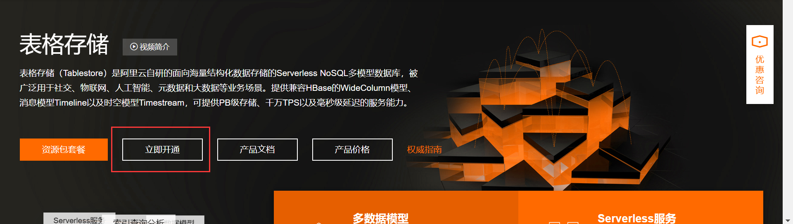
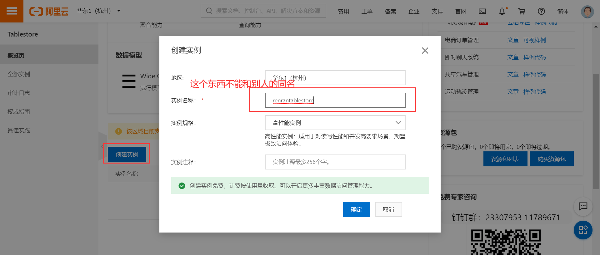
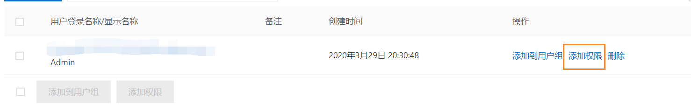

## Django 操作阿里云表格存储 Tablestore

[TOC]

### Tablestore 的配置

首先，开通阿里云表格存储服务。连接：https://www.aliyun.com/product/ots?spm=a2c4g.11186623.2.7.6f0b23a5RBru3P



开通好之后，创建一个实例：



在开始之前，还要创建 Access Key。

Access Key 的创建参见：https://help.aliyun.com/document_detail/53045.html?spm=a2c4g.11186623.2.12.7ed845d1l6vPRz

需要注意的是，AccessKeySecret 只在创建时显示，**不要一出来就手滑关闭**。等稍后，我们把它记录下来只会，再关不迟。而且不要忘了把表格存储 AliyunOTSFullAccess 加入到新创建的用户的权限中。



Python 操作 TableStore 的 SDK：https://github.com/aliyun/aliyun-tablestore-python-sdk

阿里云官方 Python SDK：<https://help.aliyun.com/document_detail/31723.html?spm=a2c4g.11186623.6.891.563c3d76sdVMpI>

首先安装 Tablestore 的 Python 模块：

```bash
pip install tablestore
```

`settings/dev.py`，添加 TableStore 的 API 接口配置：

```python
# tablestore
OTS_ID = "LTAI4FxkXpCaQwsNTMzxGmMk"    # AccessKeyId
OTS_SECRET = "AxS8Y0m3US8prS8XJuqkHDpd2XGRii"    # AccessKeySecret
OTS_INSTANCE = "renrantablestore"    # 实例名称
OTS_ENDPOINT = "https://renranzixun.cn-hangzhou.ots.aliyuncs.com"    # 实例访问公网地址
```

Tablestore 目前只支持四种数据类型：INTEGER、STRING、DOUBLE 和 BOOLEAN。其中 DOUBLE 类型不能做主键类型，BOOLEAN 不可以做主键的第一列（分区键）。

为了方便演示，我们另外创建一个单独的子应用 store 来编写 tablestore 的代码：

```
cd renranapi/apps
python ../../manage.py startapp store
```

在 `settings/dev.py` 注册：

```python
INSALL_APPS = [
    ...
    'store',    # 用于演示tableStore，后续删除掉即可
]
```

### 表操作

参见：[创建表](https://help.aliyun.com/document_detail/106096.html?spm=a2c4g.11186623.2.18.6d51b0aaLLynie)

Tablestore 里面创建表的时候必须设置表名，主键列，还有表元信息和表的描述项（有效期，版本，吞吐量）。

创建表的时候，除了主键列以外，还可以设置预设字段列。这个不常用，因为当前使用 tablestore 是 NOSQL 数据，所以我们表结构的字段列可以在添加数据的时候再指定。

视图代码：

```python
import tablestore as ts
from django.conf import settings
from rest_framework import status
from rest_framework.response import Response
from rest_framework.views import APIView

class TableStoreAPIView(APIView):
    @property
    def client(self):
        return ts.OTSClient(settings.OTS_ENDPOINT, settings.OTS_ID, settings.OTS_SECRET, settings.OTS_INSTANCE)

    def post(self, request):
        """创建表"""
        # 设置主键和字段
        table_name = 'user_message_table'    # 如果表名已存在，会报错
        # schema_of_primary_key = [
        # ('字段名', '字段类型', ts.PK_AUTO_INCR),
        # ('uid', 'STRING')
        # ]
        # 字段类型包括：INTEGER、STRING、DOUBLE 和 BOOLEAN
        # 主键列
        schema_of_primary_key = [
            ('user_id', 'INTEGER'),
            ('sequence_id', 'INTEGER', ts.PK_AUTO_INCR),
            ('sender_id', 'INTEGER'),
            ('message_id', 'INTEGER'),
        ]
        # 设置表的元信息
        table_meta = ts.TableMeta(table_name, schema_of_primary_key)
        # 设置数据的有效期，数据保留7*68400秒，超过后自动删除；最大5个版本；
        table_options = ts.TableOptions(7 * 68400, 5)
        # 设置数据的预留读写吞吐量
        reserved_throughput = ts.ReservedThroughput(ts.CapacityUnit(0, 0))
        # 创建数据
        self.client.create_table(table_meta, table_options, reserved_throughput)
        return Response({'message': 'ok'})

    def delete(self, request):
        """删除表"""
        table_name = 'user_message_table'
        self.client.delete_table(table_name)
        return Response({'message': 'ok'}, status=status.HTTP_204_NO_CONTENT)

    def get(self, request):
        """列出所有的表"""
        # ["user_message_table","user_message_table1","user_message_table2"]
        table_list = self.client.list_table()
        return Response(table_list)
```

注意：
1. 通过 postman 测试各个接口。
2. 创建表后需要等待 1 分钟进行加载，在此期间对该表的读/写数据操作有可能会失败。
   应用程序应该等待表加载完毕后再进行数据操作。
3. 创建表格存储的表时必须指定表的主键。
   主键包含 1~4 个主键列，每一个主键列都有名字和类型。

路由:

```python
from django.urls import path
from . import views

urlpatterns = [
    path('table/', views.TableStoreAPIView.as_view())
]

# 总路由
urlpatterns = [
    ...
    path(r'ots/', include('tstore.urls')),
]
```

### 一条数据的操作

参见：[单行数据操作](https://help.aliyun.com/document_detail/31731.html?spm=a2c4g.11186623.6.910.1f961021T5bySl)

```python
class RowAPIView(APIView):
    @property
    def client(self):
        return ts.OTSClient(settings.OTS_ENDPOINT, settings.OTS_ID, settings.OTS_SECRET, settings.OTS_INSTANCE)

    def post(self, request):
        """添加一条数据到表格中"""
        table_name = 'user_message_table'
        # 新增数据的主键列
        primary_key = [
            # ('主键名', 值),
            ('user_id', 3),     # 接收Feed的用户ID
            ('sequence_id', ts.PK_AUTO_INCR),    # 如果是自增主键，则值为 ts.PK_AUTO_INCR
            ('sender_id', 1),    # 发布Feed的用户ID
            ('message_id', 4),    # 文章ID
        ]
        # 属性列
        attribute_columns = [
            ('receive_time', datetime.now().timestamp()),
            ('read_status', False),
        ]
        row = ts.Row(primary_key, attribute_columns)
        consumed, return_row = self.client.put_row(table_name, row)
        return Response({'return_row': return_row})

    def get(self, request):
        table_name = 'user_message_table'
        primary_key = [
            ('user_id', 3),
            ('sequence_id', 1586614638036000),
            ('sender_id', 1),
            ('message_id', 4),
        ]
        # 需要返回的属性列：。如果columns_to_get为[]，则返回所有属性列。
        columns_to_get = []
        # columns_to_get = ['recevice_time', 'read_status', 'age', 'sex']

        consumed, return_row, next_token = self.client.get_row(table_name, primary_key, columns_to_get)

        return Response({
            'primary_key': return_row.primary_key,    # [["user_id",3],["sequence_id",1586614638036000],["sender_id",1],["message_id",4]]
            'attribute_columns': return_row.attribute_columns,    # [["read_status",false,1586614638036],["receive_time",1586614637.572764,1586614638036]]
            'next_toke': next_token,
        })
```

路由,代码:

```python
urlpatterns = [
    ...
    path('row/', views.RowAPIView.as_view()),
]
```

### 多条数据的操作

参见：[多行数据操作](https://help.aliyun.com/document_detail/31733.html?spm=a2c4g.11186623.6.909.696c7df9ReXRbO)

```python
from datetime import datetime

import tablestore as ts
from django.conf import settings
from rest_framework import status
from rest_framework.response import Response
from rest_framework.views import APIView


class TableStoreAPIView(APIView):
    @property
    def client(self):
        return ts.OTSClient(settings.OTS_ENDPOINT, settings.OTS_ID, settings.OTS_SECRET, settings.OTS_INSTANCE)

    def post(self, request):
        """创建表"""
        # 设置主键和字段
        table_name = 'user_message_table'    # 如果表名已存在，会报错
        # schema_of_primary_key = [
        # ('字段名', '字段类型', ts.PK_AUTO_INCR),
        # ('uid', 'STRING')
        # ]
        # 字段类型包括：INTEGER、STRING、DOUBLE 和 BOOLEAN
        # 主键列
        schema_of_primary_key = [
            ('user_id', 'INTEGER'),
            ('sequence_id', 'INTEGER', ts.PK_AUTO_INCR),
            ('sender_id', 'INTEGER'),
            ('message_id', 'INTEGER'),
        ]
        # 设置表的元信息
        table_meta = ts.TableMeta(table_name, schema_of_primary_key)
        # 设置数据的有效期，数据保留7*68400秒，超过后自动删除；最大5个版本；
        table_options = ts.TableOptions(7 * 68400, 5)
        # 设置数据的预留读写吞吐量
        reserved_throughput = ts.ReservedThroughput(ts.CapacityUnit(0, 0))
        # 创建数据
        self.client.create_table(table_meta, table_options, reserved_throughput)
        return Response({'message': 'ok'})

    def delete(self, request):
        """删除表"""
        table_name = 'user_message_table'
        self.client.delete_table(table_name)
        return Response({'message': 'ok'}, status=status.HTTP_204_NO_CONTENT)

    def get(self, request):
        """列出所有的表"""
        # ["user_message_table","user_message_table1","user_message_table2"]
        table_list = self.client.list_table()
        return Response(table_list)

class RowAPIView(APIView):
    @property
    def client(self):
        return ts.OTSClient(settings.OTS_ENDPOINT, settings.OTS_ID, settings.OTS_SECRET, settings.OTS_INSTANCE)

    def post(self, request):
        """添加一条数据到表格中"""
        table_name = 'user_message_table'
        # 新增数据的主键列
        primary_key = [
            # ('主键名', 值),
            ('user_id', 3),     # 接收Feed的用户ID
            ('sequence_id', ts.PK_AUTO_INCR),    # 如果是自增主键，则值为 ts.PK_AUTO_INCR
            ('sender_id', 1),    # 发布Feed的用户ID
            ('message_id', 4),    # 文章ID
        ]
        # 属性列
        attribute_columns = [
            ('receive_time', datetime.now().timestamp()),
            ('read_status', False),
        ]
        row = ts.Row(primary_key, attribute_columns)
        consumed, return_row = self.client.put_row(table_name, row)
        return Response({'return_row': return_row})

    def get(self, request):
        table_name = 'user_message_table'
        primary_key = [
            ('user_id', 3),
            ('sequence_id', 1586614638036000),
            ('sender_id', 1),
            ('message_id', 4),
        ]
        # 需要返回的属性列：。如果columns_to_get为[]，则返回所有属性列。
        columns_to_get = []
        # columns_to_get = ['recevice_time', 'read_status', 'age', 'sex']

        consumed, return_row, next_token = self.client.get_row(table_name, primary_key, columns_to_get)

        return Response({
            'primary_key': return_row.primary_key,    # [["user_id",3],["sequence_id",1586614638036000],["sender_id",1],["message_id",4]]
            'attribute_columns': return_row.attribute_columns,    # [["read_status",false,1586614638036],["receive_time",1586614637.572764,1586614638036]]
            'next_toke': next_token,
        })

class BatchRowAPIView(APIView):
    @property
    def client(self):
        return ts.OTSClient(settings.OTS_ENDPOINT, settings.OTS_ID, settings.OTS_SECRET, settings.OTS_INSTANCE)

    def post(self, request):
        """添加多条数据"""
        table_name = 'user_message_table'
        put_row_items = []
        for i in range(10):
            primary_key = [
                ('user_id', i),
                ('sequence_id', ts.PK_AUTO_INCR),
                ('sender_id', i * 2),
                ('message_id', i + 5),
            ]
            attribute_columns = [
                ('receive_time', datetime.now().timestamp()),
                ('read_status', False),
            ]
            row = ts.Row(primary_key, attribute_columns)
            condition = ts.Condition(ts.RowExistenceExpectation.IGNORE)
            item = ts.PutRowItem(row, condition)
            put_row_items.append(item)
        req = ts.BatchWriteRowRequest()
        req.add(ts.TableInBatchWriteRowItem(table_name, put_row_items))
        result = self.client.batch_write_row(req)
        return Response(result.is_all_succeed())    # True
    def get(self, request):
        """按范围获取多行数据"""
        table_name = 'user_message_table'
        # 范围查询的起始主键
        inclusive_start_primary_key = [
            ('user_id', ts.INF_MIN),
            ('sequence_id', ts.INF_MIN),    # ts.INF_MIN指代最小的值
            ('sender_id', ts.INF_MIN),
            ('message_id', ts.INF_MIN),
        ]
        # 范围查询的结束主键
        exclusive_end_primary_key = [
            ('user_id', ts.INF_MAX),
            ('sequence_id', ts.INF_MAX),    # ts.INF_MAX指代最大值
            ('sender_id', ts.INF_MAX),
            ('message_id', ts.INF_MAX),
        ]
        # 查询所有列
        # columns_to_get = []    # []表示返回所有列
        columns_to_get = ['user_id', 'sequence_id']    # []表示返回所有列
        limit = 100

        # 设置多条件
        cond = ts.CompositeColumnCondition(ts.LogicalOperator.AND)    # 逻辑条件
        # cond = ts.CompositeColumnCondition(ts.LogicalOperator.OR)
        # cond = ts.CompositeColumnCondition(ts.LogicalOperator.NOT)

        # 多条件下的子条件
        # 比较运算符：EQUAL，NOT_EQUAL，GREATER_THAN，GREATER_EQUAL，LESS_THAN，LESS_EQUAL
        cond.add_sub_condition(ts.SingleColumnCondition('user_id', 3, ts.ComparatorType.GREATER_THAN))
        cond.add_sub_condition(ts.SingleColumnCondition('user_id', 5, ts.ComparatorType.LESS_EQUAL))
        cond.add_sub_condition(ts.SingleColumnCondition('sender_id', 8, ts.ComparatorType.EQUAL))

        consumed, next_start_primary_key, row_list, next_token = self.client.get_range(
            table_name,    # 操作表名
            ts.Direction.FORWARD,    # 范围的方向，字符串格式，取值包括'FORWARD'和'BACKWARD'
            inclusive_start_primary_key,    # 起始值
            exclusive_end_primary_key,    # 终止值
            columns_to_get,    # 返回字段列
            limit,    #　结果数量
            column_filter=cond,    # 过滤条件
            max_version=1    # 返回版本数量
        )
        for row in row_list:
            print(row.primary_key, row.attribute_columns)
        return Response({
            'primary_keys': [row.primary_key for row in row_list],
        })
```

多行数据操作路由代码：

```python
urlpatterns = [
    ...
    path('batch/', views.BatchRowAPIView.as_view()),
]
```

### Django 自定义终端命令创建和删除表格

在子应用 home 目录下创建 management 包，并在 management 包中创建命令包目录 commands，commands 下面就可以创建命令模块文件了。【注意，app 子应用必须注册到 INSTALL_APPS 应用列表中】

`add_argument()` 常用的参数：

- default：设置参数的默认值

- version：打印程序版本信息
- nargs：指定选项后接受参数的个数，如果指定这个参数，值将以列表形式存放，即便只有一个元素也是如此。使用命令时，参数个数必须要和指定的数目保持一致，如果指定为 `'*'`，则可接受任意数量参数
- help：参数命令的介绍

在 commands 包下面创建命令文件，并在文件中声明命令类，例如：`tablestore.py`，代码：

```python
from django.core.management import BaseCommand

class Command(BaseCommand):
    help = """测试命令的帮助文档"""

    def add_arguments(self, parser):
        parser.add_argument('argument', nargs='*', help='必填参数的说明')    # 位置参数
        parser.add_argument('--option', '-o', default=None, help='可选参数的说明')    # 选项参数

    def handle(self, *args, **options):
        """命令主方法
        options: 参数列表
        """
        argument = options.get('argument')    # 获取位置参数
        option = options.get('option')    # 获取选项参数

        self.stdout.write(f'argument: {argument}')
        self.stdout.write(f'option: {option}')
       
        if option == None:
            self.stdout.write('没有设置option选项参数')
```

终端进入后台 renranapi 根目录，数据命令即可测试：

```bash
python manage.py tablestore add
python manage.py tablestore add --option del
python manage.py tablestore add -o del
```

注意：

1. 命令类必须继承于 `django.core.management.BaseCommand`，并且类名必须叫 Command。
2. 命令名称就是文件名，例如，命令文件叫 `tablestore.py`，则终端下调用命令为： `python manage.py tablestore`
3. 命令参数左边加上 `--`，则表示可选参数，可选参数建议设置默认值，方便在 handle 方法中判断进行默认处理。如果不设置，默认值默认为 None。
4. 命令参数如果没有 `--`，则表示位置参数，则调用命令时，必须为当前命令传递参数，否则报错！

接下来我们直接在项目中提供 TableStore 的操作用于创建 Feed 系统的表结构。

```python
import tablestore as ts
from django.core.management import BaseCommand
from django.conf import settings

class Command(BaseCommand):
    help = """表格存储命令必须接收而且只接收1个命令参数，可选参数如下：
        create  表示创建项目使用的表格
        delete  表示删除项目中的所有表格（慎用！）
        """
    def add_arguments(self, parser):
        parser.add_argument('argument', nargs='*', help='操作类型')

    def handle(self, *args, **options):
        """表格存储的初始化"""
        argument = options.get('argument')
        if len(argument) == 1:
            if argument[0] == 'create':
                """创建项目所需要的表格"""
                self.create_table()
            elif argument[0] == 'delete':
                """删除项目中所有表格"""
                self.delete_table()
            else:
                self.stdout.write(self.help)
        else:
            self.stdout.write(self.help)

    @property
    def client(self):
        return ts.OTSClient(settings.OTS_ENDPOINT, settings.OTS_ID, settings.OTS_SECRET, settings.OTS_INSTANCE)

    def set_table(self, table_name, schema_of_primary_key, time_to_live=-1):
        # 设置表的元信息
        table_meta = ts.TableMeta(table_name, schema_of_primary_key)
        # 设置数据的有效性
        table_options = ts.TableOptions(time_to_live, max_version=5)
        # 设置数据的预留读写吞吐量
        reserved_throughput = ts.ReservedThroughput(ts.CapacityUnit(0, 0))
        # 创建数据
        self.client.create_table(table_meta, table_options, reserved_throughput)

    def create_table(self):
        """建立项目所需的三个数据表：存储库、关系库和未读池"""
        # 创建存储库
        table_name = 'user_message_table'
        schema_of_primary_key =[
            ('user_id', 'INTEGER'),
            ('sequence_id', 'INTEGER', ts.PK_AUTO_INCR),
            ('sender_id', 'INTEGER'),
            ('message_id', 'INTEGER'),
        ]
        self.set_table(table_name, schema_of_primary_key, time_to_live=7 * 86400)
        self.stdout.write(f'表格 {table_name} 创建完成')

        # 创建关系库
        table_name = 'user_relation_table'
        schema_of_primary_key = [
            ('user_id', 'INTEGER'),
            ('follower_id', 'INTEGER'),
        ]
        self.set_table(table_name, schema_of_primary_key, time_to_live=7 * 86400)
        self.stdout.write(f'表格 {table_name} 创建完成')

        # 创建未读池
        table_name = 'user_message_session_table'
        schema_of_primary_key = [
            ('user_id', 'INTEGER'),
            ('last_sequence_id', 'INTEGER'),
        ]
        self.set_table(table_name, schema_of_primary_key, time_to_live=7 * 86400)
        self.stdout.write(f'表格 {table_name} 创建完成')

    def delete_table(self):
        """删除所有已存在的表"""
        table_list = self.client.list_table()
        for table in table_list:
            self.client.delete_table(table)
            self.stdout.write(f'表格 {table} 删除成功！')
```

以后如果我们就可以直接使用命令创建和删除项目所需要的表格了：

```python
python manage.py tablestore delete    # 删除所有已存在的表格
python manage.py tablestore create    # 创建项目所需的表格
```

