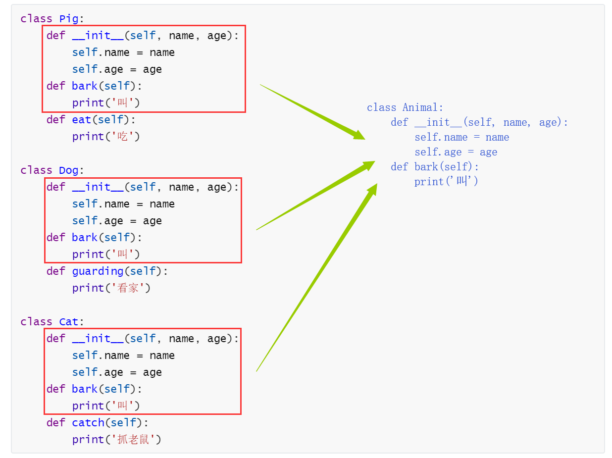
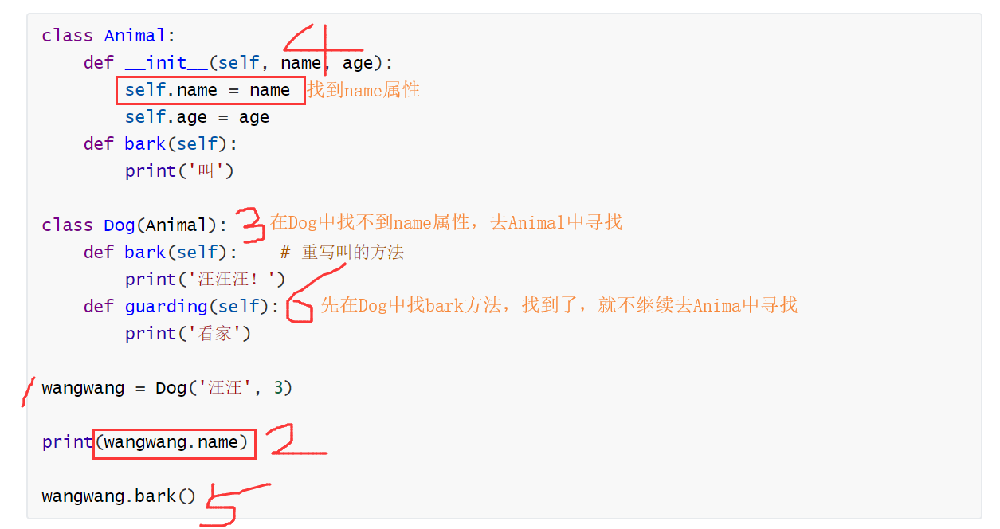
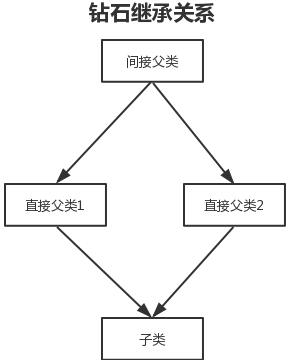
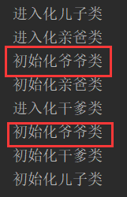
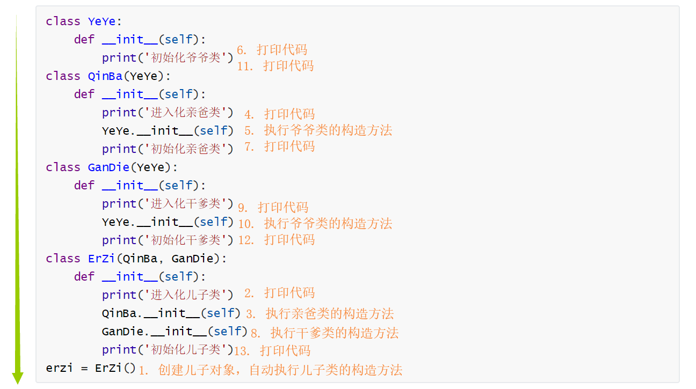
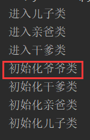
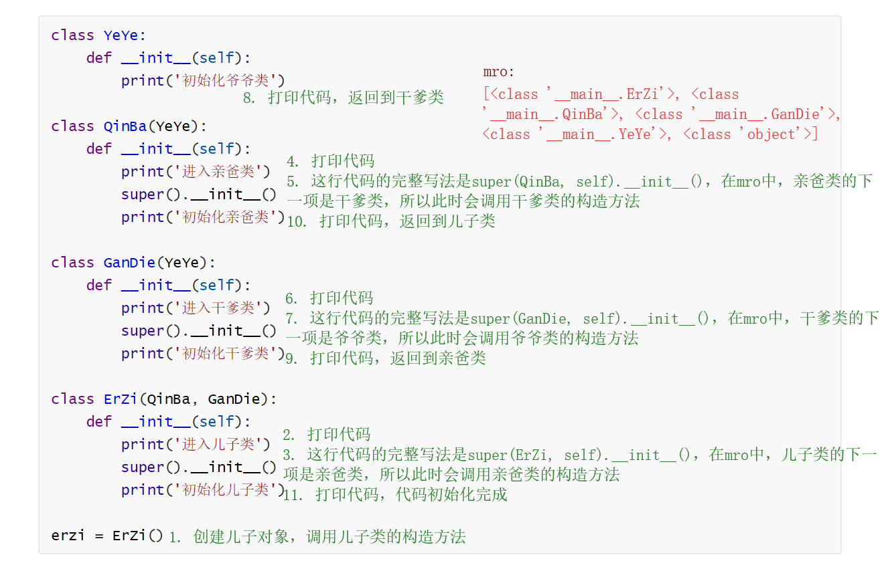
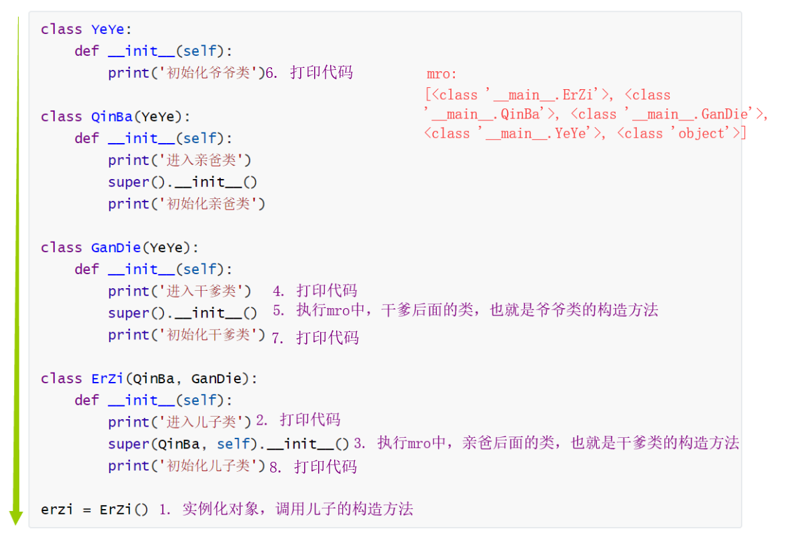

## 继承（实现）关系

[TOC]

### 面向对象与继承

面向对象思想有三大要素：

1. 继承
2. 封装
3. 多态

面向对象编程（OOP）语言的一个重要功能就是“继承”：

- 它可以使用现有类的所有功能，并在无需重新编写原来类的情况下，对这些功能进行扩展
- 通过继承创建的新类被称为“子类”或“派生类”，被继承的类被称为“基类”、“父类”或“超类”
- 在 Python 中，同时支持单继承与多继承

### 继承的概念

举个例子，我们现在像创建猪、狗和猫三个类，它们都有名字和年龄属性，也都有一个叫的方法。不同的是，猪有吃的方法、狗有看家的方法、猫有抓老鼠的方法。按照之前的学习，我们会将代码写成这样：

```python
class Pig:
    def __init__(self, name, age):
        self.name = name
        self.age = age
    def bark(self):
        print('叫')
    def eat(self):
        print('吃')

class Dog:
    def __init__(self, name, age):
        self.name = name
        self.age = age
    def bark(self):
        print('叫')
    def guarding(self):
        print('看家')
        
class Cat:
    def __init__(self, name, age):
        self.name = name
        self.age = age
    def bark(self):
        print('叫')
    def catch(self):
        print('抓老鼠')
```

我们发现，虽然实现了需求，但是我们看到，这里面出现了大量的重复代码。如果我们能将这些重复代码封装起来，比如封装到一个动物类中，然后猪、狗和猫分别都继承这个动物类，就可以让代码更加简洁。



具体的实现方法为：

```python
class Animal:
    def __init__(self, name, age):
        self.name = name
        self.age = age
    def bark(self):
        print('叫')
class Pig(Animal):
    def eat(self):
        print('吃')
class Dog(Animal):
    def guarding(self):
        print('看家')
class Cat(Animal):
    def catch(self):
        print('抓老鼠')
mimi = Cat('咪咪', 3)
print(mimi.name, mimi.age)
mimi.bark()
mimi.catch()
```

输出的结果为：

```python
咪咪 3
叫
抓老鼠
```

实现继承之后，子类将继承父类的属性和方法。

不难看出，继承关系的特点为：

- 增加了类的耦合性（耦合性不宜多，宜精）
- 减少了重复代码
- 使得代码更加规范化，合理化

组合与继承的对比：

- 组合
  - 组合是指在新类里面创建原有类的对象，重复利用已有类的功能，是 `has-a` 的关系（如：猫有腿）
  - 原来类的对象作为整体，以新类的属性的形式存在
- 继承
  - 继承允许设计人员根据其他类的实现来定义一个类的实现，是 `is-a` 的关系（如：猫是动物）
  - 子类可以直接使用父类中的属性和方法，就好像父类的属性和方法已经存在于子类中了一样

Python 3 中使用的都是新式类，如果一个类谁都不继承，那么它默认继承 object 类。

继承虽然很好用，但是不能滥用，像之前说的，耦合程度不宜过高，否则逻辑会十分混乱：

- 不要轻易地使用继承，除非两个类之间是 `is-a` 关系
- 不要单纯地为了实现代码的重用而使用继承，因为过多的继承会破坏代码的可维护性，当父类被修改的时候，会影响到所有继承自它的子类，从而增加程序的维护难度与成本
- 总结起来就是：组装的时候使用组合，扩展的时候使用继承

回到我们刚才的例子，猪、狗、猫三各类都只有动物一个父类，这种只有一个父类的继承方式，我们称作为单继承。在单继承中，子类可以继承父类的属性和方法，修改父类，所有子类都会受到影响。

### `isinstance` 和 `issubclass`

- `isinstance`：
  - 用于检查实例类型
  - `isinstance(对象, 类)`，用来判断对象是不是该类的实例对象
- `issubclass`：
  - 用于检查类继承
  - `issubclass(类1, 类2)`，用来判断类1是否是类2的子类

### 类与数据类型

Python 与其他编程语言不同，当我们定义一个 class 的时候，我们实际上就定义了一个数据类型。我们定义的数据类型和 Python 自带的数据类型，比如 str、list、dict 没什么两样：

```python
print(isinstance(10, int))

输出的结果为： True
```

### 重写父类方法

如果父类中的方法在子类中不适用，我们可以对其进行重写：

```python
class Animal:
    def __init__(self, name, age):
        self.name = name
        self.age = age
    def bark(self):
        print('叫')

class Dog(Animal):
    def bark(self):    # 重写叫的方法
        print('汪汪汪！')
    def guarding(self):
        print('看家')
  
wangwang = Dog('汪汪', 3)
print(wangwang.name)
wangwang.bark()
```

输出的结果为：

```python
汪汪
汪汪汪！
```

重写父类方法的原理是，当示例调用方法时，会先在自己的类方法中查找，如果找不到，才会去父类中查找是否有相应的方法。如果在自己的类方法中找到了需要的方法，就不会去父类中查找，也就调用不到父类的同名方法，从而实现对父类中方法的重写



### 调用父类方法

但是有些时候，我们不得已会写一些重名的方法，比如父类和子类都会有 `__init__` 构造方法。但是我们在调用子类方法的同时，也希望调用到父类中相应的方法。我们可以通过父类的类名直接调用：

```python
class Father:
    eye_num = 2
    def __init__(self, name, age):
        self.name = name
        self.age = age
    def live_like_yemen(self):
        print('打儿子')
class Son(Father):
    hair_color = '蓝色'
    def __init__(self, name, age, sex):
        Father.__init__(self, name, age)
        self.sex = sex
    def live_like_yemen(self):
        print('打弟弟')

xiaoming = Son('小明', 16, '男')
xiaoming.live_like_yemen()
print(xiaoming.name)
```

输出的结果为：

```python
打弟弟
小明
```

需要注意的是，在类中，self 永远指的是调用类的实例化对象。

### super 方法

在上面的例子中，如果没有 `Father.__init__(self, name, age)` 这行代码，在子类中就无法调用父类的构造方法，因为子类已经重写了构造方法。上面的方法虽然实现了预期的功能，但是并不符合开发规范。

从子类中，调用父类中方法的关键字是 super，上述例子可修改为：

```python
class Father:
    eye_num = 2
    def __init__(self, name, age):
        self.name = name
        self.age = age
    def live_like_yemen(self):
        print('打儿子')
class Son(Father):
    hair_color = '蓝色'
    def __init__(self, name, age, sex):
        super().__init__(name, age)    # 也可以写为super(Son, self).__init__(name, age)
        self.sex = sex
    def live_like_yemen(self):
        print('打弟弟')

xiaoming = Son('小明', 16, '男')
xiaoming.live_like_yemen()
print(xiaoming.name)
```

super 方法：

- 子类如果编写了自己的构造方法，但是没有声明要调用父类的构造方法，而还需要父类的构造函数中初始化的一些属性，就会出现问题
- 如果子类和父类都有构造函数，子类的构造函数其实是对父类的构造函数的重写。如果不显示调用父类构造函数，父类的构造函数便不会被执行
- 解决方法：直接使用超类的类名调用超类构造方法，或者使用 super 函数 `super(当前类名, self).__init__()`

父类方法重写：

- 子类可以重写父类中的方法
- 通过 super 关键字可以调用父类中的方法

### Python 中的多继承

多重继承和多继承

- 多重继承：包含多个间接父类

  ```python
  class A(object): pass
  class B(A): pass
  class C(B): pass
  ```

- 多继承：有多个直接父类

  ```python
  class X(object): pass
  class Y(object): pass
  class Z(object): pass
  class M(X, Y, Z): pass
  ```

- 大部分面向对象的编程语言（除了 C++）都只支持单继承，而不支持多继承

  - 多继承不仅增加了编程的复杂度，而且很容易导致一些莫名的错误[^1]

- Python 虽然在语法上明确支持多继承，但通常推荐如果不是很有必要，尽量不要使用多继承，而是使用单继承

  - 这样可以保证编程思路更清晰，而且可以避免很多麻烦

- 如果多个直接父类中包含了同名的方法

  - 排在前面的父类中的方法会“遮蔽“排在后面的父类中的同名方法

  ```python
  class A:
      def method(self):
          print('A_method')
  class B:
      def method(self):
          print('B_method')
  class C(A, B):
      pass
  
  c = C()
  c.method()
  ```
  
  输出的结果为：
  
  ```python
A_method
  ```

### 钻石继承和 MRO

我们刚刚谈到，即便不使用 super 方法，直接使用父类的类名，同样可以实现对父类方法的调用。那为什么更推荐使用 super 方法呢？

这是因为当涉及到比较复杂得多继承关系，比如钻石继承关系时，会出现间接父类会被初始化多次的情况。



比如，我们来看下面这个钻石继承的例子，如果我们使用父类的类名调用构造方法：

```python
class YeYe:
    def __init__(self):
        print('初始化爷爷类')
class QinBa(YeYe):
    def __init__(self):
        print('进入化亲爸类')
        YeYe.__init__(self)
        print('初始化亲爸类')
class GanDie(YeYe):
    def __init__(self):
        print('进入化干爹类')
        YeYe.__init__(self)
        print('初始化干爹类')
class ErZi(QinBa, GanDie):
    def __init__(self):
        print('进入化儿子类')
        QinBa.__init__(self)
        GanDie.__init__(self)
        print('初始化儿子类')
erzi = ErZi()
```

我们看到，程序运行后，爷爷类被初始化了两次。



这是因为，当创建儿子对象时，会执行它的构造函数。首先打印的是儿子类中初始化方法的代码，然后执行秦霸的构造方法。在亲爸的构造方法中，也是先打印代码，然后执行爷爷的构造方法。执行完爷爷的构造方法之后，程序继续执行亲爸中剩余的代码，然后回到儿子类中，执行干爹的构造方法。在干爹的构造方法中，又要调用爷爷的构造方法。然后打印剩余代码，直至结束。



我们看到，第五步和第十步都是要调用爷爷的构造方法，爷爷类被初始化了两次。这种情况一来没有必要，会占用很大空间，二来，多次初始化也会带来程序逻辑的混乱。

如果我们改用 super 函数来进行这样的操作，就不会有这些麻烦：

```python
class YeYe:
    def __init__(self):
        print('初始化爷爷类')
        
class QinBa(YeYe):
    def __init__(self):
        print('进入亲爸类')
        super().__init__()
        print('初始化亲爸类')
        
class GanDie(YeYe):
    def __init__(self):
        print('进入干爹类')
        super().__init__()
        print('初始化干爹类')
        
class ErZi(QinBa, GanDie):
    def __init__(self):
        print('进入儿子类')
        super().__init__()
        print('初始化儿子类')
        
erzi = ErZi()
```

首先，我们发现，在儿子类中，我们只用一行代码指代调用两个直接父类的构造方法。然后，从结果上看，此时，爷爷类只被初始化一次。



而且我们发现，代码的运行情况与多个装饰器装饰一个函数的情况很类似，子类的代码包含着父类的代码，一层套一层的形式。

要解释这个现象，就要引入 super 方法的查找方法：方法解析顺序列表，MRO[^2]。这个列表是 super 解析父类继承顺序的依据，通过 C3 算法实现。使用 C3 算法计算 MRO 列表的方法可以参考我翻译的 [Python 新式类继承关系的 C3 算法](..\translation\python-MRO.md) 官方文档。

查看 mro 的方法有两种：

```python
类名.mro()
对象名.__class__.mro()
```

前面例子中的 mro 为：

```python
[<class '__main__.ErZi'>, <class '__main__.QinBa'>, <class '__main__.GanDie'>, <class '__main__.YeYe'>, <class 'object'>]
```

我们说过，super 后面什么都不写，默认和 `super(当前类名, self)` 的写法一样。但事实上，super 的参数除了可以写当前类名外，还可以写它的父类[^3]的类名。此时，会执行在方法解析顺序列表中，该类下一个类的方法。

补充了这些知识，我们就可以解释上面的程序运行的顺序了。



super 关键字详解：

- 基本结构：`super(class[, object or class])`
- Python 3 可以直接使用 `super().xxx` 代替 `super(class, self).xxx`
- 使用多继承时，会涉及到查找顺序（MRO）、钻石继承等问题
  - 单继承时，`类名.__init__()` 的方式和 `super().__init__()` 的方式调用父类中的方法没有什么差别
  - 使用 `类名.__init__()` 的方式在钻石继承时，会遇到初始化混乱的问题

super 内核的 mro 方法：返回的是一个类的方法解析顺序表（顺序结构）

- 我们定义的每一个类，Python 都会计算出一个方法解析顺序（MRO[^2]）列表这也是 super 在父类中查找成员的顺序，它是通过 C3 线性算法来实现的

- 每个父类[^3]都存在且只在其中出现一次

- 我们可以通过下面两种方式获得某个类的 mro 列表：

  ```python
  类名.mro()
  对象名.__class__.mro()
  ```

- 当使用 `super(cls, obj)` 时，Python 会在 `obj` 的 `mro` 列表上搜索 `cls` 的下一个类

- 事实上，super 和父类没有实质性的关联，我们也不一定非要把 super 后面的参数写成自己类的名字和 self。我们甚至可以很灵活地给 super 传参数

  - `super(cls, obj)` 获得的是 `cls` 在 obj 的 `MRO` 列表中的下一个类，`cls` 可以是任何一个类，`obj` 可以是任何一个对象，只要合理即可

    ```python
    class class ErZi(Qinba,GanDie):
        def __init__(self):
            super(ErZi, self).__init__()
            print('初始化儿子')
    ```

  - 在前面我们定义儿子类的时候，如果我们不想调用亲爸的 `__init__()`，而是要调用干爹的 `__init__()`，只需把 super 写成 `super(Qinba, self).__init__()`，也就是这样：

    ```python
    class YeYe:
        def __init__(self):
            print('初始化爷爷类')
    
    class QinBa(YeYe):
        def __init__(self):
            print('进入亲爸类')
            super().__init__()
            print('初始化亲爸类')
    
    class GanDie(YeYe):
        def __init__(self):
            print('进入干爹类')
            super().__init__()
            print('初始化干爹类')
    
    class ErZi(QinBa, GanDie):
        def __init__(self):
            print('进入儿子类')
            super(QinBa, self).__init__()
            print('初始化儿子类')
    
    erzi = ErZi()
    ```

    其执行顺序为：

    

[^1]: 在编程时，莫名其妙的错误最为可怕，因为不可预测，难以排除。
[^2]: Method Resolution Order
[^3]: 包括直接父类和间接父类