# 消息队列和 RabbitMQ

## 消息队列

来看这样一个例子。相信大家都用外卖软件点过外卖。当我们在手机上下单之后，都发生了什么呢？

首先，客户用手机下单，将请求发送给服务端。服务端当然要先安排订单系统确认我们的订单信息，只有当我们付款成功后，订单才会生成。订单生成后，需要做三件事（真实的系统要做的事情更多，这里只是简单讨论）：分配骑士、告知商家和记录流水。

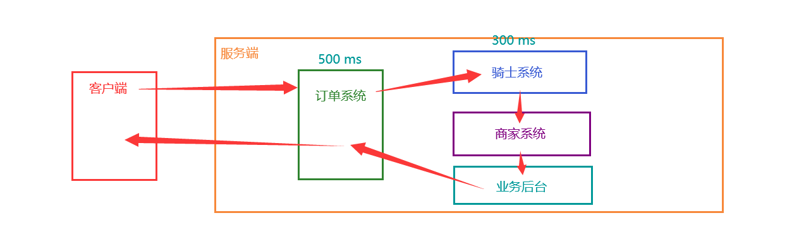

如果按照流程顺序，一步一步走，执行同步操作。我们假设订单系统要花费 500 ms，其他系统都要花费 300 ms。那么整套系统应该要花费 1.4 s。

这种顺序执行的方式，除了执行效率慢意外，容错率也很低——一旦有任何中间流程出现问题，整个业务都要瘫痪。

针对这些不足，我们可以进行改进，引入并发的概念，异步执行系统任务。

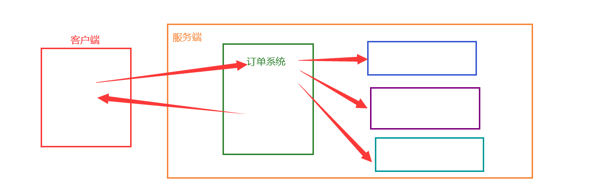

需要注意的是，异步任务并不一定越多越好，也好视情况合理安排。比如订单系统是不能和其他任务并发执行的。只有当订单系统执行完，订单确认提交，也就是我们付好了钱，才会生成订单，交给剩下的系统去执行。

此时，我们使用并发的思想。当订单生成后，不需要其它系统的响应，立即把“订单已生成”的消息发送给用户。而不需要等待骑手接单、商家准备好饭菜、后台记录好流水之后再发送。

这样做，首先减少了用户的等待时间，只需要订单处理的 500 ms。此外，如果后台某个系统出了故障，也不会影响其他系统的正常工作。骑手出问题，可以等待系统再分配，而商家在此时仍可准备餐点，一切都不受影响。

不过这样做仍然不是完美的。如果我们需要扩展业务，再增加一个系统。或者我们要压缩业务，缩减一个系统。这时，我们该怎么办呢？

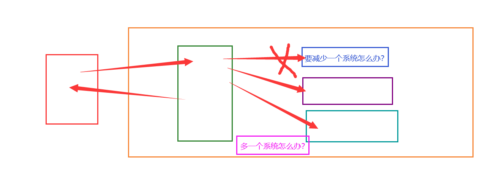

没办法，我们只好修改与各个系统进行数据交互的订单系统。但是要知道，修改源代码是编程大忌，轻易不可这样做。因为不像我们平时练习，代码少，随便改几行无所谓。工作中的代码往往很多，相互之间盘根错节。随意增删很容易造成不确定的麻烦。

对于生产者（这里的订单系统）和消费者（其他系统）直接通信的情况来说，还有很多不好的地方。比如，生产者有 3 个，而消费者有 5 个，改如何调和生产者与消费者数目不等且不成倍数的问题？

而如果生产者和消费者形成了死板的一对一或一对多的模式，又会造成资源分配的不合理。比如，生产者 1 早上的任务多些，生产者 2 晚上的任务多些。那么如果它们连接在不同的消费者中，就会造成峰值过高的情况。

如果有一种方法，能够把生产者和消费者解耦合，能够均衡峰值，该有多好。

于是，就有了生产者消费者模式。生产者消费者模式是通过一个容器来解决生产者和消费者的强耦合问题。生产者和消费者彼此之间不直接通讯，而通过阻塞队列来进行通讯，所以生产者生产完数据之后不用等待消费者处理，直接扔给阻塞队列，消费者不找生产者要数据，而是直接从阻塞队列里取，阻塞队列就相当于一个缓冲区，平衡了生产者和消费者的处理能力。

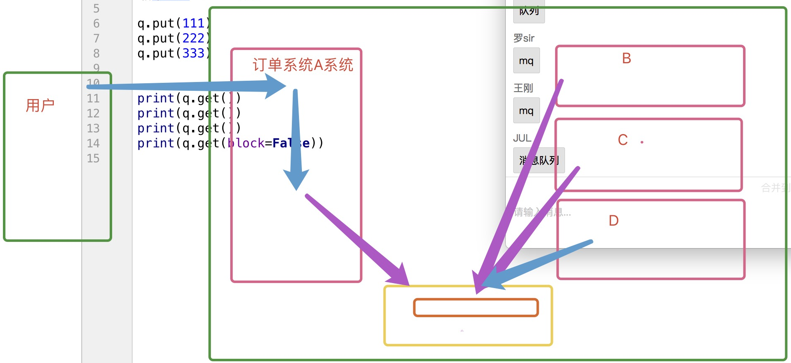

这样，生产者和消费者不再直接练习。如果新增系统，不会修改订单系统的代码，减少系统亦然。

消息队列 MQ，全称为 Message Queue （MQ），是一种应用程序对应用程序的通信方法。MQ 是消费 - 生产者模型的一个典型的代表，一端往消息队列中不断写入消息，而另一端则可以读取队列中的消息。这样发布者和使用者都不用知道对方的存在。

抛开消息不谈，队列（Queue），是一种先进先出的数据结构。

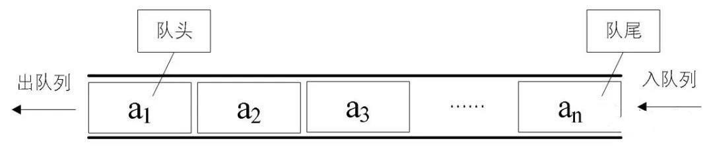

消息队列，可以立即为把要传输的数据放在队列中。

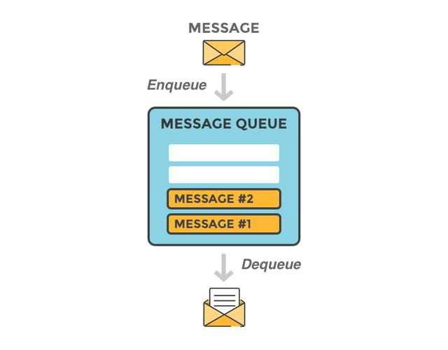

消息队列中间件是分布式系统中重要的组件，主要解决应用**解耦**，**异步消息**，**流量削锋**等问题，实现高性能，高可用，可伸缩和最终一致性架构。目前使用较多的消息队列有 ActiveMQ，RabbitMQ，ZeroMQ，Kafka，MetaMQ，RocketMQ。

## 队列杂谈

思考这样一个问题：既然队列跟列表一样，是一种数据结构，为什么我们一开始学基本数据类型的时候没有学到呢？为什么我们直到学了并发才开始学队列，而且似乎除了并发编程之外，我们很少用到队列呢？

来看下面一段代码：

```python
import queue

q=queue.Queue(10)

q.put(111)
q.put(222)
q.put(333)

print(q.get())
print(q.get())
print(q.get())
print(q.get())
```

这是一个同步执行的代码，从队列中取出来的数据要多于队列中已有的数据。在默认情况下，程序会阻塞在这里，等待队列中插入数据。但是因为这是串行执行的代码，显然不会有任何数据能够被加入到队列中，程序就被阻塞死了。

如果我们把 get 方法的 block 参数设置为 False，程序会直接报错：

```python
print(q.get(block=False))
```

很显然，对于同步代码来说，队列是有其局限性的。但是对于异步程序而言，则是另一种景象了。尤其是对于实现 Python 进程间通信，队列更是占有一席之地。

这是因为并发任务中，即便其中某一个任务因为队列中没有数据而阻塞，并不会阻碍其他任务的进行。其他任务有可能会继续向队列中写入数据，从而让阻塞的队列继续执行。

可以说，队列和并发很配哟。

## RabbitMQ

### 安装 RabbitMQ

#### Windows

Windows 安装 RabbitMQ 需要先安装 Erlang。在 [Erlang 官网](https://www.erlang.org/downloads) 下载最新版本的 Erlang 安装包

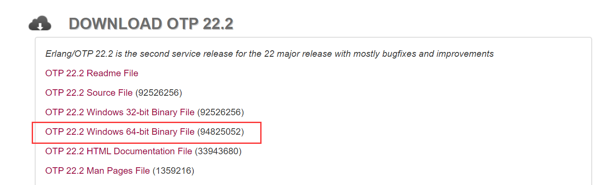

下载好之后，一顿点下一步，按照默认安装即可。

安装好 Erlang，即可安装 RabbitMQ。首先还是在 [RabbitMQ 官网](https://www.rabbitmq.com/install-windows.html#installer) 下载安装包。

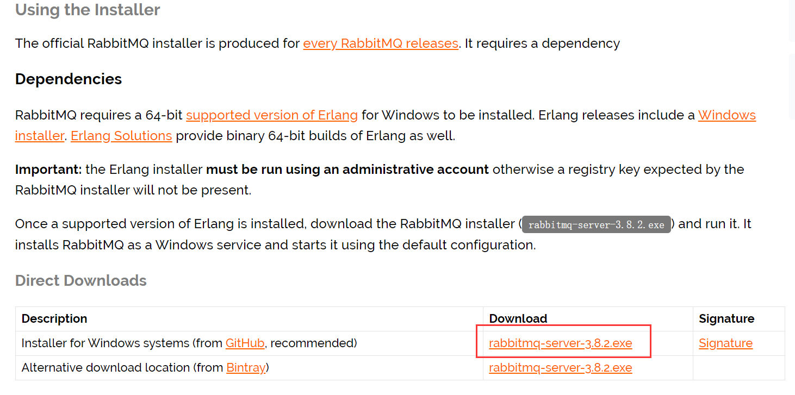

下载完成也是一顿下一步就能安装。

启动/停止 RabbitMQ 服务，以管理员身份运行终端，输入下面的命令：

```bash
net start rabbitmq
net stop rabbitmq
```

#### Ubuntu

首先，还是安装 erlang：

```bash
sudo apt-get install erlang-nox     # 安装erlang
erl    # 查看erlang语言版本，成功执行则说明erlang安装成功
```

添加 RabbitMQ 的公钥：

```bash
wget -O- https://www.rabbitmq.com/rabbitmq-release-signing-key.asc | sudo apt-key add -
```

安装 RabbitMQ：

```bash
sudo apt-get update
sudo apt-get install rabbitmq-server  #安装成功后，默认开机自动启动
```

查看 RabbitMQ 运行状态：

```bash
systemctl status rabbitmq-server    # Active: active (running) 说明处于运行状态

# service rabbitmq-server status    # 用service指令也可以查看，同systemctl指令
```

启动、停止、重启：

```bash
service rabbitmq-server start    # 启动
service rabbitmq-server stop     # 停止
service rabbitmq-server restart  # 重启 
```


执行了上面的步骤，rabbitMQ 已经安装成功。

启用 web 端可视化操作界面，我们还需要配置 Management Plugin 插件

```bash
rabbitmq-plugins enable rabbitmq_management   # 启用插件
service rabbitmq-server restart    # 重启
```


此时，应该可以通过 http://localhost:15672 查看，使用默认账户guest/guest 登录。

### 安装 pika

就像我们使用 Python 连接到 MySQL 需要安装 pymsql 一样，要连接到 RabbitMQ，我们也需要安装一个第三方包，pika。直接 pip 安装即可：

```bash
pip3 install pika -i https://pypi.douban.com/simple
```

### 简单模式

创建两个 py 文件，分别用作生产者和消费者：`producer.py` 和 `consumer.py`。

生产者：

1. 连接 RabbitMQ
2. 创建队列
3. 插入数据

`producer.py` 代码：

```python
import pika  # pika是Python连接RabbitMQ的模块

# 连接RabbitMQ，可指定IP和端口
connection = pika.BlockingConnection(pika.ConnectionParameters('localhost'))
channel = connection.channel()

# 创建一个名为hello的队列
channel.queue_declare(queue='hello')

#  向hello队列插入'Hello World!'
channel.basic_publish(exchange='',
                      routing_key='hello',
                      body='Hello Alex!')

print(" [x] Sent 'Hello World!'")
```

消费者： 

1. 连接 RabbitMQ
2. 声明队列，虽然生产者中已经声明了队列，消费者中还是有必要再次声明。因为我们无法确定究竟是生产者先启动还是消费者先启动。若已经存在同名消息队列，将不会创建新的队列。
3. 监听队列
4. 收到信息执行回调函数

`consumer.py` 代码：

```python
import pika

connection = pika.BlockingConnection(pika.ConnectionParameters('localhost'))
channel = connection.channel()

# 确保有队列可供操作
channel.queue_declare(queue='hello')

# 定义回调函数
def callback(ch, method, properties, body):
    print(" [x] Received %r" % body)

channel.basic_consume(queue='hello',
                      auto_ack=True,    # 默认应答机制
                      on_message_callback=callback    # 接收到消息后调用回调函数
                     )

print(' [*] Waiting for messages. To exit press CTRL+C')
channel.start_consuming()
```

上面代码运行效果如下：

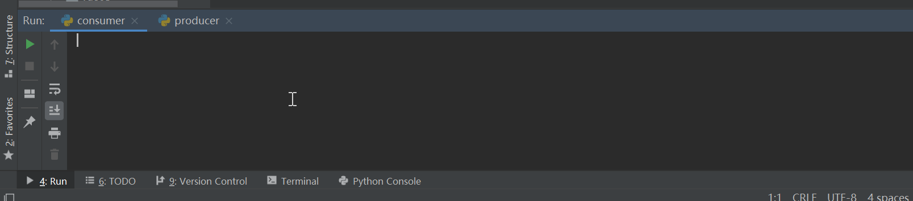

### 交换机模式

#### 发布订阅模式

对于我们最开始的外卖分配的例子，如果使用普通队列的话，恐怕无法完成任务。因为普通队列中的数据一旦提取出来，数据就不在了。不可能把一个订单消息分配给骑士系统、商家系统、后台管理三个系统。这时，我们就可以通过发布订阅模式，生产者把消息发送给交换机，由交换机将消息分发给多个队列。每一个消费者从自己绑定的队列中拿去数据，就可以实现一对多的数据分发了。

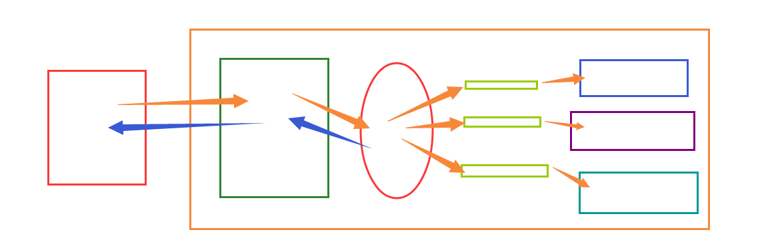

发布订阅和简单的消息队列区别在于，发布订阅会将消息发送给所有的订阅者，而消息队列中的数据被消费一次便消失。所以，RabbitMQ 实现发布和订阅时，会为每一个订阅者创建一个队列，而发布者发布消息时，会将消息放置在所有相关队列中。

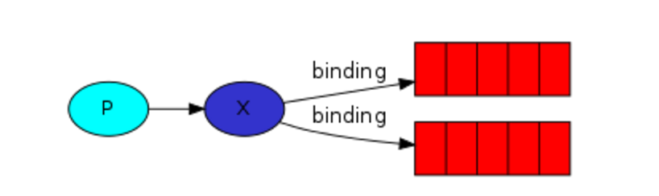

生产者：

1. 连接 RabbitMQ
2. 创建交换机
3. 向交换机插入数据

`producer.py` 代码：

```python
# 生产者
import pika


# 连接rabbitmq
connection = pika.BlockingConnection(pika.ConnectionParameters(
        host='localhost'))
channel = connection.channel()

# 声明创建一个交换机
channel.exchange_declare(exchange='logs',
                         exchange_type='fanout')


message = "info: Hello World!"
channel.basic_publish(exchange='logs',
                      routing_key='',
                      body=message)
print(" [x] Sent %r" % message)
connection.close()
```

   消费者：

1. 连接 RabbitMQ
2. 创建队列
3. 让队列绑定交换机
4. 收到信息执行回调函数

```python
import pika

connection = pika.BlockingConnection(pika.ConnectionParameters(host='localhost'))
channel = connection.channel()

# 声明交换机
channel.exchange_declare(exchange='logs',
                         exchange_type='fanout')

# 创建队列，名为随机字符串，这样每次运行的时候都不必费心给队列取名字了
result = channel.queue_declare("",exclusive=True)
queue_name = result.method.queue
print(queue_name)

# 将队列绑定到某个交换机上
channel.queue_bind(exchange='logs',
                   queue=queue_name)

print(' [*] Waiting for logs. To exit press CTRL+C')

def callback(ch, method, properties, body):
    print(" [x] %r" % body)

channel.basic_consume(queue=queue_name,
                      auto_ack=True,
                      on_message_callback=callback)

channel.start_consuming()
```

测试的时候因为需要开起多个消费者。但是 PyCharm 默认每个 Python 脚本同时只能运行一个，所以我们需要进行一下配置。

首先，打开配置页面，注意选择正确的 Python 脚本：

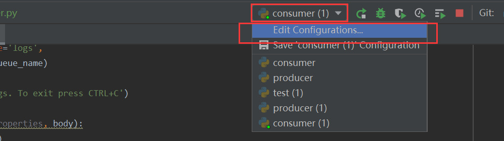

然后勾选右上角的 Allo parallel run

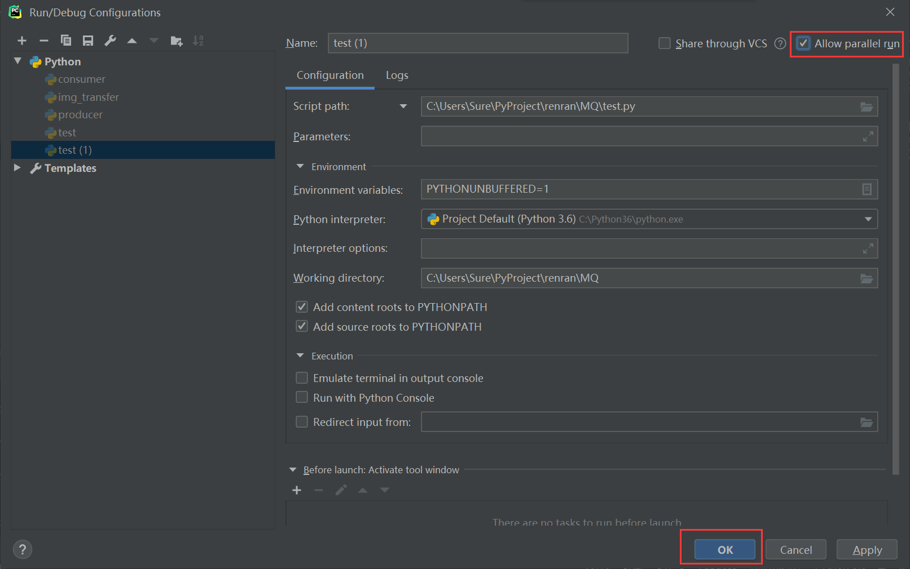

即可实现一个脚本平行运行了。

代码运行的效果如下：

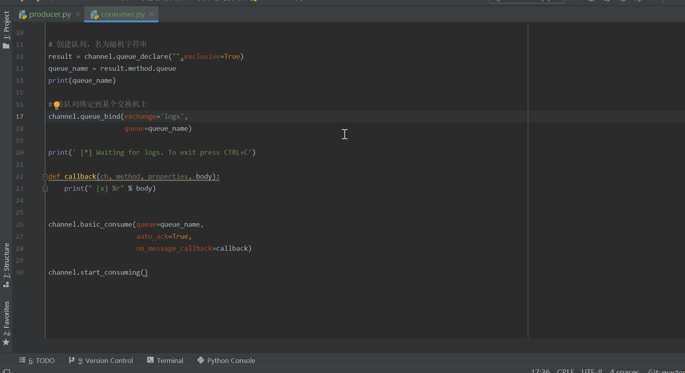

#### 关键字模式

发布订阅模式不管订阅者是非需要，一改会把数据发送过去。但有的时候，我们需要将数据根据需要，分发给不同的系统。比如写日志，我们希望 C2 能够处理所有的日志，而 C1 只处理等级为 error 的日志。这就需要按照关键字分发不同的数据给每个系统了。

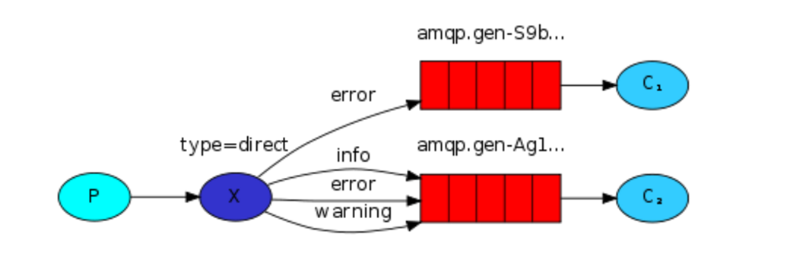

生产者 `producer.py` 代码：

```python
# 生产者
import pika


# 连接rabbitmq
connection = pika.BlockingConnection(pika.ConnectionParameters(
        host='localhost'))
channel = connection.channel()

# 声明创建一个交换机
channel.exchange_declare(exchange='logs2',
                         exchange_type='direct')

message = "%s: Hello World!"
key_wd = 'info'
# key_wd = 'warning'
# key_wd = 'error'
channel.basic_publish(exchange='logs2',
                      routing_key=key_wd, # 信息绑定关键字
                      body=(message % key_wd))
print(" [x] Sent %r" % message % key_wd)
connection.close()
```

消费者 `consumer.py` 代码：

```python
import pika

connection = pika.BlockingConnection(pika.ConnectionParameters(host='localhost'))
channel = connection.channel()

# 声明交换机
channel.exchange_declare(exchange='logs2',
                         exchange_type='direct')  # direct:关键字

# 创建队列，名为随机字符串
result = channel.queue_declare("", exclusive=True)
queue_name = result.method.queue
print(queue_name)

# 将队列绑定到某个交换机上
channel.queue_bind(exchange='logs2',
                   queue=queue_name,
                   routing_key="info"    # 关键字
                   )
# 若要绑定多个关键字，需要绑定多个队列，而非直接传多个 routing_key 参数
channel.queue_bind(exchange='logs2',
                   queue=queue_name,
                   routing_key="error"
                   )
channel.queue_bind(exchange='logs2',
                   queue=queue_name,
                   routing_key="warning"
                   )

print(' [*] Waiting for info, error and warning.')
# print(' [*] Waiting for info.')
# print(' [*] Waiting for error.')


def callback(ch, method, properties, body):
    print(" [x] %r" % body)


channel.basic_consume(queue=queue_name,
                      auto_ack=True,
                      on_message_callback=callback)

channel.start_consuming()
```

上面的代码运行效果为：

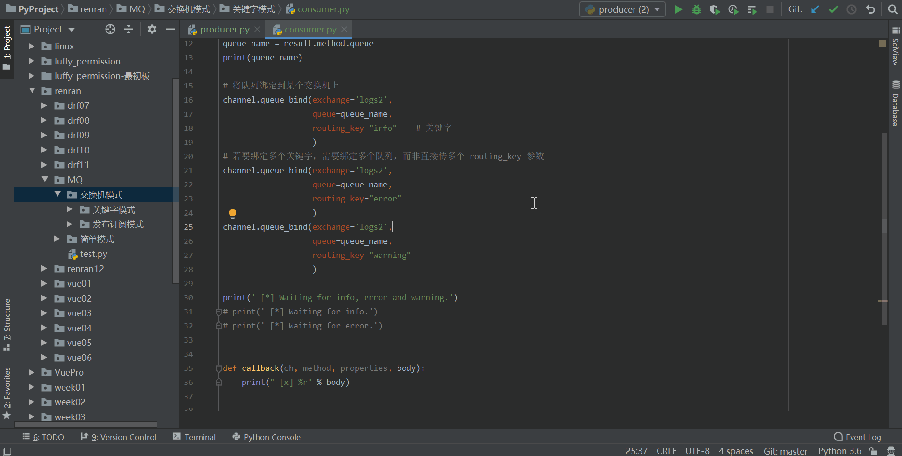

#### 模糊匹配模式

关键字模式虽然可以通过关键字判断是否接收数据。但是有的时候，数据过滤的规则比较复杂，单单使用关键字就显得有些死板。这时，我们可以使用通配符，进行模糊匹配。

在 RabbitMQ 中，通过通配符交换机（Topic Exchange）实现模糊匹配。

通配符交换机与之前的路由模式相比，它将信息的传输类型的 key 更加细化，以 `key1.key2.keyN...` 的模式来指定信息传输的 key 的大类型和大类型下面的小类型，让消费者可以更加精细的确认自己想要获取的信息类型。在消费者一端，不用精确的指定具体到哪一个大类型下的小类型的 key，而是可以使用类似正则表达式（但与正则表达式规则完全不同）的通配符在指定一定范围或符合某一个字符串匹配规则的 key，来获取想要的信息。

通配符交换机将路由键和某模式进行匹配。此时队列需要绑定在一个模式上。**符号 `#` 匹配一个或多个词，符号 `*` 仅匹配一个词**。因此 `audit.#` 能够匹配到 `audit.irs.corporate`，但是 `audit.*` 只会匹配到 `audit.irs`。（这里与我们一般的正则表达式的 `*` 和 `#` 刚好相反，需要注意一下）
下面是一个解释通配符模式交换机工作的一个样例，类似于一个国际新闻讯息网站的机制。


废话不多说，直接看代码。

生产者 `producer.py` 代码：

```python
import pika

# 连接rabbitmq
connection = pika.BlockingConnection(pika.ConnectionParameters(
        host='localhost'))
channel = connection.channel()

# 声明创建一个交换机
channel.exchange_declare(exchange='logs3',
                         exchange_type='topic')

message = "usa news... ... ..."
channel.basic_publish(exchange='logs3',
                      routing_key='china.weather',   # 信息绑定关键字
                      body=message)
print(" [x] Sent %r" % message)
connection.close()
```

消费者 `consumer.py` 代码：

```python
import pika

connection = pika.BlockingConnection(pika.ConnectionParameters(host='localhost'))
channel = connection.channel()

# 声明交换机
channel.exchange_declare(exchange='logs3',
                         exchange_type='topic')  # topic:模糊匹配

# 创建队列，名为随机字符串
result = channel.queue_declare("", exclusive=True)
queue_name = result.method.queue
print(queue_name)

message = '#.ne'

# 将队列绑定到某个交换机上
channel.queue_bind(exchange='logs3',
                   queue=queue_name,
                   routing_key=message
                   )

print('listening to %s' % message)

def callback(ch, method, properties, body):
    print(" [x] %r" % body)

channel.basic_consume(queue=queue_name,
                      auto_ack=True,
                      on_message_callback=callback)

channel.start_consuming()
```

上面代码的演示效果为：

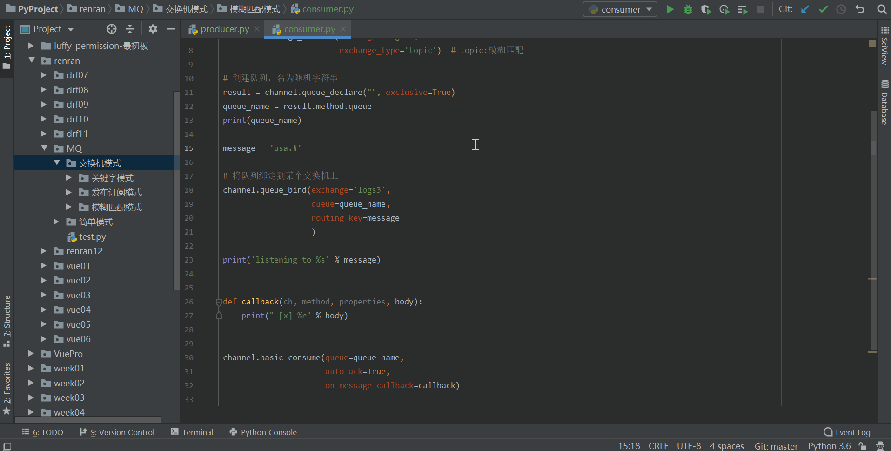

### 相关参数

#### 应答参数

当进程从队列中接收到数据后，会给队列返回一个确认的应答信息。队列已收到这个应答信息，知道我们已经接收到了数据，就将数据从队列中删除掉。

我们可以通过将 auto_ack 参数设置为 True，让程序自动应答。自动应答会在回调函数调用之前实现应答。这有一个弊端是，如果回调函数除了错误，程序崩溃了。再次启动程序时，队列中的数据将不会有那条数据——队列已经接收到了应答，删除了数据。这样我们就浪费了一条数据。数据丢失可是会造成严重后果的。

于是，有的时候，对于某些重要数据的操作，我们可以将应答参数设置为 False。待数据处理完，再向队列发送应答信息。如果程序出错，因为应答信息尚未发出，队列中的数据并不会被删除，再次请求还是会有。这样就避免了数据的丢失。

当然手动应答也有些许不如自动应答的地方。首先当然是代码量增加了，除了设置应答参数为 False，我们还要增加回复应答消息的代码。再有就是要等待任务处理完才会响应数据，对程序执行效率会有影响。

手动应答涉及到的代码有两个：

```python
auto_ack=False    # 消费者basic_consume中的参数
ch.basic_ack(delivery_tag=method.delivery_tag)    # 回调函数中用来发送应答信息
```

自动应答的代码就直接参照 [简单模式](#简单模式) 的代码来就行，下面的是手动应答的代码。

生产者 `producer.py` 代码并没有改变，跟自动应答是一样的，应答参数主要是消费者设置的：

```python
import pika

# 连接rabbitmq
connection = pika.BlockingConnection(pika.ConnectionParameters('localhost'))
channel = connection.channel()

# 创建一个名为hello的队列
channel.queue_declare(queue='hello')

#  向hello队列插入'Hello World!'
channel.basic_publish(exchange='',
                      routing_key='hello',
                      body='Hello World!')

print(" [x] Sent 'Hello World!'")
```

消费者 `consumer.py` 代码：

```python
import pika

connection = pika.BlockingConnection(pika.ConnectionParameters('localhost'))
channel = connection.channel()


channel.queue_declare(queue='hello')


def callback(ch, method, properties, body):
    # xxx
    print(" [x] Received %r" % body)

    #手动应答
    ch.basic_ack(delivery_tag=method.delivery_tag)


channel.basic_consume(queue='hello',
                      auto_ack=False,    # 手动应答机制
                      on_message_callback=callback)


print(' [*] Waiting for messages. To exit press CTRL+C')
channel.start_consuming()
```

自动应答，如果回调函数出错数据会丢失，使用简单应答的代码一试便知，就不演示了。手动应答，回调函数出错数据不丢失，演示如下：

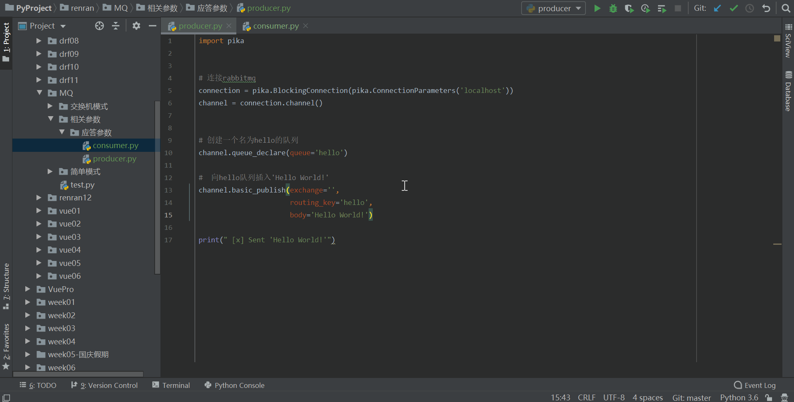

#### 分配参数

对于简单模式来说，如果多个消费者监听同一个队列，并不会像发布订阅模式那样，每个消费者都会得到同样的数据。而是队列将数据轮询分发给每一个消费者。通过这个规则，我们可以实现简单的负载均衡。大致演示如下：

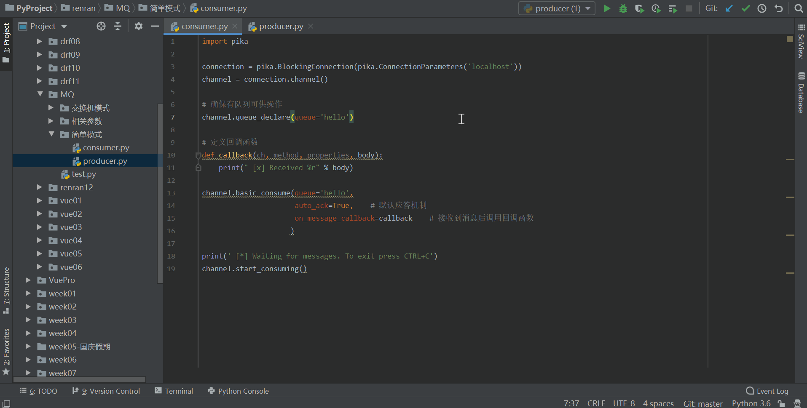

但是这种负载均衡又要给弊端：太死板。不论消费者是否空闲，只要是轮到了，就会发数据给他，只要没轮到，就不会发数据。如果消费者没有空闲，还会出现阻塞的情况。若要测试的话可以给一个消费者休眠 20 秒，另外一个不休眠或者休眠 5 秒。测试就会发现，休眠 20 秒的进程尚未结束时，如果再向队列中插入数据，休眠 5 秒的队列结束休眠后也不会拿到数据，而是由休眠 20 秒的进程拿到。我就不在这里演示了。

很多情况下，我们显然希望程序能够自动分配任务。哪一个消费者有空闲，就把任务安排给谁。

要把轮询分配改为公平分配，我们只需要在消费者中加入一行代码：

```python
channel.basic_qos(prefetch_count=1)
```

具体来说，生产者 `producer.py` 的代码不需要改动，还是简单模式的代码：

```python
import pika    # pika是python连接rabbitmq的模块

# 连接rabbitmq
connection = pika.BlockingConnection(pika.ConnectionParameters('localhost'))
channel = connection.channel()

# 创建一个名为hello的队列
channel.queue_declare(queue='hello')

#  向hello队列插入'Hello World!'
channel.basic_publish(exchange='',
                      routing_key='hello',
                      body='Hello World!')

print(" [x] Sent 'Hello World!'")
```

消费者 `consumer.py` 也只需要添加一行代码：

```python
import pika

connection = pika.BlockingConnection(pika.ConnectionParameters('localhost'))
channel = connection.channel()

channel.queue_declare(queue='hello')


def callback(ch, method, properties, body):
    import time
    time.sleep(5)
    print(" [x] Received %r" % body)

    #手动应答
    ch.basic_ack(delivery_tag=method.delivery_tag)

# 将轮询分配改为公平分配
channel.basic_qos(prefetch_count=1)

channel.basic_consume(queue='hello',
                      auto_ack=False,# 手动应答机制
                      on_message_callback=callback)

print(' [*] Waiting for messages. To exit press CTRL+C')
channel.start_consuming()
```

通过修改消费者睡眠时间即可测试。比如第一个消费者睡眠 20 秒，第二个消费者睡眠 5 秒。连续调用生产者三次，产生三个数据。如果是轮询分配的话，第一个消费者会受到两个数据，第二个消费者只能拿到一个数据。而对于公平分配，因为当第二个消费者处理完数据时，第一个消费者尚未处理完数据，所以最后一个数据会优先传给第二个消费者。

#### 持久化参数

消息队列的数据，甚至包括消息队列本身都是存储在内存中的。这就意味着，一旦关闭电源或者重启 RabbitMQ 服务，消息队列中的数据就会消失。

但是对于一些重要数据，我们需要它们保留下来，不会因为断电或者重启服务而消失。这时，就需要对数据进行持久化操作，将消息队列存储在硬盘中。

与应答参数和分配参数不同，持久化参数当然要主要由生产者来声明。生产者声明持久化参数分两步：

1. 创建持久化的队列。需要注意的是，这个队列的名字不能是已存在的非持久化队列。换句话说。这个命令只会创建持久化队列，而不会把非持久化队列转换为持久化队列。

   ```python
   channel.queue_declare(queue='hello2',durable=True)
   ```

2. 在插入数据时，声明数据是持久的。

   ```python
   channel.basic_publish(exchange='',
                         routing_key='hello2',
                         body='Hello World!',
                         properties=pika.BasicProperties(
                             delivery_mode=2,  # 声明数据要永久保存
                             )
                         )
   ```

因为无法确定生产者和消费者到底谁先运行，所以，消费者中也要添加创建持久化队列的代码：

```python
channel.queue_declare(queue='hello2',durable=True)
```

于是，生产者 `producer.py` 的完整代码为：

```python
import pika    # pika是python连接rabbitmq的模块

# 连接rabbitmq
connection = pika.BlockingConnection(pika.ConnectionParameters('localhost'))
channel = connection.channel()

# 创建一个名为hello2的队列，注意如果已经有了这个同名队列，是不会被持久化的
channel.queue_declare(queue='hello2',durable=True)

#  向hello2队列插入'Hello World!'
channel.basic_publish(exchange='',
                      routing_key='hello2',
                      body='Hello World!',
                      properties=pika.BasicProperties(
                          delivery_mode=2,  # 声明数据要永久保存
                          )
                      )

print(" [x] Sent 'Hello World!'")
```

消费者 `consumer.py` 的完整代码：

```python
import pika

connection = pika.BlockingConnection(pika.ConnectionParameters('localhost'))
channel = connection.channel()


channel.queue_declare(queue='hello2',durable=True)


def callback(ch, method, properties, body):

    print(" [x] Received %r" % body)
    #手动应答
    ch.basic_ack(delivery_tag=method.delivery_tag)


channel.basic_consume(queue='hello2',
                      auto_ack=False,# 手动应答机制
                      on_message_callback=callback)


print(' [*] Waiting for messages. To exit press CTRL+C')
channel.start_consuming()
```

测试方法：先使用生产者创建队列并生成一条数据，然后通过命令重启 RabbitMQ 服务，最后运行消费者，成功接收到数据。

重启 RabbitMQ 服务的方式为，以管理员身份运行 CMD，先关闭服务，再开启服务：

```bash
net stop rabbitmq
net start rabbitmq
```

## 基于 RabbitMQ 实现 RPC

关于 RPC，可以参考 [RPC 的原理和简单使用](rpc.md)。基于 RabbitMQ 实现 RPC 的原理可以参照下面这张示意图：

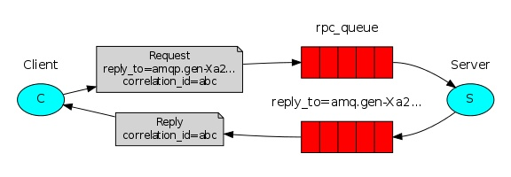

如图我们可以看出生产端 client 向消费端 server 请求处理数据，他会经历如下几次来完成交互。

1. 生产端生成 rpc_queue 队列，这个队列负责帮消费者接收数据并把消息发给消费端。

2. 生产端生成另外一个随机队列，这个队列是发给消费端，消费这个用这个队列把处理好的数据发送给生产端。

3. 生产端生成一组唯一字符串 UUID，发送给消费者，消费者会把这串字符作为验证在发给生产者。

4. 当消费端处理完数据，发给生产端时，会把处理数据与 UUID 一起通过随机生产的队列发回给生产端。

5. 生产端会使用 while 循环不断检测是否有数据，并以这种形式来实现阻塞等待数据，来监听消费端。

6. 生产端获取数据调用回调函数，回调函数判断本机的 UUID 与消费端发回 UID 是否匹配。由于消费端可能有多个，且处理时间不等所以需要判断。判断成功赋值数据，while循环就会捕获到，完成交互。

客户端 `client.py` 代码：

```python
import pika
import uuid
import time


# 斐波那契数列 前两个数相加依次排列
class FibonacciRpcClient(object):
    def __init__(self):
        # 赋值变量，一个循环值
        self.response = None
        # 链接远程
        self.connection = pika.BlockingConnection(pika.ConnectionParameters(
            host='localhost'))
        self.channel = self.connection.channel()

        # 生成随机queue
        result = self.channel.queue_declare("", exclusive=True)
        # 随机取queue名字，发给消费端
        self.callback_queue = result.method.queue

        # self.on_response 回调函数:只要收到消息就调用这个函数。
        # 声明收到消息后就 收queue=self.callback_queue内的消息

        self.channel.basic_consume(queue=self.callback_queue,
                                   auto_ack=True,
                                   on_message_callback=self.on_response)

    # 收到消息就调用
    # ch 管道内存对象地址
    # method 消息发给哪个queue
    # body数据对象
    def on_response(self, ch, method, props, body):
        # 判断本机生成的ID 与 生产端发过来的ID是否相等
        if self.corr_id == props.correlation_id:
            # 将body值 赋值给self.response
            self.response = body

    def call(self, n):

        # 　随机一次唯一的字符串
        self.corr_id = str(uuid.uuid4())

        # routing_key='rpc_queue' 发一个消息到rpc_queue内
        self.channel.basic_publish(exchange='',
                                   routing_key='rpc_queue',
                                   properties=pika.BasicProperties(

                                       # 执行命令之后结果返回给self.callaback_queue这个队列中
                                       reply_to=self.callback_queue,
                                       # 生成UUID 发送给消费端
                                       correlation_id=self.corr_id,
                                   ),
                                   # 发的消息，必须传入字符串，不能传数字
                                   body=str(n))
        # 没有数据就循环收
        while self.response is None:
            # 非阻塞版的start_consuming()
            # 没有消息不阻塞
            self.connection.process_data_events()
            print("no msg...")
            time.sleep(0.5)
        return int(self.response)


# 　实例化
fibonacci_rpc = FibonacciRpcClient()

response = fibonacci_rpc.call(30)
print(" [.] Got %r" % response)
```

服务端 server.py 代码：

```python
import pika

# 链接socket
connection = pika.BlockingConnection(pika.ConnectionParameters(
    host='localhost'))
channel = connection.channel()

# 生成rpc queue
channel.queue_declare(queue='rpc_queue')


# 　经典递归函数，生成斐波那契数列
def fib(n):
    if n == 0:
        return 0
    elif n == 1:
        return 1
    else:
        return fib(n - 1) + fib(n - 2)


# 收到消息就调用
# ch 管道内存对象地址
# method 消息发给哪个queue
# props 返回给消费的返回参数
# body数据对象
def on_request(ch, method, props, body):
    n = int(body)

    print(" [.] fib(%s)" % n)
    # 调用斐波那契函数 传入结果
    response = fib(n)

    ch.basic_publish(exchange='',
                     # 生产端随机生成的queue
                     routing_key=props.reply_to,
                     # 获取UUID唯一 字符串数值
                     properties=pika.BasicProperties(correlation_id= \
                                                         props.correlation_id),
                     # 消息返回给生产端
                     body=str(response))
    # 确保任务完成
    # ch.basic_ack(delivery_tag = method.delivery_tag)


# rpc_queue收到消息:调用on_request回调函数
# queue='rpc_queue'从rpc内收
channel.basic_consume(queue="rpc_queue",
                      auto_ack=True,
                      on_message_callback=on_request)
print(" [x] Awaiting RPC requests")
channel.start_consuming()
```

上面的代码运行效果为：

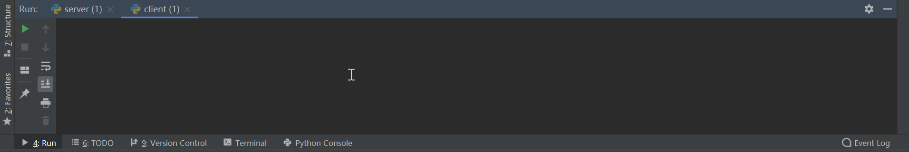

