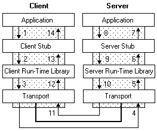

## RPC 的原理和简单使用

### RPC 的概念

RPC，Remote Procedure Call ，翻译成中文就是远程过程调用，是一种进程间通信方式。它允许程序调用另一个地址空间（通常是共享网络的另一台机器上）的过程或函数。在调用的过程中，不用程序员显式编码这个远程调用的细节。即无论是调用本地的接口/服务还是远程的接口/服务，本质上编写的调用代码基本相同。

说起 RPC，就不能不提到分布式，这个促使RPC诞生的领域。

假设你有一个计算器接口，Calculator 模块，以及它的实现类 CalculatorImpl。那么在系统还是单体应用时，你要调用 Calculator 的 add 方法来执行一个加运算，直接实例化一个 CalculatorImpl 对象，然后调用 add 方法就行了。这其实就是非常普通的本地函数调用，因为在同一个地址空间，或者说在同一块内存，所以可以直接实现。这也是我们一直以来的程序调用方式，本地调用。


现在，基于高性能和高可靠等因素的考虑，我们决定将系统改造为分布式应用系统。将很多可以共享的功能都单独拎出来，比如上面说到的计算器，你单独把它放到一个服务里头，让别的服务去调用它。


这下可难办了：服务 A 里并没有 CalculatorImpl 这个类，那它要怎样调用服务 B 的 CalculatorImpl 的 add 方法呢？

你可能会说，可以模仿 B/S 架构的调用方式，在 B 服务暴露一个 Restful 接口，然后 A 服务通过调用这个 Restful 接口来间接调用 CalculatorImpl 的 add 方法。

很好，这已经很接近 RPC 了。不过如果是这样，那每次调用时，都需要写一串发起 http 请求的代码，比如

```python
res = requests.get("URL")
```

但是，两个问题：

1. http 协议较为复杂，效率低，相对笨重

2. 调用方式不像本地调用简单方便，无法做到让调用者感知不到远程调用的逻辑

### RPC 的实现

#### RPC 的原理

实际情况下，RPC 很少用 http 协议来进行数据传输。毕竟只是想传输一下数据，何必动用到一个文本传输的应用层协议呢。一般我们会选择直接传输二进制数据。

不管你用何种协议进行数据传输，一个完整的 RPC 过程，都可以用下面这张图来描述：



以左边的 Client 端为例，Application 就是 RPC 的调用方，Client Stub 就是我们上面说到的代理对象，也就是那个看起来像是 Calculator 的实现类。其实内部是通过 RPC 方式来进行远程调用的代理对象。至于 Client Run-time Library，则是实现远程调用的工具包，比如 Python 的 socket 模块。最后通过底层网络实现实现数据的传输。

这个过程中最重要的就是**序列化**和**反序列化**，因为传输的数据包必须是二进制的。直接丢一个 Python 对象过去，人家也不认识。我们必须把 Python 对象序列化为二进制格式，传给 Server 端。Server 端接收到之后，再反序列化为 Python 对象。

#### Python 实现 RPC

Python 实现 RPC 需要使用 rpyc 模块。首先当然是安装模块：

```python
pip3 install rpyc -i https://pypi.douban.com/simple
```

安装好之后，我们就可以使用 rpyc，很容易地搭建起 Python 版本的 RPC 客户端和服务端了。

客户端 `client.py` 的代码为：

```python
import rpyc

# 参数主要是host, port
conn = rpyc.connect('localhost', 9999)
# test是服务端的那个以"exposed_"开头的方法
print('start')
while 1:
    try:
        num = int(input('请输入一个数字[任意非数字退出]：'))
        cResult = conn.root.cal(num)    # 这一句是客户端的精华，调用服务端的函数
        print(cResult)
    except Exception:
        break
print('end')

conn.close()
```

服务端 `server.py` 的代码为：

```python
from rpyc import Service
from rpyc.utils.server import ThreadedServer

class TestService(Service):

    # 对于服务端来说， 只有以"exposed_"打头的方法才能被客户端调用，所以要提供给客户端的方法都得加"exposed_"
    def exposed_cal(self, num):
        return num * 2

sr = ThreadedServer(TestService, port=9999, auto_register=False)
sr.start()
```

上面的代码执行效果为：


#### gRPC 框架

目前流行的开源 RPC 框架还是比较多的，比如阿里巴巴的 Dubbo、Facebook 的 Thrift、Google 的 gRPC、Twitter 的 Finagle 等。

- gRPC 是 Google 公布的开源软件，基于最新的 HTTP 2.0 协议，并支持常见的众多编程语言。RPC 框架是基于 HTTP 协议实现的，底层使用到了 Netty 框架的支持。
- Thrift 是 Facebook 的开源 RPC 框架，主要是一个跨语言的服务开发框架。用户只要在其之上进行二次开发就行，应用对于底层的 RPC 通讯等都是透明的。不过这个对于用户来说需要学习特定领域语言这个特性，还是有一定成本的。
- Dubbo 是阿里集团开源的一个极为出名的 RPC 框架，在很多互联网公司和企业应用中广泛使用。协议和序列化框架都可以插拔是极其鲜明的特色。

接下来我们以使用较为广泛的 gRPC 为例学习下 RPC 框架的使用。

gRPC 是 Google 开放的一款 RPC (Remote Procedure Call) 框架，建立在 HTTP2 之上，使用 Protocol Buffers。

[protocol buffers](https://developers.google.com/protocol-buffers/) 是 Google 公司开发的一种数据描述语言，采用简单的二进制格式，比 XML、JSON 格式体积更小，编解码效率更高。用于数据存储、通信协议等方面。

通过一个 `.proto` 文件，你可以定义你的数据的结构，并生成基于各种语言的代码。目前支持的语言很多，有 Python、golang、js、java 等等。

有了 protocol buffers 之后，Google 进一步推出了 gRPC。通过 gRPC，我们可以在 `.proto` 文件中也一并定义好 service，让远端使用的 client 可以如同调用本地的 library 一样使用。


基于这个原理，我们甚至可以实现跨语言的方法调用。比如上面的图片中，gRPC Server 是由 C++ 写的，Client 则分別是 Java 以及 Ruby，Server 跟 Client 端则是通过 protocol buffers 来信息传递。

接下来，我们按照下面的流程，搭建一个 gRPC 模型。

1. 安装 grpc 模块：

   ```bash
   pip3 install grpcio grpcio-tools -i https://pypi.douban.com/simple
   ```

2. 定义功能函数 `calculate.py`，示例中的是用来计算给定数字的平方根：

   ```python
   import math
   
   # 求平方
   def square(x):
       return math.sqrt(x)
   ```

3. 创建 calculate.proto 文件，在这里描述我们要使用的 message 以及 service：

   ```protobuf
   syntax = "proto3";
   
   message Number {
       float value = 1;
   }
   
   service Calculate {
       rpc Square(Number) returns (Number) {}
   }
   ```

4. 生成 gRPC 类。这部分可能是整个过程中最“黑盒子”的部分，我们将使用特殊工具自动生成类。在当前目录下执行下面的命令：

   ```bash
   python -m grpc_tools.protoc -I. --python_out=. --grpc_python_out=. calculate.proto
   ```

   你会看到生成了两个文件：

   - `calculate_pb2.py` 包含 message 信息（`calculate_pb2.Number`）
   - `calculate_pb2_grpc.py` 包含 server（`calculate_pb2_grpc.CalculatorServicer`）和 client（`calculate_pb2_grpc.CalculatorStub`）

5. 创建 gRPC 服务端：

   ```python
   import grpc
   import calculate_pb2
   import calculate_pb2_grpc
   import calculate
   from concurrent import futures
   import time
   
   
   # 创建一个 CalculateServicer 继承自 calculate_pb2_grpc.CalculateServicer
   class CalculateServicer(calculate_pb2_grpc.CalculateServicer):
       def Square(self, request, context):
           response = calculate_pb2.Number()
           response.value = calculate.square(request.value)    # 在这里进行计算
           return response
   
   
   # 创建一个 gRPC server
   server = grpc.server(futures.ThreadPoolExecutor(max_workers=10))
   # 利用 add_CalculateServicer_to_server 这个方法把上面定义的 CalculateServicer 加到 server 中
   calculate_pb2_grpc.add_CalculateServicer_to_server(CalculateServicer(), server)
   # 让 server 跑在 port 50051 中
   print('Starting server. Listening on port 50051.')
   server.add_insecure_port('[::]:50051')
   server.start()
   
   # 因为 server.start() 不会阻塞，添加睡眠循环以持续服务
   try:
       while True:
           time.sleep(24 * 60 * 60)
   except KeyboardInterrupt:
       server.stop(0)
   ```

6. 启动 gRPC server 服务端：

   ```bash
   python server.py
   ```

   

7. 创建 gRPC 客户端 `client.py`：

   ```python
   import grpc
   import calculate_pb2
   import calculate_pb2_grpc
   
   # 打开 gRPC channel，连接到 localhost:50051
   channel = grpc.insecure_channel('localhost:50051')
   # 创建一个 stub (gRPC client)
   stub = calculate_pb2_grpc.CalculateStub(channel)
   # 创建一个有效的请求消息 Number
   number = calculate_pb2.Number(value=int(input('请输入一个数字：')))
   # 带着 Number 去调用 Square
   response = stub.Square(number)
   print(response.value)
   ```

8. 运行 gRPC 服务端：

   ```bash
   python client.py
   ```

   

9. 最终的文件结构：

   

### 总结

RPC 主要用于公司内部的服务调用，性能消耗低，传输效率高，实现复杂。

HTTP 主要用于对外的异构环境，浏览器接口调用，App 接口调用，第三方接口调用等。

RPC 适用场景（大型的网站，内部子系统较多、接口非常多的情况下适合使用 RPC）：

- 长链接。不必每次通信都要像 HTTP 一样去 3 次握手，减少了网络开销。
- 注册发布机制。RPC 框架一般都有注册中心，有丰富的监控管理。发布、下线接口、动态扩展等，对调用方来说是无感知、统一化的操作。
- 安全性，没有暴露资源操作。
- 微服务支持。就是最近流行的服务化架构、服务化治理，RPC 框架是一个强力的支撑。

### RPC 没那么简单

要实现一个 RPC 不算难，难的是实现一个高性能高可靠的 RPC 框架。

比如，既然是分布式了，那么一个服务可能有多个实例，你在调用时，要如何获取这些实例的地址呢？

这时候就需要一个服务注册中心，比如在 Dubbo 里头，就可以使用 Zookeeper 作为注册中心。在调用时，从 Zookeeper 获取服务的实例列表，再从中选择一个进行调用。

那么选哪个调用好呢？这时候就需要负载均衡了，于是你又得考虑如何实现复杂均衡，比如 Dubbo 就提供了好几种负载均衡策略。

这还没完，总不能每次调用时都去注册中心查询实例列表吧，这样效率多低呀，于是又有了缓存，有了缓存，就要考虑缓存的更新问题，blablabla……

你以为就这样结束了，没呢，还有这些：

- 客户端总不能每次调用完都干等着服务端返回数据吧，于是就要支持异步调用；
- 服务端的接口修改了，老的接口还有人在用，怎么办？总不能让他们都改了吧？这就需要版本控制了；
- 服务端总不能每次接到请求都马上启动一个线程去处理吧？于是就需要线程池；
- 服务端关闭时，还没处理完的请求怎么办？是直接结束呢，还是等全部请求处理完再关闭呢？
- ……

如此种种，都是一个优秀的 RPC 框架需要考虑的问题。