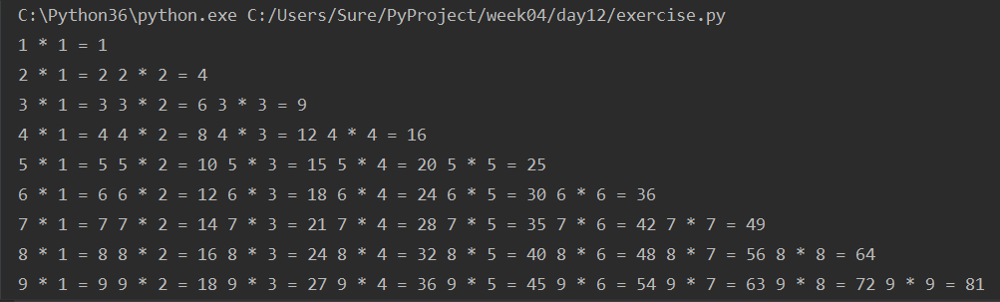
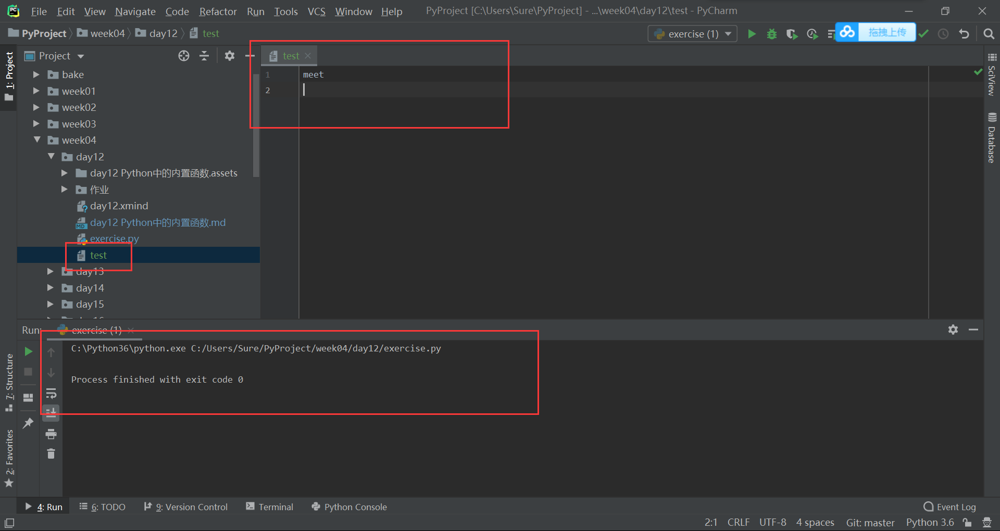

## 基础内置函数

[TOC]

### `all` 函数

all 函数用来判断可迭代对象中是否所有的元素**都**为 True：

```python
print(all([1, 2, 32, 43, 5]))

输出的结果为： True
```

### `any` 函数

any 函数与用来判断可迭代对象中的元素是否**有一个**为 True：

```python
print(any([1, 2, 3, 0, 1, 0]))

输出的结果为： True
```

### `callable` 函数

callable 函数用来判断变量是否可以被调用：

```python
def func():
    pass
print(callable(func))

输出的结果为： True
```

### `bytes` 函数

bytes 函数可以将字符串编码为二进制形式，它的功能和字符串的 `.encode()` 方法十分类似，更推荐使用字符串的 `.encode()` 方法：

```python
print('你好'.encode('utf-8'))
print(bytes('你好', encoding='utf-8'))
```

输出的结果为：

```python
b'\xe4\xbd\xa0\xe5\xa5\xbd'
b'\xe4\xbd\xa0\xe5\xa5\xbd'
```

### `chr` 和 `ord` 函数

chr 函数根据当前编码（Python 3 中为 Unicode）解码为字符，ord 为 chr 方法的逆运算，用来将字符编码为数字：

```python
print(chr(20320))
print(ord('你'))
```

输出的结果为：

```python
你
20320
```

### `complex` 和 `divmod` 函数

这两个函数用来进行计算。complex 函数用来将一对数字转换为复数形式，第一个数作为复数的实部，第二个数为复数的虚部：

```python
print(complex(20, 3))

输出的结果为：(20+3j)
```

divmode 函数会将一对数字做商，第一个参数做被除数，第二个参数做除数，返回值为一个元组，元组的第一个元素是商，第二个元素是余数：

```python
print(divmod(20, 3))

输出的结果为：(6, 2)
```

### `eval` 和 `exec` 函数

这两个函数用来执行字符串中的代码。其中，eval 函数可以执行单行字符串代码，exec 函数可以执行多行字符串代码：

```python
msg = 'print(1)'
eval(msg)

msg2 = """                                    # 禁用
def func():
    print("太厉害了")
func()
"""
exec(msg2)
```

输出的结果为：

```python
1
太厉害了
```

注意这两个函数在日后的编程中是被**禁止使用**的，因为有可能会出现被恶意注入的 Bug。

### `frozenset` 函数

frozenset 可以生成一个冻结的不可变的集合：

```python
dic = {frozenset({1, 2, 3, 4}): 1}
print(dic)

输出的结果为：{frozenset({1, 2, 3, 4}): 1}
```

既然能做字典的键，就说明冻结集合是一个不可变数据。

### `hash` 函数

hash 函数用来判断一个数据是否可哈希。如果可哈希，会返回该数据的哈希值；如果不可哈希，会报错：

```python
print(hash('12'))
print(hash(12))
print(hash(True))
# print(hash([1, 2]))
print(hash((1, 2)))
# print(hash({1: 2}))
# print(hash({1, 2}))
```

### `help` 函数

help 函数可以查看帮助信息：

```python
help(list)    # 使用 help 函数不需要打印
```

### 进制转换函数

bin、oct 和 hex 三个函数分别能将十进制数转换为二进制、八进制和十六进制数；int 方法则能将各种进制数转换为十进制数：

```python
print(bin(10))
print(oct(10))
print(hex(30))
print(int('0x1e', 16))    # 将十六进制数转为十进制，0x可以不加
print(int('1e', 16))
print(int('0o11', 8))
print(int('0b11', 2))
```

输出的结果为：

```python
0b1010
0o12
0x1e
30
30
9
3
```

### `pow` 函数

pow 函数用来进行幂运算，返回的结果是前一个数的后一个数次幂：

```python
print(pow(3, 4))    # 3 ** 4

输出的结果为： 81
```

### `repr` 函数

repr 函数用来显示打印出来的字符串两端的双引号，即令字符串原形毕露：

```python
print('123')
print(repr('123'))
```

输出的结果为：

```python
123
'123'
```

### `round` 函数

round 函数用来将小数取整，取整规则是四舍六入五成双，也可以指定保留的小数位数：

```python
print(round(3.4))
print(round(3.5))
print(round(3.6))
print(round(4.4))
print(round(4.5))
print(round(4.6))
print(round(3.14159265397932384626, 3))
```

输出的结果为：

```python
3
4
4
4
4
5
3.142
```

### `abs` 函数

abs 用来求数字的绝对值：

```python
print(abs(-6))
```

### `format` 函数

format 函数用来格式化字符串，与字符串的 `.center()` 方法类似：

```python
s = '你好'
s1 = format(s, '>20')    # 靠右
s2 = format(s, '<20')    # 靠左
s3 = format(s, '^20')    # 居中
print(s1, s2, s3, sep='\n')
```

输出的结果为：

```python
                  你好
你好                  
         你好         
```

format 也可以用来进行数字的进制转换：

```python
s = 18
print(format(s, '08b'))    # 08的意思是总共八位，不足的用0补齐，b指的是要转换为二进制bin
print(format(s, '08o'))    # oct
print(format(s, '08x'))    # hex
print(format(s, '08d'))    # decimal
```

输出的结果为：

```python
00010010
00000022
00000012
00000018
```

format 方法对于转换 ip 地址会很有用。

### `sum` 函数

sum 函数用来求一个可迭代对象中元素的总和：

```python
print(sum[1, 2, 3, 4])
```

### `dir` 函数

dir 函数用来查看当前对象有哪些方法：

```python
print(dir(list))
```

### `print` 函数

print 函数我们已经非常熟悉了，用来将内容打印出来。我们还需要了解的是 print 有两个关键字参数：sep 和 end。

sep 用来规定 print 中多个元素以什么间隔开，默认值为一个空格 `' '`；end 用来规定 print 函数打印完全部内容后以什么为结尾，默认为换行符 `\n`。

我们可以通过修改 sep 和 end 的值来实现不同的打印输出效果：

```python
print('alex', 'wusir', '太亮', sep='-', end=' ')
print('meet')
```

输出的结果为：

```python
alex-wusir-太亮 meet
```

我们可以利用 print 的这两个参数实现打印九九乘法表：

```python
for i in range(1, 10):
    for j in range(1, 10):
        if i > j:
            print(f'{i} * {j} = {i * j}', end=' ')
        elif i == j:
            print(f'{i} * {j} = {i * j}')
```

输出的结果是这样的：



除了能将信息打印到屏幕上，print 也可以将信息写入到文件中：

```python
f = open('test', 'a', encoding='utf-8')
print('meet', file=f)
```

屏幕上没又打印出任何内容，但是出现了一个名为 test 的文件，文件中的内容为 meet：



