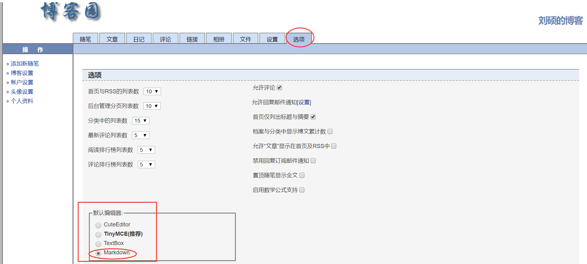
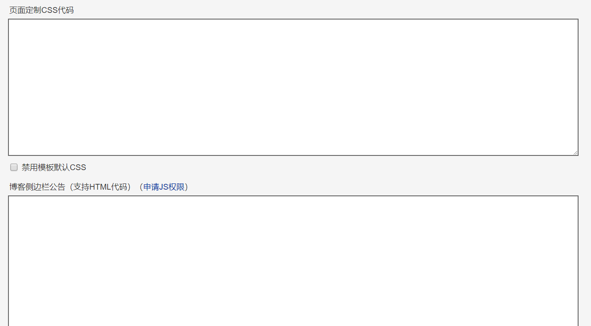

## 技术博客制作

[TOC]

### 制作步骤

1. 使用 Typora 等 markdown 文本编译工具整理好博客内容
2. 全选 -> 复制 -> 粘贴到 CSDN 或博客园等博客网站发布

### 制作技巧

1. 能用图片少用文字
2. 能用代码也少用文字
3. 能用 gif 的尽量花时间做一个 gif（进阶）

### 推荐平台

1. [博客园](https://www.cnblogs.com)
2. [CSDN](https://www.csdn.net/)
3. [V2EX](https://www.v2ex.com/)（比较古老的博客网站，很多年纪比较大的程序员活跃于此）

### 博客园使用技巧

1. 在博客园个人主页点击 `管理` -> `选项`，把 `默认编辑器` 改成 `Markdown`。这样，以后我们的博客用 Typora 写好以后就可以直接复制粘贴到博客园中发布啦。

   

2. 在 `设置` 选项卡中，可以通过自定义样式，让博客园首页更加美观。

   

3. 一个很好看的博客园美化模板：https://bndong.github.io/Cnblogs-Theme-SimpleMemory/v1.1/#/

   按教程走就行。
   
4. 看板娘，在侧边栏公告加上下面的代码：

   ```html
   <script>
       L2Dwidget.init({
           "model": {
               jsonPath: "https://unpkg.com/live2d-widget-model-shizuku/assets/shizuku.model.json",<!--这里改模型，前面后面都要改-->
               "scale": 1
           },
           "display": {
               "position": "left",<!--设置看板娘的上下左右位置-->
               "width": 100,
               "height": 200,
               "hOffset": -10,
               "vOffset": -20
           },
           "mobile": {
               "show": true,
               "scale": 0.5
           },
           "react": {
               "opacityDefault": 0.7,<!--设置透明度-->
               "opacityOnHover": 0.2
           }
       });
   </script>
   ```

   