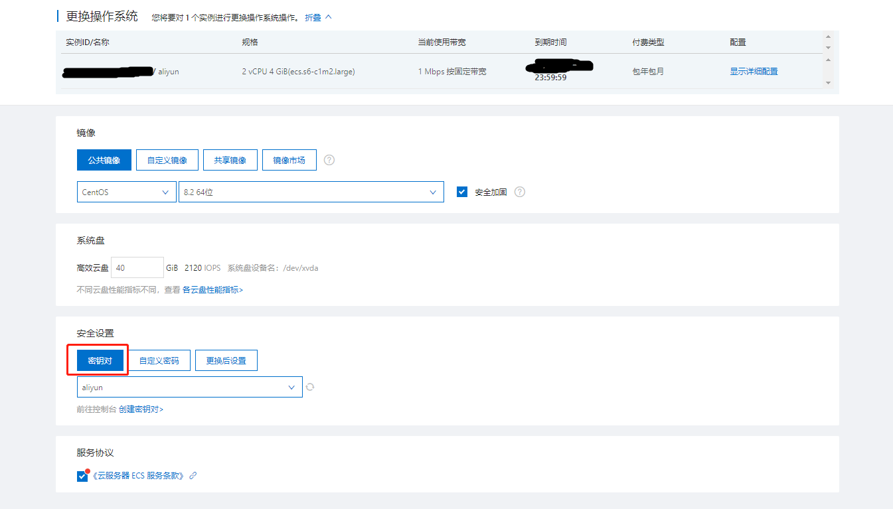
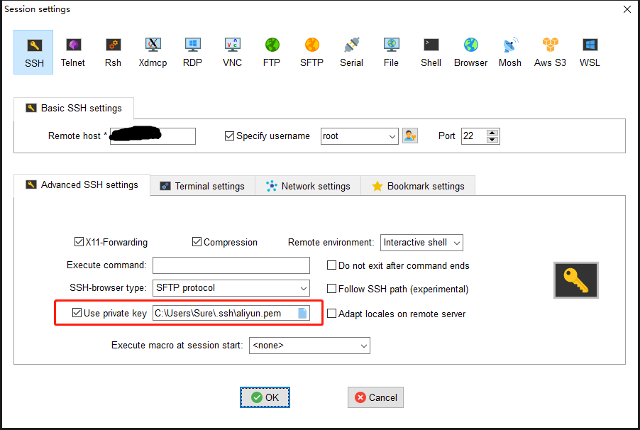
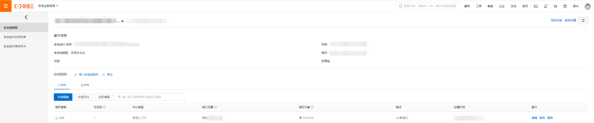
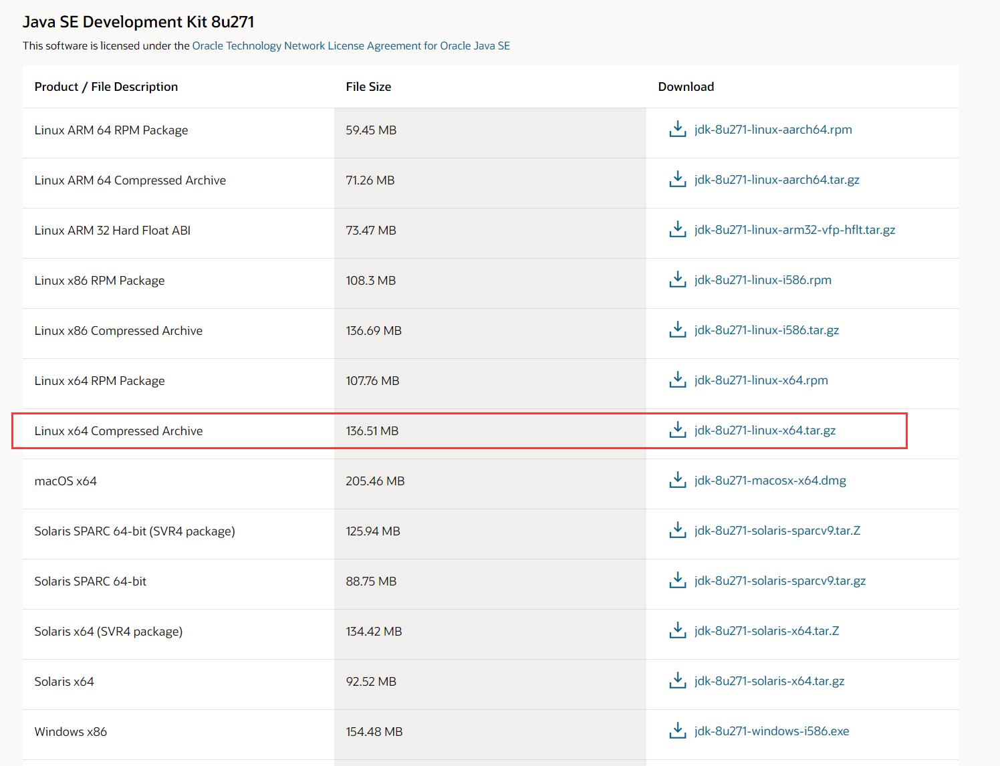

# CentOS 系统 Python 环境搭建

[toc]

## 密钥登陆 CentOS

安装系统时，指定使用密钥登陆，可以有效防止服务器被暴力破解。



可以使用 MobaXterm 登陆中指定密钥，实现密钥登陆：



也可以本地生成密钥对，然后将公钥存放至 `~/.ssh/authorized_keys` 文件中。

或者使用命令，将密钥 id 放到服务器上：

```bash
ssh-copy-id 192.168.11.11
```

## 创建管理员用户并禁止 root 登录

对于 Linux 来说，root 用户的权限过高且名称确定，如果被黑客利用后果不堪设想。

添加新用户：

```bash
useradd shuo
```

修改新用户密码（如果是外网服务器，安全起见，需设置复杂一些才好）：

```bash
passwd shuo
```

给新用户 sudo 权限：

1. 打开 sudo 的配置文件

   ```bash
   visudo
   ```

   也可以使用 vim 直接修改 `/etc/sudoers` 文件。使用 `visudo` 命令修改会有语法检测，更专业。

2. 找到如下配置行，添加你允许使用 sudo 的用户名字

   ```bash
   ## Allow root to run any commands anywhere
   root    ALL=(ALL)       ALL
   shuo    ALL=(ALL)       ALL
   ```

3. 使用 sudo 命令，在你敲的命令前，加上 sudo 即可：

   ```bash
   sudo ls /root
   ```

禁止 root 登陆，允许密码登陆：

```bash
vim /etc/ssh/sshd_config
```

 把 `PermitRootLogin yes` 改为 `PermitRootLogin no`， 把 `PasswordAuthentication no` 改成 `PasswordAuthentication yes`：


重启 ssh 服务：

```bash
service sshd restart
```

## 更换 ssh 端口

打开 ssh 服务的配置文件：

```bash
vim /etc/ssh/sshd_config
```

找到 `#Port 22`，将它取消注释，将 22 修改为需要的端口；

重启 ssh 服务：

```bash
service sshd restart
```

重启服务不会断开已有链接，下次连接时生效配置。

有些云服务供应商需要去安全组配置打开所需端口：



## 安装 Python 虚拟环境

阿里云的 CentOS 系统中已经自带了 Python3.6.8 和 pip，无需自己安装，而且已经默认将 pip 源设置为阿里云。

通过下面几条命令安装虚拟环境（virtualenvwrapper 依赖前三个包）：

```bash
sudo pip3 install wheel
sudo pip3 install pbr
sudo pip3 install virtualenv
sudo pip3 install virtualenvwrapper
```

设置 Linux 的环境变量，确保计每次开机启动时加载 virtualenvwrapper。

打开并编辑 `~/.bashrc` 文件：

```
vim ~/.bashrc
```

在文件末尾添加下面几行代码，注意修改 Python 解释器和 virtualenvwrapper 的地址为自己的 Python 安装位置，修改好后保存并退出：

```
export WORKON_HOME=~/PyEnvs    # 设置 virtualenv 的统一管理目录，可按需修改
export VIRTUALENVWRAPPER_PYTHON=/usr/bin/python3    # 指定 Python 解释器
source /usr/local/bin/virtualenvwrapper.sh    # 执行 virtualenvwrapper 安装脚本
```

读取 `~/.bashrc` 文件，使其生效：

```
source ~/.bashrc
```

执行效果像下面这样，说明运行成功。不出意外的话，完成此步即可使用 virtalenvwrapper。

```bash
[root@localhost ~]# source ~/.bashrc
virtualenvwrapper.user_scripts creating /root/Envs/premkproject
virtualenvwrapper.user_scripts creating /root/Envs/postmkproject
virtualenvwrapper.user_scripts creating /root/Envs/initialize
virtualenvwrapper.user_scripts creating /root/Envs/premkvirtualenv
virtualenvwrapper.user_scripts creating /root/Envs/postmkvirtualenv
virtualenvwrapper.user_scripts creating /root/Envs/prermvirtualenv
virtualenvwrapper.user_scripts creating /root/Envs/postrmvirtualenv
virtualenvwrapper.user_scripts creating /root/Envs/predeactivate
virtualenvwrapper.user_scripts creating /root/Envs/postdeactivate
virtualenvwrapper.user_scripts creating /root/Envs/preactivate
virtualenvwrapper.user_scripts creating /root/Envs/postactivate
virtualenvwrapper.user_scripts creating /root/Envs/get_env_details
[root@localhost ~]#
```

virtualenvwrapper 的基本使用操作命令：

```bash
# 创建一个虚拟环境：
mkvirtualenv my_django111    # 这会在 ~/Envs 中创建 my_django111 文件夹

# 在虚拟环境上工作，激活虚拟环境my_django111
workon my_django111

# 再创建一个新的虚拟环境
mkvirtualenv my_django2

# virtualenvwrapper 提供环境名字的tab补全功能。
# 当有很多环境， 并且很难记住它们的名字时，这就显得很有用。

# workon还可以任意停止你当前的环境，可以在多个虚拟环境中来回切换
workon django1.11
workon django2

# 也可以手动停止虚拟环境
deactivate

# 删除虚拟环境，需要先退出虚拟环境
rmvirtualenv my_django111
```

其他常用命令：

```bash
# 列举所有的环境
lsvirtualenv
# 导航到当前激活的虚拟环境的目录中，比如说这样就能够浏览它的 site-packages
cdvirtualenv
# 和上面的类似，但是是直接进入到 site-packages 目录中
cdsitepackages
# 显示 site-packages 目录中的内容
lssitepackages

# 完整官网介绍：https://virtualenvwrapper.readthedocs.io/en/latest/command_ref.html
```

## 安装 git

直接使用 yum 安装：

```bash
sudo yum install git
```

## 安装 Docker

首先，删除所有已经安装了的 docker：

```bash
sudo yum remove docker \
                docker-client \
                docker-client-latest \
                docker-common \
                docker-latest \
                docker-latest-logrotate \
                docker-logrotate \
                docker-engine
```

配置 docker 的 yum 仓库：

```bash
sudo yum update
sudo yum install -y yum-utils
sudo yum-config-manager \
    --add-repo \
    https://download.docker.com/linux/centos/docker-ce.repo
sudo yum update
```

安装 docker：

```bash
sudo yum install docker-ce docker-ce-cli containerd.io
```

启动/停止/重启 docker 服务：

```bash
sudo systemctl start docker
sudo systemctl stop docker
sudo systemctl restart docker
```

查看 docker 是否安装成功：

```bash
sudo docker run hello-world
```

此时 Docker 已经安装完毕。不过每次使用 Docker 都需要 sudo 权限才行，首次使用还要输入密码，很繁琐。可通过将当前用户添加到名为 docker 的用户组的方式，免除每次使用 docker 时都要敲 sudo 的限制：

```bash
sudo groupadd docker    # 创建一个 docker 用户组
sudo usermod -aG docker $USER    # 添加当前用户到 docker 用户组
```

## 安装 Nginx

直接使用 yum 安装：

```bash
sudo yum install nginx
```

也可以通过编译安装，参见： [Nginx 快速入门](..\linux\nginx-abc.md) 

编辑 nginx 配置文件，隐藏 nginx 版本号的显示，在 http 标签中加上如下一行配置即可：

```
http {
    ...
    server_tokens off;
    ...
}
```

## 配置 Java jdk

[官网下载](https://www.oracle.com/java/technologies/javase/javase-jdk8-downloads.html) Java 安装包：



将安装包上传至服务器，解压

```bash
tar -zxvf jdk-8u271-linux-x64.tar.gz
```

将压缩包移动到合适的位置：

```bash
sudo mv jdk1.8.0_271/ /opt/jdk
```

配置 JAVA_HOME 等参数与 `~/.bashrc` 文件中：

```BASH
JAVA_HOME=/opt/jdk
JRE_HOME=$JAVA_HOME/jre
CLASSPATH=.:$JAVA_HOME/lib/dt.jar:$JAVA_HOME/lib/tools.jar
PATH=$PATH:$JAVA_HOME/bin
export PATH JAVA_HOME JRE_HOME CLASSPATH
```

## 安装 npm

由于 node.js 的版本一直处于不断更新中，所以我们需要一个版本管理器来更好的使用 node.js。

nvm 是一个开源的 node 版本管理器，通过它，你可以下载任意版本的 node.js，还可以在不同版本之间切换使用。

**注意：安装 nvm 之前，要确保当前机子中不存在任何版本的 node，如果有，则卸载掉。**

github：https://github.com/creationix/nvm

安装命令：

```
sudo apt-get update
sudo apt install curl
curl -o- https://raw.githubusercontent.com/creationix/nvm/v0.34.0/install.sh | bash
source ~/.bashrc
```

## 安装 node

使用 nvm 的相关命令安装 node。

```bash
# 查看官方提供的可安装 node 版本
nvm ls-remote

# 安装执行版本的 node，例如：nvm install v10.15.2
nvm install <version>

# 卸载 node 版本，例如：nvm uninstall v10.15.2
nvm uninstall <version>

# 查看已安装的 node 列表
nvm ls

# 切换 node 版本，例如：nvm use v10.15.2
nvm use <version>

# 设置默认版本，如果没有设置，则开机时默认 node 是没有启动的。
nvm alias default v10.15.2

# 查看当前使用的版本
nvm current
```

安装几个常用的 LTS 版本

```bash
nvm install v10.15.2
nvm alias default v10.15.2
```

## npm

npm（node package manager）是 nodejs 的包管理器，用于 node 插件管理（包括安装、卸载、管理依赖等）。安装了 node 以后，就自动安装了 npm（不一定是最新版本）。

官方：[https://www.npmjs.com](https://www.npmjs.com/)

文档：https://www.npmjs.com.cn/

```bash
npm --version
```

默认情况下，npm 安装插件是从国外服务器下载，受网络影响大，可能出现网络异常。

通过淘宝镜像加速 npm

http://npm.taobao.org/

```bash
# 打印默认的 registry 地址
npm config -g get registry

# 设置淘宝镜像
npm config -g set registry https://registry.npm.taobao.org
```

