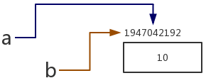
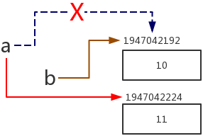
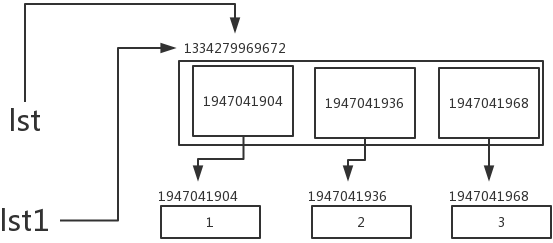
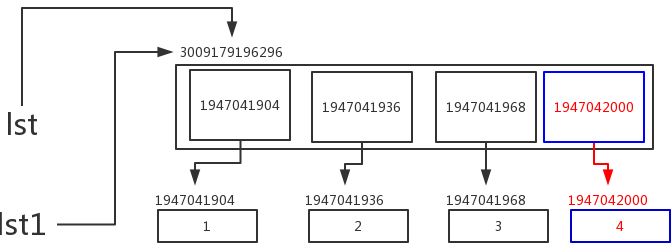
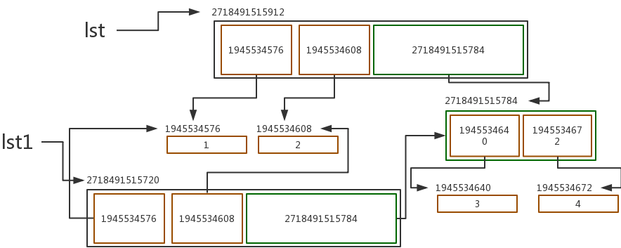
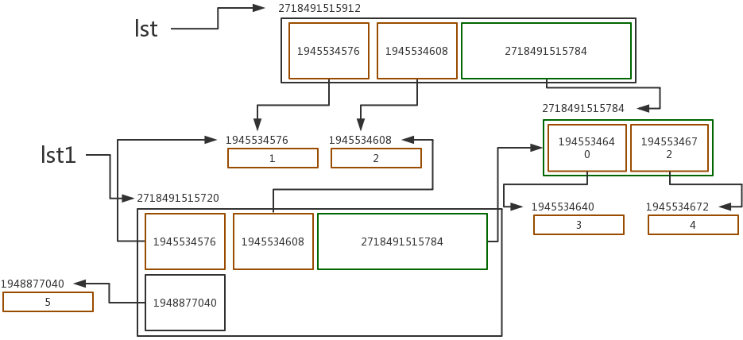
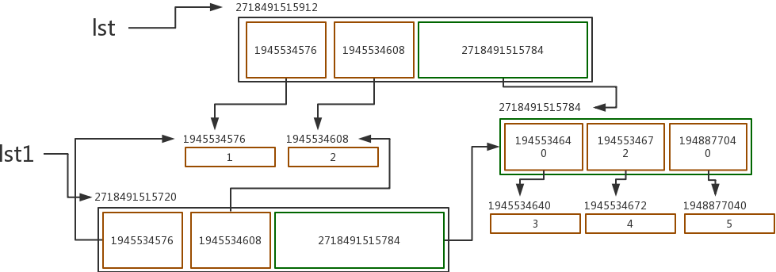
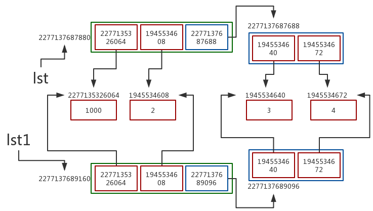

## 深浅拷贝

[TOC]

同驻留机制一样，深浅拷贝在编程中的应用其实也不是很多。但是我们依然需要了解。一方面是为了避免后期开发代码时出现问题却不知道原因，另一方面也是因为面试时几乎都会问到有关深浅拷贝的问题。

深浅拷贝主要分为三个方面：

1. 什么是赋值
2. 什么是浅拷贝
3. 什么是深拷贝

### 赋值

变量间赋值操作就是将多个变量的内存地址指向同一个数据的内存地址。例如，对于下面的代码：

```python
a = 10
b = a
print(id(a), id(b))
```

输出的结果为：

```python
1947042192 1947042192
```

a 和 b 的内存地址相同。这段赋值操作在内存中的程序是：首先，在内存中开辟一块内存空间储存整数 10，它的内存地址为 1947042192；然后，变量名 a 指向这个内存空间的内存地址；最后，变量名 b 同样指向这个内存地址。



对于整型数据这样的不可变数据类型来说，此时，如果重新给 a 进行赋值，比如赋值为 11。将会新开辟一块内存空间来存储整型数据 11，然后 a 将指向 11 的内存地址（比如：1947042224），原来的指向将不再存在。而 b 仍然指向 10 的内存地址 1947042192：



用代码来验证就是：

```python
a = 10
b = a
a = 11
print(id(a), id(b))
```

输出的结果为：

```python
1947042224 1947042192
```

对于可变数据类型的赋值操作则会有些例外。赋值操作的原则都是相同的，新变量名会指向已经存在的数据，而不是新开辟一块内存空间：

```python
lst = [1, 2, 3]
lst1 = lst
print(id(lst), id(lst1))
for i in lst:
    print(id(i))
```

输出的结果为：

```python
1334279969672 1334279969672
1947041904
1947041936
1947041968
```

首先整型数字 1、2 和 3 分别开辟各自的内存空间。需要注意的是，列表中存储的是每个元素的内存地址，而不是元素本身。当整型数据内存空间开辟好了之后，又开辟了一块列表空间，其中存储的数据是三个整型数字的内存地址。然后，变量lst指向列表的内存地址 1334279969672。最后，赋值操作令变量 lst1 也指向该列表的内存地址 1334279969672。



这些操作看起来繁琐许多，但实际上的原理还是赋值操作只是将不同的变量指向同一个数据的内存地址。

但是现在，如果我们对 lst1 进行修改，比如增加一个新的元素 4，会发生什么呢？

```python
lst = [1, 2, 3]
print(id(lst))
lst1 = lst
lst1.append(4)
print(lst, lst1)
print(id(lst), id(lst1))
for i in lst:
    print(id(i))
```

输出的结果为：

```python
3009179196296
[1, 2, 3, 4] [1, 2, 3, 4]
3009179196296 3009179196296
1947041904
1947041936
1947041968
1947042000
```

我们发现发生了一件奇怪的事情：虽然我们只对 lst1 进行了修改，但是 lst 也同样发生了改变。

这是因为列表是可变数据类型，当我们对列表进行操作时，不会改变列表的内存地址[^1]。使用 append 方法会在列表存储的内容中添加一个整型数据 4 的内存空间，但并不会改变变量 lst 和 lst1 指向列表内存的状态。故而，虽然只对 lst1 进行了修改，但是查看 lst 时，变化是相同的。



举一个形象一点的例子就是，列表就好比是一个书包。最开始，这个书包归小明所有。后来，小明跟好朋友小芳共用了这个书包。小芳有一天在书包里装了一本书，虽然小明没有对这个书包做任何的操作，他依然能够看到自己的书包里多出了一本书来。

对于字典等其他可变数据类型，道理都是相同的。对于可变数据类型的嵌套，也是一样：

```python
dic = {'key1': 2, 'key2': [1, 2, 3]}
dic1 = dic
dic1['key2'].append(4)
print(dic, dic1)
```

输出的内容为：

```python
{'key1': 2, 'key2': [1, 2, 3, 4]} {'key1': 2, 'key2': [1, 2, 3, 4]}
```

总结起来就是：赋值就是让多个变量指向同一个内存地址，如果这个内存地址的数据是不可变数据类型，修改时会开辟新的内存空间（字符串，数字，布尔值，元组）；如果时可变的数据类型，会在原地址进行修改（列表，字典）。

### 浅拷贝

与赋值略有差异的是，浅拷贝会将数据的外壳新开辟一块内存空间，在新的内存空间中存储的是最外层元素的内存地址。

列表有一个 `.copy()` 方法，用来进行浅拷贝操作：

```python
lst = [1, 2, [3, 4]]
lst1 = lst.copy()    #拷贝 or 复制
print(lst, lst1)
print(id(lst), id(lst1))
print(id(lst[0]), id(lst1[0]))
print(id(lst[1]), id(lst1[1]))
print(id(lst[2]), id(lst1[2]))
print(id(lst[2][0]), id(lst1[2][0]))
print(id(lst[2][1]), id(lst1[2][1]))
```

输出的结果为：

```python
[1, 2, [3, 4]] [1, 2, [3, 4]]
2718491515720 2718491515912
1945534576 1945534576
1945534608 1945534608
2718491515784 2718491515784
1945534640 1945534640
1945534672 1945534672
```

我们看到，除了最外层的壳子，也就是列表本身被新开辟了一块内存空间之外，无论列表中的元素是否可变，都只是复制了原来列表中元素的内存地址。

最开始，列表 lst 开辟了一块地址为 2718491515720 的内存空间，其中，数字 1 被存储在地址 1945534576，数字 2 被存储在地址 1945534608，列表被存储在地址 2718491515784。列表中的数字 3 被存储在地址 1945534640，列表中的数字4被存储在地址 1945534672。当进行浅拷贝之后，为 lst1 新开辟一块内存地址为 2718491515912 的内存空间，其中存储的元素的内存地址跟 lst 中的元素相同。



此时，如果我们对 lst1 进行增加操作，比如增加一个元素 5：

```python
lst1.append(5)
print(lst, lst1)
```

输出的结果为：

```python
[1, 2, [3, 4]] [1, 2, [3, 4], 5]
```

只有 lst1 中增加了元素，lst 并没有发生变化。这是因为 lst 和 lst1 的内存地址不同，对 lst1 进行操作并不会影响到 lst。



不过如果我们对列表中嵌套的列表进行增加操作，比如：

```python
lst = [1, 2, [3, 4]]
lst1 = lst.copy() 
lst1[-1].append(5)
print(lst, lst1)
```

输出的结果为：

```python
[1, 2, [3, 4, 5]] [1, 2, [3, 4, 5]]
```

不管是 lst 还是 lst1，它们的最后一个元素都是指向的列表 [3, 4] 的内存地址 2718491515784。当对这个列表进行修改时，尽管是使用 lst 进行的操作，lst1 调用列表时，仍然能发现列表的变化。



除了使用 `.copy()` 方法，我们还可以通过切片来实现浅拷贝：

```python
lst = [2, 3, [4, 5], 6]
lst1 = lst
lst2 = lst[:]
lst1[2].append(6)
print(lst, lst1, lst2)
```

输出的结果为：

```python
[2, 3, [4, 5, 6], 6] [2, 3, [4, 5, 6], 6] [2, 3, [4, 5, 6], 6]
```

### 深拷贝

深拷贝之后的数据使用同我们主观认为的基本一致：对一个变量的修改不会影响到另一个变量的值。经过深拷贝后的两个变量虽然值相同，但是不受彼此影响。

当然，这也不意味着深拷贝后的两个变量中的每个元素都是不同的。为了节省内存，经过深拷贝后的不可变元素仍然被两个变量共用。因为对不可变元素的改变一定会造成内存地址的变化，所以不需要单独开辟内存空间。但是对于可变元素，不管嵌套多少层，都会开辟新的内存空间。

调用深拷贝方法需要导入一个 `copy` 模块：

```python
import copy
lst = [1000, 2, [3, 4]]
lst1 = copy.deepcopy(lst)
print(id(lst), id(lst1))
print(id(lst[0]), id(lst1[0]))
print(id(lst[1]), id(lst1[1]))
print(id(lst[2]), id(lst1[2]))
print(id(lst[2][0]), id(lst1[2][0]))
print(id(lst[2][1]), id(lst1[2][1]))
```

返回的结果为：

```python
2277137687880 2277137689160
2277135326064 2277135326064
1945534608 1945534608
2277137687688 2277137689096
1945534640 1945534640
1945534672 1945534672
```

与我们前面谈到的一样，深拷贝后，两个变量会共用不可变数据，而可变数据类型则会开辟新空间。



### 深浅拷贝总结

赋值：多个变量名指向同一个内存地址，也就是将变量和值在内存中形成映射指向关系

浅拷贝：只对最外层的壳子开辟内存空间，拷贝第一层元素的内存地址。（列表中存储的是数据的内存地址，我们能看到数据是因为程序通过内存地址找到值，然后显示了出来）

深拷贝：不可变数据共用，可变数据类型不管嵌套多少层都会开辟新空间


[^1]: 虽然再次运行内存地址较上次发生了变化，但那是因为每次运行都会重新开辟内存空间。上面的代码在赋值前打印了内存地址，与所有赋值操作后比较，仍然相同，可证明列表的内存地址没有改变。