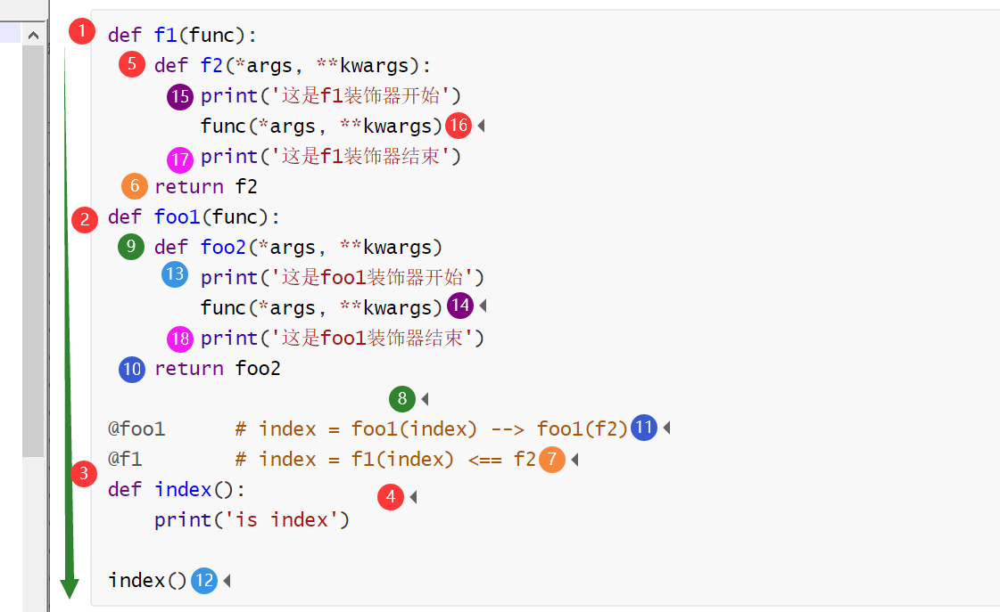
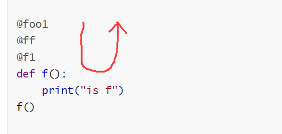

## 装饰器

[TOC]

### 装饰器初识

在编程中，有很多约定俗成的规则。开放封闭原则就是其中很重要的一个。

开放封闭原则体现在两个方面：

1. 对扩展开放，支持增加新功能
2. 对修改源代码封闭，对调用方式的改变封闭

装饰器就是为了体现编程的开放封闭原则而存在的。

装饰器，顾名思义，就是在原有基础上额外添加新功能的工具。

我们有下面一组函数：

```python
import time
def index():
    time.sleep(0.5)    # 休眠0.5秒，阻塞函数
    print('i am in index')
def func():
    time.sleep(0.8)
    print('i am in func')
def foo():
    time.sleep(0.4)
    print('i am in func')
    
index()
func()
foo()
```

现在有这样一个需求：想要知道每一个函数运行的时间。

为了不改变函数的源代码，我们可以尝试着在调用函数前后加入查看时间戳的代码，尝试着计算函数的运行时间：

```python
import time
def index():
    time.sleep(0.5)
    print('i am in index')
def func():
    time.sleep(0.8)
    print('i am in func')
def foo():
    time.sleep(0.4)
    print('i am in func')
    
start_time = time.time
index()
print(time.time - start_time)

start_time = time.time
func()
print(time.time - start_time)

start_time = time.time
foo()
print(time.time - start_time)
```

输出的结果为：

```python
i am in index
0.500666618347168
i am in func
0.800020694732666
i am in func
0.4008512496948242
```

我们好像得到我们想要的结果了。但是不要忘了，我们一开始提到的，我们编程时需要遵循开放封闭原则。我们的确没有改变函数的源代码，但是调用函数时，需要增加代码。我们改变了函数的调用方式。

另一方面，我们在调用函数的过程中，使用了大量的重复代码：`start_time = time.time` 和 `print(time.time - start_time)`。

为了减少重复代码，我们或许可以尝试着使用函数，比如这样：

```python
import time
def index():
    time.sleep(0.5)
    print('i am in index')
def func():
    time.sleep(0.8)
    print('i am in func')
def foo():
    time.sleep(0.4)
    print('i am in func')
def run_time(f):
    start_time = time.time()
    f()
    print(time.time() - start_time)

ff = index
index = run_time
index(ff)

ff = func
func = run_time
func(ff)

ff = foo
foo = run_time
foo(ff)
```

在调用函数时，我之所以把函数写得这么复杂，而不是简单地写成这样：

```python
run_time(index)
run_time(func)
run_time(foo)
```

是为了避免改变函数的调用方式。

可即便绞尽脑汁，函数最终的调用方式还是发生了变化——原本函数的调用是不需要参数的，增加功能后需要增加参数 `ff`。

不过我们已经离正确的解决办法非常近了，只差一步，就可以解决我们的困难。

这就需要结合我们刚刚学到的内容：[闭包](closure.md)。

如果我们把功能函数整合为闭包，就可以满足编程的开放封闭原则，并且不会增加太多的重复代码：

```python
import time
def index():
    time.sleep(0.5)
    print('i am in index')
def func():
    time.sleep(0.8)
    print('i am in func')
def foo():
    time.sleep(0.4)
    print('i am in func')
def run_time(f):
    def inner():
        start_time = time.time()
        f()
        print(time.time() - start_time)
    return inner
index = run_time(index)
index()
func = run_time(func)
func()
foo = run_time(foo)
foo()
```

上面的这种给函数增加功能的方法就构成了 Python 中的装饰器。

因为装饰器在 Python 编程中十分好用，Python 还专门为类似 `index = run_time(index)` 的赋值运算设定了一个语法糖：

```python
import time
def run_time(f):
    def inner():
        start_time = time.time()
        f()
        print(time.time() - start_time)
    return inner

@run_time    # 等价于 index = run_time(index)
def index():
    time.sleep(0.5)
    print('i am in index')

index()
```

语法糖必须要放在被装饰函数的正上方。虽然有些空行，Python 解释器也能识别，但是阅读起来会很别扭：

```python
@run_time


def index():
    time.sleep(0.5)
    print('i am in index')
```

### 标准装饰器

如果原函数中有参数，我们可以在装饰器的内部函数中设置加入参数：

```python
def plugin(f):
    def inner(user, pwd, hero):
        print('外挂开启')
        f(user, pwd, hero)
        print('外挂结束')
    return inner
@plugin
def gamming(user, pwd, hero):
    print('打开游戏')
    print(f'用户名：{user}，密码：{pwd}')
    print(f'选择英雄：{hero}')
    print('游戏中')
    print('游戏结束')
gamming('meet', '1234', '草丛伦')
```

输出的结果为：

```python
外挂开启
打开游戏
用户名：meet，密码：1234
选择英雄：草丛伦
游戏中
游戏结束
外挂结束
```

其实，在装饰器中，我们可以使用 `*args` 接收全部位置参数，使用 `**kwargs` 接收全部关键字参数。在调用函数时，只需要把 `args` 和 `**kwargs` 重新打散即可：

```python
def plugin(f):
    def inner(*args, **kwargs):
        print('外挂开启')
        f(*args, **kwargs)
        print('外挂结束')
    return inner
@plugin
def gamming(user, pwd, hero):
    print('打开游戏')
    print(f'用户名：{user}，密码：{pwd}')
    print(f'选择英雄：{hero}')
    print('游戏中')
    print('游戏结束')
gamming('meet', '1234', '草丛伦')
```

修饰过的 `gamming` 函数，不论是调用方法，还是参数使用，就是传参数后报错的内容都是跟修饰前的 `gamming` 一致。这就完美地符合了编程的开放封闭原则。

除了使用参数，函数的另外一个特点是可以有返回值。如果被修饰的参数也有返回值，我们只需在装饰器的内层函数中加入返回值即可：

```python
def plugin(f):
    def inner(*args, **kwargs):
        print('外挂开启')
        a = f(*args, **kwargs)
        print('外挂结束')
        return a
    return inner
@plugin
def gamming(user, pwd, hero):
    print('打开游戏')
    print(f'用户名：{user}，密码：{pwd}')
    print(f'选择英雄：{hero}')
    print('游戏中')
    print('游戏结束')
    return '我卢**没有开挂！'
print(gamming('meet', '1234', '草丛伦'))
```

输出的结果为：

```python
外挂开启
打开游戏
用户名：meet，密码：1234
选择英雄：草丛伦
游戏中
游戏结束
外挂结束
我卢**没有开挂！
```

至此，我们已经把装饰器的内容都讨论过了。其实，装饰器本身并不复杂，我们可以使用一个很规整简洁的代码写出一个装饰器：

```python
def wrapper(func):
    def inner(*args, **kwargs):
        """执行被装饰函数前，进行的操作"""
        ret = func(*args, **kwargs)
        """执行被修饰函数后，进行的操作"""
        return ret
    return inner
@wrapper
def foo():
    print('in foo')
foo()
```

这就是 `标准版的装饰器`。

其实，对于没有参数的函数，可以只写一层函数实现装饰器的功能：

```python
def foo(func):
    print('新加了一个功能')
    return func
@func
def index():
    print(2)
index()
```

输出的结果为：

```python
新加了一个功能
2
```

虽然也能实现新功能，但是不建议这样写，因为不是很规范。而且下面继续调用 index，并不会有新功能加入：

```python
def foo(func):
    print('新加了一个功能')
    return func
@func    # index = func(index) --> index = index
def index():
    print(2)
index()
index()
```

输出的结果为：

```python
新加了一个功能
2
2
```

函数调用两次，但是新加功能仅执行了一次。这是因为在执行语法糖时，新的 `index` 最终的结果还是原来的 `index` 函数，而不是像标准装饰器中的 [闭包](closure.md)。

### 有参装饰器

装饰器也是函数，就可以接受参数。如果有一天，我们想要给装饰器传递参数该怎么办呢？

或许我们可以在装饰器的外层再套一层函数 用来传参，就像这样：

```python
def decor(arg):
    def wrapper(func):
        def inner(*args, **kwargs):
            if arg:
                print('开始装饰')
            ret = func(*args, **kwargs)
            if arg:
                print('装饰结束')
            return ret
        return inner
    return wrapper

def index():
    print('is index')
```

如果还想以往那样直接在 `index` 函数的上面加语法糖 `@decor`，一来没有达到传入参数的目的，二来也会因为参数传入混乱而报错。

不过我们可以从昨天不用语法糖的方法配置装饰器的操作中获得启发，或许可以通过在下面加入这样几行代码来构建一个可以传入参数的装饰器：

```python
wrapper = decor(True)
index = wrapper(index)
index()
```

输出的结果为：

```python
开始装饰
is index
装饰结束
```

其实我们已经成功构成了一个可以传入参数的装饰器。

现在，我们需要的，是把语法糖运用起来，让代码更加简明直观。

我们知道，语法糖 `@wrapper` 相当于 `index = wrapper(index)` 这条语句。而此时 `wrapper` 等同于 `decor(True)`。没错，对于带参数的装饰器而言，我们可以这样写语法糖：

```python
def decor(arg):
    def wrapper(func):
        def inner(*args, **kwargs):
            if arg:
                print('开始装饰')
            ret = func(*args, **kwargs)
            if arg:
                print('装饰结束')
            return ret
        return inner
    return wrapper

@decor(True)
def index():
    print('is index')
    
index()
```

这个装饰器中参数的作用是，当传入的值为 `True`，装饰器会被执行；当值为 `False`，装饰器不会被执行。

我们还可以通过使用带参数的装饰器，实现使用一个装饰器针对不同函数做出不同响应的效果。

例如，让用户选择要登陆的软件，然后针对不同软件使用各自的账号密码：

```python
msg = """
1. 微信
2. 抖音
3. 邮箱
请选择您要登陆软件的编号："""
choose = input(msg)
def auth(arg):
    def wrapper(func):
        def inner(*args, **kwargs):
            user = input('用户名：')
            pwd = input('密码：')
            if arg == '1':
                if user == 'alex' and pwd == 'alex1234':
                    func(*args, **kwargs)
                else:
                    print('账号或密码错误！')
            elif arg == '2':
                if user == 'wusir' and pwd == '1234':
                    func(*args, **kwargs)
                else:
                    print('账号或密码错误！')
            elif arg == '3':
                if user == 'meet' and pwd == '1234':
                    func(*args, **kwargs)
                else:
                    print('账号或密码错误！')
        return inner
    return wrapper

@auth(choose)
def dy():
    print('抖音')

@auth(choose)
def email():
    print('邮箱')
    
@auth(choose)
def wechat():
    print('微信')
    
func_dic = {
    '1': wechat,
    '2': dy,
    '3': email,
}
if choose in func_dic:
    func_dic[choose]()
```

事实上，我们上面的代码在装饰器中有很多重复代码，可以将它们封装到一个函数中。

在函数调用时，如果我们日后学到 `反射`，会简洁很多。

带参数的装饰器的应用场景为：flask 框架的路由就是有参装饰器。

### 多个装饰器装饰一个函数

一个装饰器可以装饰多个函数，同样地，多个装饰器也可以装饰同一个函数。当多个装饰器装饰同一个函数时，先执行离被装饰函数最近的装饰器：

```python
def f1(func):
    def f2(*args, **kwargs):
        print('这是f1装饰器开始')
        func(*args, **kwargs)
        print('这是f1装饰器结束')
    return f2
def foo1(func):
    def foo2(*args, **kwargs):
        print('这是foo1装饰器开始')
        func(*args, **kwargs)
        print('这是foo1装饰器结束')
    return foo2

@foo1      # index = foo1(index) --> foo1(f2)
@f1        # index = f1(index) <== f2
def index():
    print('is index')

index()
```

返回的结果为：

```python
这是foo1装饰器开始
这是f1装饰器开始
is index
这是f1装饰器结束
这是foo1装饰器结束
```

程序的执行还是从上到下，只要按照流程一步一步走，还是能理清思路的。



对于套更多层的装饰器，规则也是相同的：

```python
def f1(func): # func == index
    def f2(*args,**kwargs):
        print("sss")
        func(*args,**kwargs)
        print("stop")
    return f2

def foo1(func): # func == f2
    def foo2(*args,**kwargs):
        print("good")
        func(*args,**kwargs)
        print("bbb")
    return foo2

def ff(func):
    def ff2():
        print("is ff")
        func()
        print("ff is")
    return ff2

@foo1
@ff
@f1
def f():
    print("is f")
f()
```

返回的结果为：

```python
good
is ff
sss
is f
stop
ff is
bbb
```

我们其实可以发现这样一个规律：装饰器的执行是被装饰代码在最中间，外层装饰器的运行结果包裹着内层装饰器的运行结果。大体上呈现一个 `U` 字形：



对于多个装饰器装饰一个函数的情况，只需要记住一个原则：先执行离被装饰函数最近的装饰器。

### 常用装饰器

#### 异常捕获装饰器

```python
import traceback

def func_try_deco(func):
    """
    用于捕获异常的装饰器，装饰过的函数若发生异常会打印异常，但不会终止进程
    """
    def inner(*args, **kwargs):
        try:
            ret = func(*args, **kwargs)
        except Exception:
            print(traceback.format_exc(), flush=True)
            ret = None
        return ret
    return inner
```

