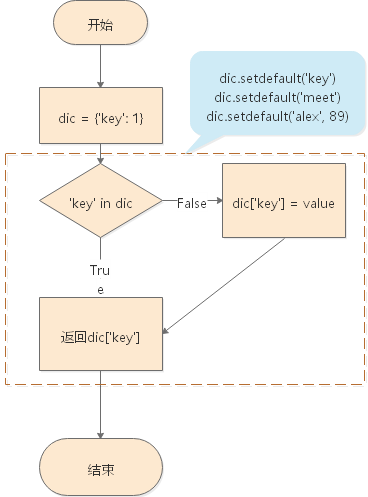

## 字典

[TOC]

### 字典初识

我们来看下面的一个例子：

```python
name_lst = ["新力", "一帆", "海绵", "秀"]
id_lst = [18, 9, 25, 50]
```

其中，列表 `name_lst` 中存储的是同学的名字，`id_lst` 中存储的是对应同学的学号。例如，`新力` 的学号是 `18`。

如果我们要查找新力的学号，就要去另一个列表中找到其索引对应的学号值，例如：

```python
name_lst[0]
id_lst[0]
```

这样的操作虽然也能满足我们的需求，但是显然有些繁琐。而且一旦任何一个列表中的索引发生了变化（比如进行了插入或者删除数据的操作），就要对另一个列表进行同样的改动，否则会造成混乱。

如果我们使用字典来进行这一类操作，就可以避免这样的麻烦。

字典也是 Python 中的基本数据类型之一。字典是 Python 中唯一一种包含键值对的数据类型。字典是一种键值对数据。

字典在 Python 中的关键字是 `dict`。

字典用来存储大量数据，数据量比列表存储的还要大。

字典能够将数据和数据之间进行关联。

字典的定义方法是这个样子的：`dic = {'键': '值'}`，具体的例子就是：

```python
dic = {"新力": ["开车", "唱", "跳"], "一帆": 9, 25: "海绵", True: "秀", (1, 2, 3): "大圣"}
```

通过键可以准确地找到其对应的值：

```python
print(dic["新力"])
```

在这里补充一个概念，`哈希`：

- 可变数据类型不可哈希
- 不可变数据类型可哈希

目前我们学到的可变数据类型有：列表和字典；不可变数据类型有：整型、字符串、布尔值和元组。

字典的键必须是不可变数据类型（也就是可哈希）且唯一（字典中的键只能存在一个）。如果字典中的键出现了重复，后面的键值对会覆盖前面的键值对。

字典的值可以是任意的数据类型。

字典本身也是一个可变数据类型：

```python
dic = {{'a': 1}: 'alex'}
print(dic)
```

运行上面的代码会报错，错误原因是字典是不可哈希的数据类型。也就是说，字典是可变的。

```python
Traceback (most recent call last):
  File "C:/Users/Sure/PyProject/day05/01 exercise.py", line 54, in <module>
    dic = {{'a': 1}: 'alex'}
TypeError: unhashable type: 'dict'
```

### 字典元素的增加

字典的增加操作可以通过 `dic["键"] = "值"` 的方式实现：

```python
dic = {"key": 1}
dic["alex"] = 89
print(dic)
```

输出的内容为：

```python
{'key': 1, 'alex': 89}
```

这种通过赋值的方法增加变量的方法有些”暴力“，因为如果字典中原本存在相同的键，赋值操作将把原来的键对应的值替换为新值：

```python
dic = {'key': 1, 'alex': 18}
dic["alex"] = 89
print(dic)
```

输出的内容为：

```python
{'key': 1, 'alex': 89}
```

还有一种相对”温柔“的增加字典元素的方法，`.setdefault()`。通过这种方法，如果原字典中已经有了同样的键，返回值为改键对应的值，不会进行修改操作。如果原字典中不存在这样的值，将会增加新的键值对。值默认为 `None`，也可以自定义要添加的值。范围值为增加之后的键对应的新值。例如：

```python
dic = {'key': 1}
print(dic.setdefault('key'))
print(dic.setdefault('meet'))
print(dic.setdefault('alex', 89))
print(dic)
```

输出的结果为：

```python
1
None
89
{'key': 1, 'meet': None, 'alex': 89}
```

对于 `.setdefault()` 的返回值，可以这样记忆：最终字典的键对应的值是什么，就返回什么。



`.setdefault()` 方法是通过两个步骤进行的：

1. 先通过减去字典中查找，如果键存在，返回对应的值，不会继续执行第二步；如果键不存在，返回将要赋给该键的值，默认为 `None`，去执行第二步。
2. 将键和值添加到字典中

### 字典的删除

字典的删除主要有 `.clear()`、`.pop()`、`.popitem()` 和 `del` 四种方法。

需要注意的是，字典没有 `.remove()` 方法。

`.clear()` 方法用来清空字典，使用该方法后，会得到一个空字典：

```python
dic = {'key': 1, 'dsb': 'alex'}
dic.clear()    # 字典是可变数据类型，可以直接用方法来修改，不必重新赋值
print(dic)

输出的结果为：{}
```

`.pop()` 方法需要输入想要删除的键作为参数，返回的是被删除的键对应的值：

```python
dic = {'key': 1, 'dsb': 'alex'}
print(dic.pop('key'))
```

`.popitem()` 是随机删除。但是在 Python 3 和最新版本的 Python 2.7 中，默认删除字典的最后一组键值对，返回值为删除掉的键值对元组（注意，是元组，而不是像 `.pop()` 一样放回的是值）：

```python
dic = {'key': 1, 'dsb': 'alex'}
print(dic.popitem())
```

输出的结果为：

```python
('dsb', 'alex')
```

与列表不同的是，字典中没有 `remove` 方法。

字典中 `del` 方法的用法和列表十分相似，如果不指定要删除的键，将会删除整个字典：

```python
dic = {'key': 1, 'dsb': 'alex'}
del dic
print(dic)
```

代码运行后报错，因为dic已经被完全删除了。

```python
Traceback (most recent call last):
  File "C:/Users/Sure/PyProject/day05/01 exercise.py", line 80, in <module>
    print(dic)
NameError: name 'dic' is not defined
```

我们也可以通过指定键的方法，删除特定的键值对：

```python
dic = {'key': 1, 'dsb': 'alex'}
del dic['dsb']
print(dic)
```

输出的结果是：

```python
{'key': 1}
```

### 字典的修改

字典的修改有两种形式，第一种是用暴力增加的方法 `dic['键'] = '值'` 对已经存在的键进行修改；第二种是通过 `.update()` 方法来合并两个字典。

使用 `dic['键'] = '值'` 进行修改，当字典中存在指定的键时，该键对应的值将会被替换为新的值：

```python
dic = {"key":1,"dsb":"alex"}
dic["dsb"] = "Alex"  # 修改
dic["ss"] = "Alex"   # 增加
print(dic)
```

输出的结果为：

```python
{'key': 1, 'dsb': 'Alex', 'ss': 'Alex'}
```

`.update()` 方法可以将两个字典合并。`update` 中输入的字典的级别要高于前面的字典。也就是说，如果新输入的键已经在就字典中存在，该键对应的新值将对替换旧值：

```python
dic = {'key': 1, 'dsb':'alex'}
dic.update({'key': 2, 'meet': 23})
print(dic)
```

输出的结果为：

```python
{'key': 2, 'dsb': 'alex', 'meet': 23}
```

### 字典的查找

字典可以直接通过键来查找值，不过这种查找方式相对“暴力”：当键存在时，返回对应的值；当键不存在时，程序会报错：

```python
dic = {'key': 1, 'dsb': 'alex'}
print(dic['dsb'])	# 返回'dsb'
print(dic['alex'])	# 程序报错
```

因为这种直接查找的方法当键不存在时会报错，有时我们需要使用 `.get()` 方法：当键存在时，返回键对应的值；当键不存在时，返回 None：

```python
dic = {'key': 1, 'dsb': 'alex'}
print(dic['dsb'])	# 返回'dsb'
print(dic['alex'])	# 返回None
```

我们甚至可以改变键不存在时的返回值：

```python
print(dic.get("alex", "没有找到啊"))
```

我们也可以通过 `.keys()`、`.values()` 和 `.items()` 方法获取字典全部的键、值和键值对。这三个方法的返回值都是一种 `高仿列表`，可以迭代但不支持索引。我们可以通过list函数将返回的高仿列表转化为普通列表：

```python
dic = {'key': 1, 'dsb': 'alex'}
print(dic.keys())
print(dic.values())
print(dic.items())
for i in dic.keys():
    print(i)
print(list(dic.values()))
```

也可以使用 for 循环迭代字典，将会遍历字典的键：

```python
dic = {'key': 1, 'dsb': 'alex'}
for i in dic:
    print(i)
```

### 字典的嵌套

有下面这样一个字典：

```python
house = {
    101: {1: {"皮裤男": {"某女": ["小钢炮"], "国际章": ["熊大", "熊二"]},
            2: {"林俊杰": ["磨牙"]}}},
    102: {1: {"皮裤女": {"林宥嘉": ["说谎", "你是我的眼"]}},
         2: {"王菲": ["天后", "传奇", "红豆", "笑忘书"]}},
    103: {1: {"韦小宝": {"阿珂": "刺客", "建宁": "公主", "双儿": "丫鬟", "教主老婆": "龙儿"}},
         2: {"张无忌": {"灭绝师太": "倚天剑", "金毛狮王": "屠龙刀", "张三丰": "太极拳"}}},
    104: {1: {"西游记": {"大圣": "金箍撸撸棒", "唐僧": "叨逼叨", "八戒": "高老庄主任"}}},
    105: {1: {"水浒传": {"武松": "打老虎", "鲁智笙": "拔树", "林冲": "教头", "宋江": "老大"}},
         2: {"官场": {"高俅": "足球"}}},
    106: {1: {"老男孩": {"alex": "dsb", "wusir": "污", "宝元": "大卡车", "江毅": "兽"}}},
}
```

要想找到里面的 `"倚天剑"` 的 `剑` 字和 `"熊大"` 的 `熊` 字，我们可以这样找到：

```python
print(house[103][2]['张无忌']['灭绝师太'][2])
print(house[101][1]['皮裤男']['国际章'][0][0])
```

从上面的例子中，我们就可以发现，字典相较于列表是很有优势的：

1. 字典查找内容更方便
2. 字典查找速度更快

字典还可以简化流程控制的过程。

举个例子，如果我们需要设计这样一个程序，用户输入编号，程序自动返回该编号对应的菜品。如果我们用 if 条件句来实现，将会非常繁琐：

```python
while True:
    choose = int(input("请输入数字（1-12）："))
    if choose == 1:
        print('饺子')
    elif choose == 2:
        print('粥')
    elif choose == 3:
        print('面条')
    elif choose == 4:
        print('肉')
    elif choose == 5:
        print('土')
    elif choose == 6:
        print('东南风')
    elif choose == 7:
        print('切糕')
    elif choose == 8:
        print('烤全羊')
    elif choose == 9:
        print('烤骆驼')
    elif choose == 10:
        print('锅包肉')
    elif choose == 11:
        print('杀猪菜')
    elif choose == 12:
        print('乱炖')
    else:
        print('输入错误，请重新输入！')
```

如果我们使用字典的方法，只需要这样即可：

```python
dic = {"1": "饺子",
       "2": "粥",
       "3": "面条",
       "4": "肉",
       "5": "土",
       "6": "东南风",
       "7": "切糕",
       "8": "烤全羊",
       "9": "烤骆驼",
       "10": "锅包肉",
       "11": "杀猪菜",
       "12": "乱炖"
       }
while True:
    choose = input("请输入数字（1-12）：")
    if choose in dic:
        print(dic[choose])
    else:
        print('输入错误，请重新输入！')
```

我们看到，使用字典之后，代码节省了不少，而且少了很多重复代码。以后如果需要增加或者删改列表，只需要在字典中进行操作即可，不需要对程序进行改动，后期维护也更为便利。