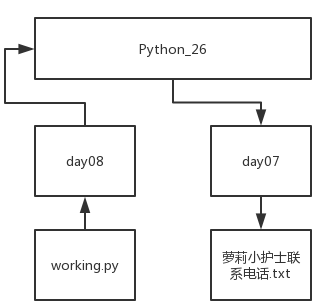

## 文件操作

[TOC]

### 文件操作初识

我们写的程序代码运行过程中的中间数据和最后的结果，都是存储在内存中。当我们终止程序之后，这些数据也都随之消失。

但是很多时候，我们需要将获得的数据存储起来，供以后使用。如果能把内存中的中间数据转移到硬盘中存储，当程序再次运行时就可以调用上次运行的结果。这就涉及到了 Python 中的文件操作。

### 文件操作模式

我们常用的文件操作模式总共有九种：

- r 只读文本
- w 清空写文本
- a 追加写文本    非常重要
- rb 只读字节    主要应用在爬虫中
- wb 清空写字节
- ab 追加写字节   非常重要
- r+ 读写    重要
- w+ 清空写读
- a+ 追加写读

### 文件操作步骤

文件操作一般都要先进行四步的准备工作：

1. 找到文件的路径
2. 确定操作文件的模式
3. 文件的编码方式
4. 建立文件句柄

#### 文件路径

文件路径有两种表示方法：绝对路径和相对路径。

绝对路径是相对于当前运行文件所在的目录，目标文件所在的位置。在相对目录中，使用 `.` 表示当前路径；使用 `..` 表示上一级路径。

例如：在 `Python_26` 文件夹中，有 `day07` 和 `day08` 两个文件夹。运行的 `py` 文件 `day08.py` 在 `day08` 中，而想要调用的文件 `萝莉小护士联系电话.txt` 在 `day07` 中，就需要这样表示目标文件的相对路径：

```python
'..\day07\萝莉小护士联系电话.txt'
```

因为当前的工作目录是 `Python_26\day08`，而目标文件在 `Python_26\day07` 中，我们就需要使用 `..` 返回到 `day08` 的父目录 `Python_26` 中，然后进入 `day07` 中找到目标文件。



除了相对路径之外，我们还可以通过绝对路径找到文件。绝对路径是从磁盘根目录开始查找文件，例如： `C:\Python_26\day07\萝莉小护士的联系方式.txt`。

如果涉及程序的协同操作，最好使用相对路径。这样当我们把文件转移到别的电脑上时，就不会担心路径会发生变化的问题。

我们可以使用 os 模块找到当前的工作路径：

```python
import os
print(os.getcwd())
```

在路径中会使用 `\` 来分隔两层目录。但是 `\` 直接连接某些字母可能会有特殊含义，比如 `\n` 表示换行，`\t` 表示制表符等。

为了避免歧义，我们就需要通过转义来消除这些特殊含义。有两种方法可以进行转义。第一种是使用 `\\` 来指代一个可以显示的 `\`，例如：`'C:\\Python_26\\day07\\萝莉小护士的联系方式.txt'`。

但是如果路径比较深的话，就需要替换很多的 `\`，费时费力。这时，我们可以通过在字符串前加一个 `r` 来转义，例如：`r'C:\Python_26\day07\萝莉小护士的联系方式.txt'`。

### 编码方式

文件的存储格式一般都是 utf-8。

Windows 操作系统使用的是 gbk 编码；Linux 和 macOS 使用的是 utf-8 编码。

### 创建文件句柄

当我们确定好了文件的路径、操作模式和编码方式之后，就可以建立一个文件句柄了：

```python
f = open('萝莉小护士的联系方式.txt', mode='r', encoding='utf-8')
```

上面这行代码的意思是：创建一个文件句柄 `f`，文件的位置与工作路径相同，文件名为 `萝莉小护士的联系方式.txt`，以 `只读` 方式打开，文件的编码模式为 `utf-8`。

文件的打开操作是通过 Python 向操作系统发送指令。

### 文件的读取

有了文件句柄，我们就可以对文件进行操作。直接打印文件句柄并不能显示出文件的内容：

```python
print(f)

输出的结果为：<_io.TextIOWrapper name='萝莉小护士的联系方式.txt' mode='r' encoding='utf-8'>
```

我们需要一个 `.read()` 方法来讲文件读取出来：

```python
print(f.read())
```

`.read()` 方法会将文件中光标所在的位置开始到文件末尾的内容全部读取出来，读取完毕后，光标会位于最后的位置。如果此时不进行任何其他转移光标的操作，再次调用 `.read()` 方法将不能获得任何内容。

`.read()` 方法中可以输入参数来控制需要获取到的字符数目：

```python
print(f.read(3))
```

需要注意的是，每一行文字末尾的换行符 `\n` 也会被算作是一个字符。

`.read()` 方法会一次性读取文件中所有内容。除此之外，我们也可以使用 `.readline()` 方法，一次只读取一行内容，这个方法也是从光标位置开始读取文件内容：

```python
print(f.readline())
```

`.readlines()` 方法可以将文件中的每一行都读取出来，以字符串的形式存储到要给列表当中：

```python
print(f.readlines())
```

此外，文件句柄本身也是一个可迭代对象，每次迭代返回的内容为文件中每一行的内容：

```python
for line in f:
    print(line)
```

### 文件的写入

文件的写入只有一个方法 `.write()`，写入的内容只能为字符串。文件的写入需要文件以可写入的方式（w 和 a）打开：

```python
f = open("test","w",encoding="utf-8")
f.write("\n今天")
f.write("\n明天")
f.write("\n后天")
```

### 光标操作

光标用来标识文件操作的起始位置。一般来说，光标起始位置为文件的头部，当进行读写操作时，光标位置会随之转移。如果我们接下来还有读写操作，将会从上次结束的位置开始进行。

如果我们想要将光标移动到一个新的位置，就需要使用到 `.seek()` 方法：

```python
f.seek(0, 0)    # 将光标移动到文件头部
f.seek(0, 1)    # 将光标移动到当前位置
f.seek(0, 2)    # 将光标移动到文件末尾
```

除了上述三种比较极端的移动方法，我们还可以自定义光标移动到的位置：

```python
f.seek(3)
```

需要注意的是，这里的 3 指的是从开头数的第 3 个字节，而不是第 3 个字符。既然是字节，就需要考虑编码的问题。例如，gbk 编码的中文字符要移动 2 个字节，而 utf-8 编码的中文字符要移动 3 个字节。

通过使用 `.tell()` 方法，可以查看光标位置。返回的值是从文件头开始到当前位置的字节数目：

```python
f.tell()
```

### 文件的保存和关闭

Windows 系统中，文件会自动保存。但是对于 Linux 系统，只有当内存中的内容达到阈值时，才会进行保存。为了保证我们的文件安全，就需要及时对文件进行存储。

`.flush()` 方法也叫刷新。每使用一次刷新方法，就会将改变的数据存储到硬盘中。在每一次比较关键的文件读取操作前后，都可以使用 `.flush()` 操作确保数据安全：

```python
f.flush()
```

在文件的最后，一般都要使用 `.close()` 方法把文件关闭，将数据存储到硬盘中，并释放内存空间：

```python
f.close()
```

### `with` 方法创建文件句柄

使用赋值方式创建文件句柄，在文件操作结束后，需要使用 `.close()` 方法来关闭文件。这就平白增添了一个步骤。

如果使用 with 方法，则不需要关闭文件，with 子句结束后，文件会自动关闭：

```python
with open('test', 'w', encoding='utf-8') as f:
    f.write('123')
```

with 方法还有一个好处是，可以同时创建多个文件句柄：

```python
f = open("test1","a",encoding="gbk")
f.write("嘿嘿")
f.close()
with open("test1","r",encoding="gbk") as f,\
        open("test","r",encoding="utf-8")as f1:
    print(f.read())
    print(f1.read())
```

### 文件操作模式细节

r 是只读模式，用来读取文件内容，不会对原文件进行任何修改。

rb 模式用来只读字节文件，在爬虫中会有应用。

w模式是清空写，当文件存在时会清空文件，文件不存在时创建文件：

1. 打开文件时自动清空文件内容
2. 写入内容，可以多次写入，每次写入都是在末尾追加
3. 只有打开文件时会清空文件内容
4. 通过移动光标，可以修改写入位置，如果该位置有内容，会造成覆盖

wb 模式是清空写字节，也是在爬虫中有所应用。

a 模式是追加写，当文件存在时会清空文件，文件不存在时创建文件。不管光标在哪里，都只会在最后追加内容：

```python
f = open("test","a",encoding="utf-8")
f.write("啦啦啦")
```

r+ 是读写模式，可读可写，原文件不会被清空，但是光标的初始位置会在文件的头部，如果不移动光标的话，新加入的内容会覆盖掉原来的文件内容：

```python
f = open("test","r+",encoding="utf-8")
a = f.read()
print(a)
f.write("这是读写")
```

w+ 是清空写读模式，打开文件时还是会将文件清空。后续的操作不会重新清空文件：

```python
f = open("test","w+",encoding="utf-8")
f.write("哈哈哈")
f.seek(0,0)   # 移动光标   移动到文件的头部
print(f.read())
```

这里有个细节，因为写入完成后，光标的位置在文件的最后，需要将光标移动到文件头，再使用 `.read()` 方法才能读取到写入的文件内容。

a+ 是追加写读模式，所有内容无论光标在哪里，都只会添加到文件的末尾：

```python
f = open("test","a+",encoding="utf-8")
f.write("嘿嘿")
f.seek(0,0)   # 移动光标   移动到文件的头部
print(f.read())
```

最常使用的文件操作模式有：r、w、a、a+（没文件时）和 r+（覆盖一些内容）。