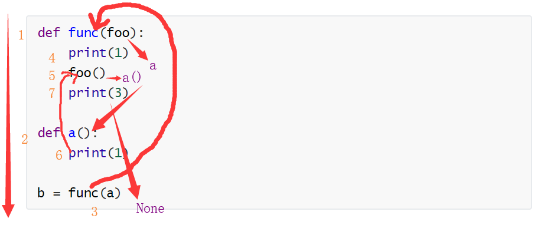
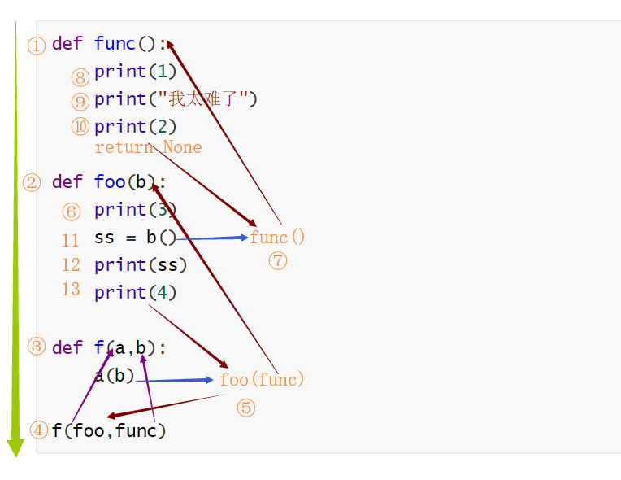
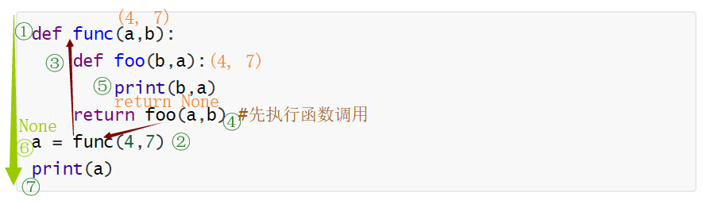
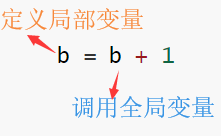

## 函数嵌套

[TOC]

### 函数嵌套概述

函数的嵌套有两种方式：

1. 交叉嵌套
2. 回环嵌套

#### 交叉嵌套

交叉嵌套的方式是在本函数中调用同一级或上一级函数的嵌套方法：

```python
def func(foo):
    print(1)
    foo()
    print(3)
    
def a():
    print(1)

b = func(a)
print(b)
```

输出的结果为：

```python
1
1
3
None
```

首先，程序会将 Python 文件中顶格的代码运行。函数 `func` 和 `a` 都是先开辟内存空间存储起来，但不会被执行。当程序走到赋值操作时，会先执行等号右边的代码。函数 `func` 被调用，函数 `a` 作为参数被传到 `func` 中。`func` 函数被执行，顺序也是从上往下，先是把 `1` 打印出来，然后调用参数 `foo`。需要注意的是，`foo` 是形参，实参是 `a`。调用 `foo` 在此时的意思是调用函数 `a`。函数 `a` 被调用，又打印出一个 `1` 来。函数 `a` 运行完毕，返回至函数 `func`，继续执行下面的代码，打印出 `3` 来。最后，函数默认返回 `None`，赋值给 `b`。程序运行结束。



再看下面的代码：

```python
def func():
    print(1)
    print("我太难了")
    print(2)

def foo(b):
    print(3)
    ss = b()
    print(ss)
    print(4)

def f(a,b):
    a(b)

f(foo,func)
```

输出的结果为：

```python
3
1
我太难了
2
None
4
```

跟上面一样，先将函数全都加载到新开辟的内存空间中，但不执行。到最后 f 函数被调用，`foo` 和 `func` 两个函数作为参数被传到函数 `f` 中。在函数 `f` 中，`foo` 函数被调用，参数为 `func` 函数。进入到 `foo` 函数，先打印 `3`。到赋值语句，先执行等号右边的代码，函数 `func` 被调用。在函数 `func` 中，打印三个内容 `1`、`我太难了` 和 `2`。函数默认返回值为 `None`，被赋值给 `ss`。打印 `ss` 就是打印 `None`。最后打印 `4`，然后返回到函数 `f`，再返回到全局空间。执行结束。



#### 回环函数

回环函数就是在函数中调用下级函数的嵌套方法：

```python
def func(a,b):
    def foo(b,a):
        print(b,a)
    return foo(a,b) #先执行函数调用
a = func(4,7)
print(a)
```

输出的结果为：

```python
4 7
None
```

函数依然先存储在新开辟的空间中不会被调用。运行到赋值语句时，还是先执行等号右边的代码，将两个数字传到函数 `func`中。在函数内部，依然是先开辟空间把函数 `foo` 放进去。运行到 `return` 不会马上终止函数，而是先运行 `return` 后面的代码。`foo` 函数被调用，传进去的值是 `4` 和 `7`，然后打印出来。需要注意的是，函数 `foo` 的形参与函数 `func` 的形参是相同的，不要给搞混了。日常写代码时不建议这样使用。打印出 `4` 和 `7` 之后，运行到函数最后一行，函数默认返回 `None`。然后再赋值给 `a`，打印出来。



### `global` 和 `nonlocal`

#### `global` 方法

我们来看下面这段代码：

```python
b = 100
def func():
    b = b + 1
    return b
print(func())
```

这段代码看上去中规中矩，似乎没有什么问题，但是程序运行后确报错。

这是因为在 Python 中，不允许直接在局部空间修改全局变量。`b = b + 1` 是一个冲突的语句：等式右边的 `b` 是要调用一个全局变量，而等号右边却是要定义一个局部变量。



如果将 `b` 视作一个全局变量依然不合适。在函数中修改全局变量会对其他调用相同变量的函数造成影响，除非万不得已或者十分确定的情况下，不建议在函数中修改全局变量。

当我们确定需要在函数中修改全局变量时，可以通过 `global` 方法来实现：

```python
b = 100
def func():
    global b
    b = b + 1
    return b
print(func())

输出的结果为： 101
```

如果 `global` 声明的变量在全局空间中不存在，将会在全局空间中新建一个变量：

```python
def func():
    global a
    a = 10
    a = a + 12
    print(a)
func()
print(a)
```

输出的结果为：

```python
22
22
```

#### `nonlocal` 方法

对于回环嵌套的函数来说，也会有类似的问题。当尝试使用内层函数修改外层函数的变量时会报错：

```python
a = 15
def func():
    a = 10
    def foo():
        a = a + 1
    foo()
    print(a)
func()
print(a)
```

类似地，也不建议在内层函数中修改外层函数的变量。如果一定要修改的话，可以使用 `nonlocal` 方法：

```python
a = 15
def func():
    a = 10
    def foo():
        nonlocal a
        a = a + 1
    foo()
    print(a)
func()
print(a)
```

输出的结果为：

```python
11
15
```

`nonlocal` 方法只修改离它最近的一层函数的变量，如果这一层没有就往上一层查找，只能在局部查找。另外，外层函数不能调用内层函数的变量，即便用 `nonlocal` 方法也不行。如果外层所有函数中都没有声明的变量，即便全局空间中有也不行，而且 `nonlocal` 不能创建变量。如果找不到，就会报错：

```python
a = 15
def func():
    def foo():
        nonlocal a
        a = a + 1
    foo()
func()
print(a)
```

其实想来这个设定也是合理的：如果外面套了很多层函数，这个变量该在哪一层创建呢？

#### `global` 和 `nonlocal`方法总结

`global` 只修改全局空间中存在的变量

- 在局部空间中可以使用全局中的变量，但是不能修改。如果要强制修改，需要使用 `global` 声明
- 当变量在全局存在时，`global` 就是声明我要修改全局的变量
- 当变量在全局中不存在时，`global` 则是声明要在全局创建一个变量

`nonlocal` 只修改局部空间中的变量，最多只能到达最外层函数

- 在内层函数中可以使用外层函数中的变量，但是不能修改。如果要强制修改，需要使用 `nonlocal` 声明
- 只修改离 `nonlocal` 最近的一层，如果这一层没有就往上一层查找，不能找到全局中
- `nonlocal` 不能创建变量，如果其声明的变量在外层函数中找不到，即便全局空间中有，也会报错

对函数的传参有一点补充，传参的时候相当于在当前函数体中进行了赋值操作：

```python
def func(a):
    # 相当于在func函数体中写了这么一个 a = 100 操作
    print(locals())
func(100)
```

最后来一道思考题，请确定下列函数输出的结果：

```python
a = 10
def func():
    a = 5
    def foo():
        a = 3
        def f():
            nonlocal a
            a = a + 1
            def aa():
                a = 1
                def b():
                    global a
                    a = a + 1
                    print(a)
                b()
                print(a)
            aa()
            print(a)
        f()
        print(a)
    foo()
    print(a)
func()
print(a)
```