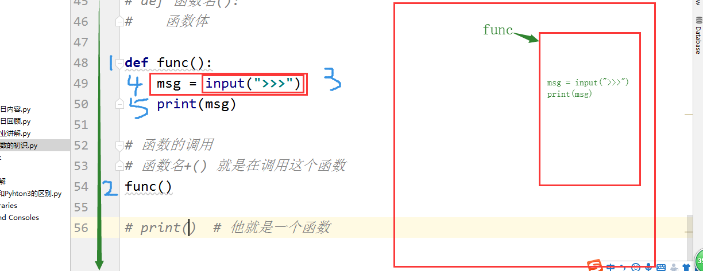
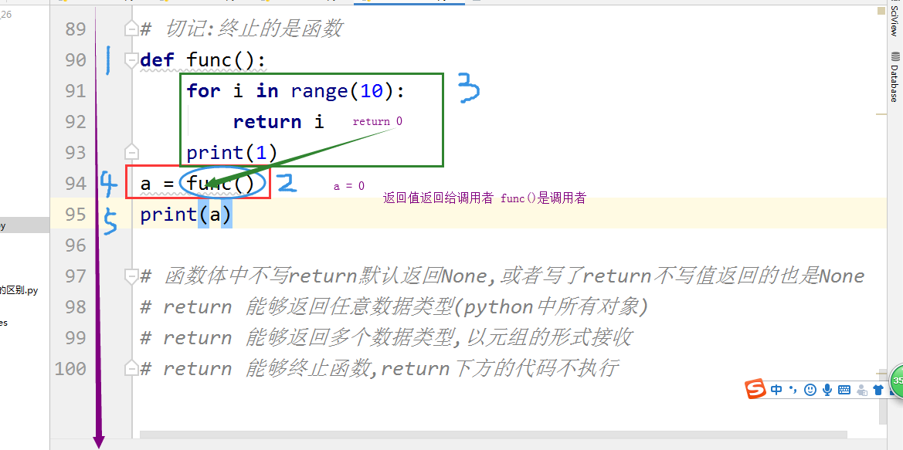

## 函数

[TOC]

### 函数初识

函数的作用是封装代码，大量减少重复代码，可重用性高。

我们之前写代码的方式可以说是过程式编程，有什么需求我们就写什么样的代码，一步一步写下去。之前写过的代码一旦运行过去之后就不会被再次运行到。

我们今天要学习的函数，其实也是一种新的编程思路，也就是函数式编程。

接下来，我们通过一个例子来初识过程式编程与函数式编程的区别。

现在有这样一个要求，不使用 `len()` 方法，如何能够得知一个字符串 `s = 'alexdasb'` 的长度呢？根据我们已有的知识，可以使用 for 循环做到：

```python
s = 'alexdsb'
count = 0
for i in s:
    count += 1
print(count)
```

这种方法对于我们来说已经轻而易举了。

如果此时，我们想接着求一个列表 `s = [1, 2, 3, 4, 5]` 的长度，即便跟前面的情况很类似，但我们不得不重新写一个代码：

```python 
s = [1, 2, 3, 4, 5]
count = 0
for i in s:
    count += 1
print(count)
```

如果再需要求一个元组 `s = (7, 8, 9, 10)` 的长度：

```python
s = (7, 8, 9, 10)
count = 0
for i in s:
    count += 1
print(count)
```

我不难发现，我们虽然得到了我们想要的结果，但是循环的代码是完全重复了的。如果使用函数式编程，就可以减少这样的重复：

```python
def my_len():
    count = 0
    for i in s:
        count += 1
    print(count)
s = "alexdsb"
my_len()
s = [1, 2, 3, 4, 5, 6, 7, 8]
my_len()
```

### 函数的定义

从上面的例子我们已经能看出来，函数的定义结构为：

```python
def 函数名():
    函数体
```

- `def` 是一个关键字，声明要定义一个函数
- `函数名` 指代函数的名字，遵循变量命名的规则
- `()` 是固定结构，用来传参
- `:` 表示语句结束
- `缩进`
- `函数体` 为函数的代码内容

### 函数的调用

根据前面所学到的东西，我们可以很容易地写出一个简单地输出用户输入内容的函数：

```python
def func():
    msg = input('>>>')
    print(msg)
```

程序运行之后直接结束，并没有按照我们预想的出现让用户输入的情况。

这是因为当程序运行到 def 语句时，并不会立即执行函数中的内容，而是会开辟一块内存空间，将函数的内容存储到内存中。

只有当函数被调用时，函数中的内容才会被执行。`函数名()` 这种形式就是在调用函数。



回到上面的例子，如果我们在最后增加对函数的调用，就可以实现我们想要的效果：

```python
func()
```

这种 `函数名()` 的结构有两层含义：

1. 调用函数
2. 接收返回值

### 函数的返回

我们学过的很多方法，比如 `print()`、`input()` 等，本质上就是函数。

如果我们将 `print()` 和 `input()` 两个函数本身作为参数打印出来，会有什么样的效果呢？

```python
print(print('a'))
print(input('>>>'))
```

输出的结果为：

```python
a
None
>>>123
123
```

print 和 input 运行后打印出来的内容有很大差别，这是因为两个函数的返回值不同。

函数中使用 `return` 语句返回内容。return 语句的基本用法为：

```python
def func():
    a = 10
    return a
a = func()
print(a)
```

return 后面可以跟 Python 中任意数据类型[^1]。

return还可以一次性返回多个数据，返回的数据以元组的形式接收：

```python
def func():
    a = 10
    b = 20
    return a, b
a = func()
print(a)

输出的结果是：(10, 20)
```

因为返回的数据是元组，我们可以通过解构的方式获取每一个值：

```python
def func():
    a = 10
    b = 20
    return a, b
a, b = func()   # 拆包，解包，平行赋值
print(a, b)

输出的结果为： 10 20
```

return 是函数终止的标识，return 能够终止函数，它后面的代码不被执行：

```python
def func():
    for i in range(10):
        return i
    print(1)
a = func()
print(a)

输出的结果为： 0
```

return 会将返回值返回给调用者。



函数的返回小结：

- 函数体中不写 return 默认返回 None；写了 return 不写值也返回 None
- return 能够返回任意数据类型（Python 中所有对象）
- return 能够返回多个数据类型，以元组的形式接收
- return 能够终止函数，其下方的代码不会被执行
- return 将返回值返回给调用者

### 函数的参数

#### 位置参数

我们现在写好下面这样的函数并调用：

```python
def yue():
    print("掏出手机")
    print("打开微信")
    print("找到附近的人")
    print("聊一聊")
    print("约一约")
yue()
```

这个函数当然会很正常地运行。而且不管我们在什么位置，只要调用这个函数，就会打印这五行内容。

但是如果有一天，我们需要换一个 app，比如不用微信，改用陌陌，该如何办呢？如果在函数上改会很麻烦且不灵活。

我们可以通过参数的方式进行自定义函数输出的内容：

```python
def yue(app):
    print("掏出手机")
    print("打开", app)
    print("找到附近的人")
    print("聊一聊")
    print("约一约")
yue('微信')
yue('陌陌')
yue('谈谈')
```

通过这种传入参数的方式，我们如果需要函数输出不同的内容就不需要去改变函数本身了。

我们可以一次性传入多个参数：

```python
def yue(app, girl, age, addr):    # 形参
    print("掏出手机")
    print(f"打开{app}")
    print(f"找一位{girl}，要求年龄：{age}，地区：{addr}的人")
    print("聊一聊")
    print("约一约")
yue("微信", "女孩", 18, "乌克兰")  # 实参  按照位置传参
```

在定义函数时使用的参数被称作形式参数，也称形参。在调用函数是使用的参数是实际参数，也称实参。

上面这种函数的传参方式被称作按位置传参，实参和形参需要一一对应，否则会出现参数混乱的问题。

#### 默认参数

对于一些特殊的情况，比如某个男生很多，女生很少的班级，录入班级信息时，会经常重复输入性别为男。这时，我们可以通过设置默认参数的方法，将性别默认设定为男。当不输入参数时，函数会自动使用男作为参数。这样会节省很多时间：

```python
def userinfo(name, age, hobby, sex="男"):
    print(f"姓名：{name} 年龄：{age} 性别：{sex} 爱好：{hobby}")
userinfo("岳新力", 23, "开车")
userinfo("刘柄良", 60, "玩卡丁车")
userinfo("燕莹轩", 16, "听音乐","女")
userinfo("苑子蒙", 16, "玩游戏","女")
userinfo("王雪芹", 16, "看书","女")
userinfo("瑞瑞", 18, "知难而上")
```

需要注意的是，默认参数需要放在位置参数的后面，否则会报错。

参数的优先级为：位置参数 -- 默认参数

#### 混合参数

位置参数和默认参数可以混合在一起使用。需要注意的是，默认参数必须都要放在位置参数的后面：

```python
def func(a, b, c=1, d=2):
    print(a, b, c, d)

func(1, 3, 4, 5)   # 实参 位置参数传递
func(a=1, b=2, c=3, d=4)  # 关键字传参  （指名道姓传参）
func(1, 2, d=3)  # 关键字传参  （指名道姓传参）
```

这里有引入了一个传参的概念。当调用函数时，我们需要把参数传递给函数，这个过程被称作传参。直接把参数按照形参的位置一一对应传入的方式被称作位置传参。也可以指定形参的名字来传参，这种方法被称作关键字传参。

当存在多个默认参数，但只想修改其中少数默认参数时，就需要使用关键字传参告诉函数需要改变的是哪一个参数。

#### 动态参数

我们已经学到了函数的两种参数：位置参数和默认参数。但是对这两种参数而言，我们传入函数的数据不能多于参数的总个数。但是有些时候，参数的数量是不能很好控制的，这时候，我们就需要应用到动态参数。

动态参数的作用主要有两个：

1. 能够接收不固定长度的参数
2. 位置参数过多时，可以使用动态参数

##### 动态位置参数

我们可以通过下面的方法定义一个动态的位置参数：

```python
def func(*c):
    print(c)
func(1, 2, 3, 4, 5, 6, 7, 8, 9, 0)
```

输出的结果为：

```python
(1, 2, 3, 4, 5, 6, 7, 8, 9, 0)
```

这个方法得到的数据类型是一个元组。

动态位置参数以 `*形参` 的形式表示。相信大家已经发现，这种方式跟切片时十分相似。

事实上，同切片时将多余数据打包的原理一样，在形参位置上的 `*` 就是聚合。同样，我们可以在函数体中使用 `*` 将聚合后得到的元组打散：

```python
def func(*c):  # 形参位置上的*是聚合
    print(*c)  # 函数体中的*就是打散
func(1, 2, 3, 4, 5, 6, 7, 8, 9, 0)
```

输出的结果为：

```python
1 2 3 4 5 6 7 8 9 0
```

因为动态位置参数会将多余的位置参数全都打包起来，所以一个函数中只需要一个动态位置参数就足够了。一般情况下，动态位置参数会被命名为 `*args`。当然也可以自定义参数名，但是不建议修改，因为这时程序员约定俗成的共识。

如果动态位置参数后面还有位置参数，那么后面的位置参数将永远无法获取到值，程序会直接报错：

```python
def eat(*args, a, b):
    print(a, b, args)
eat("面条", "米饭", "馒头", "包子", "煎饼")
```

程序报错，错误内容为：

```python
Traceback (most recent call last):
  File "C:/Users/Sure/PyProject/day10/exercise.py", line 12, in <module>
    eat("面条", "米饭", "馒头", "包子", "煎饼")
TypeError: eat() missing 2 required keyword-only arguments: 'a' and 'b'
```

因为参数 `a` 和 `b` 永远也无法得到值，尽管我们输入很多内容，依旧无济于事。

一个比较标准的参数设置方法是这样的：

```python
def eat(a, b, *args):  # 位置参数 动态位置参数
    print(a, b, args)
eat("面条", "米饭", "馒头", "包子", "煎饼")
```

输出的结果为：

```python
面条 米饭 ('馒头', '包子', '煎饼')
```

位置参数一一对应获得参数，动态位置参数将剩余的参数打包成一个元组。

##### 动态关键字参数（动态默认参数）

当我们在实参中传入的关键字参数在形参中存在时，会成功传递进入。可是如果形参中没有我们传入的实参，就会报错。

动态关键字参数就是用来接收这些没有被定义过的关键字参数。

我们可以在形参中使用 `**参数名` 的形式定义一个动态关键字参数。同样地，参数名可以随意选取，但是程序员间约定俗成的动态关键字参数名为 `**kwargs`：

```python
def func(a,b,*args,**kwargs):
    print(a,b,args,kwargs)
func(1, 2, 3, 4, 5, 6, 76, 87, 8, c=100)
```

输出的结果为：

```python
1 2 (3, 4, 5, 6, 76, 87, 8) {'c': 100}
```

前两个位置参数分别传给了 `a` 和 `b`，剩余的位置参数打包成元组传给了 `args`，而关键字参数则以字典的形式传给了 `kwargs`。

当我们需要设置多种参数时，推荐使用的顺序是：位置参数，动态位置参数，默认参数，动态关键字参数：

```python
def func(a, b, *args, m=8, **kwargs): 
    # 位置参数,动态位置,默认参数,动态关键字参数
    print(a, b, m, args, kwargs)
func(1, 2, 4, 5, m=10, c=11, d=12)
```

输出的结果为：

```python
1 2 10 (4, 5) {'c': 11, 'd': 12}
```

#### 函数参数总结

- 在定义函数的阶段使用的参数是形参：
  - 可以单独使用位置参数，也可以单独使用默认参数，也可以混合使用
  - 位置参数：必须一一对应
  - 默认参数：可以不传参，可以传参，传参就是把默认的值给覆盖
  - 混合使用：位置参数，默认参数
- 在调用函数的阶段使用的是实参：
  - 可以单独使用位置参数，也可以单独使用关键字参数，也可以混合使用
  - 位置传参：必须一一对应
  - 关键字传参：指名道姓的方式进行传参
  - 混合使用：位置参数，默认参数
- 将实参传递给形参的过程就是传参

- 优先级：位置参数 > 动态位置参数（可变位置参数）> 默认参数 > 动态关键字参数（可变关键字参数）
- `*args` 和 `**kwargs` 是程序员之间约定俗成的命名法（可以更换但是不建议更换）
- `*args` 获取的是一个元组
- `**kwargs` 获取的是一个字典
- `*args` 只接收多余的位置参数
- `**kwargs` 只接收多余的关键字参数

#### 函数参数补充

##### 万能传参

因为动态位置参数和动态关键字参数可以接受所有的位置参数和关键字参数，所以在设置形参时，我们甚至可以只设置 `*args` 和 `**kwargs` 两个形参，这种传参方法被称作万能传参：

```python
def func(*args, **kwargs):   # 万能传参
    print(args, kwargs)
func(12, 2, 121, 12, 321, 3, a=1, b=2)
```

输出的结果为：

```python
(12, 2, 121, 12, 321, 3) {'a': 1, 'b': 2}
```

##### 聚合与打散

在前面的 [动态位置参数](#动态位置参数) 部分已经讨论过，形参中的 `*args` 是将多于变量聚合为元组，函数体中的 `*args` 是将元组打散。其实对于 `**kwargs` 来说也很类似：形参中的 `**kwargs` 是将 `key=1, key2=2` 这样类型的语句转化为字典，而函数体中 `*kwargs` 是获取字典中所有的键，`**kwargs` 是将字典打散为 `key=1, key2=2` 的语句。

除了函数中，我们可以在 Python 的很多地方灵活运用打散和聚合的操作：

```python
lst = [1, 2, 3, 4, 6, 7]
def func(*args):  # 聚合
    print(*args)  # 打散
func(*lst)  # 打散 func(1, 2, 3, 4, 6, 7)

dic = {"key": 1, "key2": 2}
def func(**kwargs):  # 聚合
    print(kwargs)
func(**dic)  # 打散 func(key=1, key2=2)
```

输出的结果为：

```python
1 2 3 4 6 7
{'key': 1, 'key2': 2}
```

### 函数的注释

在协同操作的过程中，大家或许会查看和使用彼此的代码。但是如果没有任何提示性的内容的话，从头开始看起会有很大的理解困难。如果我们将函数的一些功能、参数要求等信息在函数中写出来，别人阅读时就会节省很多时间，也更容易理解调用和修改我们的函数。

标准的函数注释应该是这样的：

```python
def add(a, b):
    """
    数字的加法运算
    :param a: int
    :param b: int
    :return: int
    """
    return a + b
print(add(1, 2))
```

函数中使用三对 `"`，就是代表注释。也可以使用 `'` 表示，但是不推荐。

另外一种比较流行的注释方法是在形参后加入 `:数据类型`，例如：

```python
def add(a:int, b:int):  # 提示,没有做到约束
    """
    加法
    :param a:
    :param b:
    :return:
    """
    return a + b
add(1, 2)
add("1", "2")
```

需要注意的是，参数的作用只是起到提示的作用，并不会进行判断，约束我们传入变量的数据类型。

我们可以通过 `函数名.__doc__` 的方法查看函数的注释；通过 `函数名.__name__` 的方法查看函数的名字。


[^1]: 事实上，return后面可以跟Python中所有的对象。