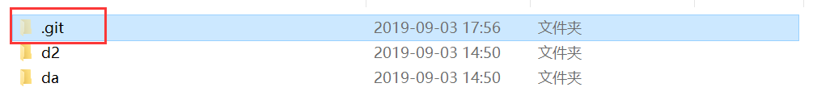

## 码云初识

[TOC]

本文仅讨论一些码云和 git 的初级用法，仅供初学者参考。

码云官网：https://gitee.com/


### 码云注册

点击右上角“注册”按钮，开始注册一个码云账号，建议使用邮箱注册账号。


新建一个库，“是否开源”处选择“公开”


将默认勾选的“使用 Readme 文件初始化这个仓库”前面的复选框取消勾选


在 git 官网 https://git-scm.com/ 下载 git，安装到电脑上。

### 码云的日常使用

第一步，在想要进行版本控制的文件夹中点击右键，点击“Git Bash Here”，在 git 窗口中输入 `git init`，然后按下 `回车` 键。git 初始化将自动运行。

```bash
Sure@LAPTOP-ISFBFO7G MINGW64 ~/Desktop/try
$ git init
Initialized empty Git repository in C:/Users/Sure/Desktop/try/.git/
```

初始化操作会在当前文件夹中新建一个 `.git` 文件夹，里面装的是 git 的配置文件。



第二步，输入 `git add .`，按下 `回车` 键，匹配此文件夹下的所有增删改信息。其中，可以把 `.` 替换为特定的文件，对指定文件的更改信息进行更新。

第三步，输入 `git commit -m "first attempt"`，提交本次增删改，并在 -m 后给提交以备注信息。

```bash
  Sure@LAPTOP-ISFBFO7G MINGW64 ~/Desktop/try (master)
  $ git commit -m "first attempt"
  [master (root-commit) 3e41efc] first attempt
   45 files changed, 609 insertions(+)
   create mode 100644 d2/media/Git_01.png
   create mode 100644 d2/media/Git_02.png
   create mode 100644 da/Markdown Reference.md
   create mode 100644 da/media/pc_setup_01.png
   create mode 100644 da/media/pc_setup_02.png
   create mode 100644 da/media/pc_setup_03.png
   create mode 100644 da/media/pc_setup_04.png
   create mode 100644 da/media/pc_setup_05.png
   create mode 100644 da/media/pc_setup_06.png
   create mode 100644 da/media/pc_setup_07.png
   create mode 100644 da/media/pc_setup_08.png
   create mode 100644 da/media/pc_setup_09.png
   create mode 100644 da/media/pc_setup_10.png
   create mode 100644 da/media/pc_setup_11.png
   create mode 100644 da/media/pc_setup_12.png
   create mode 100644 da/media/pc_setup_13.png
   create mode 100644 da/media/pc_setup_14.png
   create mode 100644 da/media/pc_setup_15.png
   create mode 100644 da/media/pc_setup_16.png
   create mode 100644 da/media/pc_setup_17.png
   create mode 100644 da/media/pc_setup_18.png
   create mode 100644 da/media/py_setup_01.png
   create mode 100644 da/media/py_setup_02.png
   create mode 100644 da/media/py_setup_03.png
   create mode 100644 da/media/py_setup_04.png
   create mode 100644 da/media/py_setup_05.png
   create mode 100644 da/media/py_setup_06.png
   create mode 100644 da/media/py_setup_07.png
   create mode 100644 da/media/py_setup_08.png
   create mode 100644 da/media/py_setup_09.png
   create mode 100644 da/media/py_setup_10.png
   create mode 100644 da/media/py_setup_11.png
   create mode 100644 da/media/py_setup_12.png
   create mode 100644 da/media/py_setup_13.png
   create mode 100644 da/media/py_setup_14.png
   create mode 100644 da/media/py_setup_15.png
   create mode 100644 da/media/py_setup_16.png
   create mode 100644 da/media/py_setup_17.png
   create mode 100644 da/media/py_setup_18.png
   create mode 100644 da/media/py_setup_19.png
   create mode 100644 da/media/py_setup_20.png
   create mode 100644 da/media/py_setup_21.png
   create mode 100644 da/media/py_setup_22.png
   create mode 100644 da/test.py
   create mode 100644 "da/\351\242\204\347\247\221day01_\347\254\224\350\256\260.md"
```

第四步，输入 `git remote add origin https://gitee.com/oldboy-python-full-stack-26/19083026021.git`，将本地文件夹和码云的仓库建立连接，绑定新的本地仓库至远程仓库。其中，`https://gitee.com/oldboy-python-full-stack-26/19083026021.git` 是码云仓库的地址。

第五步，输入 `git push origin master`，把修改推送至云端仓库。

```bash
Sure@LAPTOP-ISFBFO7G MINGW64 ~/Desktop/try (master)
$ git push origin master
To https://gitee.com/oldboy-python-full-stack-26/19083026021.git
! [rejected]        master -> master (fetch first)
error: failed to push some refs to 'https://gitee.com/oldboy-python-full-stack-26/19083026021.git'
hint: Updates were rejected because the remote contains work that you do
hint: not have locally. This is usually caused by another repository pushing
hint: to the same ref. You may want to first integrate the remote changes
hint: (e.g., 'git pull ...') before pushing again.
hint: See the 'Note about fast-forwards' in 'git push --help' for details.
```

因为云端仓库有内容，需要先把云端的内容拉到本地，才能把本地的修改推至云端。

第六步，输入 `git pull origin master`，因为发现推送失败，需要解决冲突，先把代码拉下来 。

```bash
Sure@LAPTOP-ISFBFO7G MINGW64 ~/Desktop/try (master)
$ git pull origin master
warning: no common commits
remote: Enumerating objects: 113, done.
remote: Counting objects: 100% (113/113), done.
remote: Compressing objects: 100% (107/107), done.
remote: Total 113 (delta 23), reused 0 (delta 0)
Receiving objects: 100% (113/113), 5.64 MiB | 1.83 MiB/s, done.
Resolving deltas: 100% (23/23), done.
From https://gitee.com/oldboy-python-full-stack-26/19083026021
    * branch            master     -> FETCH_HEAD
    * [new branch]      master     -> origin/master
fatal: refusing to merge unrelated histories
```

还是没有成功。失败的原因是不能融合没有关联的历史修改。

第七步，输入 `git pull origin master --allow-unrelated-histories`，用更高级的代码，允许无关联的历史修改进行融合，把代码拉下来。

弹出的是 Vim 打开的空白文件，输入 `:`，然后输入 `wq`，按下 `回车` 键退出编辑即可。

```bash
  Sure@LAPTOP-ISFBFO7G MINGW64 ~/Desktop/try (master)
  $ git pull origin master --allow-unrelated-histories
  From https://gitee.com/oldboy-python-full-stack-26/19083026021
   * branch            master     -> FETCH_HEAD
  Merge made by the 'recursive' strategy.
   .idea/PyProject.iml                                |  11 +
   .idea/inspectionProfiles/profiles_settings.xml     |   6 +
   .idea/misc.xml                                     |   7 +
   .idea/modules.xml                                  |   8 +
   .idea/vcs.xml                                      |   6 +
   .idea/workspace.xml                                |  98 +++++
   day01/Markdown Reference.md                        | 406 +++++++++++++++++++++
   day01/gh-md-toc.exe                                | Bin 0 -> 6391808 bytes
   day01/gh.exe                                       | Bin 0 -> 6400000 bytes
   day01/media/pc_setup_01.png                        | Bin 0 -> 69626 bytes
   day01/media/pc_setup_02.png                        | Bin 0 -> 67690 bytes
   day01/media/pc_setup_03.png                        | Bin 0 -> 46178 bytes
   day01/media/pc_setup_04.png                        | Bin 0 -> 34293 bytes
   day01/media/pc_setup_05.png                        | Bin 0 -> 33099 bytes
   day01/media/pc_setup_06.png                        | Bin 0 -> 33854 bytes
   day01/media/pc_setup_07.png                        | Bin 0 -> 38762 bytes
   day01/media/pc_setup_08.png                        | Bin 0 -> 14240 bytes
   day01/media/pc_setup_09.png                        | Bin 0 -> 216577 bytes
   day01/media/pc_setup_10.png                        | Bin 0 -> 43529 bytes
   day01/media/pc_setup_11.png                        | Bin 0 -> 51163 bytes
   day01/media/pc_setup_12.png                        | Bin 0 -> 75482 bytes
   day01/media/pc_setup_13.png                        | Bin 0 -> 38615 bytes
   day01/media/pc_setup_14.png                        | Bin 0 -> 76688 bytes
   day01/media/pc_setup_15.png                        | Bin 0 -> 139743 bytes
   day01/media/pc_setup_16.png                        | Bin 0 -> 9092 bytes
   day01/media/pc_setup_17.png                        | Bin 0 -> 120995 bytes
   day01/media/pc_setup_18.png                        | Bin 0 -> 86085 bytes
   day01/media/py_setup_01.png                        | Bin 0 -> 209410 bytes
   day01/media/py_setup_02.png                        | Bin 0 -> 199153 bytes
   day01/media/py_setup_03.png                        | Bin 0 -> 212513 bytes
   day01/media/py_setup_04.png                        | Bin 0 -> 178987 bytes
   day01/media/py_setup_05.png                        | Bin 0 -> 19117 bytes
   day01/media/py_setup_06.png                        | Bin 0 -> 35736 bytes
   day01/media/py_setup_07.png                        | Bin 0 -> 38355 bytes
   day01/media/py_setup_08.png                        | Bin 0 -> 4303 bytes
   day01/media/py_setup_09.png                        | Bin 0 -> 18328 bytes
   day01/media/py_setup_10.png                        | Bin 0 -> 6736 bytes
   day01/media/py_setup_11.png                        | Bin 0 -> 54323 bytes
   day01/media/py_setup_12.png                        | Bin 0 -> 44906 bytes
   day01/media/py_setup_13.png                        | Bin 0 -> 58768 bytes
   day01/media/py_setup_14.png                        | Bin 0 -> 100797 bytes
   day01/media/py_setup_15.png                        | Bin 0 -> 38831 bytes
   day01/media/py_setup_16.png                        | Bin 0 -> 56690 bytes
   day01/media/py_setup_17.png                        | Bin 0 -> 58158 bytes
   day01/media/py_setup_18.png                        | Bin 0 -> 59996 bytes
   day01/media/py_setup_19.png                        | Bin 0 -> 36564 bytes
   day01/media/py_setup_20.png                        | Bin 0 -> 194578 bytes
   day01/media/py_setup_21.png                        | Bin 0 -> 183047 bytes
   day01/media/py_setup_22.png                        | Bin 0 -> 67268 bytes
   day01/test.py                                      |   1 +
   ...4\347\247\221day01_\347\254\224\350\256\260.md" | 204 +++++++++++
   day02/media/Git_01.png                             | Bin 0 -> 94007 bytes
   day02/media/Git_02.png                             | Bin 0 -> 407678 bytes
   53 files changed, 747 insertions(+)
   create mode 100644 .idea/PyProject.iml
   create mode 100644 .idea/inspectionProfiles/profiles_settings.xml
   create mode 100644 .idea/misc.xml
   create mode 100644 .idea/modules.xml
   create mode 100644 .idea/vcs.xml
   create mode 100644 .idea/workspace.xml
   create mode 100644 day01/Markdown Reference.md
   create mode 100644 day01/gh-md-toc.exe
   create mode 100644 day01/gh.exe
   create mode 100644 day01/media/pc_setup_01.png
   create mode 100644 day01/media/pc_setup_02.png
   create mode 100644 day01/media/pc_setup_03.png
   create mode 100644 day01/media/pc_setup_04.png
   create mode 100644 day01/media/pc_setup_05.png
   create mode 100644 day01/media/pc_setup_06.png
   create mode 100644 day01/media/pc_setup_07.png
   create mode 100644 day01/media/pc_setup_08.png
   create mode 100644 day01/media/pc_setup_09.png
   create mode 100644 day01/media/pc_setup_10.png
   create mode 100644 day01/media/pc_setup_11.png
   create mode 100644 day01/media/pc_setup_12.png
   create mode 100644 day01/media/pc_setup_13.png
   create mode 100644 day01/media/pc_setup_14.png
   create mode 100644 day01/media/pc_setup_15.png
   create mode 100644 day01/media/pc_setup_16.png
   create mode 100644 day01/media/pc_setup_17.png
   create mode 100644 day01/media/pc_setup_18.png
   create mode 100644 day01/media/py_setup_01.png
   create mode 100644 day01/media/py_setup_02.png
   create mode 100644 day01/media/py_setup_03.png
   create mode 100644 day01/media/py_setup_04.png
   create mode 100644 day01/media/py_setup_05.png
   create mode 100644 day01/media/py_setup_06.png
   create mode 100644 day01/media/py_setup_07.png
   create mode 100644 day01/media/py_setup_08.png
   create mode 100644 day01/media/py_setup_09.png
   create mode 100644 day01/media/py_setup_10.png
   create mode 100644 day01/media/py_setup_11.png
   create mode 100644 day01/media/py_setup_12.png
   create mode 100644 day01/media/py_setup_13.png
   create mode 100644 day01/media/py_setup_14.png
   create mode 100644 day01/media/py_setup_15.png
   create mode 100644 day01/media/py_setup_16.png
   create mode 100644 day01/media/py_setup_17.png
   create mode 100644 day01/media/py_setup_18.png
   create mode 100644 day01/media/py_setup_19.png
   create mode 100644 day01/media/py_setup_20.png
   create mode 100644 day01/media/py_setup_21.png
   create mode 100644 day01/media/py_setup_22.png
   create mode 100644 day01/test.py
   create mode 100644 "day01/\351\242\204\347\247\221day01_\347\254\224\350\256\260.md"
   create mode 100644 day02/media/Git_01.png
   create mode 100644 day02/media/Git_02.png
```

第八步，重复第五步，输入 `git push origin master`，代码成功上传至云端。

```bash
Sure@LAPTOP-ISFBFO7G MINGW64 ~/Desktop/try (master)
$ git push origin master
Enumerating objects: 8, done.
Counting objects: 100% (8/8), done.
Delta compression using up to 4 threads
Compressing objects: 100% (7/7), done.
Writing objects: 100% (7/7), 10.03 KiB | 3.34 MiB/s, done.
Total 7 (delta 1), reused 0 (delta 0)
remote: Powered By Gitee.com
To https://gitee.com/oldboy-python-full-stack-26/19083026021.git
91e455d..24b44b2  master -> master
```

其中，第一部和第四步仅在第一次配置的时候需要用到，第六步和第七步是因为第五步出错才采取的应对步骤，第八步与第五步是完全相同的操作。在平时日常使用中，主要使用**第二步、第三步和第五步**这三个步骤。

### git 基本操作总结

1. `git init`，初始化
2. `git add .`，将代码的增删改拍快照
3. `git commit -m 'note'`，将代码变更提交
4. `git remote add origin https://gitee.com/oldboy-python-full-stack-26/19083026021.git`，将本地仓库与码云仓库建立连接。其中，`https://gitee.com/oldboy-python-full-stack-26/19083026021.git` 是码云仓库的地址
5. `git pull origin master`，将码云的更改内容应用到本地仓库
6. `git pull origin master --allow-unrelated-histories`，允许合并无关联的历史变更
7. `git push origin master`，将本地的代码变更应用到码云仓库