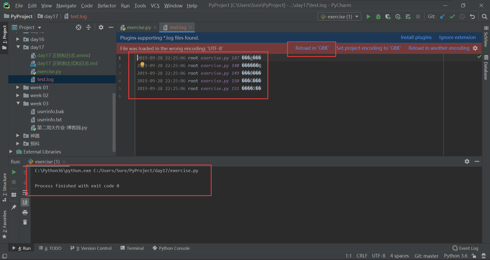
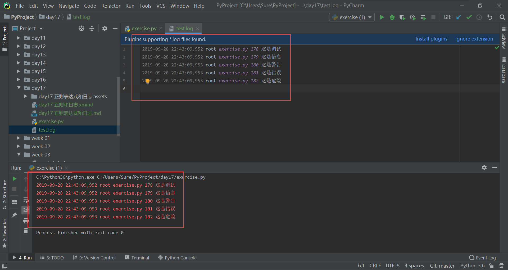

## logging 模块和日志

[TOC]

logging 也就是日志模块，其主要作用于有：

1. 记录程序运行的状态（时间，文件名，报错行数，错误信息）；
2. 用户的喜好（分析用户的一些喜好和操作）；
3. 银行（账户流水）。

日志一共分为五个级别：

| 序号 |  错误名  | 含义 | 级别 |
| :--: | :------: | :--: | :--: |
|  1   |  debug   | 调试 |  10  |
|  2   |   info   | 信息 |  20  |
|  3   | warning  | 警告 |  30  |
|  4   |  error   | 错误 |  40  |
|  5   | critical | 危险 |  50  |

一般情况下，日志默认报告级别在 30 以上的事件。

### 基础版日志

基础版的日志是 Python 已经写好了的，可以直接调用：

```python
import logging

logging.basicConfig(
    level=10,
    format="%(asctime)s %(name)s %(filename)s %(lineno)s %(message)s",
    datefmt="%Y-%m-%d %H:%M:%S",
    filename='test.log',
    filemode='a', )
logging.debug('这是调试')
logging.info('这是信息')
logging.warning('这是警告')
logging.error('这是错误')
logging.error('这是危险')
```

窗口中没有打印出任何信息，日志全部被写入到文件 text.log 中。但是因为编码默认是 gbk，所以中文出现了乱码。虽然可以通过更改编码读取文件，但是基础版的日志是没有办法指定编码方法的。



有了日志之后，我们可以通过日志的方法与用户交互，而避免报错：

```python
import logging

logging.basicConfig(
    level=10,
    format="%(asctime)s %(name)s %(filename)s %(lineno)s %(message)s",
    datefmt="%Y-%m-%d %H:%M:%S",)
num = input('请输入数字：')
try:
    num = int(num)
    print(num)
except ValueError:
    logging.warning('字符串不能强行转换成数字！')
```

输出的结果为：

```python
请输入数字：a
2019-09-28 22:30:56 root exercise.py 165 字符串不能强行转换成数字！
```

基础版日志调用非常方便，但是有两个缺点：

1. 编码默认为 gbk，且不可修改；
2. 屏幕显示和文件存储不能同时有。

因为这两个缺点，我们更常用的是进阶版的日志。

### 进阶版日志

进阶版日志是我们自己组装实现的，是通过二次开发获得的，其基本用法为：

```python
import logging
logger = logging.getLogger()    # 创建一个空架子
fh = logging.FileHandler('test.log', mode='a', encoding='utf-8')    # 创建一个文件句柄，用来记录日志（文件流）
ch = logging.StreamHandler()    # 创建一个屏幕流，打印记录的内容
f_str = logging.Formatter('%(asctime)s %(name)s %(filename)s %(lineno)s %(message)s')    # 定义一个记录日志的格式
logger.level = 10    # 设置日志记录的级别
fh.setFormatter(f_str)    # 给文件句柄设置记录内容的格式
ch.setFormatter(f_str)    # 给中控台设置记录内容的格式
logger.addHandler(fh)    # 将文件句柄添加到logger对象中
logger.addHandler(ch)    # 将中控台添加到logger对象中

logger.debug("这是调试")
logger.info("这是信息")
logger.warning("这是警告")
logger.error("这是错误")
logger.critical("这是危险")
```

这次屏幕和文件中都出现了日志信息，且中文也不需要转编码即可正常显示。



### 类封装版日志

将进阶版日志封装到类中，可以直接写到文件里。

有一点要注意的是，

settings 中的配置为：

```python
BASE_DIR = os.path.dirname(os.path.dirname(__file__))
LOG_DIR = os.path.join(BASE_DIR, 'log')
```

日志处理文件的写法为：

```python
import logging
import os

from conf import  settings


class LogHandler:
    def __init__(self, log_file_name: str):
        log_path = os.path.join(settings.LOG_DIR, log_file_name)
        self.logger = logging.getLogger()    # 创建一个空架子
        fh = logging.FileHandler(log_path, mode='a', encoding='utf-8')    # 创建一个文件句柄，用来记录日志（文件流）
        ch = logging.StreamHandler()    # 创建一个屏幕流，打印记录的内容
        f_str = logging.Formatter('%(asctime)s %(name)s %(filename)s %(lineno)s %(message)s')    # 定义一个记录日志的格式
        self.logger.level = 10    # 设置日志记录的级别
        fh.setFormatter(f_str)    # 给文件句柄设置记录内容的格式
        ch.setFormatter(f_str)    # 给中控台设置记录内容的格式
        if not logger.hasHandlers():    # 防止多次实例化对象，重复添加日志句柄
            self.logger.addHandler(fh)    # 将文件句柄添加到logger对象中
            self.logger.addHandler(ch)    # 将中控台添加到logger对象中
    
    def debug(self, message):    # 调试
        self.logger.debug(message)
        
    def info(self, message):    # 信息
        self.logger.info(message)
        
    def warning(self, message):    # 警告
        self.logger.warning(message)
        
    def error(self, message):    # 错误
        self.logger.error(message)
        
    def critical(self, message):    # 危险
        self.logger.critical(message)
```

