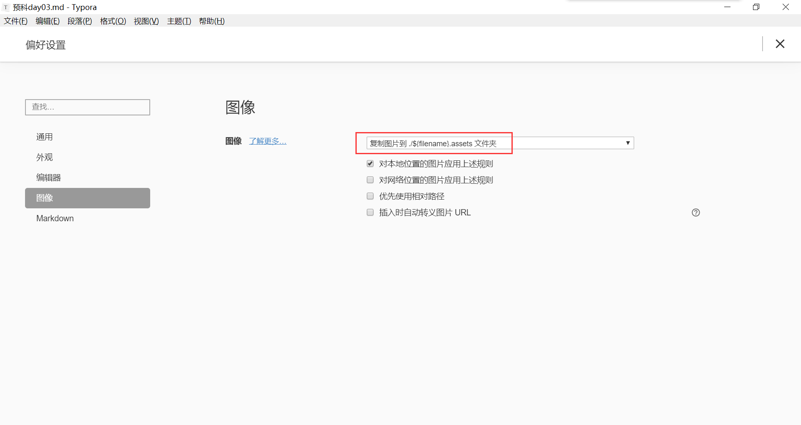

## Markdown 常用语法

[TOC]

这里介绍的都是日常经常会用到的一些 markdown 语法。若需要了解更详细的 markdown 语法，可以参见我翻译的 [Typora官方Markdown教程](..\translation\Typora-Markdown.md) 以及转载的 [CSDN 官方的 Markdown 教程](CSDN-Markdown-manual.md) 

### 标题

```markdown
# 一级标题
## 二级标题
### 三级标题
#### 四级标题
##### 五级标题
###### 六级标题
```

- # 一级标题

- ## 二级标题

- ### 三级标题

- #### 四级标题

- ##### 五级标题

- ###### 六级标题

### 列表

- 有序列表

  ```markdown
  1. 列表内容
  2. 列表内容
  3. 列表内容
  ```

  1. 列表内容
  2. 列表内容
  3. 列表内容

- 无序列表

  ```markdown
  * 列表内容
  - 列表内容
  + 列表内容
  ```

  - 列表内容

  - 列表内容

  - 列表内容

### 代码块

- 多行代码块

  ~~~markdown
  ```然后按下回车键，这个符号在键盘左上角，叫做反引号。
  这段文字的内容就包含在一个多行代码块内。
  多行代码块的右下角还可以设置语言，用来高亮显示相应语言的语法短语。
  ~~~

- 单行代码块

  ```markdown
  这段`代码内容`会在段落的行内显示
  ```

  这段 `代码内容` 会在段落的行内显示

### 表格

- 使用代码创建表格

  ```markdown
  | 第一个标题  | 第二个标题 |
  | --------- | -------- |
  | 文字内容  | 文字内容  |
  | 文字内容  | 文字内容  |
  ```

- 代码创建表格太过繁琐，建议使用快捷键 `ctrl + t` 或者在菜单栏中依次点击 `段落` -> `表格` -> `插入表格` 快捷创建表格

- | 第一个标题 | 第二个标题 |
  | ---------- | ---------- |
  | 文字内容   | 文字内容   |
  | 文字内容   | 文字内容   |

### 图片

- Markdown 语法插入图片

  ```markdown
  
  
  用“/”而不是“\”是因为在 URL 中，用“/”写路径能被识别出来。
  ```

  

  如上图，在偏好设置的图像标签中，设置 `复制图片到./$(filename).assets` 文件夹，这样，新复制的图片文件就会保存在工作目录的文件夹中。

- HTML 语法插入图片

  ```html
  
  ```

  

  

### 超链接

```markdown
[提示语](网址)
我们可以建立这样一个 [百度](https://www.baidu.com/) 的超链接
```

- 我们可以建立这样一个 [百度](https://www.baidu.com/) 的超链接
- 按住 `ctrl` 键，用鼠标左键点击超链接，会在浏览器中访问链接地址。

### 加粗倾斜

```markdown
**这个是加粗**
*这个是倾斜*
***这个是加粗倾斜***
```

- **这个是加粗**
- *这个是倾斜*
- ***这个是加粗倾斜***

### 分割线

```markdown
***
---
+++
```

------

------

------

### 颜色

Markdown本身不支持颜色显示，需要用HTML标签实现

```html
<span style = "color:pink">粉色</span>
```

- <span style = "color:pink">粉色</span>