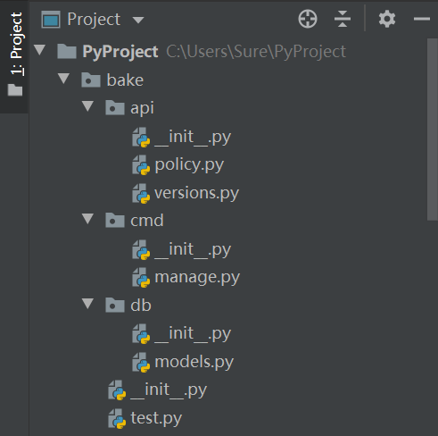
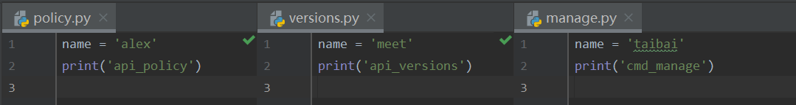

## 包

包的定义：具有 `__init__.py` 文件的文件夹就是一个包。

包的目的是用来管理模块。

包的本质就是一个模块。模块可以导入，包也可以导入。

在 Python 2 中，使用 import 导入一个包，如果包中没有 `__init__.py` 文件，会报错；

在 Python 3 中，使用 import 导入一个包，如果包中没有 `__init__.py` 文件，不会报错，但也无法正常使用。

在导入时只要使用点操作，就是在导入包。导入时，`.` 前面的必须是一个包。

我们在项目的根目录 `PyProject` 下建立一个名为 `bake` 的包，然后按照下面的目录树创建包和 `py` 文件：

```
----bake\
    |----api\
    |    |----policy.py
    |    |----versions.py
    |    |----__init__.py
    |----cmd\
    |    |----manage.py
    |    |----__init__.py
    |----db\
    |    |----models.py
    |    |----__init__.py
    |----file_tree.py
    |----test.py
    |----__init__.py
```

创建完成后是这个样子的。需要注意的是，`bake` 文件夹一定要直接放在项目的根目录 `PyProject` 下，否则接下来的导入过程可能会出问题。



在文件 `policy.py` 中写入代码：

```python
name = 'alex'
print('api_policy')
```

在文件 `versions.py` 中写入代码：

```python
name = 'meet'
print('api_versions')
```

在文件 `manage.py` 中写入代码：

```python
neme = 'taibai'
print('cmd_manage')
```

也就是这个样子：



导入包可以使用相对路径和绝对路径两种方法：
绝对路径：`bake1.api.policy` 从最外层的开始查找
相对路径：取决于在哪个文件中启动，`.` 代表当前目录

导入包的方式最基本的结构为：

```python
import 包.包.模块
```

比如，我们想在 `test.py` 文件中导入 version 模块，并使用其中的 `name` 变量：

```python
import bake.api.versions
print(bake.api.versions.name)
```

输出的结果为：

```python
api_versions
meet
```

我们成功导入了包，也成功调用了包中的变量。但是每次使用的时候都要使用长长的绝对路径，十分麻烦。这时，我们可以给导入的包取一个别名，来方便调用：

```python
import bake.api.policy as p
print(p.name)
```

输出的结果为：

```python
api_policy
alex
```

我们也可以通过 from 方法来导入包中指定的函数或变量，而不是将包整体导入。其基本结构为：

```python
from 包.包.模块 import 函数，变量，*
```

比如，我们要导入模块 `manage` 中的变量 `name`，就可以这样：

```python
from bake.cmd.manage import name
print(name)
```

输出的结果为：

```python
cmd_manage
taibai
```

我们说过，包的本质也是模块，但是如果我们直接导入包，却发现无法直接调用其中的模块中的变量：

```python
from bake import api
print(api.policy.name)
```

程序报错，报错信息为：

```python
Traceback (most recent call last):
  File "C:/Users/Sure/PyProject/bake/test.py", line 21, in <module>
    print(api.policy.name)
AttributeError: module 'bake.api' has no attribute 'policy'
```

这是因为我们没有指明 api 包所需要导入的文件。这时，我们就要在 api 包下的 `__init__.py` 文件中指明导入的文件：

```python
from .policy import *
```

这样，程序就可以顺利运行啦。

如果我们直接在 test 文件中导入 bake 中的所有模块中的函数和变量，就可以这样：

```python
from bake import *
print(name)
```

输出的结果为：

```python
api_policy
api_versions
cmd_manage
taibai
```

因为变量名都命名为 `name`，相互覆盖之后，只剩下了 taibai。

总结一下，当程序运行到 `from bake import *` 命令时，一共经历两个步骤：

1. 先在 bake 的 `__init__.py` 中导入 bake 下的所有的包
2. 在 bake 下的所有包中的 `__init__.py` 中导入每个包下的模块

模块与包的关系为：

- 模块 - 软件开发规范 - 包
- 按照软件开发规范创建包，包中存放模块。