## Python 的版本选择与安装细节

[TOC]

### Python 版本选择

因程序开发者未必及时更新 Python 程序，安装新版本 Python 可能会遇到兼容性问题，故而不建议安装最新版本的 Python。

- Win 10 安装 Python 3.6.8（[官方下载链接](https://www.python.org/ftp/python/3.6.8/python-3.6.8-amd64.exe)）
- Win 7 & Win 8 安装 Python 3.5.0（[官方下载链接](https://www.python.org/ftp/python/3.5.0/python-3.5.0-amd64.exe)）
- 在 Win10 以下版本的 Windows 操作系统中安装新版本的 Python 需要安装额外的系统补丁
- 360 可解决 Win 7 不能顺利安装高版本（3.6.8 及以后）Python 的问题

下载前确定电脑操作系统的位数，64 位操作系统安装 64 位的 Python 程序，32 位操作系统安装 32 位的 Python 程序。

### Python 安装细节

双击下载好的安装包，出现 Python 的安装程序。注意勾选 `Add Python 3.6 to PATH` 的复选框，这个意思是把 Python 的安装路径加入到 `环境变量` 中。然后点击 `Customize installation`。

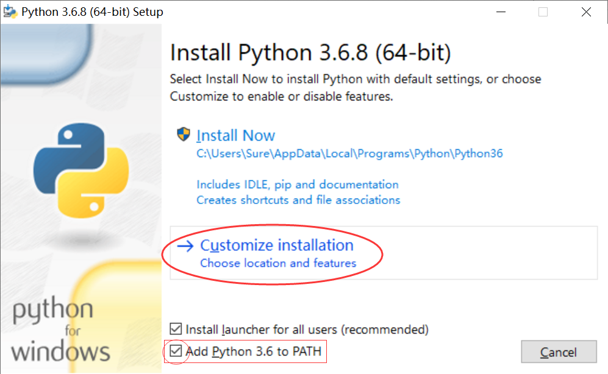

这里一切按照默认即可，直接点击 `Next`。

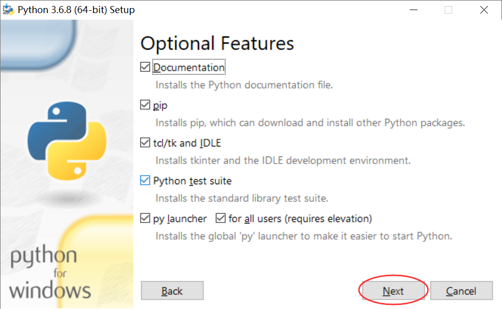

勾选最上面的 `Install for all users` 复选框，建议把安装路径设置为 `C:\Python36`。短路径名能方便以后操作。然后点击 `Install` 开始安装。

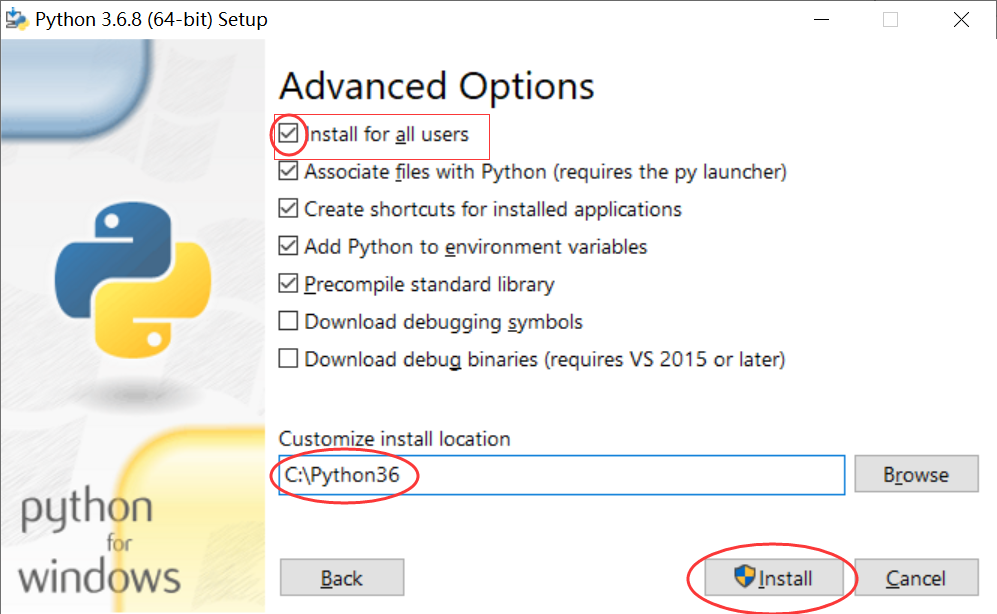

当最后出现这个界面的时候，恭喜你，安装成功了。

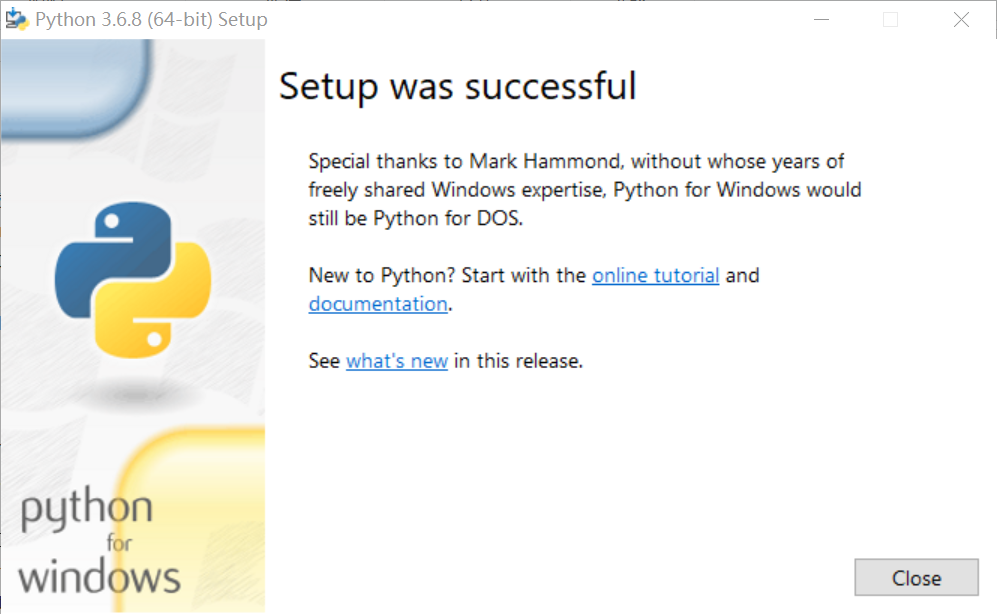

### 验证是否安装成功

`Win + R` 打开 `运行`，输入 `cmd`，点击 `确定`。

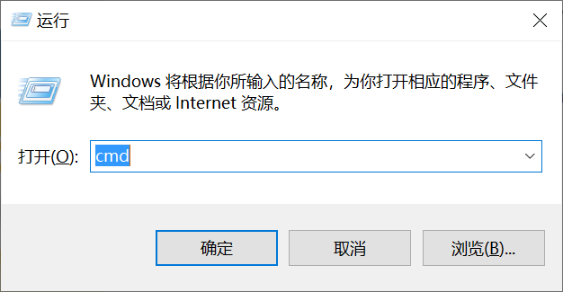

在命令行中输入 `python`，如果安装成功，界面会是这个样子的。

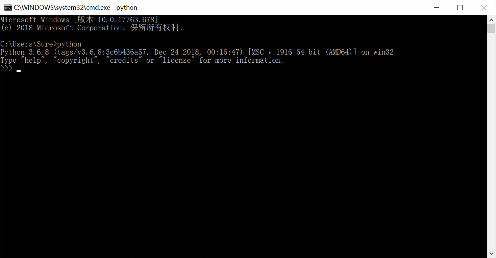

输入第一行代码 `print ("hello world!")`，按下 `回车` 键。

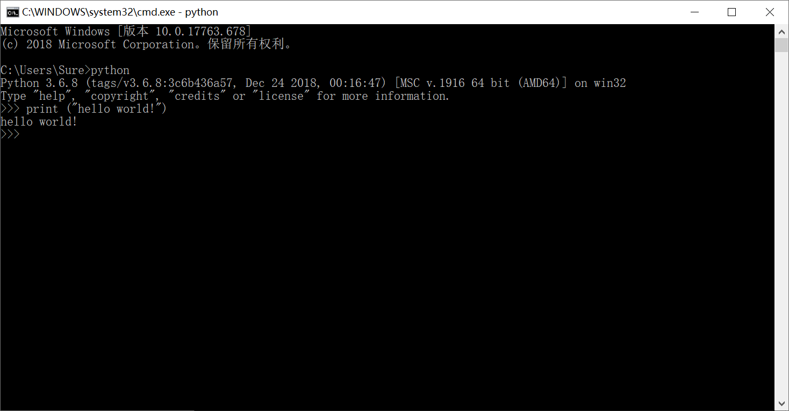

就完成了我们的第一个 Python 命令。输入 `exit()`，退出 Python。

### 在命令行中用 Python 运行 `.py` 文件

新建一个文本文档，命名为 `今天作业.txt`。

用 `记事本` 打开文件，输入 `print("刘硕 " * 100)`，保存然后关闭。

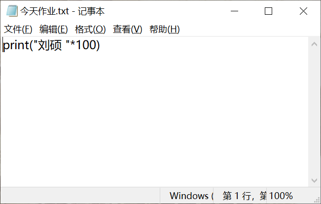

将文件的后缀名改为 `py`。

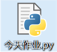

在命令行中输入`python C:\Users\Sure\Desktop\今天作业.py`。其中，`C:\Users\Sure\Desktop` 是文件的路径名。敲下 `回车` 键，就可以发现代码顺利运行啦。

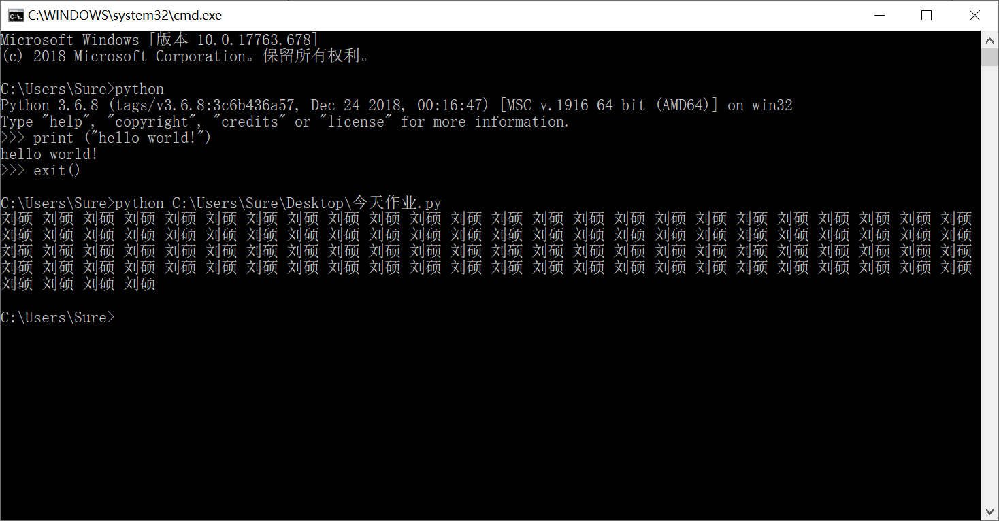

### 配置环境变量

如果在上一步骤，输入 `python C:\Users\Sure\Desktop\今天作业.py` 命令后，出现了 `'python' 不是内部或外部命令，也不是可运行的程序或批处理文件。` 的错误，意味着没有将 Python 的安装路径放在 `环境变量` 中。导致这个错误的原因很可能是在安装的第一步，忘记了勾选 `Add Python 3.6 to PATH` 前面的复选框。

可以通过在 Python 前面加入 python 安装路径的方法顺利运行 `.py` 文件，但是这种方法比较麻烦且不实用。

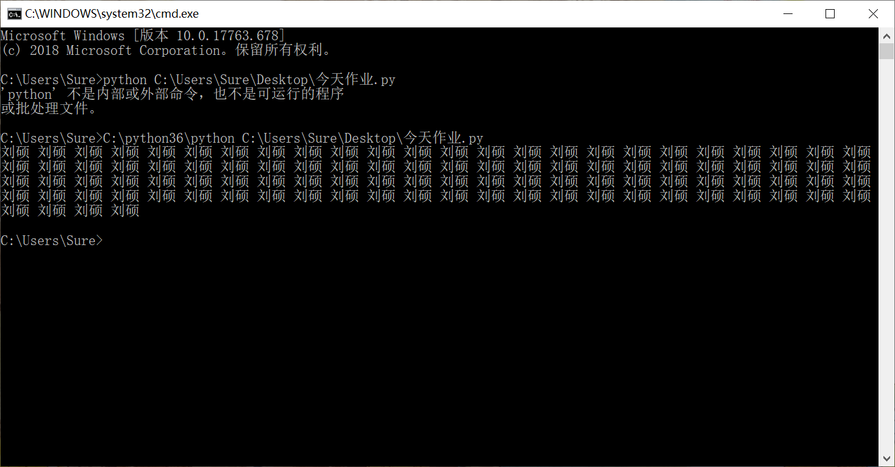

这时，就需要我们把Python的安装路径添加到`环境变量`中。

配置环境变量的方法参见： [环境变量的配置](environment-variable.md) 

重启命令行，输入`python C:\Users\Sure\Desktop\今天作业.py`，`py`文件顺利运行。

### 后缀名显示方法

如果文件后缀名默认没有显示，可以用这个方法查看后缀名： [后缀名显示方法](show-suffix.md) 

