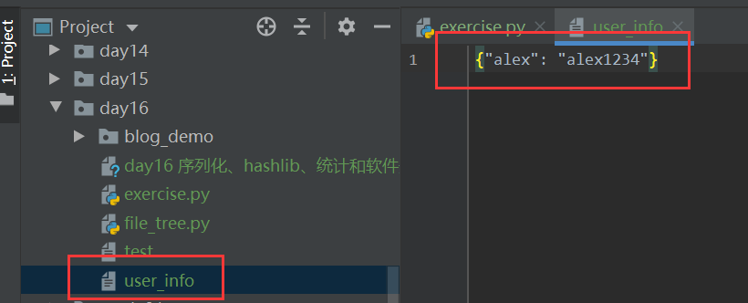
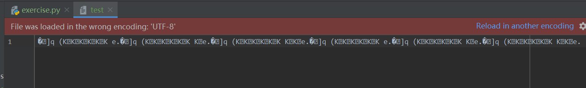

## 序列化 json 和 pickle

[TOC]

关于序列化，我们只需要掌握两个模块，四种方法。

两个模块：

1. json -- 重点，只能实现字典和列表的序列化
2. pickle -- Python 独有

四种方法：

- dump 和 load  --  用于文件写入存储
- dumps 和 loads  --  用于网络传输（网络编程）

序列化，也就是将一个数据类型转换成另一个数据类型。我们平时使用的 `list`、`dict` 等函数就是序列化的一种。

### json 模块

我们从前说过，对文件的操作都是对字符串进行操作。可是如果使用工厂函数对列表等数据和字符串相互转换会出现很大问题：

```python
lst = [1, 2, 3, 4, 5]
a = str(lst)
print(repr(a))
print(list(a))
```

输出的结果为：

```python
'[1, 2, 3, 4, 5]'
['[', '1', ',', ' ', '2', ',', ' ', '3', ',', ' ', '4', ',', ' ', '5', ']']
```

当将列表转换为字符串时，是将列表整体，包括列表元素和括号、逗号甚至空格作为整体转化成字符串。而当我们使用 `list` 函数将字符串转换为列表时，又会迭代每一个元素，我们从前的列表就变得面目全非。

我们当然能够使用 `eval` 函数将字符串形式的列表转换为可使用的列表。但我们强调过，`eval` 函数在编程过程中是禁止使用的。

这时我们就可以使用 json 实现列表和字典的序列化：

```python
import json
lst = [1, 2, 3, 4, 5]
a = json.dumps(lst)
print(a, type(a))
b = json.loads(a)
print(b, type(b))

dic = {1: 12, 2: 23}
c = json.dumps(dic)
print(c, type(c))
d = json.loads(c)
print(d, type(d))
```

输出的结果为：

```python
[1, 2, 3, 4, 5] <class 'str'>
[1, 2, 3, 4, 5] <class 'list'>
{"1": 12, "2": 23} <class 'str'>
{'1': 12, '2': 23} <class 'dict'>
```

需要注意的是，对于字典数据，如果它的键是数字，经过 json 转换之后，将会变成字符串。

在上面的例子中，我们用到了 `dumps` 和 `loads` 两个方法，其中：

- `dumps` 是序列化
- `loads` 是反序列化

如果需要序列化的数据中存在中文，就需要将 `dumps` 方法的 `ensure_ascii` 参数设置为 `False`，否则的话显示的中文将会是一串看不懂的字符：

```python
import json
lst = ["宝元","尚玉杰"]
a = json.dumps(lst)
b = json.dumps(lst, ensure_ascii=False)
print(a, b, sep='\n')
```

输出的结果为：

```python
["\u5b9d\u5143", "\u5c1a\u7389\u6770"]
["宝元", "尚玉杰"]
```

`dumps` 和 `loads` 方法实现的是字典和列表在程序中的序列化与反序列化。而我们有时需要在文件中进行相关操作，这就涉及到 `dump` 和 `load` 两个方法：

```python
import json
dic = {'alex': 'alex1234'}
with open('user_info', 'a', encoding='utf-8') as f:
    json.dump(dic, f)
    f.flush()
with open('user_info', 'r', encoding='utf-8') as f1:
    d = json.load(f)
print(d)
```

输出的结果为：

```python
{'alex': 'alex1234'}
```

上面的代码运行完成后，在当前文件夹中，我们还能找到新创建的文件，里面有我们写入的数据。



上面这种方法只能写入一条数据，如果写入多条数据，json 就无法识别而报错。

如果需要写入多条数据，我们就要在每次写入之后加入 `\n` 换行；当下次调用时，通过循环来获取每一条内容：

```python
import json
dic = {"alex":"alex1234"}
with open('user_info', 'a', encoding='utf-8') as f:
    for i in range(3):
        json.dump(dic, f)
        f.write('\n')
        f.flush()
with open('user_info', 'r', encoding='utf-8') as f1:
    for j in f1:
        print(json.loads(j), type(json.loads(j)))    # 这里我们是对字符串操作，而不是文件，所以需要使用loads而不是load
```

输出的结果为：

```python
{'alex': 'alex1234'} <class 'dict'>
{'alex': 'alex1234'} <class 'dict'>
{'alex': 'alex1234'} <class 'dict'>
```

### pickle 模块

`pickle` 可以将 Python 中大多数的对象进行序列化（不支持 lambda）。与 `json` 不同的是，`pickle` 是以字节的形式存储数据，而不是字符串。`pickle` 的用法和 `json` 几乎完全一致：

```python
import pickle
def func():
    print(111)
a = pickle.dumps(func)
print(a, type(a))
b = pickle.loads(a)
print(b, type(b))
b()
```

输出的结果为：

```python
b'\x80\x03c__main__\nfunc\nq\x00.' <class 'bytes'>
<function func at 0x0000027B4D4D1EA0> <class 'function'>
111
```

与 `json` 一样，`pickle` 也是使用 `dump` 和 `load` 实现对文件进行操作。所不同的是，`pickle` 不需要额外的换行操作就可以进行对文件进行多次写如何读取：

```python
import pickle
lst = [1, 2, 3, 4, 5]
for i in range(3):
    lst.append(i)
    with open('test', 'ab') as f:    # pickle写入的是字节，所以需要使用带b的方法
        pickle.dump(lst, f)
        f.flush()

with open('test', 'rb') as f1:
    for i in range(3):
        a = pickle.load(f1)
        print(a)
```

输出的结果为：

```python
[1, 2, 3, 4, 5, 0]
[1, 2, 3, 4, 5, 0, 1]
[1, 2, 3, 4, 5, 0, 1, 2]
```

虽然生成的文件仅显示一行，但是不必担心，这只是编码不同造成的，pickle 时能识别出其中的换行标识的。千万不可以修改文件中的任何字符，否则文件将不能被读取。



### `json` 和 `pickle` 的区别

- `json` 序列化之后得到的是字符串，仅支持字典和字符串，应用范围极广，各种编程语言几乎都能支持 `json`
- `pickle` 序列化之后得到的是字节，支持 Python 中大部分对象，仅被 Python 支持
- pickle 序列化不会改变字典键的数据类型；json 序列化，如果键是数字，会转为字符串