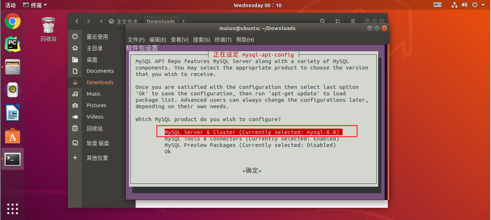

# Ubuntu 系统安装和 Python 开发环境配置

[TOC]

## Ubuntu 系统的安装

Ubuntu 可用 [淘宝镜像站](https://developer.aliyun.com/mirror/) 下载，下载链接为：https://mirrors.aliyun.com/ubuntu-releases/18.04/ubuntu-18.04.3-desktop-amd64.iso 。这是 18.04 版本的，也可以去下载其他版本。

在 VMware 中新建虚拟机：


.png)


指定当前虚拟机使用的系统镜像：


设置系统的登录账号密码，设置完成以后一定要记住。


一直等待，系统初始化安装，直到出现下方界面：


输入前面设置的密码，点击 `Sign In`。


点击右上角绿色按钮，一路 next 即可。


点击 `Install Now`，下载最新版本的 Ubuntu 软件库。


输入登录密码。


选择稍后重启 `Restart Later`。


## 更改系统语言为中文

点击屏幕右上角设置按钮


选择地区和语言设置 `Region & Language`。

然后选择 语言安装管理 `Manage Installed Languages` 。


点击 `Install`，下载安装语言包，必须联网。

下载安装语言包需要管理员授权，所以还是输入登录密码。


点击 `Install/Remove Languages...`，安装语言包


在弹出窗口中，找到`Chinese(simplified)` 和 `Englis`h，勾选上再点击 `Apply`。


等待下载完成。


在已经下载完成的语言列表中找到汉语（中国），并把它拖到语言列表的最上方位置，并点选 `Apply System-Wide`，最后点击 `Close` 关闭当前窗口。


重启 Ubuntu。


重启后的 Ubuntu，会弹出提示将标准文件夹更新到当前语言吗？选择保留旧的名称 。


## 更改系统时区为亚洲/上海

```bash
sudo tzselect
# 选项Asia  4
# 选项China 9
# 选项Beijing 1
# 选项Yes     1
```


```bash
# 复制时区文件
sudo cp /usr/share/zoneinfo/Asia/Shanghai  /etc/localtime
# 安装ntp时间服务器
sudo apt install ntpdate
# 同步ntp时间服务器
sudo ntpdate time.windows.com
# 将系统时间与网络同步
sudo ntpdate cn.pool.ntp.org
# 将时间写入硬件
sudo hwclock --systohc

# 重启Ubuntu
```

## 更换国内下载源

更换国内源的道理不多说了，就是为了快。

直接将当前操作系统里面的源文件复制备份，然后开始修改：

```bash
sudo cp /etc/apt/sources.list /etc/apt/sources.list.bak
sudo vim /etc/apt/sources.list
```

清空原文档里面的内容，把下面的阿里源信息粘贴进去。

```
deb http://mirrors.aliyun.com/ubuntu/ bionic main restricted universe multiverse
deb http://mirrors.aliyun.com/ubuntu/ bionic-security main restricted universe multiverse
deb http://mirrors.aliyun.com/ubuntu/ bionic-updates main restricted universe multiverse
deb http://mirrors.aliyun.com/ubuntu/ bionic-proposed main restricted universe multiverse
deb http://mirrors.aliyun.com/ubuntu/ bionic-backports main restricted universe multiverse
deb-src http://mirrors.aliyun.com/ubuntu/ bionic main restricted universe multiverse
deb-src http://mirrors.aliyun.com/ubuntu/ bionic-security main restricted universe multiverse
deb-src http://mirrors.aliyun.com/ubuntu/ bionic-updates main restricted universe multiverse
deb-src http://mirrors.aliyun.com/ubuntu/ bionic-proposed main restricted universe multiverse
deb-src http://mirrors.aliyun.com/ubuntu/ bionic-backports main restricted universe multiverse
```

保存当前文档，继续执行更新源操作

```bash
sudo apt-get update
```

## 调整分辨率

> 注：本方法开机后还是需要手动指定分辨率，暂未发现好的解决方案
>
> 注2：似乎通过图形界面设置分辨率即可，开机后便不需要再次设置分辨率了
>
> 注3：通过设置

虚拟机中的 Ubuntu 一半都会随着窗口的变大或变小，自动适应。即便不适应，也可以通过 `设置 -> 设备 -> 显示` 很简单地调整分辨率。

但是偶尔，虚拟机有不听话的时候，窗口很小。而可供选择的分辨率又没有适合自己的，就可以通过下面的步骤自定义一个屏幕分辨率。

终端输入命令，查看当前可供选择的屏幕分辨率：

```
xrandr
```


如果列表中有你满意的分辨率，那么可以直接通过命令，修改分辨率，比如（我不知道中间的是不是 x，最好还是直接复制粘贴人家打印出来的东西）：

```bash
xrandr --size 1920x1200
```

若没有，操作就要麻烦一点了。

首先，查看一下你想要的分辨率的相关信息，比如我想查看 1920x1080 分辨率，刷新频率 60 赫兹的各项参数：

```bash
moluo@ubuntu:~$ cvt 1920 1080 60
# 1920x1080 59.96 Hz (CVT 2.07M9) hsync: 67.16 kHz; pclk: 173.00 MHz
Modeline "1920x1080_60.00"  173.00  1920 2048 2248 2576  1080 1083 1088 1120 -hsync +vsync
```

上面输出的数据中，Modline 后面的内容是我们需要的显示信息。

将这个信息配置到系统中，使用命令：

```bash
xrandr --newmode "1920x1080_60.00"  173.00  1920 2048 2248 2576  1080 1083 1088 1120 -hsync +vsync
```

再次查看系统支持的分辨率模式，发现新模式以及加入：


不过虽然新的显示模式已经有了，但并没有配置在我们的显示器（Virtual1，注意区分大小写）中。所以，下一步就要把显示模式适配到显示器上（同上，中间的 x 最好复制粘贴）：

```bash
xrandr --addmode Virtual1 1920x1080_60.00
```

这是即可发现，新的分辨率已经适配到我们的系统中。当然，这个过程可能会导致屏幕分辨率变化。

```bash
moluo@ubuntu:~$ xrandr
Screen 0: minimum 1 x 1, current 800 x 600, maximum 16384 x 16384
Virtual1 connected primary 800x600+0+0 (normal left inverted right x axis y axis) 0mm x 0mm
   800x600       60.00*+  60.32  
   2560x1600     59.99  
   1920x1440     60.00  
   1856x1392     60.00  
   1792x1344     60.00  
   1920x1200     59.88  
   1600x1200     60.00  
   1680x1050     59.95  
   1400x1050     59.98  
   1280x1024     60.02  
   1440x900      59.89  
   1280x960      60.00  
   1360x768      60.02  
   1280x800      59.81  
   1152x864      75.00  
   1280x768      59.87  
   1024x768      60.00  
   640x480       59.94  
   1920x1080_60.00  59.96  
Virtual2 disconnected (normal left inverted right x axis y axis)
Virtual3 disconnected (normal left inverted right x axis y axis)
Virtual4 disconnected (normal left inverted right x axis y axis)
Virtual5 disconnected (normal left inverted right x axis y axis)
Virtual6 disconnected (normal left inverted right x axis y axis)
Virtual7 disconnected (normal left inverted right x axis y axis)
Virtual8 disconnected (normal left inverted right x axis y axis)
```

虽然使用下面命令，可应用新的显示模式。但且住，不要这样改动分辨率，因为这样改动的话，下次重启，还是不会应用到新的分辨率。

```bash
xrandr -s 1920x1080_60.00
```

> awsl，别用下面的法子了，还是用命令改吧。用下面的方法改分辨率可能会开机黑屏。如果一定要测试，最好给虚拟机拍快照，给自己多留一线生机。至少重要文件要备份了。

为了让系统每次启动时，都自动使用这个分辨率，可以在 `~/.xprofile` 文件中加上这样几行代码：

```bash
# 下面这个行代码是人家说的，我测试了，没有用，可能是我的环境问题。没删，不必加
# xrandr --output Virtual1 --mode 1920x1080_60.00

# 从下面开始，把这两行没注释的代码放进去就成
xrandr --newmode "1920x1080_60.00"  173.00  1920 2048 2248 2576  1080 1083 1088 1120 -hsync +vsync
xrandr --addmode Virtual1 1920x1080_60.00
```

接下来，一定要用系统图形化的设置来更改分辨率，因为如果用命令行修改的话，下次启动不生效，还要手动配置（存疑，可能跟我的环境有关系）：


## 安装基本使用软件

### Vim

```bash
sudo apt install vim
```


### ssh

一般 Ubuntu 都会默认安装 openssh-client，但是没有安装 openssh-server。而如果我们要远程 ssh 连接到 Ubuntu，就要 Ubuntu 作为 ssh 服务器才行。

所以，首先要安装 ssh 服务器：

```bash
sudo apt install openssh-server
```

如果需要，也可以再安装一个 ssh 客户端：

```bash
sudo apt install openssh-client
```

使用命令查看 ssh 安装状态：

```bash
dpkg -l | grep ssh
```

若有看到 openssh-server，说明安装成功。 


配置 ssh 客户端，去掉 `PasswordAuthentication yes` 前面用于注释的 # 号，保存退出。

```bash
sudo vim /etc/ssh/ssh_config
```

配置 ssh 服务端，把 `PermitRootLogin prohibit-password` 取消注释，并将其改成 `PermitRootLogin yes`，允许 root 用户以任何认证方式登录，保存后退出。同时，也可以在这里设置 ssh 监听端口，默认为 22。

```bash
sudo vim /etc/ssh/sshd_config
```

常用命令：

```bash
sudo /etc/init.d/ssh start     # 启动ssh服务
sudo /etc/init.d/ssh restart   # 重启ssh服务
sudo /etc/init.d/ssh stop      # 关闭ssh服务

ps -ef | grep sshd    # 查看ssh服务是否运行
```

### Chrome

使用 Ubuntu 内置的火狐浏览器打开谷歌浏览器的下载地址：

<http://www.google.cn/intl/zh-CN/chrome/browser/desktop/index.html>


选择 Ubuntu 版本


点选 `保存文件`，默认会保存在用户家目录下的 Downloads 目录下


可以选择把图标拉动到左侧收藏栏中，方便快速打开。


### 搜狗输入法

访问搜狗输入法 For Linux：https://pinyin.sogou.com/linux/?r=pinyin


关闭窗口后，重启 Ubuntu。


### PyCharm

#### 方法一：直接从 Ubuntu 软件商店下载


#### 方法二：使用官网下载安装

官网地址：https://www.jetbrains.com/pycharm/download/#section=linux

下载 Linux 系统下的专业版：


下载的是 `tar.gz` 格式的压缩包。拖放到 Ubuntu 虚拟机中，解压到指定目录。进入到解压好的文件中的 bin 目录，运行命令启动 PyCharm：

```bash
sure@sure-virtual-machine:/opt/pycharm-2020.2.1/bin$ pwd
/opt/pycharm-2020.2.1/bin
sure@sure-virtual-machine:/opt/pycharm-2020.2.1/bin$ sh ./pycharm.sh
```

然后就跟 Windows 下安装 PyCharm 基本一致了。

我们当然不希望每次都通过命令行启动 PyCharm，所以需要创建一个图标快捷方式。

进入 `/usr/share/applications` 路径，创建文件 `PyCharm.desktop`：

```bash
sure@sure-virtual-machine:~$ cd /usr/share/applications
sure@sure-virtual-machine:/usr/share/applications$ sudo vim PyCharm.desktop
```

在文件中写入如下内容，注意把 Exec 和 Icon 的路径替换为你解压好的 PyCharm 文件所在的位置：

```ini
[Desktop Entry]
Type = Application      
Name = Pycharm
GenericName = Pycharm
Comment = Pycharm:The Python IDE
Exec = "your_dir/pycharm-2020.2.1/bin/pycharm.sh" %f
Icon = your_dir/pycharm-2020.2.1/bin/pycharm.png
Terminal = pycharm
Categories = Pycharm;
```

合理使用地址：<http://idea.lanyus.com/>

第一步 将：0.0.0.0 https://account.jetbrains.com:443 加入 hosts，hosts 文件在 `/etc/hosts`
第二步 打开终端，输入`sudo /etc/init.d/networking restart `，刷新 dns 缓存
第三步 在 Activation code 输入 lanyu 序列号

```python
56ZS5PQ1RF-eyJsaWNlbnNlSWQiOiI1NlpTNVBRMVJGIiwibGljZW5zZWVOYW1lIjoi5q2j54mI5o6I5p2DIC4iLCJhc3NpZ25lZU5hbWUiOiIiLCJhc3NpZ25lZUVtYWlsIjoiIiwibGljZW5zZVJlc3RyaWN0aW9uIjoiRm9yIGVkdWNhdGlvbmFsIHVzZSBvbmx5IiwiY2hlY2tDb25jdXJyZW50VXNlIjpmYWxzZSwicHJvZHVjdHMiOlt7ImNvZGUiOiJJSSIsInBhaWRVcFRvIjoiMjAyMC0wMy0xMCJ9LHsiY29kZSI6IkFDIiwicGFpZFVwVG8iOiIyMDIwLTAzLTEwIn0seyJjb2RlIjoiRFBOIiwicGFpZFVwVG8iOiIyMDIwLTAzLTEwIn0seyJjb2RlIjoiUFMiLCJwYWlkVXBUbyI6IjIwMjAtMDMtMTAifSx7ImNvZGUiOiJHTyIsInBhaWRVcFRvIjoiMjAyMC0wMy0xMCJ9LHsiY29kZSI6IkRNIiwicGFpZFVwVG8iOiIyMDIwLTAzLTEwIn0seyJjb2RlIjoiQ0wiLCJwYWlkVXBUbyI6IjIwMjAtMDMtMTAifSx7ImNvZGUiOiJSUzAiLCJwYWlkVXBUbyI6IjIwMjAtMDMtMTAifSx7ImNvZGUiOiJSQyIsInBhaWRVcFRvIjoiMjAyMC0wMy0xMCJ9LHsiY29kZSI6IlJEIiwicGFpZFVwVG8iOiIyMDIwLTAzLTEwIn0seyJjb2RlIjoiUEMiLCJwYWlkVXBUbyI6IjIwMjAtMDMtMTAifSx7ImNvZGUiOiJSTSIsInBhaWRVcFRvIjoiMjAyMC0wMy0xMCJ9LHsiY29kZSI6IldTIiwicGFpZFVwVG8iOiIyMDIwLTAzLTEwIn0seyJjb2RlIjoiREIiLCJwYWlkVXBUbyI6IjIwMjAtMDMtMTAifSx7ImNvZGUiOiJEQyIsInBhaWRVcFRvIjoiMjAyMC0wMy0xMCJ9LHsiY29kZSI6IlJTVSIsInBhaWRVcFRvIjoiMjAyMC0wMy0xMCJ9XSwiaGFzaCI6IjEyMjkxNDk4LzAiLCJncmFjZVBlcmlvZERheXMiOjAsImF1dG9Qcm9sb25nYXRlZCI6ZmFsc2UsImlzQXV0b1Byb2xvbmdhdGVkIjpmYWxzZX0=-SYSsDcgL1WJmHnsiGaHUWbaZLPIe2oI3QiIneDtaIbh/SZOqu63G7RGudSjf3ssPb1zxroMti/bK9II1ugHz/nTjw31Uah7D0HqeaCO7Zc0q9BeHysiWmBZ+8bABs5vr25GgIa5pO7CJhL7RitXQbWpAajrMBAeZ2En3wCgNwT6D6hNmiMlhXsWgwkw2OKnyHZ2dl8yEL+oV5SW14t7bdjYGKQrYjSd4+2zc4FnaX88yLnGNO9B3U6G+BuM37pxS5MjHrkHqMTK8W3I66mIj6IB6dYXD5nvKKO1OZREBAr6LV0BqRYSbuJKFhZ8nd6YDG20GvW6leimv0rHVBFmA0w==-MIIElTCCAn2gAwIBAgIBCTANBgkqhkiG9w0BAQsFADAYMRYwFAYDVQQDDA1KZXRQcm9maWxlIENBMB4XDTE4MTEwMTEyMjk0NloXDTIwMTEwMjEyMjk0NlowaDELMAkGA1UEBhMCQ1oxDjAMBgNVBAgMBU51c2xlMQ8wDQYDVQQHDAZQcmFndWUxGTAXBgNVBAoMEEpldEJyYWlucyBzLnIuby4xHTAbBgNVBAMMFHByb2QzeS1mcm9tLTIwMTgxMTAxMIIBIjANBgkqhkiG9w0BAQEFAAOCAQ8AMIIBCgKCAQEAxcQkq+zdxlR2mmRYBPzGbUNdMN6OaXiXzxIWtMEkrJMO/5oUfQJbLLuMSMK0QHFmaI37WShyxZcfRCidwXjot4zmNBKnlyHodDij/78TmVqFl8nOeD5+07B8VEaIu7c3E1N+e1doC6wht4I4+IEmtsPAdoaj5WCQVQbrI8KeT8M9VcBIWX7fD0fhexfg3ZRt0xqwMcXGNp3DdJHiO0rCdU+Itv7EmtnSVq9jBG1usMSFvMowR25mju2JcPFp1+I4ZI+FqgR8gyG8oiNDyNEoAbsR3lOpI7grUYSvkB/xVy/VoklPCK2h0f0GJxFjnye8NT1PAywoyl7RmiAVRE/EKwIDAQABo4GZMIGWMAkGA1UdEwQCMAAwHQYDVR0OBBYEFGEpG9oZGcfLMGNBkY7SgHiMGgTcMEgGA1UdIwRBMD+AFKOetkhnQhI2Qb1t4Lm0oFKLl/GzoRykGjAYMRYwFAYDVQQDDA1KZXRQcm9maWxlIENBggkA0myxg7KDeeEwEwYDVR0lBAwwCgYIKwYBBQUHAwEwCwYDVR0PBAQDAgWgMA0GCSqGSIb3DQEBCwUAA4ICAQAF8uc+YJOHHwOFcPzmbjcxNDuGoOUIP+2h1R75Lecswb7ru2LWWSUMtXVKQzChLNPn/72W0k+oI056tgiwuG7M49LXp4zQVlQnFmWU1wwGvVhq5R63Rpjx1zjGUhcXgayu7+9zMUW596Lbomsg8qVve6euqsrFicYkIIuUu4zYPndJwfe0YkS5nY72SHnNdbPhEnN8wcB2Kz+OIG0lih3yz5EqFhld03bGp222ZQCIghCTVL6QBNadGsiN/lWLl4JdR3lJkZzlpFdiHijoVRdWeSWqM4y0t23c92HXKrgppoSV18XMxrWVdoSM3nuMHwxGhFyde05OdDtLpCv+jlWf5REAHHA201pAU6bJSZINyHDUTB+Beo28rRXSwSh3OUIvYwKNVeoBY+KwOJ7WnuTCUq1meE6GkKc4D/cXmgpOyW/1SmBz3XjVIi/zprZ0zf3qH5mkphtg6ksjKgKjmx1cXfZAAX6wcDBNaCL+Ortep1Dh8xDUbqbBVNBL4jbiL3i3xsfNiyJgaZ5sX7i8tmStEpLbPwvHcByuf59qJhV/bZOl8KqJBETCDJcY6O2aqhTUy+9x93ThKs1GKrRPePrWPluud7ttlgtRveit/pcBrnQcXOl1rHq7ByB8CFAxNotRUYL9IF5n3wJOgkPojMy6jetQA5Ogc8Sm7RG6vg1yow==
```

Pycharm 新版本在 Ubuntu 下面和搜索的底层有冲突，可能需要 revert pycharm的版本：

```shell
snap revert pycharm-professional
```


### Sublimetext 3


### pip 和 virtualenv

默认情况下 Ubuntu18.04 版本已经内置 Python3.6 了。但是没有内置 pip，所以先安装 pip：

```bash
sudo apt install python3-pip
```


使用国内 pip 源：

```bash
mkdir ~/.pip
sudo vim ~/.pip/pip.conf
```

向其中写入如下内容：

```ini
[global]
index-url = https://pypi.tuna.tsinghua.edu.cn/simple
[install]
trusted-host=mirrors.aliyun.com
```

安装虚拟环境：

```shell
pip3 install virtualenv
pip3 install virtualenvwrapper
```


安装完成了以后，接下来需要配置系统环境变量：

```bash
mkdir $HOME/.virtualenvs
```

执行命令，打开并编辑 `~/.bashrc`：

```bash
vim  ~/.bashrc
```


文件末尾添加以下几行代码，`:wq` 保存退出：

```shell
export WORKON_HOME=$HOME/.virtualenvs
export VIRTUALENVWRAPPER_PYTHON=/usr/bin/python3
source ~/.local/bin/virtualenvwrapper.sh
```


刷新配置文件：

```bash
source ~/.bashrc
```


最后测试是否安装成功

```
workon
mkvirtualenv
```


如果出现上面的错误，是因为 virtualenv 这个基础依赖包被安装在默认 Python 目录下，做一个 virtualenv 的软连接到 `/usr/bin` 中给 Python 3 调用即可。

首先还是用 find 找到 virtualenv 的位置

```shell
sudo find / -name "virtualenv"
```


创建软连接

```bash
sudo ln -s /home/moluo/.local/bin/virtualenv /usr/bin/virtualenv
```

注意：`/home/moluo/.local/bin/virtualenv` 根据前面 find 查找出来的结果而定

解决上面问题以后，再次执行就成功了。


### MySQL

通过从官方提供的 `mysql-apt-config.deb` 包进行 APT 源设置。

MySQL 下载地址：https://dev.mysql.com/downloads/mysql/


APT 源下载地址：https://dev.mysql.com/downloads/repo/apt/


下载完成以后，默认 apt 源保存在了 Downloads 目录下：


通过终端切换目录到 Downloads 目录下执行一下命令：

```bash
cd Downloads/
sudo dpkg -i mysql-apt-config_0.8.12-1_all.deb 
```





按下方向键选择 OK 回车即可。


完成后运行更新命令：

```shell
sudo apt-get update
```


安装 MySQL：

```shell
sudo apt-get install mysql-server
```


设置 root 账号的登录密码：


经过上面操作，就完成了数据库的安装和配置。


### navicat

从网盘上面下载navicat破解版压缩包到ubuntu

```
链接: https://pan.baidu.com/s/1VcrFp3dNgdiyGo4TFT6Wiw 
提取码: 39yt
```


双击压缩包，并把内部文件拖放到桌面上


进入 navicat 目录，在终端打开输入以下命令：

```shell
./start_navicat
```


点击安装 Mono 和 Gecko：


把桌面上解压出来的 navicat 目录复制到 `/opt` 目录下。桌面的删除即可。

```
sudo cp ~/Desktop/navicat120_premium_cs_x64  /opt -r
```


在 `/usr/share/applications` 目录下创建 navicat 的快捷方式文件，执行以下代码：

```bash
cd /usr/share/applications
sudo vim navicat.desktop
```


文件代码如下，`:wq` 保存退出。

```bash
[Desktop Entry]
Encoding=UTF-8
Name=navicat
Comment=The Smarter Way to manage dadabase
Exec=/opt/navicat120_premium_cs_x64/start_navicat
Icon=/opt/navicat120_premium_cs_x64/navicat.png
Categories=Application;Database;MySQL;navicat
Version=1.0
Type=Application
Terminal=0
```


接下来在应用程序中搜索 `navicat` 并设置到收藏列表中。


### Postman

从官网下载 Postman 软件包，官网地址：[https://www.getpostman.com/downloads/](https://www.getpostman.com/downloads/)


安装 Postman 运行的依赖包

```bash
sudo apt-get install libgconf-2-4
sudo apt-get install libcanberra-gtk-module
```


把下载回来的 Postman 从 `Downloads` 目录中解压并剪切到 `/opt` 目录下

```bash
cd ~/Downloads
sudo tar -zxf Postman-linux-x64-7.0.7.tar.gz
sudo mv Postman /opt
```


把官方上面的 logo 图片下载回来，。并保存到软件目录 `/opt/Postman` 下。


创建桌面快捷方式，创建快捷方式文件

```bash
sudo vim /usr/share/applications/postman.desktop
```

快捷方式文件代码如下，`:wq` 保存退出。

```bash
[Desktop Entry]
Encoding=UTF-8
Name=postman
Comment=用于接口测试的一个工具
Exec=/opt/Postman/Postman
Icon=/opt/Postman/postman.svg
Categories=Application;Web;MySQL;postman
Version=1.0
Type=Application
Terminal=0
```


在应用程序中搜索 `postman`，并设置到收藏夹。


### git

运行以下命令安装 git

```bash
sudo apt-get install git
```


安装完成了，可以查看下版本。


### redis

使用以下命令安装 redis

```bash
sudo apt-get install redis-server
```


配置文件地址：`/etc/redis/redis.conf`

### snap

```bash
$ sudo apt update
$ sudo apt install snapd
```

测试是否安装成功：

```bash
$ sudo snap install hello-world
hello-world 6.3 from Canonical✓ installed
$ hello-world
Hello World!
```

### RedisDesktopManager

这个可以直接在应用商店里面安装，但是因为网络原因，安装不成的话，可以尝试通过 snap 安装：

```bash
$ sudo snap install redis-desktop-manager
```

### nvm

由于 node.js 的版本一直处于不断更新中，所以我们需要一个版本管理器来更好的使用 node.js。

nvm 是一个开源的 node 版本管理器，通过它，你可以下载任意版本的 node.js，还可以在不同版本之间切换使用。

**注意：安装 nvm 之前，要确保当前机子中不存在任何版本的 node，如果有，则卸载掉。**

github：<https://github.com/creationix/nvm>

安装命令：

```bash
sudo apt-get update
sudo apt install curl
curl -o- https://raw.githubusercontent.com/creationix/nvm/v0.34.0/install.sh | bash
source ~/.bashrc
```


### node

使用 nvm 的相关命令安装 node。

```python
# 查看官方提供的可安装node版本
nvm ls-remote

# 安装执行版本的node,例如：nvm install v10.15.2
nvm install <version>

# 卸载node版本，例如：nvm uninstall v10.15.2
nvm uninstall <version>

# 查看已安装的node列表
nvm ls

# 切换node版本，例如：nvm use v10.15.2
nvm use <version>

# 设置默认版本，如果没有设置，则开机时默认node是没有启动的。
nvm alias default v10.15.2

# 查看当前使用的版本
nvm current

```


安装几个常用的 LTS 版本

```shell
nvm install v10.15.2
nvm alias default v10.15.2
```


### npm

npm（node package manager）是 nodejs 的包管理器，用于 node 插件管理（包括安装、卸载、管理依赖等）。安装了 node 以后，就自动安装了 npm（不一定是最新版本）。

官方：[https://www.npmjs.com](https://www.npmjs.com/)

文档：[https://www.npmjs.com.cn/](https://www.npmjs.com.cn/)

```shell
npm --version
```

### cnpm

默认情况下，npm 安装插件是从国外服务器下载，受网络影响大，可能出现网络异常。

通过淘宝镜像加速 npm

[http://npm.taobao.org/](http://npm.taobao.org/)

```bash
# 打印默认的 registry 地址
npm config -g get registry

# 设置淘宝镜像
npm config -g set registry https://registry.npm.taobao.org
```


### vue-cli

使用前面已经安装好的 node 版本，进行安装。注意一旦安装以后，以后这个 vue-li 最好契合当前 node 版本。也就是说，运行接下来安装的 vue-cli 时，最好运行的就是本次跑的 node 版本。如果回头切换到其他版本 node 来运行 vue-cli，有可能因为版本不兼容出现不必要的 bug。

文档：[https://cli.vuejs.org/zh/guide/installation.html](https://cli.vuejs.org/zh/guide/installation.html)

安装命令：

```bash
npm install -g @vue/cli
npm install -g @vue/cli-init  # vue2.x版本需要安装桥接工具

# 安装完成可以查看版本
vue -V

# 搭建项目
# vue2.x
vue init webpack <项目目录名>

# vue3.x
vue create <项目目录名>
```


### nginx

安装命令：

```bash
sudo apt-get install nginx
```


安装好的文件位置：

```cmd
/usr/sbin/nginx # 主程序目录

/etc/nginx # 存放配置文件目录

/usr/share/nginx # 存放静态文件目录

/etc/nginx/sites-available # 默认站点配置文件

/var/log/nginx # 存放日志目录

/var/www/html  # 默认站点根目录
```


相关操作：

```bash
# 首次启动nginx服务器
sudo /usr/sbin/nginx

# 停止nginx服务器
sudo /usr/sbin/nginx -s stop

# 重启nginx
sudo /usr/sbin/nginx -s reload
```


### Docker

更新 Ubuntu 的 apt 源,上面如果执行过可以忽略

```bash
sudo apt-get update
```

安装包允许 apt 通过 HTTPS 使用仓库

```bash
sudo apt-get install apt-transport-https ca-certificates curl software-properties-common
```


添加 Docker 官方 GPG key，网络不好的话，会报错，多执行几次即可。

```bash
curl -fsSL https://download.docker.com/linux/ubuntu/gpg | sudo apt-key add -
```

设置 Docker 稳定版仓库，网络不好的话，会报错，多执行几次即可。

```bash
sudo add-apt-repository "deb [arch=amd64] https://download.docker.com/linux/ubuntu $(lsb_release -cs) stable"
```

添加 Docker 仓库后，更新 apt 源索引,注意，这里更新的源是关于 docker 的。

```bash
sudo apt-get update
```


安装最新版 Docker CE（社区版）

```bash
sudo apt-get install docker-ce
```


检查 Docker CE 是否安装正确，hello-world 是一个打印字符串的测试镜像，docker 会自动下载

```bash
sudo docker run hello-world
```


此时 Docker 已经安装完毕。不过每次使用 Docker 都需要 sudo 权限才行，首次使用还要输入密码，很繁琐。可通过将当前用户添加到名为 docker 的用户组的方式，免除每次使用 docker 时都要敲 sudo 的限制：

```bash
sudo groupadd docker    # 创建一个 docker 用户组
sudo usermod -aG docker $USER    # 添加当前用户到 docker 用户组
```

### MongoDB

```bash
sudo apt-get install mongodb
```


安装完成以后，mongodb 是默认开机自启的。可以通过 `mongdo` 命令进入 mongodb 的控制台验证是否安装成功了：

```bash
mongo
```


启动和关闭 mongodb 命令：

```
service mongodb start
service mongodb stop
```


### Golang

Github地址：https://github.com/golang/go

Golang官方网站：https://golang.org/

Golang中文官网：https://golang.google.cn/dl/

Golang安装包下载地址：https://dl.google.com/go/go1.12.5.linux-amd64.tar.gz


注意：apt-get 也可以安装 Golang，但是安装的版本相对较低，因为 Golang 本身更新速度问题，所以我们使用手动下载安装包的方式来完成安装。


下载压缩包 `go1.12.1.linux-amd64.tar.gz`，解压到 `/usr/local/` 目录下[这个目录是官方推荐的]。

```shell
cd ~/Downloads
wget https://dl.google.com/go/go1.12.5.linux-amd64.tar.gz
sudo tar -xzf go1.12.5.linux-amd64.tar.gz -C /usr/local
```


直接在终端运行 Golang 执行文件，检查版本，看是否能正常使用。

```shell
/usr/local/go/bin/go version
```

效果如下，证明安装成功。


接下来，在 `~/.bashrc` 文件中配置 Golang 相关的环境变量。

```shell
vim  ~/.bashrc
```

在文件末尾追加如下内容，`:wq` 保存退出

```shell
export GOROOT=/usr/local/go
export PATH=$PATH:$GOROOT/bin
```


刷新环境变量

```shell
source ~/.bashrc
```


再使用`go version`检测环境变量是否生效。


开发时，很多工具代码不会全部都是由我们自己编写，这样的话实在太累了， 所以我们往往需要加载第三方类库代码到项目中调用，所以我们必须配置 `$GOPATH`，否则 go 命令不知道这些第三方代码要安装到什么位置。

`$GOPATH` 目录约定有三个子目录，在我们配置了 `$GOPATH` 以后，go 命令会在使用的时候自动帮我们生成。

- `src` 目录，存放源代码。
- `pkg` 目录，编译时生成的中间文件。
- `bin` 目录，编译后生成的可执行文件。

打开环境变量文件，进行配置。

```shell
vim  ~/.bashrc
```

把 Golang 相关配置信息，修改为：

```shell
export GOROOT=/usr/local/go
export GOPATH=$HOME/go
export PATH=$PATH:$GOROOT/bin:$GOPATH/bin
```

刷新环境变量

```shell
source ~/.bashrc
```

安装一个 beego 框架来测试一下：

```shell
go get github.com/astaxie/beego
go get github.com/beego/bee
```


没有报错，我们可以到刚才设置的 `$GOPATH` 目录下，查看：


左边是 `$GOPATH` 目录，右边是 `src` 目录，里面包含了 `beego` 框架的三个包。


### Goland

官网下载地址：https://www.jetbrains.com/go/download/#section=linux


把下载回来的压缩包进行解压。

```shell
cd ~/Downloads
wget https://download.jetbrains.com/go/goland-2019.1.3.tar.gz
tar -zxvf goland-2019.1.3.tar.gz
```


把解压出来的文件剪切到 opt 目录下，并切换工作目录到 opt，启动 goland。

```shell
sudo mv ~/Downloads/GoLand-2019.1.3 /opt
cd /opt/GoLand-2019.1.3/bin
sh goland.sh
```


参考以下网址进行激活：

http://idea.lanyus.com/


出现如下窗口，则表示激活成功！


在 `/etc/hosts` 下屏蔽网址。

```shell
sudo vim /etc/hosts
```

追加内容：

```shell
0.0.0.0 account.jetbrains.com
0.0.0.0 www.jetbrains.com
```


创建快捷方式，选择 `Tools`，`Create Desktop Entry...`


给所有用户创建快捷方式。


在应用程序中搜索 `Goland`，并鼠标右键设置到收藏夹。


### GitLab

GitLab 是一个用于仓库管理系统的开源项目，使用 Git 作为代码管理工具，并在此基础上搭建起来的 web 服务。

原版是英文的，我们这里安装中文汉化版。

GitLab 官方网站地址：https://gitlab.com/

GitLab 中文社区地址：https://gitlab.com/xhang/gitlab


```shell
cd ~/Downloads
wget https://gitlab.com/xhang/gitlab/-/archive/10-8-stable-zh/gitlab-10-8-stable-zh.tar.bz2
```


