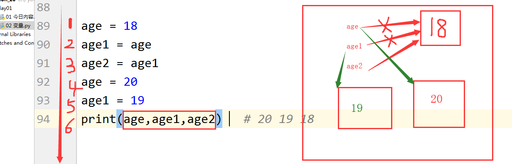

## 变量、常量和注释

[TOC]

### 变量

先介绍一个 `print` 函数，用来打印（输出）数据。

```python
>>> print(111)
111
```

变量的官方定义：将程序中运行的中间值，临时存储起来，以便再次使用。

通俗来讲，变量就是给数据起一个昵称，方便调用。

下面的是一个典型的赋值变量的语句：

```python
name = "alex"
```

其中，`alex` 是赋值给变量的值，也就是数据；`=` 代表的是赋值操作；`name` 是变量名。通过 `print(name)` 操作来使用定义的变量名：

```python
>>> name = "alex"
>>> print(name)
alex
```

变量名（其他 Python 中的标识符如函数名、类名、模块名等也要遵循这个规则）命名规范：

1. 变量名只能由数字、字母和下划线组成
2. 不能以数字开头
3. 禁止使用python中的关键字
4. 变量名要具有可描述性
5. 变量名要区分大小写
6. 不能使用中文和拼音
7. 推荐写法：
   - 驼峰体
   - 下划线（官方推荐）

以数字为开头命名变量会报错：

```python 
>>> 1a = 'alex'
  File "<stdin>", line 1
    1a = 'alex'
     ^
SyntaxError: invalid syntax
```

驼峰体和下划线命名变量示例，很显然下划线的命名法更直观些：

```python
AlexOfOldboy = 89	# 这是驼峰体
alex_of_oldboy = 89	# 这是下划线
```

Python 中的变量名是区分大小写的：

```python
>>> name = 'alex'
>>> Name = 'leo'
>>> print(name)
alex
>>> print(Name)
leo
```

Python 中的关键字：

```python
['False', 'None', 'True', 'and', 'as', 'assert', 'break', 'class', 'continue', 'def', 'del', 'elif', 'else', 'except', 'finally', 'for', 'from', 'global', 'if', 'import', 'in', 'is', 'lambda', 'nonlocal', 'not', 'or','pass', 'raise', 'return', 'try', 'while', 'with', 'yield']
```

`print` 可以打印多个内容，以逗号分隔：

```python
>>> age1 = 19
>>> print(age, age1)
18 19
```

请看下面一段赋值操作：

```python 
age = 18
age1 = age
age2 = age1
age = 20
age1 = 19
print(age, age1, age2)
```

最终打印出来的结果是：

```python
20 19 18
```

具体的赋值操作如下图所示：



第一步，在内存中开辟一块内存，把 `18` 储存在内存中。然后变量名 `age` 指向 `18` 对应的内存地址。第二步和第三步，`age1` 和 `age2` 也分别指向 `18` 的内存地址。第四步，变量名 `age` 指向 `20` 对应的内存地址，同时不再指向 `18`。第五步，变量名 `age1` 指向 `19` 对应的内存地址，同时不再指向 `18`。最终的结果是，`age2` 指向 `18`，`age1` 指向 `19`，`age` 指向 `20`。

### 常量

在 Python 中，没有严格意义的常量。大家约定俗成的是，变量名大写的变量就被视为常量，在程序执行过程中一般不会被轻易修改。例如：

```python
ID = 110120130140150
ID = "123123213"    # 不建议在程序执行过程中随意修改
```

变量与常量的应用场景：

- 变量用于我们后期开发使用
- 常量用于配置文件中

### 注释

注释的作用是给一些晦涩难懂的代码进行标注或解释。被注释的代码不会被执行。

Python 中的注释分为两种：

- 单行注释（当行注释）：用 `#` 开头表示
- 多行注释：用三对 `“ ”` 或 `‘ ’` 包裹，可以换行

具体示例为：

```python
# 这个是单行注释的示例
# 换行之后要在开头加一个#

"""
窗前明月光,
玻璃好上霜.
要不及时擦,
整不好就脏.
"""
```
