## Visual Studio Code Python 环境部署

### 简单说两句

一直以来都在用 PyCharm，但是随着学生身份的消失，不能合法免费使用了。而社区版本的 PyCharm 功能又太不完善。当然，这些还不是主要问题，因为 PyCharm 太好用，这些都不是阻碍我继续使用 PyCharm 的理由。

现在遇到的问题是，电脑配置太低，虚拟机开着 Ubuntu，里面跑两个 PyCharm 很快就吃不消了。看着进度条一卡一卡的，十分闹心。

一直以来就听说 VS Code 这东西靠谱，今天开始尝试这转移到这里。走一步是一步吧。

### 安装客户端和插件

下载链接：https://code.visualstudio.com/Download

安装的话都没啥好说的，一顿下一步，默认来就行。

然后就是插件。VS Code 一开始白纸一张，能做的事比较有限。我们要安装插件，完善功能。

VS Code 默认是英文的，安装中文插件就能变成中文界面。

安装很容易，点击左边的插件按钮，搜索 Chinese 就能找到，然后点绿色的 Install 就安装。安装好之后，重启 VS Code 即可应用中文显示。

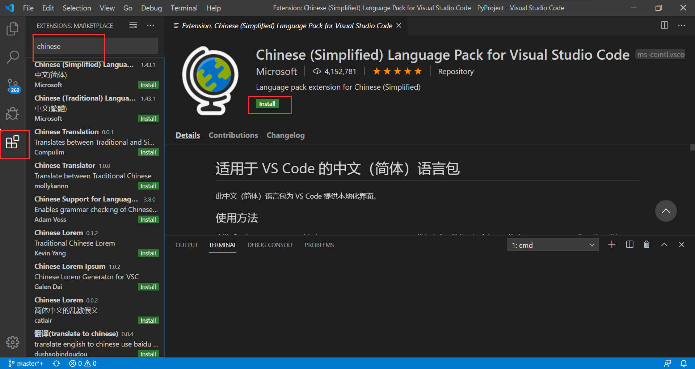

同样方式，安装 Python 和 Vue 的插件：

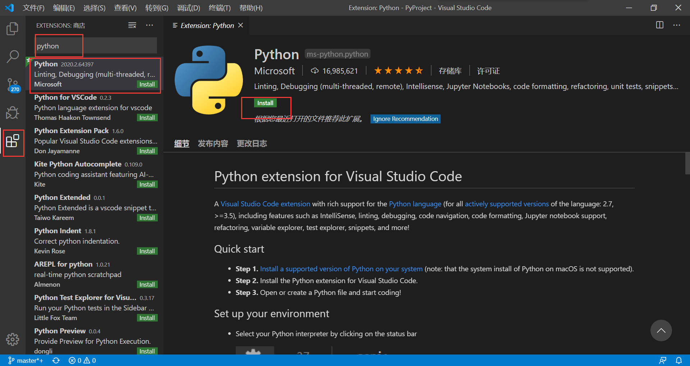

注意 VS Code 官方推荐的 Vue 插件是这个，Vuetur（难怪 Vue 那个插件评分那么低），不要下错了。

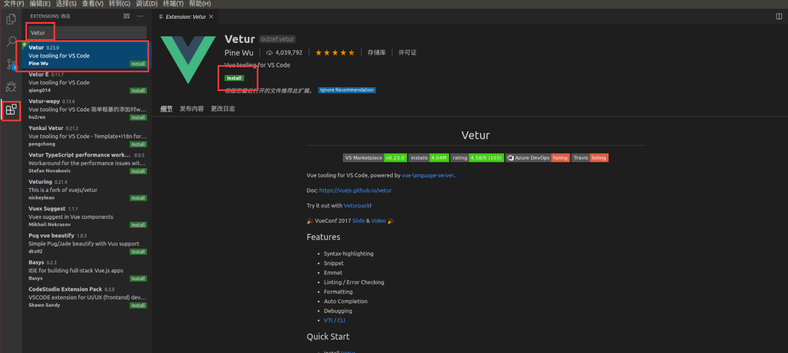

vue 官方文档还建议安装 [Debugger for Chrome](https://marketplace.visualstudio.com/items?itemName=msjsdiag.debugger-for-chrome) 扩展：

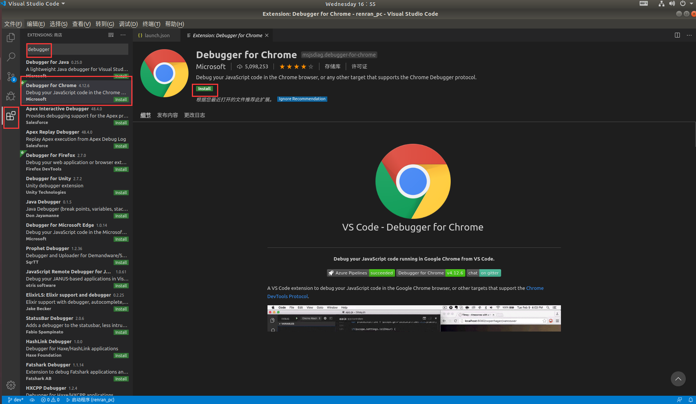

安装 ESLint，规范 js 代码格式的：

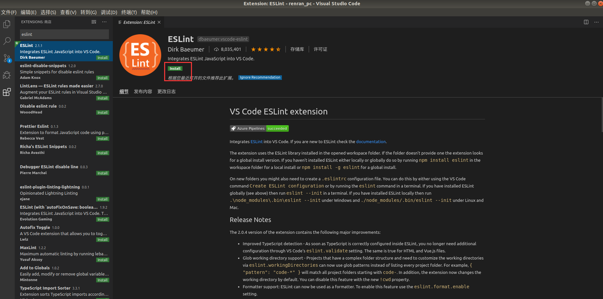

其他插件：

- open in browser
- Auto Close Tag 自动闭合标签
- Auto Rename Tag 自动完成另一侧标签的同步修改
- JavaScript(ES6) code snippets ES6语法智能提示以及快速输入，除js外还支持.ts，.jsx，.tsx，.html，.vue，省去了配置其支持各种包含js代码文件的时间
- Path Intellisense —— 自动路劲补全

### 离线安装插件

首先，进入 VSCode 插件市场 [Extensions for the Visual Studio family of products](https://marketplace.visualstudio.com/vscode)，输入你想要的插件名称，比如这我要安装中文插件：

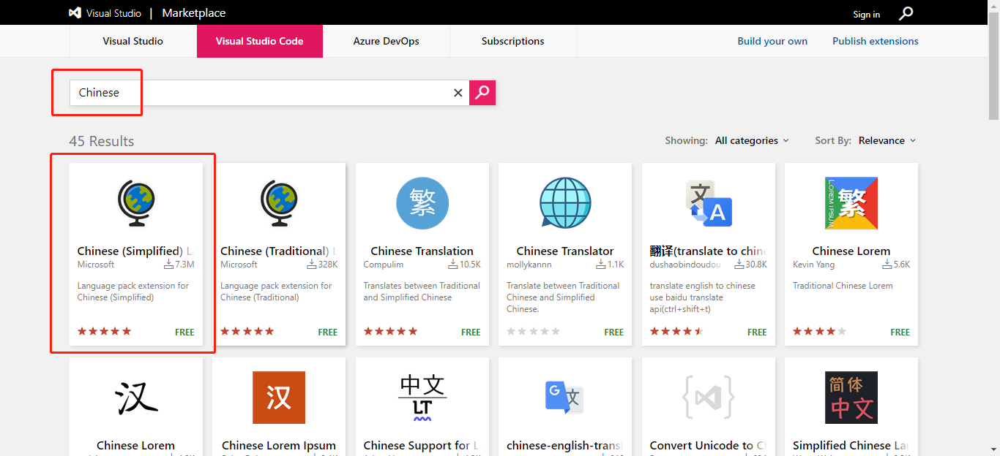

点击进入我们想要的那个插件中，然后点击右侧的 `Download Extension` 下载插件：

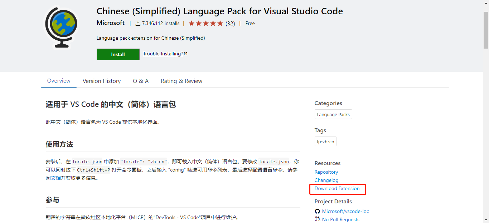


终端进入存放插件文件的目录，执行命令安装插件：

```bash
code --install-extension MS-CEINTL.vscode-language-pack-zh-hans-1.51.2.vsix
```

如果出现 `Extension ‘xxx’ was successfully installed` 字样，说明安装成功，重启 VSCode，可以看到插件生效了：

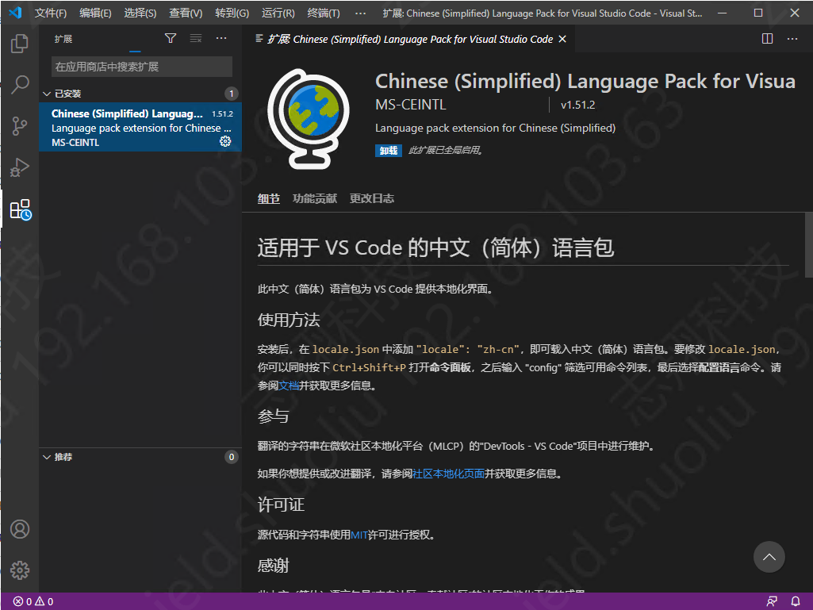

### 运行 Django 项目

别的操作，比如打开文件夹，运行简单程序之类的太简单，就不写了。

运行 Django 项目的方式是从官方文档里面找到的，亲测可行，把方法写到这里。

#### pylint 工具安装

安装 Python 的一个小插件，具体干啥的我也不太清楚，但是有了它才能完成配置。这东西在安装玩 Python 插件后，会在右下角提示安装。如果因为网络原因安装不成功，可以尝试更换 pip 源。

```bash
python3 -m pip install -U pylint --user
```

#### 更换虚拟环境

默认情况使用系统的 Python 环境。有时候我们想要使用自己的虚拟环境，就要手动选择一下。

`Ctrl + Shift + P` 调出命令框，输入命令：

```
Python: Select Interprete
```

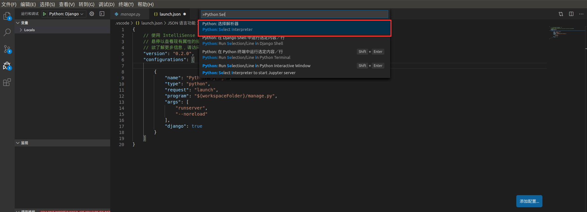

VS Code 会自动找到系统中已经安装了的 Python 环境，选择你需要的虚拟环境即可。如果没有的话，自己手动输入应该也是可以的。

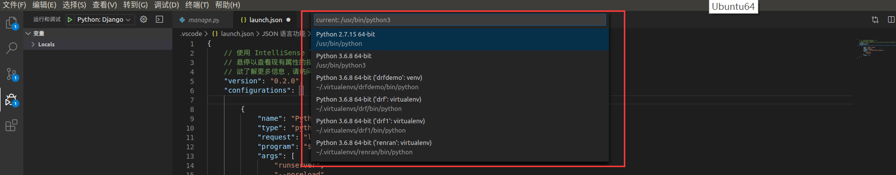

更换虚拟环境后，pylint 工具或许还是要重新安装一次的。

#### 运行 Django 项目

在 `mange.py` 下打开调试任务，点击运行调试：

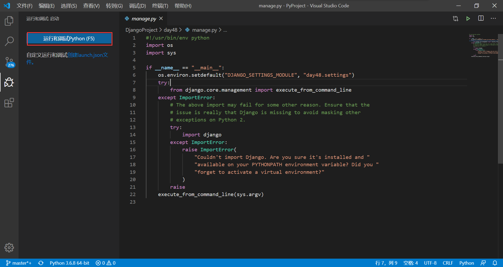

在弹出的窗口中选择 Django：

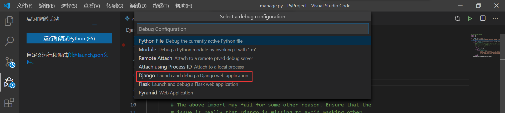

在这里输入 Django 的 manage.py 所在路径，`${workspaceFolder}` 指代的是打开的工作文件夹路径，修改好回车确认：

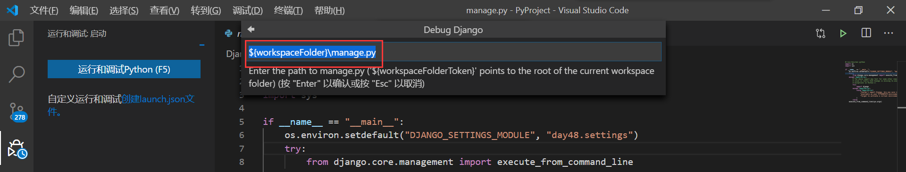

这些配置，后面还是可以修改的，比如这里我删除了它默认的参数 `--noreload`，加上了运行的 IP 和端口信息。

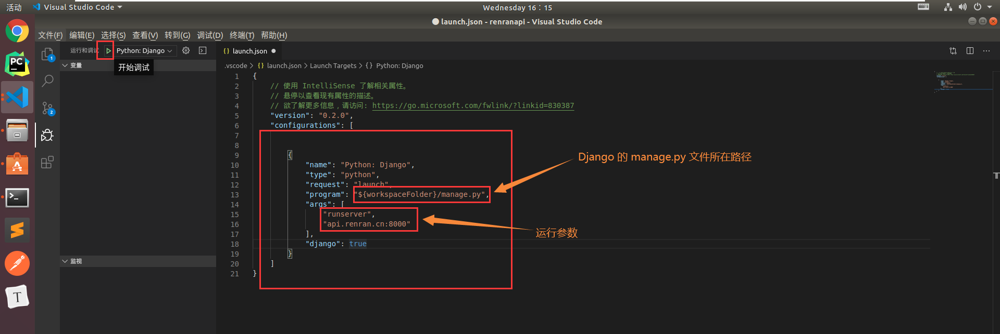

点击运行按钮，项目即可启动：

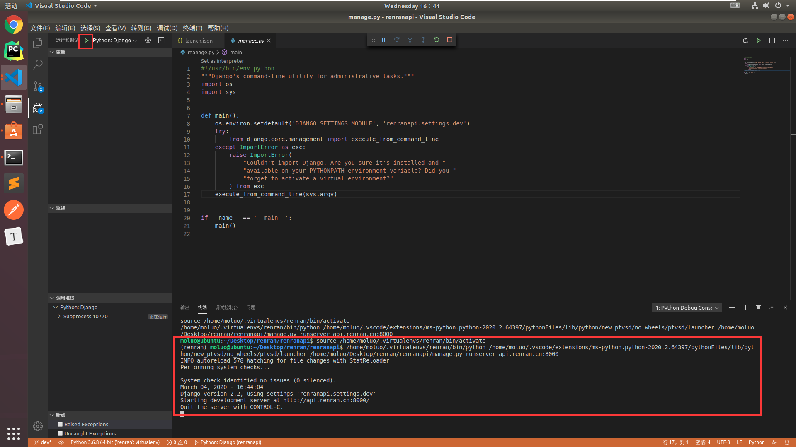

