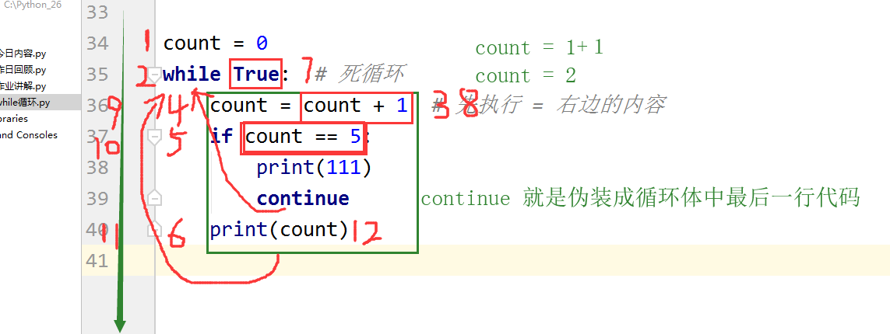
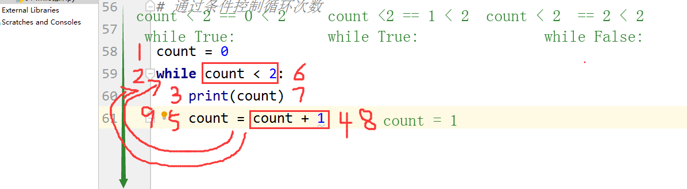

## while 循环

[TOC]

### while 循环基本结构

循环就是不断地重复着某件事情。`while` 是 while 循环的关键字。

while循环的基本结构：

```python 
while 条件:
缩进 循环体
```

典型 while 循环示例：

```python
print(1111)
while True:   # 死循环
    print("坚强")
    print("过火")
    print("鸡你太美")
    print("大碗宽面")
print(333)
```

上面的例子中，第一步，先打印 `1111`。第二步，进入 while 语句，判断 `while` 后的条件是否为真。`while` 后的语句是 `True`，为真，进入循环体中。第三步，打印 `坚强`。第四五六步分别打印出 `过火`、`鸡你太美` 和 `大碗宽面`。循环体中的内容运行完毕，程序又返回到 while 语句。第七步，继续判断 `while` 后的条件是否为真。然后继续进入循环体，重新打印内容。随后又返回到 while 语句中。因为 while 语句后面的条件一直都是 `True`，故而循环往复，永不停息，成为了死循环。最后一条的 `333` 永远也打印不出来。


### break 语句

很显然，这样的死循环并不能满足我们日常编程的需要。如果能有办法限制循环次数，将会十分实用。在这里，我们可以引入 break 语句。break 可以终止当前循环。结合 if 条件语句，可以把死循环转换成有限的循环。例如：

```python
# 循环5次
count = 0
while True:  # 死循环
    count = count + 1  # 先执行 = 右边的内容
    if count == 5:
        print(count)
        break # 有限循环
```

运行的结果为：

```python
5
```

在这个例子中，我们先定义了一个变量 `count` 用来计数，也称为 `计数器`。每一次循环，`count` 就会增加 `1`。当 `count` 等于 `5` 时，if 语句的条件成立，打印出当前 `count` 的数值，运行 `break`，退出循环。我们就成功把死循环转换成了有限循环。


### continue 语句

除了 `break`，while 循环中还有一个很重要的语句 `continue`。`continue` 语句的意思是跳出本次循环，继续下次循环。用通俗的话来讲，`continue` 就是伪装成循环体中最后一行代码。例如：

```python
count = 0
while True:  # 死循环
    count = count + 1  # 先执行 = 右边的内容
    if count == 5:
        print(111)
        continue  # continue 就是伪装成循环体中最后一行代码
    print(count)
```

很显然，这还是一个死循环。只不过当计数器 `count` 等于 `5` 的时候，会打印一次 `111`，并且这次的 `count`，也就是 `5`，不会被打印出来。



### 条件控制循环

除了通过使用 break 关键字来终止循环，我们还可以通过 while 后面的条件来控制循环次数：

```python
count = 0
while count < 2:
    print(count)
    count = count + 1
```

打印出的结果为：

```python
0
1
```

在上面的例子中，最开始计数器 `count` 的值为 `0`。然后运行到 while 条件，`count < 2` 是成立的，于是进入循环体。首先把 `count` 的内容 `0` 打印出来，然后 `count` 增加 `1`，进入下一次循环。第二次循环也一样，打印 `1` 之后，`count` 变成了 `2`，再回到 while 判断语句。此时，`count < 2` 不成立，循环终止。



### while else 语句

while 语句也有判断的行为，所以也可以配合 else 语句使用。while else 结构和 if else 结构很相似。只有当 while 后判断的条件不成立时，才会执行 else 中的语句。如果循环中没有 break，else 语句中的内容将在循环结束后执行；如果循环中有 break，else 语句中的内容有可能不被执行。观察下面两个例子：

```python 
print(222)
count = 0
while count < 3:
    print(count)
    count = count + 1
else:
    print(111)
# 运行结果: 222 0 1 2 111

print(222)
count = 0
while count < 3:
    print(count)
    count = count + 1
    break
else:
    print(111)
# 运行结果: 222 0
```

在第一个例子中，经过三次循环后，计数器 `count` 的值将增加到 `3`。此时，条件 `count < 3` 不再满足，跳出循环，执行 `else` 语句，打印出 `111` 来。而第二个例子中，在第一次循环中就遇到了 `break`，循环被强行终止，并没有再次判断 `count < 3`，于是就不会进入到 `else` 中，`111` 便打印不出来。

### while 循环小结

- while循环基本结构：

  ```python
  while 条件:
  缩进 循环体
  ```

- `break`：终止当前循环
- `continue`：跳出本次循环，继续下次循环（就是伪装成循环体中最后一行代码）
- `continue` 和 `break` 下方的代码都不会执行
- `while` 循环可以通过条件控制循环的次数
- `while` 语句可以和 `else` 语句配合使用，当 `while` 后的条件不满足时，将会运行 `else` 中的语句。