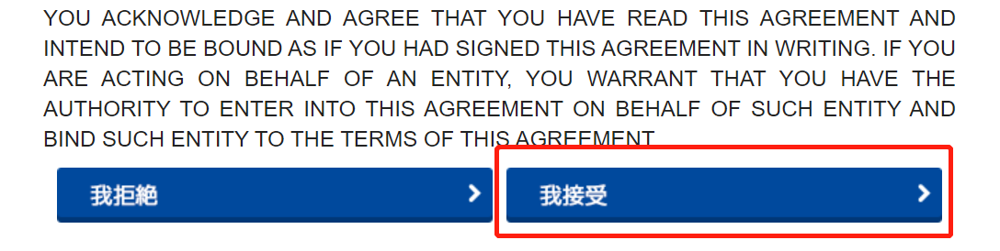
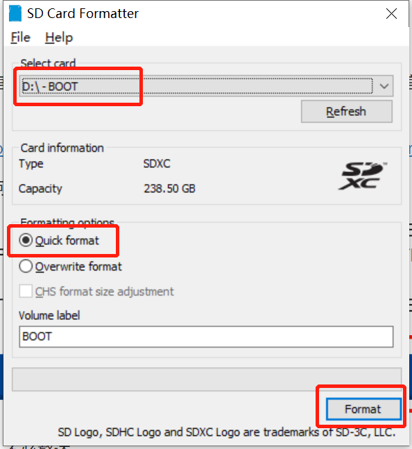
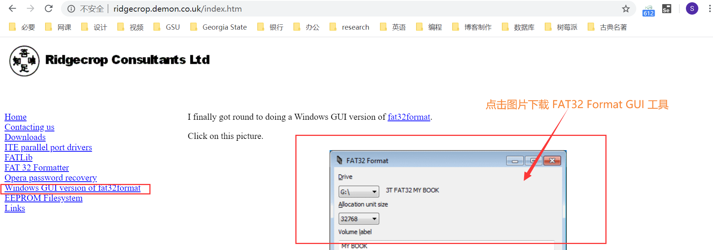
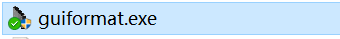
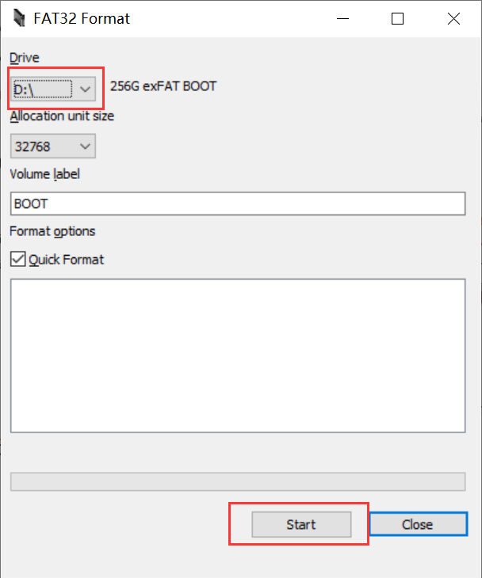
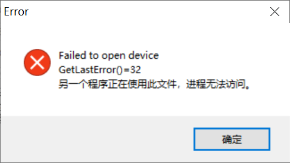
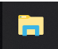
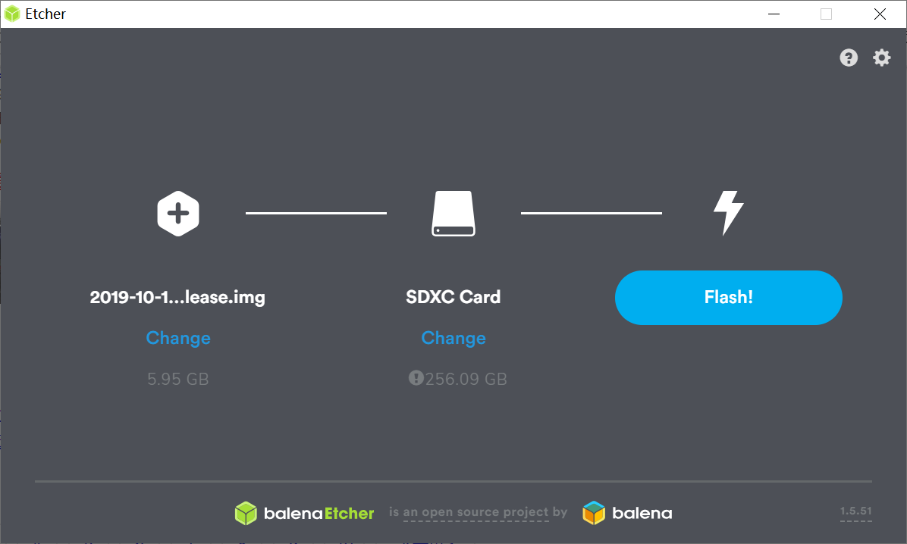

## SD 卡的格式化

格式化树莓派的 SD 卡一般会用到三个工具：SD Card Formatter、这些工具都是树莓派官方建议使用的。如果有其他更好用的，也不是非要用这些。

### SD Card Formatter

SD Card Formatter 是 SD Card 组织官方的格式化工具，相比于 Windows 的格式化，树莓派官方更加推荐使用这个工具格式化 SD 卡。

官方下载链接：https://www.sdcard.org/chs/downloads/formatter/eula_windows/index.html

在官网划到最底部，点击 `我接受`，即可下载。

下载好安装包，就是普通的软件安装，不必赘述。

安装好以后，打开软件。软件界面十分简洁，一目了然。选择好要格式化的 SD 卡对应的盘符，然后最好选择 Quick format，这样速度会快些。都选好之后，点击 Format 格式化即可。

快速格式化不会花费很多时间，如果你的内存卡容量不超过 32GB，到此即格式化完毕了。

### FAT32 Format

根据[树莓派的官方文档](https://www.raspberrypi.org/documentation/installation/sdxc_formatting.md)，容量大于 32GB 的 SD 卡都是 SDXC 卡，一般只能格式化为 exFAT 文件系统。前面的官方 SD 卡格式化工具只能将容量大于等于 64GB 的 SD 卡格式化为 exFAT。

可是树莓派内置在 GPU 中无法升级的引导程序只支持 FAT 文件系统（FAT16 和 FAT32 都可以），并不支持 exFAT 文件系统。所以如果使用的是比较大容量的内存卡，需要使用其他工具，比如 FAT32 Format 来重新格式化 SD 卡，将文件系统设为 FAT32。当然，还是建议先使用官方的工具格式化一下，这样可以将 SD 卡的各个分区合并起来。

FAT32 Format 工具可以在官网下载：http://www.ridgecrop.demon.co.uk/index.htm

如下图，先点击左侧的 Windows GUI version of fat32format，然后点击那个实例图片（真的不太容易想到居然要点击图片下载）即可下载到 FAT32 Format 工具。

文件名默认为 guiformat.exe，无需安装，即点即用，十分方便。

使用时，选择需要格式化的 SD 卡对应的盘符，然后一切默认，点击 start 即可。

因为默认选择的是快速格式化，所以也是一般不会花费很多时间。

需要注意的是，如果文件资源管理器是打开的，有可能会报如下错误：

只需将文件资源管理器关闭即可解决这个问题。

文件资源管理器指的是这个东西：

如果使用的是树莓派官方的 NOOBS 系统，只需将文件解压到 SD 卡中即可，就不需要下面的工具了。

### balenaEtcher

如果使用的是镜像系统，可以使用 balenaEtcher 工具将系统烧录到 SD 卡中。

balenaEtcher 下载地址：https://www.balena.io/etcher/

点击 download 即可下载，然后按照常规软件安装方式安装，无需赘述。

然后按照提示，选择镜像和 SD 卡对应的盘符，点击 Flash 开始烧录。

然后就大功告成啦！