## selenium 模块的安装和配置

[TOC]

### selenium IDE 的安装

selenium IDE 是浏览器的插件，我们可以使用它来录制我们操作浏览器的动作。

录制好的动作可以自动执行，也可以导出成其他语言的脚本代码。

看着挺炫，其实没什么用。

selenium IDE 是用来录制和回放的 selenium 工具。谷歌和火狐都支持该插件的下载。

火狐浏览器直接去应用商店搜索 `selenium ide` 即可下载：

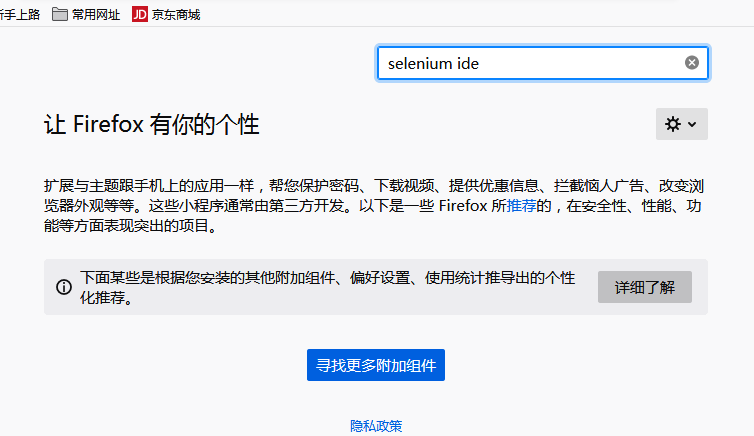

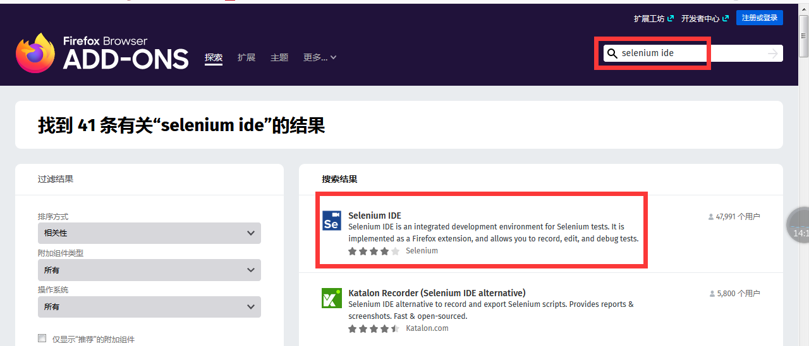

点击 `添加到Firefox` 按钮，即可安装。安装成功后，浏览器的右上角将会出现 Selenium IDE 的图标

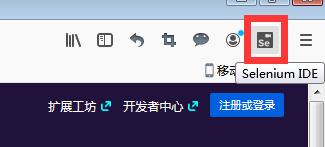

至于谷歌浏览器可能要稍微麻烦一些。因为谷歌商店一般被墙，我们无法从官方的应用商店下载到插件。好在国内有很多插件代理网站，比如我们可以去 `https://www.extfans.com/` 网站搜索下载。

从那里下载到本地的将是一个压缩包，解压后以此点击谷歌浏览器的设置--> 更多工具-->扩展程序。将解压包内的 `selenium-ide.crx` 拖到该页面中。

注意：需要打开 `开发者模式` 选项。

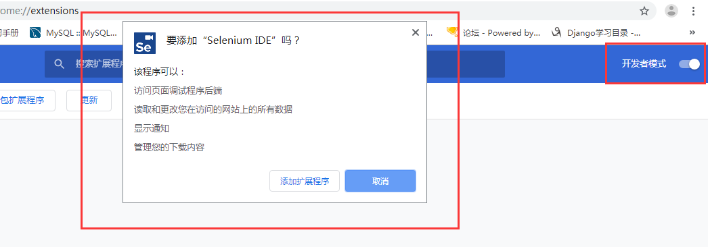

安装成功后将会是这个样子：

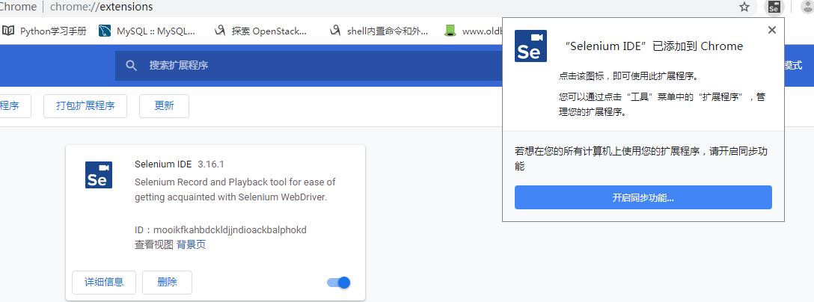

### Selenium IDE 的使用

首先，创建一个新的项目：

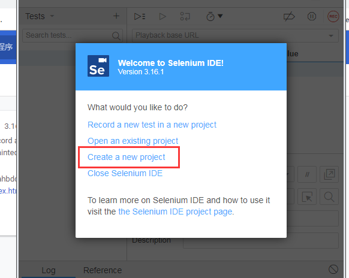

项目名随便取：

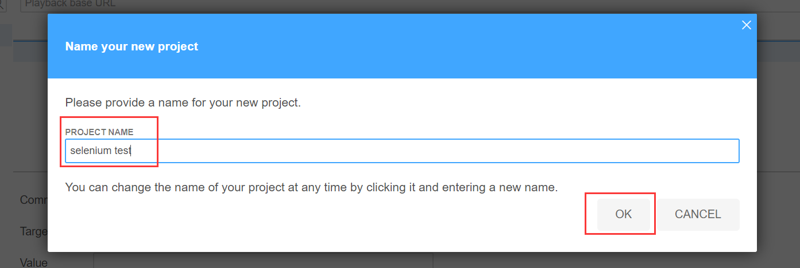

点击左上角加号，添加新的测试：

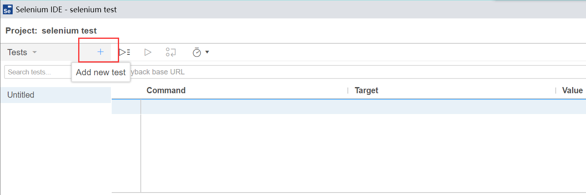

测试名随便写：

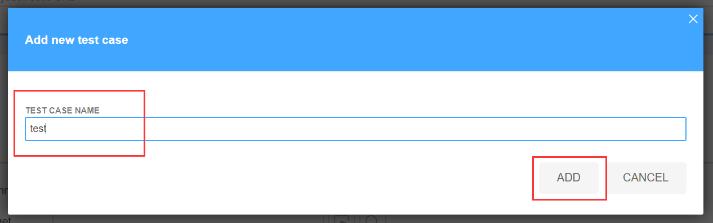

点击右上角的红色按钮，开始录制：

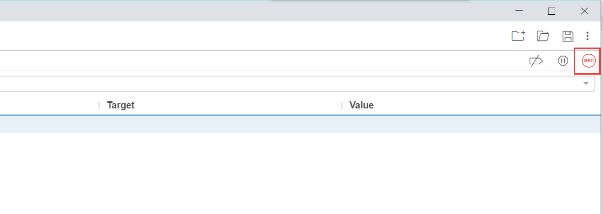


随便写名字，然后开始录制：

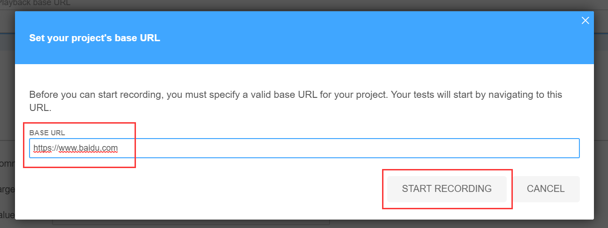

在新弹出的窗口点点，即可开始录制。录制完成后，直接关闭窗口即可。

然后，我们就可以执行录制的动作，也可以导出为各种语言的脚本。

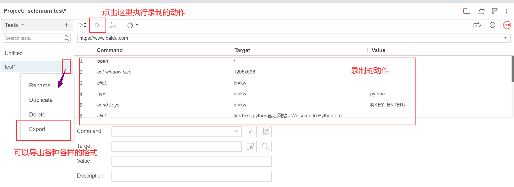

再说一次，前面这些东西基本没什么用，了解即可。从这以后，都是很常用到的。

### selenium 模块的安装

直接使用 pip 安装即可：

```python
pip install selenium
```

### 浏览器驱动下载

除了需要安装 selenium 第三方模块，我们还要安装适配浏览器的驱动。最常用的当然是 Chrome 和火狐。IE 和 Safari 也有各自的驱动。他们的下载链接如下：

- Chrome 驱动地址：https://npm.taobao.org/mirrors/chromedriver

  也可以使用 Chrome 官网的下载地址：http://chromedriver.storage.googleapis.com/index.html

- Firefox 驱动地址：https://github.com/mozilla/geckodriver/releases

- IE 驱动地址：https://developer.microsoft.com/en-us/microsoft-edge/tools/webdriver/

- Safari 驱动地址：https://webkit.org/blog/6900/webdriver-support-in-safari-10/

注意 Chrome 浏览器需要先查看自己浏览器的版本，然后下载与浏览器版本号最接近的浏览器驱动。如果驱动与浏览器版本差别过大，有可能会出问题。

可通过下面的方式查看浏览器的版本：

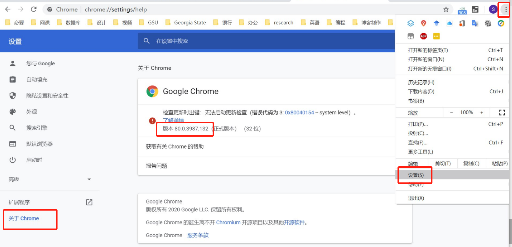

根据浏览器版本和系统平台下载对应的浏览器驱动，Windows 系统下 32 位的版本即可：

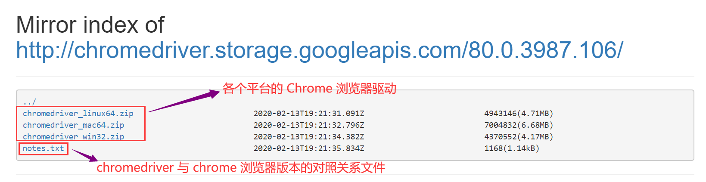

一般情况下，最后一位版本号可以不同，影响不大。

下载到本地之后，把 `chromedriver.exe` 移动至 Python 解释器同级的目录（Python 的安装目录）或者 Scripts 目录下即可。

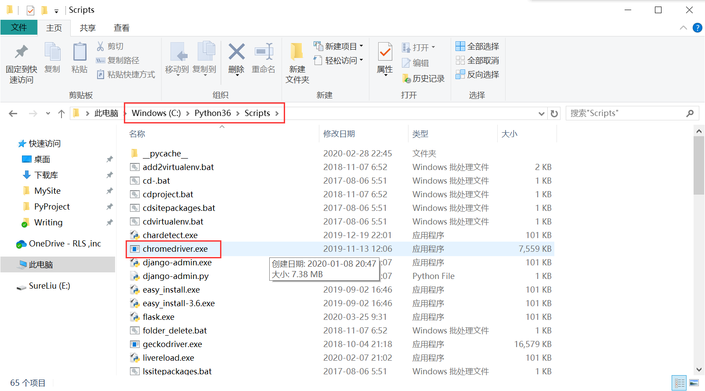

### 测试运行

安装好 selenium 模块，并且配置好浏览器驱动之后，我们可以执行一段简单的 selenium 代码测试一下安装的情况。

创建一个 py 文件，比如就叫 `test.py`，在里面写上下面的代码：

```python
from selenium import webdriver
# 创建Chrome WebDriver实例，此路径为驱动程序的路径
driver = webdriver.Chrome()
# firefox浏览器打开
# driver = webdriver.Firefox()
# 加载URL网页
driver.get("http://www.baidu.com/")
# 打印当前页面的title属性内容
print(driver.title)
# 关闭浏览器
driver.quit()
```

可以看到打开一个浏览器，然后很快就关闭了。本地打印出了结果，表示安装成功！

### 可能的报错

有时候，即便将浏览器驱动添加到环境变量中，仍然找不到。这时候，我们就要在创建浏览器对象的时候，使用绝对路径指定浏览器驱动的安装位置，比如：

```python
from selenium import webdriver
driver = webdriver.Firefox(executable_path=r'C:\Python36\Scripts\geckodriver.exe')
driver.get('https://www.baidu.com/')
```

