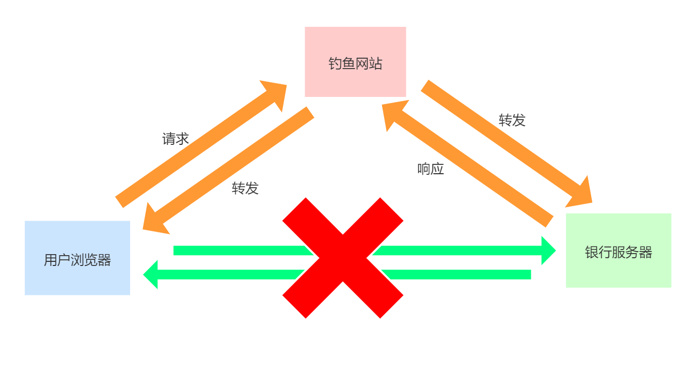
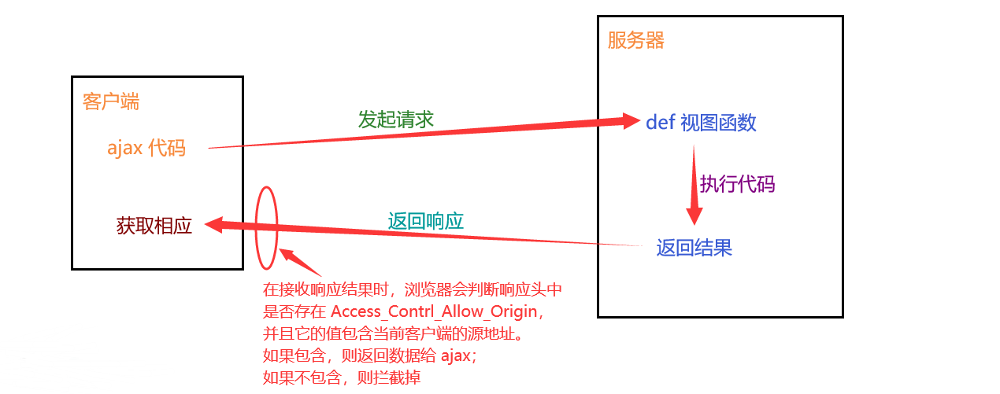

## ajax 和同源策略

ajax，一般中文称之为："阿贾克斯"，是英文“Async Javascript And Xml”的简写，译作：异步 js 和 xml 数据传输数据。

ajax 的作用： ajax 可以让 js 代替浏览器向后端程序发送 http 请求，与后端通信，在用户不知道的情况下操作数据和信息，从而实现页面局部刷新数据/无刷新更新数据。

所以开发中 ajax 是很常用的技术，主要用于操作后端提供的数据接口，从而实现网站的前后端分离。

ajax 技术的原理是实例化 js 的 XMLHttpRequest 对象，使用此对象提供的内置方法就可以与后端进行数据通信。

这里的 js 更多的指的还是  [JSON 数据](json.md)。JSON 数据的基本写法为：

```json
{
    "name":"晓明",
    "age":12
}
```

与 JSON 类似，XML 也是一种数据的存储格式，同样很多编程语言都能支持，曾经一度非常火热。但是因为数据写法太过繁琐，所以热度越来越低。XML 的基本写法为：

```xml
<xml version="1.0">
   <name>晓明</name>
   <age>12</age>
</xml>
```

虽然能看懂，但如果数据量很大，嵌套层数很多的话，就很难看清楚了。而且因为需要封闭标签，写起来就更加让人头疼了。

### 数据接口

数据接口，也叫 api 接口，表示后端提供操作数据/功能的 url 地址给客户端使用。

客户端通过发起请求向服务端提供的 url 地址申请操作数据（操作一般为增删查改）。

同时在工作中，大部分数据接口都不是手写，而是通过函数库/框架来生成。

### ajax 的使用

ajax 必须与服务端程序配合使用。但是目前我们先学习 ajax 的使用，所以暂时先不涉及到服务端 Python 代码的编写。因此，我们可以使用别人写好的数据接口进行调用。

jQuery 将 ajax 封装成了一个函数 `$.ajax()`，我们可以直接用这个函数来执行 ajax 请求。

| 接口         | 地址                                                         |
| ------------ | ------------------------------------------------------------ |
| 天气接口     | http://wthrcdn.etouch.cn/weather_mini?city=城市名称          |
| 音乐接口搜索 | http://tingapi.ting.baidu.com/v1/restserver/ting?method=baidu.ting.search.catalogSug&query=歌曲标题 |
| 音乐信息接口 | http://tingapi.ting.baidu.com/v1/restserver/ting?method=baidu.ting.song.play&songid=音乐ID |

编写代码获取接口提供的数据：

jQuery 版本

```html
<!DOCTYPE html>
<html lang="zh-CN">
<head>
    <meta charset="UTF-8">
    <title>Title</title>
    <script src="js/jquery-1.12.4.js"></script>
    <script>
    $(function(){
        $("#btn").on("click",function(){
            $.ajax({
                // 后端程序的url地址
                url: 'http://wthrcdn.etouch.cn/weather_mini',
                // 也可以使用method，提交数据的方式，默认是'GET'，常用的还有'POST'
                type: 'get', 
                dataType: 'json',  // 返回的数据格式，常用的有'json'、'html'、'jsonp'
                data:{ // 设置发送给服务器的数据，如果是get请求，也可以写在url地址的?后面
                    "city":'北京'
                }
            })
            .done(function(resp) {     // 请求成功以后的操作
                console.log(resp);
            })
            .fail(function(error) {    // 请求失败以后的操作
                console.log(error);
            });
        });
    })
    </script>
</head>
<body>
<button id="btn">点击获取数据</button>
</body>
</html>
```

vue 版本

```html
<!DOCTYPE html>
<html lang="zh-CN">
<head>
    <meta charset="UTF-8">
    <title>Title</title>
    <script src="js/vue.js"></script>
    <script src="js/axios.js"></script>
</head>
<body>
    <div id="app">
        <input type="text" v-model="city">
        <button @click="get_weather">点击获取天气</button>
    </div>
    <script>
        let vm = new Vue({
            el:"#app",
            data:{
                city:"",
            },
            methods:{
                get_weather(){
                    // http://wthrcdn.etouch.cn/weather_mini?city=城市名称
                    axios.get("http://wthrcdn.etouch.cn/weather_mini?city="+this.city)
                        .then(response=>{
                            console.log(response);

                        }).catch(error=>{
                            console.log(error.response)
                    });
                  // 上面的参数写法,也可以是下面这种格式:
                  // axios.get("http://wthrcdn.etouch.cn/weather_mini",{
                  //     // get请求的附带参数
                  //     params:{
                  //         "city": this.city,
                  //     }
                  // }).then(response=>{
                  //     console.log(response.data);  // 获取接口数据
                  // }).catch(error=>{
                  //     console.log(error.response); // 获取错误信息
                  // })
                }
            }
        })
    </script>
</body>
</html>
```

### jQuery 的 `$.get`  和 `$.post` 发送 ajax

jQuery 提供了`$.get` 和 `$post` 简写 `$.ajax` 的操作。

发送 get 请求：

```JavaScript
// 参数1：数据接口的请求地址
// 参数2：发送给接口地址的数据参数
// 参数3：ajax请求成功以后，调用的匿名函数，匿名函数的第一个参数还是服务端返回的数据
// 参数4：设置服务端返回的数据格式，告诉给jQuery
$.get("test.php", { "func": "getNameAndTime" },
   function(data){
     alert(data.name); // John
     console.log(data.time); //  2pm
   }, "json");
```

发送 post 请求：

```JavaScript
// 参数1：数据接口的请求地址
// 参数2：发送给接口地址的数据参数
// 参数3：ajax请求成功以后，调用的匿名函数，匿名函数的第一个参数还是服务端返回的数据
// 参数4：设置服务端返回的数据格式，告诉给jQuery
$.post("test.php", { "func": "getNameAndTime" },
   function(data){
     alert(data.name); // John
     console.log(data.time); //  2pm
   }, "json");
```

### 同源策略

想象一下这样的情景，有一个钓鱼网站，冒充网银。这个网站跟网银长得十分相似，以至于不明就里的用户以为它就是银行的官方网站。用户在这个假网站的登陆界面输入用户名和密码。这个网站在记录了这个数据之后，使用用户的数据，向银行的官网发送请求。银行的请求返回过后，或许需要手机号验证之类的操作，钓鱼网站再把这个需求返回给用户。用户经过一些列的操作，把自己的各种信息泄露个精光，最后损失不少钱财。当然，黑客最后也是被警方抓获，用户的损失算是被弥补回来了。



不过通过上面的例子，我们就看到，如果随意能让别人转发我们的请求是一件很危险的事，为此，浏览器就增加了一个同源策略。

同源策略，是浏览器为了保护用户信息安全的一种安全机制。所谓的同源就是指代通信的两个地址（例如服务端接口地址与浏览器客户端页面地址）之间比较，是否协议、域名（IP）和端口相同。不同源的客户端脚本（JavaScript）在没有明确授权的情况下，没有权限读写对方信息。



这里注意两个点，首先，同源拦截策略是**浏览器**的机制，如果不是用浏览器，就不会受这个机制的影响。比如我们使用 Python 脚本做爬虫时，就不需要考虑同源策略的影响。另外，这个拦截是针对的**脚本**发出请求进行的拦截，主要是 JavaScript 的请求。但如果是用其他方式，比如浏览器的 script 标签中的 src 属性，也是可以访问到非同源请求的。这就是 jsonp 处理同源机制的原理。

ajax 本质上还是 JavaScript，是运行在浏览器中的脚本语言，所以会被受到浏览器的同源策略所限制。

| 前端地址：`http://www.oldboy.cn/index.html` | 是否同源 | 原因                      |
| ------------------------------------------- | :------: | ------------------------- |
| `http://www.oldboy.cn/user/login.html`      |    是    | 协议、域名、端口相同      |
| `http://www.oldboy.cn/about.html`           |    是    | 协议、域名、端口相同      |
| `https://www.oldboy.cn/user/login.html`     |    否    | 协议不同（https 和 http） |
| `http:/www.oldboy.cn:5000/user/login.html`  |    否    | 端口 不同（5000 和 80）   |
| `http://bbs.oldboy.cn/user/login.html`      |    否    | 域名不同（bbs 和 www）    |

注意，`127.0.0.1` 和 `localhost` 也是不同域名，所以也不同源。

同源策略针对 ajax 的拦截，代码：

```html
<!DOCTYPE html>
<html lang="en">
<head>
    <meta charset="UTF-8">
    <title>Title</title>
    <script src="js/vue.js"></script>
    <script src="js/axios.js"></script>
</head>
<body>
    <div id="app">
        <button @click="get_music">点击获取天气</button>
    </div>
    <script>
        let vm = new Vue({
            el:"#app",
            data:{},
            methods:{
                get_music(){
                    axios.get("http://tingapi.ting.baidu.com/v1/restserver/ting?method=baidu.ting.search.catalogSug&query=我的中国心")
                        .then(response=>{
                            console.log(response);

                        }).catch(error=>{
                            console.log(error.response)
                    });
                }
            }
        })
    </script>
</body>
</html>
```

上面代码运行错误如下：

```
Access to XMLHttpRequest at 'http://tingapi.ting.baidu.com/v1/restserver/ting?method=baidu.ting.search.catalogSug&query=%E6%88%91%E7%9A%84%E4%B8%AD%E5%9B%BD%E5%BF%83' from origin 'http://localhost:63342' has been blocked by CORS policy: No 'Access-Control-Allow-Origin' header is present on the requested resource.
```

上面错误的关键词：`Access-Control-Allow-Origin`

只要出现这个关键词，就是访问受限。出现同源策略的拦截问题。

### ajax 跨域（跨源）方案之 CORS

ajax 跨域（跨源）方案有三种：后端授权（CORS）、jsonp、服务端代理。

CORS 是一个 W3C 标准，全称是"跨域资源共享"，它允许浏览器向跨源的后端服务器发出 ajax 请求，从而克服了ajax 只能同源使用的限制。

实现 CORS 主要依靠<mark>后端服务器中响应数据中设置响应头信息返回</mark>的。


django的视图，注意 ajax 发送的最好是 get 请求，否则还会受到 django 的 csrf 限制，比较麻烦：

```python
def cors(request):
    data = {'name': 'sure', 'age': 18}
    response = JsonResponse(data)
    response['Access-Control-Allow-Origin'] = '*'
    return response
```

授权给前端访问，也就是 CORS，只需在响应行信息里面设置以下内容

```
Access-Control-Allow-Origin: ajax所在的域名地址
```

例如：

```js
Access-Control-Allow-Origin:" www.baidu.com"  // 表示只允许www.baidu.com域名的客户端的ajax跨域访问
Access-Control-Allow-Origin: "http://localhost:63342"  // 指定域名、端口和协议
// * 表示任意源，表示允许任意源下的客户端的ajax都可以访问当前服务端信息
Access-Control-Allow-Origin: "*"
```


### 同源策略总结

1. 同源策略指的是浏览器的一种保护用户数据的一种安全机制。浏览器会限制 ajax 不能跨源访问其他源的数据地址。

   判断两个地址是否同源的依据是这两个地址的协议、域名（或 ip）以及端口是否完全一致。

   那么下面两个地址是同源的吗？

   ```
   ajax：  http://127.0.0.1/index
   浏览器访问的api数据接口：  http://localhost/index
   ```

   仍然不是同源的，即便 `127.0.0.1` 和 `localhost` 指代的都是同一台电脑，也就是本机。是否同源的判断依据不会根据电脑来判断，而是通过协议、域名、端口的字符串是否一致来判断。

2. ajax 发送的请求默认情况下会受到同源策略的影响，一旦受到影响会报错误如下：

   ```js
   No 'Access-Control-Allow-Origin' header is present on the requested resource
   ```

3. 解决 ajax 只能同源访问数据接口的方式：

   1. CORS，跨域资源共享，在服务端的响应行中设置：

      ```js
      Access-Control-Allow-Origin: 允许访问的域名地址
      ```

   2. jsonp

   3. 服务端代理。其原理是，浏览器会拦截非同源请求，但是 Python 脚本不会。如果我们通过 Python 来请求对应的服务接口，获取到数据后，加上 CORS 的请求头返回给浏览器，就不会被拦截了。
