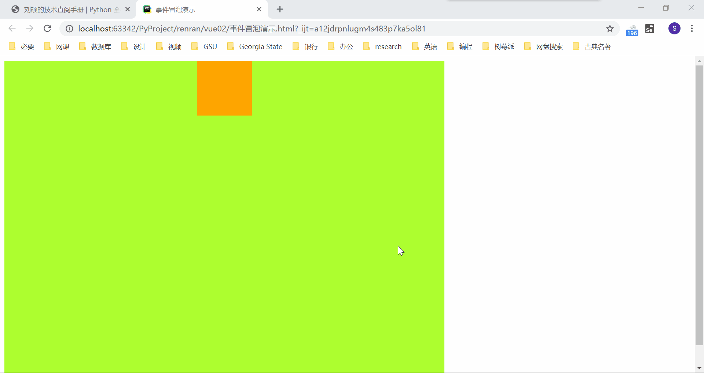
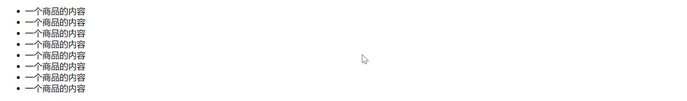

## JavaScript 的事件冒泡和事件委托

[TOC]

### 事件冒泡现象

原生 js 中，因为元素的相互嵌套关系，所以在 js 的事件处理机制中，实现了事件的传播机制。这种传播机制是由内向往，逐层传递的，这种现象，我们也称之为"事件冒泡"。这种事件冒泡现象有其好处也有坏处，有时候我们需要应用到它来做一些事情，有时候却需要避免它。

但首先，我们还是要认识它。来看下面这段代码：

```html
<!DOCTYPE html>
<html lang="zh-CN">
<head>
    <meta charset="UTF-8">
    <title>事件冒泡演示</title>
    <style>
        .c1 {
            height: 600px;
            width: 800px;
            background-color: greenyellow;
        }
        .c2 {
            margin: auto;
            height: 100px;
            width: 100px;
            background-color: orange;
        }
    </style>
</head>
<body>
<div class="c1">
    <div class="c2"></div>
</div>
</body>
<script>
    let div1 = document.getElementsByClassName('c1')[0];
    div1.onclick = function () {
        alert('您点击了外层的 c1')
    };

    let div2 = document.getElementsByClassName('c2')[0];
    div2.onclick = function () {
        alert('您点击了内层的 c2')
    };

</script>
</html>
```

代码执行的效果为：



点击外层标签时，是正常的，只触发了外层标签的事件。但是点击内层标签后我们发现，不仅出发了内层标签的事件，也出发了外层标签的事件。这其实也很好理解，点击到内层标签也算是点击到外层标签了嘛。

这种触发内层标签的事件后，逐层传递，触发外层标签的情况，我们就称为事件冒泡。

### 事件冒泡的应用：事件委托

事件冒泡存在是合理的，而且它所造成的结果也并非一致都让人烦恼。有些时候，通过一些巧妙的应用，我们可以利用事件冒泡做一些事情。其中，最经典的例子就是事件委托。

我们现在有很多的 li 标签，就像下面这样：

```html
<ul>
    <li>一个商品的内容</li>
    <li>一个商品的内容</li>
    <li>一个商品的内容</li>
    <li>一个商品的内容</li>
    <li>一个商品的内容</li>
    <li>一个商品的内容</li>
    <li>一个商品的内容</li>
    <li>一个商品的内容</li>
</ul>
```

我们需要给每一个标签绑定上一个事件。这里为图方便，就让被点击的标签背景颜色变为橙色。实际当中，可能会是对标签的增删改查。

你大可以给每一个标签都绑定上事件，如果应用上循环，代码量也未必很高，比如这样写：

```javascript
let li_tag_list = document.getElementsByTagName('li');
    for (let li_tag of li_tag_list) {
    li_tag.onclick = function () {
        this.style.backgroundColor = 'orange'
    }
}
```

但是要知道，每绑定一个事件，就会占用一定的计算机资源。这么多重复的 li 标签会占用很多资源。对于一个网页，如果每个标签都这么绑定事件，用户体验会很糟糕的。而且有时候，我们通过 js 局部刷新数据增加标签时，新标签是不会绑定上点击事件的。

此时，我们就可以通过事件委托来解决这个问题。

当鼠标点击某个标签时，浏览器会记录下这个点击事件，并查找它所绑定的点击事件。如果没有找到对应的事件，根据事件冒泡的规则，会找到它的上级标签，去看这些外层标签是否有绑定的事件。

于是，对于上面这个例子，我们可以不把事件直接绑定到 li 标签上，而是绑定到它们上一级的 ul 标签。当 ul 的事件被触发时，我们知道是某个 li 标签被点击了。前面提到，浏览器会记录下这个点击事件，我们可以通过 js 代码接收到这个事件，比如叫做 event。点击到的那个 li 标签，我们可以通过 event.target 获取到（事实上，如果打印 event，会发现也有其他的方式比如 srcElement 和 toElement 也可以获得到目标标签，但是 target 是大家比较认可的，也是大多数浏览器都支持的）。找到了特定的 li 标签，我们就可以对其进行想要的操作了。

这种利用事件冒泡来进行优化的方式，利用给父元素绑定事件，批量管理子元素的同名事件，就叫做"事件委托"。

把上面的描述转换成代码就是：

```html
<!DOCTYPE html>
<html lang="zh-CN">
<head>
    <meta charset="UTF-8">
    <title>事件委托演示</title>
</head>
<body>
<ul>
    <li>一个商品的内容</li>
    <li>一个商品的内容</li>
    <li>一个商品的内容</li>
    <li>一个商品的内容</li>
    <li>一个商品的内容</li>
    <li>一个商品的内容</li>
    <li>一个商品的内容</li>
    <li>一个商品的内容</li>
</ul>
</body>
<script>
    // 注释掉的代码是直接把事件绑定到 li 标签上，能实现，但是有缺陷
    // let li_tag_list = document.getElementsByTagName('li');
    // for (let li_tag of li_tag_list) {
    //     li_tag.onclick = function () {
    //         this.style.backgroundColor = 'orange'
    //     }
    // }
    let ul_tag = document.getElementsByTagName('ul')[0];
    ul_tag.onclick = function (event) {    // 事件的函数都可以接收鼠标点击事件作为参数
        let li_tag = event.target;    // 获取 li 标签
        li_tag.style.backgroundColor = 'orange';
    }
</script>
</html>
```

上面的代码执行后的效果为：



### 事件冒泡的阻止

当然很多时候，我们并不希望事件冒泡发生。比如最开始的弹窗的例子，点击内层标签我只希望内层标签提示，外层标签不要提示。这就要阻止事件冒泡。

阻止事件冒泡的方式也很简单，只需要接收到鼠标的点击事件，并对点击事件调用 stopPropagation 方法即可。

用代码来表示就是：

```html
<!DOCTYPE html>
<html lang="zh-CN">
<head>
    <meta charset="UTF-8">
    <title>事件冒泡演示</title>
    <style>
        .c1 {
            height: 600px;
            width: 800px;
            background-color: greenyellow;
        }
        .c2 {
            margin: auto;
            height: 100px;
            width: 100px;
            background-color: orange;
        }
    </style>
</head>
<body>
<div class="c1">
    <div class="c2"></div>
</div>
</body>
<script>
    let div1 = document.getElementsByClassName('c1')[0];
    div1.onclick = function () {
        alert('您点击了外层的 c1')
    };

    let div2 = document.getElementsByClassName('c2')[0];
    div2.onclick = function (event) {
        alert('您点击了内层的 c2');
        event.stopPropagation()    // 只需要接收 event 参数，再加上这一行代码即可阻止事件冒泡
    };

</script>
</html>
```

上面代码执行的效果为：


事件冒泡成功被阻止，当点击内层标签时，外层标签绑定的事件不会被触发。而当点击外层标签时，事件并不受影响。