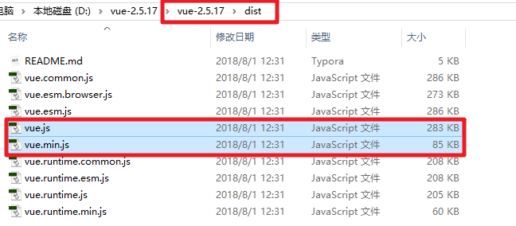
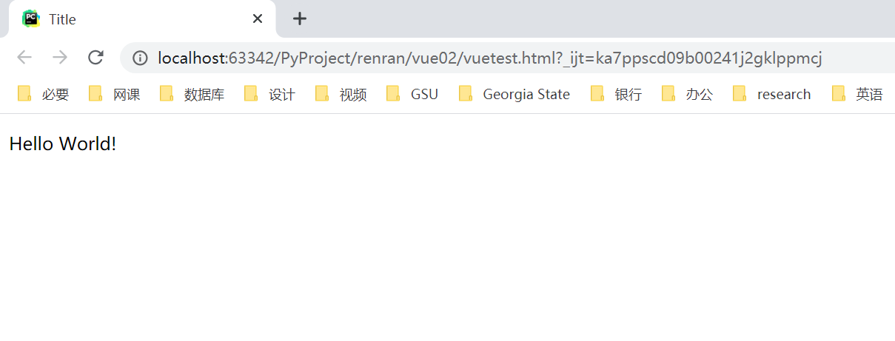
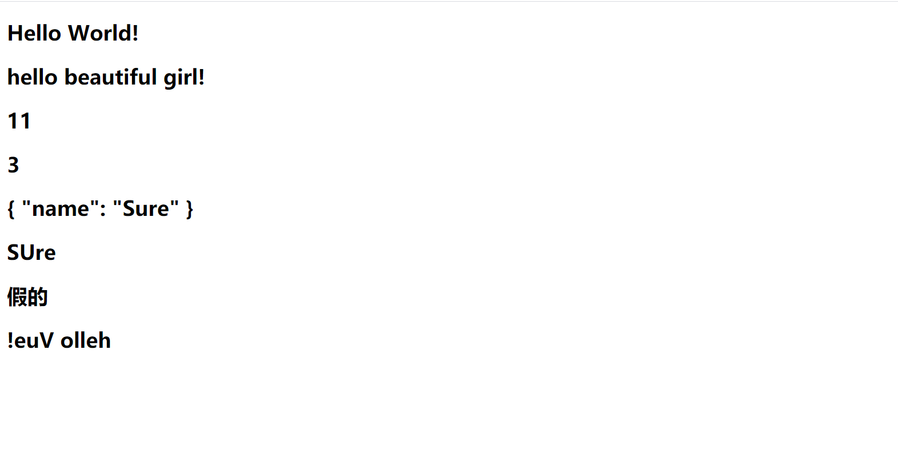
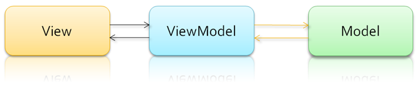
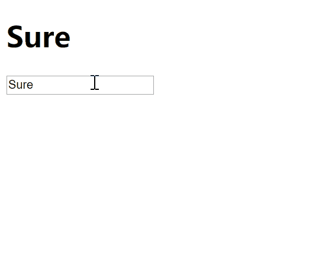

## `vue.js` 的快速入门使用

[TOC]

### `vue.js` 库的下载

`vue.js` 是目前前端 web 开发最流行的工具库之一，由尤雨溪在 2014 年 2 月发布。

另外几个常见的工具库：`react.js` / `angular.js`

官方网站：

​	中文：https://cn.vuejs.org/

​	英文：https://vuejs.org/

官方文档：https://cn.vuejs.org/v2/guide/

`vue.js` 目前有 1.x、2.x 和 3.x 版本，我们学习 2.x 版本的。


### `vue.js` 库的基本使用

在 GitHub 下载： https://github.com/vuejs/vue/releases

在官网下载地址： <https://cn.vuejs.org/v2/guide/installation.html>

vue 的引入类似于 jQuery，开发中可以使用开发版本 `vue-x.x.x.js`，产品上线要换成 `vue.min.js`。

下图是 GitHub 网站下载的 `vue.js` 目录：



直接来看一段使用 vue 的简单代码：

```html
<!DOCTYPE html>
<html lang="zh-CN">
<head>
    <meta charset="UTF-8">
    <title>Title</title>
    <!-- 引入vue -->
    <script src="js/vue.js"></script>
</head>
<body>
<div id="app">
    <!-- {{ msg }} 表示把vue对象里面data属性中的对应数据输出到页面中 -->
    <!-- 在标签中显示数据要通过{{  }}来完成 -->
    <p>{{ msg }}</p>
</div>
</body>
<script>
    // vue.js的代码开始于一个Vue对象。所以每次操作数据都要声明Vue对象开始。
    let vm = new Vue({
        el: '#app',    // 设置当前vue对象要控制的标签范围，后面接的是CSS选择器
        data: {    // data是将要展示到HTML标签元素中的数据
            msg: 'Hello World!'
        }
    })
</script>
</html>
```

代码执行效果：



实例化 vue 对象时，我们会用到 el 参数。这个参数对应的值是一个标签选择器，用来找到前面 HTML 页面中的指定的标签作为工作标签。所以，实例化对象的过程一定要放在那个标签的下方，一般都是放在文档的最后放。当然也可以通过 window.onload 的方式将其放在文档的最前方，只是这种方式由于较为繁琐，不太常用：

```html
<!DOCTYPE html>
<html lang="zh-CN">
<head>
    <meta charset="UTF-8">
    <title>Title</title>
    <script src="js/vue.js"></script>
    <script>
        window.onload = function () {
            let vm = new Vue({
            el: '#app',
            data: {
                msg: 'Hello World!'
            }
            })
        }
    </script>
</head>
<body>
<div id="app">
    <p>{{ msg }}</p>
</div>
</body>
</html>
```

vue 用法的简单总结：

1. vue的使用要从创建 vue 对象开始：

   ```js
   let vm = new Vue();
   ```

2. 创建 vue 对象的时候，需要传递参数，是 json 自定义对象。json 自定义对象对象必须至少有两个属性成员（其实后面的学习可以了解到，若无必要，data 属性也是可以省略的）：

   ```js
   var vm = new Vue({
       el:"#app",
       data: {
           数据变量:"变量值",
           数据变量:"变量值",
           数据变量:"变量值",
       },
   });
   ```

   属性名解释：

   - el，圈地，划地盘，设置 vue 可以操作的 HTML 内容范围，值一般就是 CSS 的 id 选择器，其他选择器也可以，但是多用 id 选择器
   - data，保存 vue 中要显示到 HTML 页面的数据

3. vue 要控制器的内容必须包裹在 el 指定的标签里面：

   ```html
   <div id="app">
       <h1>{{ message }}</h1>
       <p>{{ message }}</p>
   </div>
   ```

vue 中的模板语法中可以直接进行一些简单直接的 js 运算操作（注意，一般只放一些简单操作，复杂操作由函数执行）：

```html
<!DOCTYPE html>
<html lang="zh-CN">
<head>
    <meta charset="UTF-8">
    <title>Title</title>
</head>
<body>
<div id="app">
    <!-- vue的模板语法，和django的模板语法类似 -->
    <h2>{{ msg }}</h2>
    <!-- 有人说，我们直接这样写数据不就行吗，但是你注意，我们将来的数据都是从后端动态取出来的，不能写死这些数据啊，你说对不对。于是，我们可以进行如下操作： -->
    <h2>{{ 'hello beautiful girl!' }}</h2>  <!-- 直接放一个字符串 -->
    <h2>{{ num + 1 }}</h2>  <!-- 四则运算 -->
    <h2>{{ 2 + 1 }}</h2>  <!-- 四则运算 -->
    <h2>{{ {name: 'Sure'} }}</h2> <!-- 直接放一个自定义对象 -->
    <h2>{{ person.name }}</h2>  <!-- 下面data属性里面的person属性中的name属性的值 -->
    <h2>{{ 1>2?'真的':'假的' }}</h2>  <!-- js的三元运算 -->
    <h2>{{ s.split('').reverse().join('') }}</h2>  <!-- 字符串反转 -->
</div>
</body>
<!-- 1.引包，写在vm对象之前即可 -->
<script src="js/vue.js"></script>
<script>
    //2.实例化对象
    let vm = new Vue({
        el: '#app',
        data: {
            msg: 'Hello World!',
            person: {
                name: 'SUre',
                age: 18,
            },
            s: 'hello Vue!',
            num: 10,
        }
    })
</script>
</html>
```

代码执行效果如下：




### vue.js 的 M-V-VM 思想

MVVM 是 Model-View-ViewModel 的缩写，它是一种基于前端开发的架构模式。

- `Model` 指代的就是 vue 对象的 data 属性里面的数据。这里的数据要显示到页面中。

- `View`  指代的就是 vue 中数据要显示的 HTML 页面，在 vue 中，也称之为“视图模板” 。

- `ViewModel ` 指代的是 vue 中我们编写代码时的 vm 对象了。它是 vue.js 的核心，负责连接 View 和 Model，保证视图和数据的一致性，所以前面代码中，data 里面的数据被显示中 p 标签中就是 vm 对象自动完成的。



编写代码，让我们更加清晰的了解 MVVM：

```html
<!DOCTYPE html>
<html lang="zh-CN">
<head>
    <meta charset="UTF-8">
    <title>Title</title>
    <script src="js/vue.js"></script>
</head>
<body>
<div id="app">
    <h1>{{ name }}</h1>
    <!-- 在表单输入框中显示数据要使用v-model来完成，模板语法的时候，我们会详细学习 -->
    <input type="text" v-model="name">
</div>
</body>
<script>
    let vm = new Vue({
        el: '#app',
        data: {
            name: 'Sure',
            age: 18
        }
    })
</script>
</html>
```

代码执行效果为：



在浏览器中可以使用 `console.log` 通过 vm 对象直接访问 el 和 data 属性，甚至可以访问 data 里面的数据：

```javascript
console.log(vm.$el)     // #app  vm对象可以控制的范围
console.log(vm.$data);  // vm对象要显示到页面中的数据
console.log(vm.$data.name);  // 'Sure'  访问data里面的数据
console.log(vm.name);// 'Sure'   这个 message就是data里面声明的数据,也可以使用 vm.变量名显示其他数据,message只是举例.
```

vue 对象自动生成的系统属性和方法名通常以 `$` 开头，所以我们创建变量或函数名时，要尽量避免使用 `$` 开头。

关于 MVVM 的一些总结：

1. 如果要输出 data 里面的数据作为普通标签的内容，需要使用双花括号。例如，若 vue 对象中的 data 属性值为：

   ```js
   data:{
       name: '小明'
   }
   ```

   则若要在标签中使用到 name 的数据，标签元素应该写成：

   ```jinja2
   <h1>{{ name }}</h1>
   ```

2. 如果要输出 data 里面的数据作为表单元素的值，需要使用 vue 提供的元素属性 v-model。例如，我们的 vue 对象属性还是：

   ```js
   data:{
       name: '小明'
   }
   ```

   HTML 中列表元素的写法应该为，注意在标签属性值中不需要加双花括号：

   ```html
   <input type="text" v-model="name">
   ```

   使用 v-model 把 data 里面的数据显示到表单元素以后，一旦用户修改表单元素的值，则 data 里面对应数据的值也会随之发生改变，甚至，页面中凡是使用了这个数据都会发生变化。
