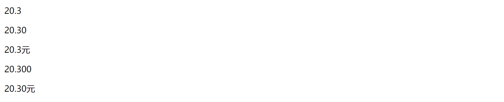
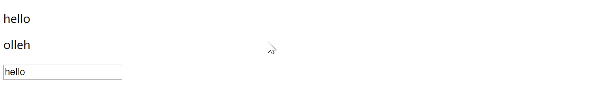
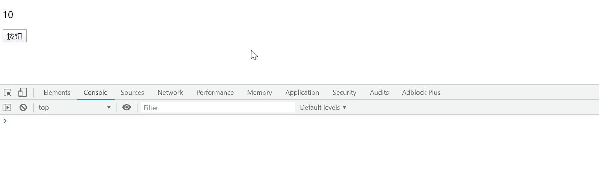
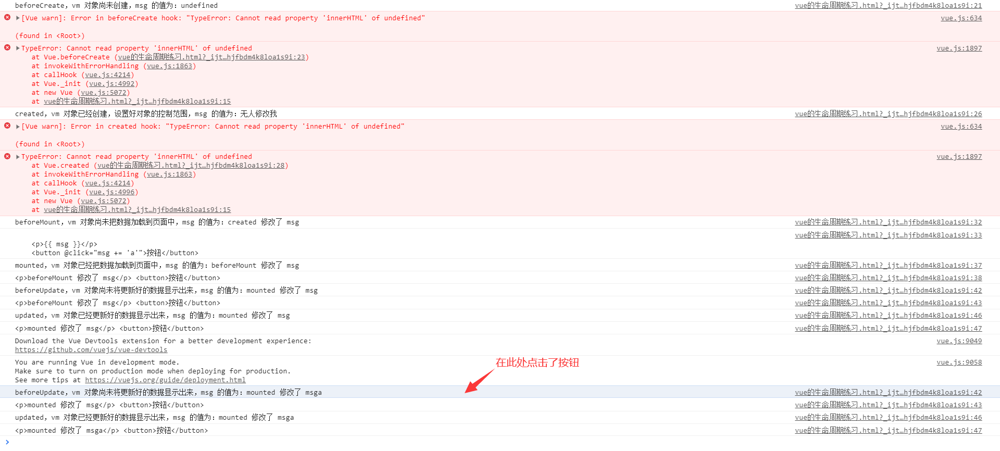
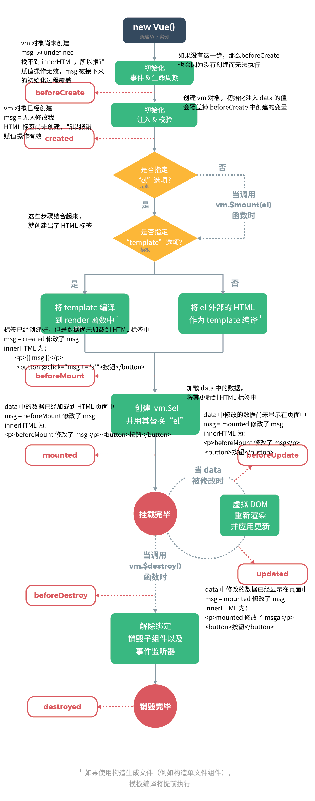
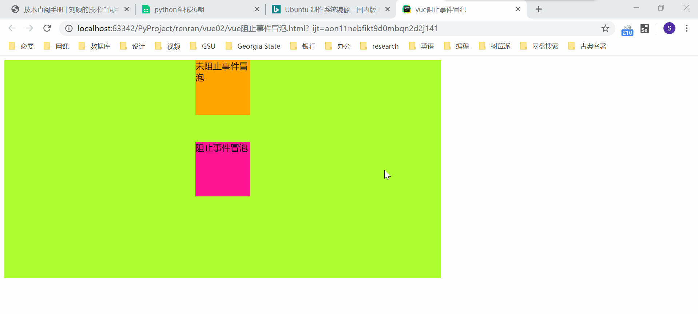
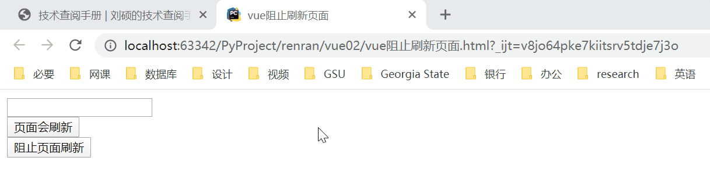
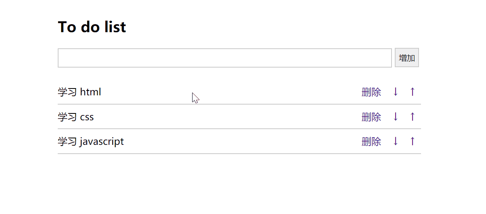

## Vue 对象提供的属性功能

[TOC]

### 过滤器

过滤器，就是vue允许开发者自定义的文本格式化函数，可以使用在两个地方：输出内容和操作数据中。

定义过滤器的方式有两种。

#### 使用 `Vue.filter()` 进行全局定义

这种定义方式对当前文档中所有的 Vue 对象都生效，其基本写法为：

```vue
<p>{{ value|过滤器名 }}</p>

    ...

Vue.filter("过滤器名", function(value, 参数){
    ...
    return '返回值'
})
```

#### 在 vue 对象中通过 filters 属性来定义

这种定义方式只对当前对象 vm 生效，基本写法为

```javascript
var vm = new Vue({
  el:"#app",
  data:{},
  filters:{
    过滤器名:function(value, 参数){
        ...
    },
	}
});
```

#### 过滤器实例：保留指定位数小数点，并在后面加上一个“元”字

示例代码如下：

```vue
<!DOCTYPE html>
<html lang="zh-CN">
<head>
    <meta charset="UTF-8">
    <title>Title</title>
    <script src="js/vue.js"></script>
</head>
<body>
<div id="app">
    <p>{{ price }}</p>
    <p>{{ price.toFixed(2) }}</p>
    <p>{{ price|RMB }}</p>
    <!-- 过滤器可以接收参数 -->
    <p>{{ price|keepdot(3) }}</p>
    <!-- 可以同时使用多个过滤器 -->
    <p>{{ price|keepdot(2)|RMB }}</p>
    <p></p>
</div>
</body>
<script>
    // 全局过滤器，注意这里的filter后面没有s
    // Vue.filter("过滤器名称","调用过滤器时执行的函数")
    Vue.filter('RMB', function (value) {
        return value + '元';
    });
    let vm = new Vue({
        el: '#app',
        data: {
            price: 20.3
        },
        // 普通过滤器（局部过滤器）
        filters: {   // 注意这里是filters，别忘了加s
            keepdot(value, num){
                return value.toFixed(num);
            }
        }
    })
</script>
</html>
```

上面代码执行后的效果为：



#### 过滤器总结

1. 一个数据可以调用多个过滤器，每个过滤器之间使用"|"竖杠隔开。注意过滤器的执行顺序是从左往右执行，所以有可能产生冲突问题。这时候可以尝试调整调用过滤器之间的顺序解决冲突；

2. 过滤器本质上就是一个函数，必须有返回值。否则数据调用了过滤器以后，无法得到处理后的数据结果；
3. vue1.x 版本时，有内置的过滤器。但是官方认为，过多地封装工具给开发者使用会造成框架本身的臃肿。所以在 vue2.x 版本以后把内置的过滤器废除了；
4. 过滤器本质上来说就是函数，而函数不仅只有一个参数。过滤器也支持多个参数的写法。

### 计算和侦听属性

#### 计算属性

我们之前学习过字符串反转。如果直接把反转的代码写在元素中，则会使得其他同事在开发时时不易发现数据被调整。vue 提供了一个计算属性（computed），可以让我们把调整 data 数据的代码存在在该属性中。而且计算结果会随着用来计算的数据的变化而自动更新。

需要注意的是，从名字里面就能看出来，计算属性是属性，不是方法，所以不能有参数。

接下来，我们通过实例，深入了解计算属性的用法：

```vue
<!DOCTYPE html>
<html lang="zh-CN">
<head>
    <meta charset="UTF-8">
    <title>Title</title>
    <script src="js/vue.js"></script>
</head>
<body>
<div id="app">
    <p>{{ str1 }}</p>
    <p>{{ strRevs }}</p>
    <input type="text" v-model="str1">
</div>
</body>
<script>
    let vm = new Vue({
        el: '#app',
        data: {
            str1: 'hello'
        },
        // 通过计算属性computed产生一个新的变量给模板使用
        computed: {   // 计算属性：里面的函数都必须有返回值
            strRevs(){   // 这是strRevs: function(){}的简写形式
                return this.str1.split('').reverse().join('')
            }
        }
    })
</script>
</html>
```

上面代码的运行效果为：



计算属性和过滤器都可以对 data 中的数据进行计算，我们可以通过一个例子，简单做一下对比：

```vue
<!DOCTYPE html>
<html lang="zh-CN">
<head>
    <meta charset="UTF-8">
    <title>Title</title>
    <script src="js/vue.js"></script>
</head>
<body>
<div id="app">
    原价格：{{ price|k(2) }}<br/>
    折扣价：{{ sale_price }}
</div>
</body>
<script>
    let vm = new Vue({
        el: '#app',
        data: {
            price: 20.3,
            sale: 0.6,
        },
        // 过滤器
        filters: {
            k(value, num){    // 过滤器是方法，可以任意使用参数
                return value.toFixed(num)
            }
        },
        // 计算属性
        computed: {
            sale_price(){    // 计算属性是属性，不能有参数
                let s_price = this.price * this.sale;
                return s_price.toFixed(2)
            }
        }

    })
</script>
</html>
```

#### 监听属性

侦听属性（watch），也叫监听属性，主要的作用就是为了实时监听 data 中某个数据变量的变化。在监听的变量发生改变时候，执行其他的代码操作。

侦听属性是一个对象，它的键是要监听的对象或者变量，值一般是函数。当侦听的 data 数据发生变化时，会自定执行的对应函数。这个函数在被调用时，vue 会传入两个形参，第一个是变化前的数据值，第二个是变化后的数据值。

具体使用实例如下：

```vue
<!DOCTYPE html>
<html lang="zh-CN">
<head>
    <meta charset="UTF-8">
    <title>Title</title>
    <script src="js/vue.js"></script>
</head>
<body>
<div id="app">
    <p>{{ num }}</p>
    <button @click="num++">按钮</button>
</div>
</body>
<script>
    let vm = new Vue({
        el: '#app',
        data: {
            num: 10
        },
        watch: {
            // 函数名必须和要修改的变量同名
            num(newval, oldval){  // newval为变化后的新值，oldval为变化前的旧值
                // num 发生变化的时候，要执行的代码
                // 一般这里写的要么是ajax，要么就是改变其他相关变量的代码
                console.log(`num 的数值发生了变化：从 ${oldval} 变成了 ${newval}`)
            }
        }
    })
</script>
</html>
```

上面的代码执行的效果为：



### 在用户输入 url 地址以后，浏览器都干了什么？

1. 拼接 url 地址
2. 把 url 地址发送到 dns 域名解析服务器（网络世界中，不是通过域名识别计算机，而是 IP）
3. 完成 tcp/udp 的程序，把网页内容发送过来
4. 读取网页的原始内容
5. 把网页的 HTML 代码转换成浏览器识别的 HTML DOM 结构对象
6. 把标签的属性逐一完成渲染
7. 把 CSS 的代码读取
8. 把 CSS　的样式添加到 DOM 结构对象中（DOM树）
9. 页面渲染（执行 js 操作）

### vue 对象的生命周期

每个 Vue 对象在创建时都要经过一系列的初始化过程。在这个过程中 `Vue.js` 会自动运行一些叫做生命周期的的钩子函数，我们可以使用这些函数，在对象创建的不同阶段加上我们需要的代码，实现特定的功能。

在这些钩子函数中，需要重点掌握，日后使用较多的有两个：created 和 mounted 方法。

关于 vue 对象的生命周期钩子，我们可以通过 [vue 官方网站](https://cn.vuejs.org/v2/guide/instance.html) 中的一张图片来理解：


我们可以通过代码，测试一下每一个生命周期钩子函数所处的阶段具体是何含义：

```vue
<!DOCTYPE html>
<html lang="zh-CN">
<head>
    <meta charset="UTF-8">
    <title>Title</title>
    <script src="js/vue.js"></script>
</head>
<body>
<div id="app">
    <p>{{ msg }}</p>
    <button @click="msg += 'a'">按钮</button>
</div>
</body>
<script>
    let vm = new Vue({
        el: '#app',
        data: {
            msg: '无人修改我',
        },
        beforeCreate () {
            console.log('beforeCreate，vm 对象尚未创建，msg 的值为：' + this.msg);    //undefined，就是说data属性中的值还没有放
            this.msg = 'beforeCreate 修改了 msg';  // 这个值会在一会儿对象创建时被覆盖掉
            console.log(this.$el.innerHTML);  // 因为对象还未创建，所以找不到而报错
        },
        // 用的居多，一般在这里使用ajax去后端获取数据，然后交给data属性
        created () {
            console.log('created，vm 对象已经创建，设置好对象的控制范围，msg 的值为：' + this.msg);  // 无人修改我，也就是data属性中的值已经初始化放到vm对象中
            this.msg = 'created 修改了 msg';
            console.log(this.$el.innerHTML);  // HTML 标签尚未创建，所以依然找不到，报错
        },
        beforeMount () {
            console.log('beforeMount，vm 对象尚未把数据加载到页面中，msg 的值为：' + this.msg);
            console.log(this.$el.innerHTML);  // <p>{{ msg }}</p>，HTML标签已经生成，只是尚未载入数据
            this.msg = 'beforeMount 修改了 msg'
        },
        // 用的居多，一般在这里使用ajax去后端获取数据然后通过js代码对页面中原来的内容进行更改
        mounted () {
            console.log('mounted，vm 对象已经把数据加载到页面中，msg 的值为：' + this.msg);
            // this.$el 就是我们创建vm对象时指定的el属性，$el表示当前vue.js所控制的元素#app
            console.log(this.$el.innerHTML);  // <p>beforeMount 修改了 msg</p>，数据已经加载进来
            this.msg = 'mounted 修改了 msg'
        },
        // 后面两个简单作为了解吧。需要注意的是，对象初始化创建时，这两个函数也会连通上面的函数一起被执行
        beforeUpdate () {
            console.log('beforeUpdate，vm 对象尚未将更新好的数据显示出来，msg 的值为：' + this.msg);
            console.log(this.$el.innerHTML);
        },
        updated () {
            console.log('updated，vm 对象已经更新好的数据显示出来，msg 的值为：' + this.msg);
            console.log(this.$el.innerHTML);
        },
    })
</script>
</html>
```

上面代码执行后，浏览器终端中显示的内容为：



根据上面代码运行结果得出的结论，我们可以在官方的 vue 生命周期图中，加上备注，从而更加清晰了解 vm 对象的创建过程：



vue 的生命周期钩子函数总结：

1. 在 vue 使用的过程中，如果要初始化操作，把初始化操作的代码放在 mounted 中执行；
2. mounted 阶段就是在 vm 对象已经把 data 数据实现到页面以后。一般页面初始化使用。例如，用户访问页面加载成功以后，就要执行的 ajax 请求；
3. 另一个就是 created，这个阶段就是在 vue对象创建以后，把 ajax 请求后端数据的代码放进 created。

### 阻止事件冒泡和刷新页面

#### 阻止事件冒泡

js 中，子标签事件触发的同时也会导致父标签时间的触发，这种现象被称为事件冒泡。要了解事件冒泡的更多内容，可以参见 [JavaScript 的事件冒泡和事件委托](js-event-bubble.md)。

vue 中，阻止事件冒泡的写法很简单，只需要在标签中绑定的事件后面，加上 `.prevent` 即可，比如可以这样写：

```html
<!DOCTYPE html>
<html lang="zh-CN">
<head>
    <meta charset="UTF-8">
    <title>vue阻止事件冒泡</title>
    <script src="js/vue.js"></script>
    <style>
        .c1 {
            height: 400px;
            width: 800px;
            background-color: greenyellow;
        }
        .c2 {
            margin: auto;
            height: 100px;
            width: 100px;
            background-color: orange;
        }
        .c3 {
            margin: 50px auto;
            height: 100px;
            width: 100px;
            background-color: deeppink;
        }
    </style>
</head>
<body>
<div class="c1" id="app" @click="alert('这里是外层标签 c1')">
    <div class="c2" @click="alert('这里是未阻止事件冒泡的内层标签 c2')">未阻止事件冒泡</div>
    <!-- 在事件后面加上.stop即可阻止事件冒泡 -->
    <div class="c3" @click.stop="alert('这里是阻止事件冒泡的内层标签 c3')">阻止事件冒泡</div>
</div>
</body>
<script>
    let vm = new Vue({
        el: '#app',
        methods: {
            alert (msg) {   // 这个是vm对象的方法
                alert(msg);   // 这个是js的内置函数
            }
        },
    })
</script>
</html>
```

代码执行后的效果为：



#### 阻止刷新页面

button 按钮和 a 标签点击后可能会刷新页面。但是 vue 是不喜欢经常刷新页面的，所以有时需要阻止这些后续步骤的执行。

在 vue 中，可以简单地在标签事件的后面加上 `.prevent` 阻止刷新页面等后续步骤。

通过代码来表示就是这样的：

```html
<!DOCTYPE html>
<html lang="zh-CN">
<head>
    <meta charset="UTF-8">
    <title>vue阻止刷新页面</title>
    <script src="js/vue.js"></script>
</head>
<body>
<div id="app">
    <form action="">
        <div><input type="text"></div>
        <!-- 因为没有绑定点击事件，可以不加@click的，这里是为了证明阻止页面刷新与click本身无关 -->
        <div><input type="submit" value="页面会刷新" @click=""></div>
        <!-- 表现中绑定事件的位置加上.prevent可以阻止后续不必要的操作发生 -->
        <div><input type="submit" value="阻止页面刷新" @click.prevent=""></div>
    </form>
</div>
</body>
<script>
    let vm = new Vue({
        el: '#app',
    })
</script>
</html>
```

上面代码运行的效果如下：



### 综合案例：todolist

我的计划列表。功能：可以对数据中的任务列表进行增删改查操作，可以调整任务的排列顺序。

可以基于下面已经写好样式的 html 代码添加事件进行开发：

```html
<!DOCTYPE html>
<html lang="zh-CN">
<head>
    <meta charset="UTF-8">
    <title>todolist</title>
    <script src="js/vue.js"></script>
	<style type="text/css">
		.list_con{
			width:600px;
			margin:50px auto 0;
		}
		.inputtxt{
			width:550px;
			height:30px;
			border:1px solid #ccc;
			padding:0px;
			text-indent:10px;
		}
		.inputbtn{
			width:40px;
			height:32px;
			padding:0px;
			border:1px solid #ccc;
		}
		.list{
			margin:0;
			padding:0;
			list-style:none;
			margin-top:20px;
		}
		.list li{
			height:40px;
			line-height:40px;
			border-bottom:1px solid #ccc;
		}

		.list li span{
			float:left;
		}

		.list li a{
			float:right;
			text-decoration:none;
			margin:0 10px;
		}
	</style>
</head>
<body>
	<div class="list_con">
		<h2>To do list</h2>
		<input type="text" name="" id="txt1" class="inputtxt">
		<input type="button" name="" value="增加" id="btn1" class="inputbtn">

		<ul id="list" class="list">
			<!-- javascript:; # 阻止a标签跳转 -->
			<li>
				<span>学习html</span>
				<a href="javascript:;" class="up"> ↑ </a>
				<a href="javascript:;" class="down"> ↓ </a>
				<a href="javascript:;" class="del">删除</a>
			</li>
			<li>
                <span>学习css</span>
                <a href="javascript:;" class="up"> ↑ </a>
                <a href="javascript:;" class="down"> ↓ </a>
                <a href="javascript:;" class="del">删除</a>
            </li>
			<li>
                <span>学习javascript</span>
                <a href="javascript:;" class="up"> ↑ </a>
                <a href="javascript:;" class="down"> ↓ </a>
                <a href="javascript:;" class="del">删除</a>
            </li>
		</ul>
	</div>
</body>
</html>
```

特效实现效果：

```html
<!DOCTYPE html>
<html lang="en">
<head>
	<meta charset="UTF-8">
	<title>todolist</title>
	<style type="text/css">
		.list_con{
			width:600px;
			margin:50px auto 0;
		}
		.inputtxt{
			width:550px;
			height:30px;
			border:1px solid #ccc;
			padding:0px;
			text-indent:10px;
		}
		.inputbtn{
			width:40px;
			height:32px;
			padding:0px;
			border:1px solid #ccc;
		}
		.list{
			margin:0;
			padding:0;
			list-style:none;
			margin-top:20px;
		}
		.list li{
			height:40px;
			line-height:40px;
			border-bottom:1px solid #ccc;
		}

		.list li span{
			float:left;
		}

		.list li a{
			float:right;
			text-decoration:none;
			margin:0 10px;
		}
	</style>
    <script src="js/vue.js"></script>
</head>
<body>
	<div id="todolist" class="list_con">
		<h2>To do list</h2>
		<input type="text" v-model="message" class="inputtxt">
		<input type="button" @click="addItem" value="增加" class="inputbtn">
		<ul id="list" class="list">
			<li v-for="item,key in dolist">
				<span>{{item}}</span>
				<a @click="upItem(key)" class="up" > ↑ </a>
				<a @click="downItem(key)" class="down"> ↓ </a>
				<a @click="delItem(key)" class="del">删除</a>
			</li>
		</ul>
	</div>
    <script>
    // 计划列表代码
    let vm = new Vue({
        el:"#todolist",
        data:{
            message:"",
            dolist:[
                "学习html",
                "学习css",
                "学习javascript",
            ]
        },
        methods:{
            addItem(){
                if(this.messsage==""){
                    return false;
                }

                this.dolist.push(this.message);
                this.message = ""
            },
            delItem(key){
                // 删除和替换
                // 参数1: 开始下表
                // 参数2: 元素长度，如果不填默认删除到最后
                // 参数3: 表示使用当前参数替换已经删除内容的位置
                this.dolist.splice(key, 1);
            },
            upItem(key){
                if(key==0){
                    return false;
                }
                // 向上移动
                let result = this.dolist.splice(key,1);
                this.dolist.splice(key-1,0,result[0]);
            },
            downItem(key){
                // 向下移动
                let result = this.dolist.splice(key, 1);
                console.log(result);
                this.dolist.splice(key+1,0,result[0]);
            }
        }
    })
    </script>
</body>
</html>
```

最终的页面效果为：

