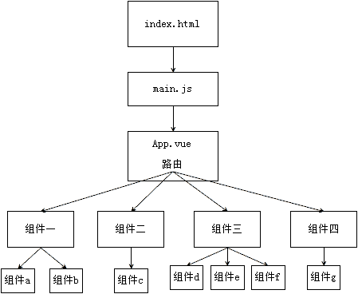

# Vue 自动化工具（VueCLI）脚手架

前面学习了普通组件以后，接下来我们继续学习单文件组件则需要提前先安装准备一些组件开发工具。否则无法使用和学习单文件组件。

一般情况下，单文件组件，我们运行在自动化工具 Vue CLI 中，可以帮我们编译单文件组件。所以我们需要在系统中先搭建 Vue CLI 工具。

官网：https://cli.vuejs.org/zh/

Vue CLI 需要 [Node.js](https://nodejs.org/) 8.9 或更高版本（推荐 8.11.0+）。你可以使用 [nvm](https://github.com/creationix/nvm) 或 [nvm-windows](https://github.com/coreybutler/nvm-windows) 在同一台电脑中管理多个 Node 版本。

nvm工具的下载和安装可以参考下面两篇文章：

- Windows：https://www.jianshu.com/p/d0e0935b150a

- macOS：https://www.jianshu.com/p/622ad36ee020

安装记录:

打开：https://github.com/coreybutler/nvm-windows/releases

安装完成以后,先查看环境变量是否设置好了.


常用的 nvm 命令：

```bash
nvm list   # 列出目前在nvm里面安装的所有node版本
nvm install node版本号      # 安装指定版本的node.js
nvm uninstall node版本号    # 卸载指定版本的node.js
nvm use node版本号          # 切换当前使用的node.js版本	
```

如果使用 nvm 工具，则直接可以不用自己手动下载。如果使用 nvm 下载安装 node 的 npm 比较慢的时候，可以修改 nvm 的配置文件（在安装根目录下）：

```ini
# settings.txt
root: C:\tool\nvm    # 这里的目录地址是安装nvm时自己设置的地址,要根据实际修改
path: C:\tool\nodejs
arch: 64
proxy: none
node_mirror: http://npm.taobao.org/mirrors/node/ 
npm_mirror: https://npm.taobao.org/mirrors/npm/
```

## 安装 node.js

Node.js 是一个新的后端（后台）语言，它的语法和 JavaScript 类似，所以可以说它是属于前端的后端语言，后端语言和前端语言的区别：

- 运行环境：后端语言一般运行在服务器端，前端语言运行在客户端的浏览器上
- 功能：后端语言可以操作文件，可以读写数据库，前端语言不能操作文件，不能读写数据库。

我们一般安装 LTS（长线支持版本 Long-Time Support）：

下载地址：https://nodejs.org/en/download/（上面已经安装了nvm，那么这里不用手动安装了）

node.js 的版本有两大分支：

官方发布的 node.js 版本：0.xx.xx 这种版本号就是官方发布的版本

社区发布的 node.js 版本：xx.xx.x 就是社区开发的版本

Node.js 如果安装成功，可以查看Node.js的版本,在终端输入如下命令：

```bash
node -v
```

## npm

在安装node.js完成后，在node.js中会同时帮我们安装一个npm包管理器npm。我们可以借助npm命令来安装node.js的包。这个工具相当于python的pip管理器。

```shell
npm install -g 包名              # 安装模块   -g表示全局安装，如果没有-g，则表示在当前项目安装
npm list                        # 查看当前目录下已安装的node包
npm view 包名 engines            # 查看包所依赖的Node的版本 
npm outdated                    # 检查包是否已经过时，命令会列出所有已过时的包
npm update 包名                  # 更新node包
npm uninstall 包名               # 卸载node包
npm 命令 -h                      # 查看指定命令的帮助文档
npm install -g npm              # 升级npm
```

因为 npm 大多数服务是在外网，所以速度会比较慢，可以尝试着使用国内的阿里源：http://npm.taobao.org/

```bash
# 临时使用
npm install jquery --registry https://registry.npm.taobao.org

# 可以把这个选型配置到文件中，这样不用每一次都很麻烦
npm config set registry https://registry.npm.taobao.org

# 验证是否配置成功 
npm config list
    # 或者
npm config get registry

# 在任意目录下都可执行,--global是全局安装，不可省略
npm install --global cnpm
    # 或者
npm install -g cnpm --registry=https://registry.npm.taobao.org

# 安装后直接使用
cnpm install jquery
```

## 安装Vue CLI

```bash
npm install -g vue-cli
```

## 使用 Vue CLI 初始化创建前端项目

### 生成项目目录

使用 Vue 自动化工具可以快速搭建单页应用项目目录。

该工具为现代化的前端开发工作流提供了开箱即用的构建配置。只需几分钟即可创建并启动一个带热重载、保存时静态检查以及可用于生产环境的构建配置的项目：

```bash
# 生成一个基于 webpack 模板的新项目
vue init webpack 项目目录名
# 例如
vue init webpack myproject
```

项目初始化过程中，会有如下的步骤：

```bash
moluo@ubuntu:~/Desktop$ vue init webpack myproject

? Project name myproject    # 项目名，命令行已指定
? Project description Very NB de Vue project    # 项目描述
? Author Shuo Liu    # 作者
? Vue build     # 有下面两个选项。临时加编译，最多人用，我们也用这个；仅临时，不会缓存，比较慢
❯ Runtime + Compiler: recommended for most users 
  Runtime-only: about 6KB lighter min+gzip, but templates (or any Vue-specific H
TML) are ONLY allowed in .vue files - render functions are required elsewhere 
? Install vue-router? No    # 是否安装 vue-router，暂时不用，装了目录结构会有差别
? Use ESLint to lint your code? No    # 是否通过 ESLint校验代码，检查语法是否正确，新手不必选
? Set up unit tests No    # 是否选择安装单元测试组件，不需要
? Setup e2e tests with Nightwatch? No   # 是否用 e2e，也不用
? Should we run `npm install` for you after the project has been created? (recom
mended) (Use arrow keys)    # 使用 NPM 还是 Yarn 安装。Yarn 是新的用来取代npm的工具，按需选择。
❯ Yes, use NPM 
  Yes, use Yarn 
  No, I will handle that myself
```

当出现这样的提示的时候，说明安装已经完成：


项目初始化完成后，进入到项目目录中，运行命令启动项目：

```bash
# 启动开发服务器 ctrl+c 停止服务
cd myproject
npm run dev           # 运行这个命令就可以启动node提供的测试http服务器
```

运行了上面代码以后,终端下会出现以下效果提示：


浏览器访问：`http://localhost:8080/`，即可看到 Vue 项目的页面了：


### 项目目录结构

- src 主开发目录，要开发的单文件组件全部在这个目录下的 components 目录下

- static 静态资源目录，所有的 css，js 文件放在这个文件夹

- dist 项目打包发布文件夹，最后要上线单文件项目文件都在这个文件夹中（后面打包项目，让项目中的 vue 组件经过编译变成 js 代码以后，dist 就出现了）

- node_modules 目录是 node 的包目录，

- config 是配置目录，

- build 是项目打包时依赖的目录

- src/router 路由,后面需要我们在使用Router路由的时候,自己声明.


### 项目执行流程图



整个项目是一个主文件 index.html，index.html 中会引入 src 文件夹中的 main.js，main.js 中会导入顶级单文件组件 App.vue，App.vue 中会通过组件嵌套或者路由来引用 components 文件夹中的其他单文件组件。