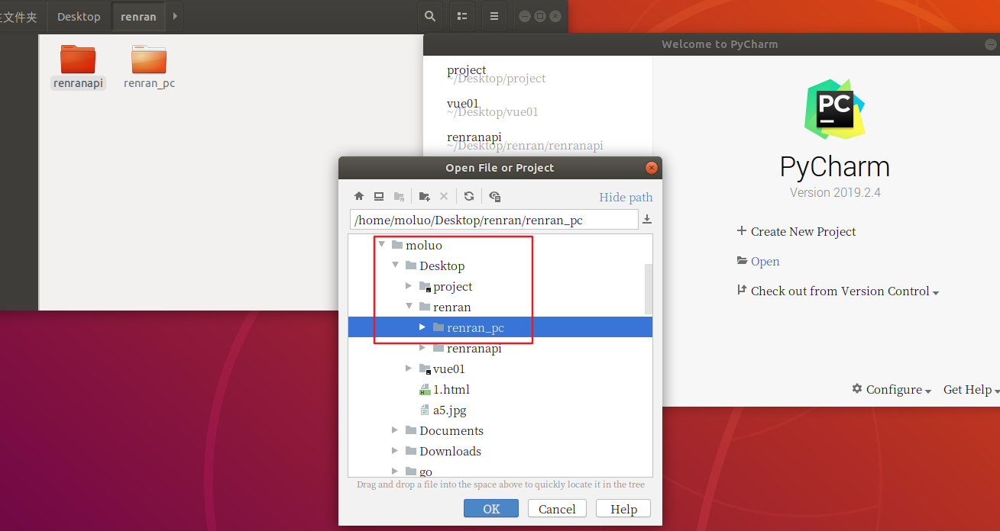
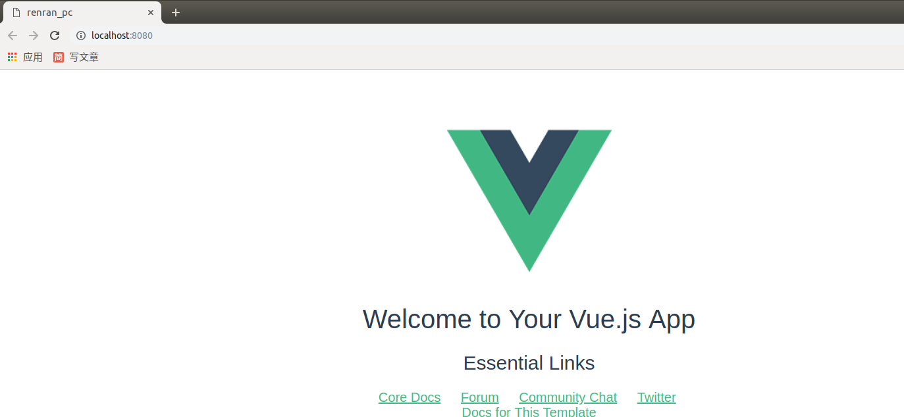
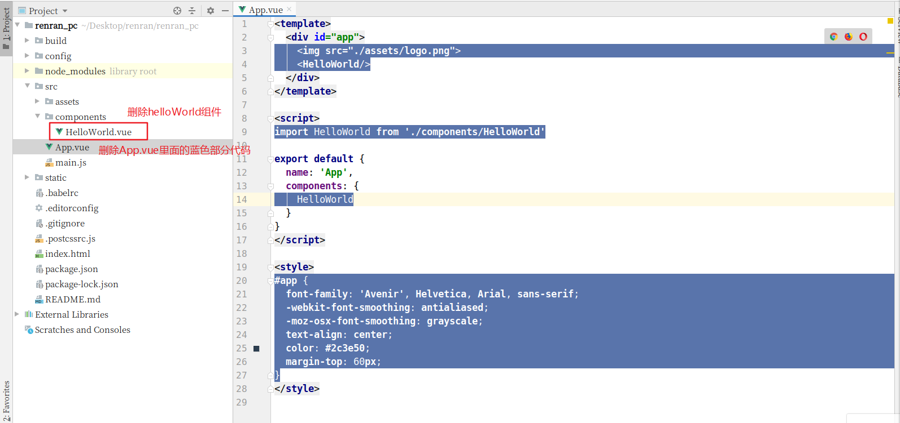
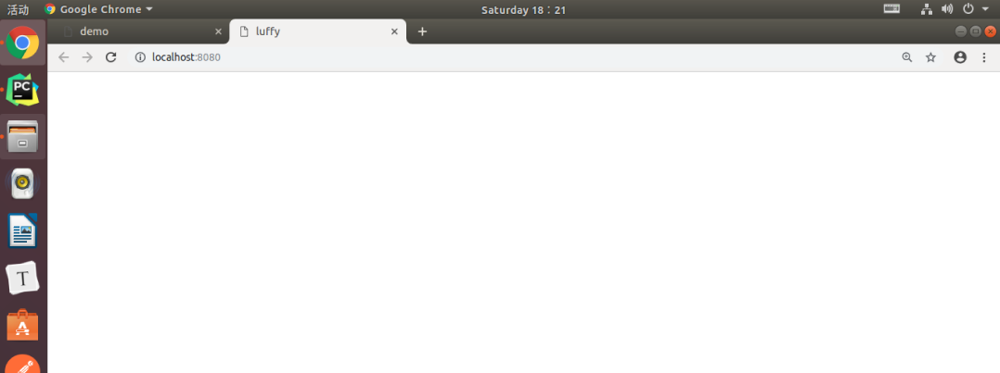
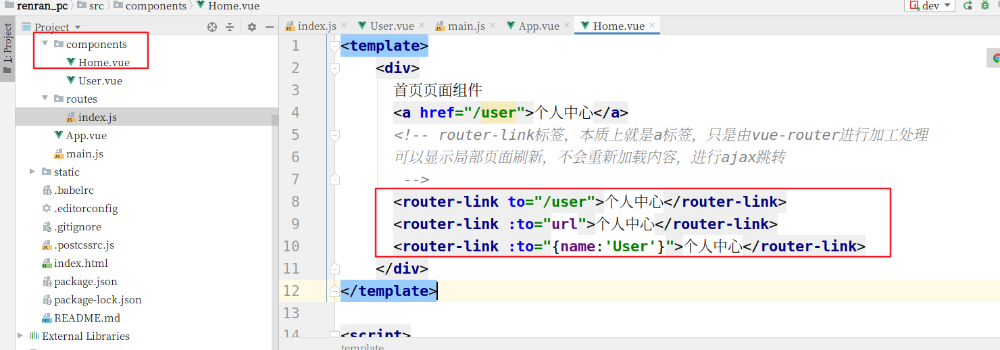
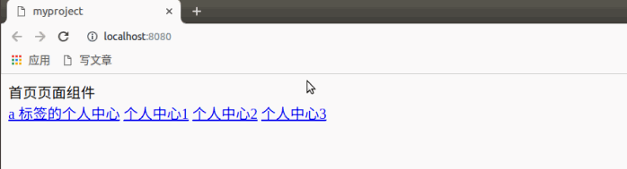
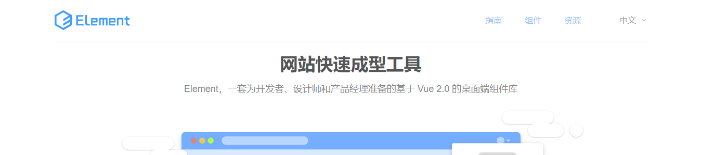
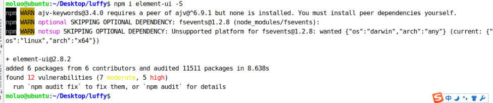

# Vue 客户端项目搭建

## 创建项目目录

使用下面的命令初始化创建一个新的 Vue 项目：

```bash
cd 项目目录
vue init webpack 项目名称
```

例如，我要把项目保存在桌面下 `~/Desktop/renran`，可以如下操作：

```shell
cd Desktop/renran
vue init webpack renran_pc
```



打开项目已经，在 PyCharm 的终端下运行 Vue 项目，查看效果。

```
npm run dev
```

接下来，我们根据终端上效果显示的对应地址来访问项目（如果有多个 Vue 项目在运行，8080 端口被占据了，服务器会自动改端口，所以根据自己实际在操作中看到的地址来访问）。

访问：`http://localost:8080`，即可看到 Vue 项目的页面。




## 初始化项目

清除默认的 `HelloWorld.vue` 组件和 `APP.vue` 中的默认模板代码以及默认 css 样式，删除掉下面标注中的所有内容。



`App.vue` 的最终版本要是这个样子：

```html
<template>
  <div id="app">
  </div>
</template>

<script>
export default {
  name: 'App',
  components: {

  }
}
</script>

<style>
</style>
```

接下来，我们可以查看效果了，干干净净的一张白纸。




## 路由 vue-router

官方文档：https://router.vuejs.org/zh/

### 下载安装路由组件

在终端中输入下面命令之一即可：

```bash
npm i vue-router -S
npm install vue-router --save
```

说明：这两条命令完全等效，第一条命令是第二条命令的简写，`install` 可简写成 `i`。`--save` 意思是保存安装包到本地，以后再次安装可以不必联网，直接从本地获取，可简写为 `-S`。

### 配置路由

#### 初始化路由对象

在 src 目录下创建 routes 路由目录，在 router 目录下创建 `index.js` 路由文件

`index.js` 路由文件中，编写初始化路由对象的代码 .

```javascript
// 1. 引入vue和vue-router组件核心对象，并在vue中通过use注册vue-router组件
import Vue from "vue";
import Router from "vue-router";

Vue.use(Router);

// 2. 暴露vue-router对象，并在vue-router里面编写路由，提供给main.js调用
export default new Router({
  // 设置路由模式为‘history’，去掉默认的#
  mode: "history",
  routes:[
    // 路由列表
	
  ]
})
```

#### 注册路由信息

打开 `main.js` 文件，把 router 路由规则对象注册到 vue 中，分为引入和注册两步，代码：

```javascript
// The Vue build version to load with the `import` command
// (runtime-only or standalone) has been set in webpack.base.conf with an alias.
import Vue from 'vue'
import App from './App'
import router from './router/index'    // 1、引入，这样引入文件那么会直接拿到这个文件中export default后面的对象，export default的意思是将对象暴露出去，让别人可以引入
// import router from '@/router/index'   // @符号表示的是src的目录路径，这样写起来更靠谱一些，因为引入src目录里面的内容的时候就不需要知道当前文件和src目录里面的文件隔着几层了

Vue.config.productionTip = false

/* eslint-disable no-new */
new Vue({
  el: '#app',
  router,    // 2、注册
  components: { App },
  template: '<App/>'
});
```

#### 在视图中显示路由对应的内容

在 `App.vue` 组件中，添加显示路由对应的内容。代码：

```html
<template>
  <div id="app">
    <!-- 标签名必须是这个rouer-view -->
    <router-view/>
  </div>
</template>

<script>
export default {
  name: 'App',
  components: {},
}
</script>

<style>
</style>
```

注意：如果在 vue 创建项目的时候，设置安装 vue-router，则项目会自动帮我们生成上面的 router 目录和 `index.js` 里面的代码，以及自动到 `main.js` 里面注册路由对象。 

### 路由对象提供的操作

在我们安装注册了 vue-router 组件吗以后，vue-router 在 vue 项目中会帮我们在全局范围内所有组件里面创建 2 个对象给我们使用：

1. `this.$router`，可用于在 js 代码中进行页面跳转。
2. `this.$route`，可用于获取地址栏上面的 url 参数。

#### 页面跳转

在 vue-router 提供的操作中， 进行页面跳转有 2 种方式：

1. 使用 `<router-link to="url地址">` 来跳转

2. 在 `<script>` 中使用 `this.$router.push(url地址)` 来跳转

   在 `<script>` 中还可以使用 `this.$router.go(整数)`，表示跳转返回上一页或者上几页，下一个或者下几页

##### router-link 标签

我们可以在 `Home.vue` 组件中，使用 router-link 跳转到 `User.vue` 组件中。

vue-router 除了可以进行组件和 url 地址的绑定（即访问特定的 URL 会返回不同的页面）以外，还可以实现不同组件的页面跳转。

`routes/index.js` 的代码如下：

```javascript
// 1. 引入vue和vue-router组件核心对象，并在vue中通过use注册vue-router组件
import Vue from "vue";
import Router from "vue-router";

Vue.use(Router); // Router是类
// 2. 暴露vue-router对象，并在vue-router里面编写路由，提供给main.js调用

// 导入组件
// import 组件名 from "../components/组件名"
import Home from "../components/Home";
import User from "../components/User";    // 当然要有一个User.vue文件，随便写就行

export default new Router({
  mode:"history",  // 路由地址的显示模式： 默认hash，表示地址栏上面出现#
  routes:[
    // {
    //   name:"路由名称[对应组件的name值，将来用于跳转页面]",
    //   path: "访问url路径",
    //   component: 组件名
    // },
    {
      name:"Home",
      path: "/",
      component: Home
    },{
      name:"User",
      path: "/user",
      component: User
    },
  ],
});
```

`Home.vue` 代码：

```vue
<template>
    <div>
      首页页面组件
      <a href="/user">个人中心</a>
      <!-- router-link标签，本质上就是a标签，只是由vue-router进行加工处理
      可以显示局部页面刷新，不会重新加载内容，可进行ajax跳转 -->
      <router-link to="/user">个人中心</router-link>
      <router-link :to="url">个人中心</router-link>
      <router-link :to="{name:'User'}">个人中心</router-link>
    </div>
</template>

<script>
    export default {
        name: "Home",
        data(){
          return {
              url: "/user",
          }
        },
        methods:{
        }
    }
</script>

<style scoped>
</style>
```



上面代码的运行效果为：



##### `this.$router.push()` 跳转

```vue
<template>
    <div>
      首页页面组件
      <a href="/user">个人中心</a>
      <router-link to="/user">个人中心</router-link>
      <router-link :to="url">个人中心</router-link>
      <router-link :to="{name:'User'}">个人中心</router-link>
      <button @click="jump">个人中心</button>
    </div>
</template>

<script>
    export default {
        name: "Home",
        data(){
          return {
              url: "/user",
          }
        },
        methods:{
          jump(){
              // 开发中可以先进行权限，登录之类的判断，然后再进行跳转
                // this.$router.back(); // 返回上一页，本质上就是 location.back()
                // this.$router.go(-1); // 返回上一页，本质上就是 location.go()
                // this.$router.forward(); // 跳转到下一页，本质上就是 location.forward()
                this.$router.push("/user"); // 跳转到站内的制定地址页面中，本质上就是 location.href
                // 注意,this.$router.push() 不能跳转到其他网站。如果真的要跳转外站，则使用location.href="站外地址，记得加上http://协议"
          }
        }
    }
</script>

<style scoped>
</style>
```

#### 参数传递

vue-router 提供了 `this.$route`，可以让我们接受来自其他页面的附带参数。参数有 2 种：

1. 查询字符串（query string），就是地址栏上面`?`号后面的参数，

   例如：`http://localhost:8008/user?name=xiaoming&pwd=123`，这里 `name=xiaoming&pwd=123` 就是查询字符串参数。

2. 路由参数（router params），就是地址栏上面路由路径的一部分，

   例如：`http://localhost:8080/user/300/xiaoming`，此时，300 属于路由路径的一部分，这个 300 就是路由参数，当然，xiaoming 或者 user 也可以理解是路由参数，就是看我们的页面中是否需要接收而已。

##### 获取查询字符串

1. 必须先有一个页面跳转发送参数。例如，在 Home 组件中跳转到 User 组件中，需要传递 name 和 pwd 查询字符串。

   `Home.vue` 代码：

   ```html
   <template>
       <div>
         首页页面组件
         <router-link :to="`/user?name=${name}&pwd=${pwd}`">查询字符串参数</router-link>
         <router-link :to="'/user?name='+name+'&pwd='+pwd">查询字符串参数</router-link>
       </div>
   </template>
   
   <script>
       export default {
           name: "Home",
           data(){
             return {
                 name: "xiaoming",
                 pwd: "123",
             }
           },
       }
   </script>
   
   <style scoped>
   </style>
   ```
   
2. 可以在下一个页面中，这里代表的就是 User 组件，接收来自 Home 组件的参数。

   ```html
   <template>
       <div>
         用户中心页面组件
       </div>
   </template>
   
   <script>
       export default {
           name: "User",
           created() {
               // 接收地址栏上面的参数
               // this.$route是vue-router提供的一个用于接收地址参数的对象。
               // 经过main.js里面注册router对象以后，
               // 将来在所有的子组件中，可以通过this.$route来获取参数或者通过this.$router跳转页面
               // 查询字符串参数
               // query是this.$route里面的一个数组，this.$route会自动收集地址栏上所有的参数保存到query里面
               // let name = this.$route.query.name;
               // let pwd = this.$route.query.pwd;
               // console.log(`name=${name}&pwd=${pwd}`);  // ``里面，${}圈住的内容会被js当成变量来解析
           }
       }
   </script>
   
   <style scoped>
   </style>
   ```

##### 获取路由参数

例如：我们用户的界面都是一样的，但是每一个用户来到自己的页面中，显示的内容肯定都是不一样的，此时，我们需要使用不同的路径来区分不同的用户。这时候，可以在路由路径中使用路由参数表示不同用户的 id。

例如：我们就需要设置一个 `route/index.js` 中路由信息里面，哪一段路由属于路由参数。

`src/routes/index.js` 设置路由参数。

```javascript
import Vue from "vue";
import Router from "vue-router";

Vue.use(Router);


import Home from "../components/Home";
import User from "../components/User";

export default new Router({
  mode:"history",
  routes:[
    {
      name:"Home",
      path: "/",
      component: Home
    },{
      name:"User",
      path: "/user/:id/img-:img_id",
      component: User
    },
  ],
});
```

然后我们就是在 Home 中如果需要转到 User 里面。

`Home.vue` 代码：

```vue
<template>
    <div>
      首页页面组件
      <router-link to="/user/100/img-10086">路由参数</router-link>
    </div>
</template>

<script>
    export default {
        name: "Home"
    }
</script>

<style scoped>
</style>
```

User.vue，组件中可以通过`this.$route.params`接收路由参数。

```vue
<template>
    <div>
      用户中心页面组件
    </div>
</template>

<script>
    export default {
        name: "User",
        created() {
            // 接收地址栏上面的参数
            // this.$route是vue-router提供的一个用于接收地址参数的对象。
            // 经过main.js里面注册router对象以后，
            // 将来在所有的子组件中，可以通过this.$route来获取参数或者通过this.$router跳转页面

            // 查询字符串参数
            // query是this.$route里面的一个数组，this.$route会自动收集地址栏上所有的参数保存到query里面
            // let name = this.$route.query.name;
            // let pwd = this.$route.query.pwd;
            // console.log(`name=${name}&pwd=${pwd}`);  // ``里面，${}圈住的内容会被js当成变量来解析

            // 路由参数
            // params是this.$route里面的一个数组，this.$route会自动收集路由列表中已经标记为路由参数所有内容保存到params中
            let id = this.$route.params.id;
            console.log(id);
            let img_id = this.$route.params.img_id;
            console.log(`img_id = ${img_id}`);
        }
    }
</script>

<style scoped>
</style>
```

## ElementUI

对于前端页面布局，我们可以使用一些开源的UI框架来配合开发，常用的 UI 框有：bootstap，H-ui 框架，lay-UI 框架，Amaze UI，zui 框架，ElementUI.

Vue 开发前端项目中，比较常用的就是 ElementUI。

ElementUI 是饿了么团队开发的一个 UI 组件框架。这个框架提前帮我们提供了很多已经写好的通用模块，我们可以在 Vue 项目中引入来使用。这个框架的使用类似于我们前面学习的 bootstrap 框架。也就是说，我们完全可以把官方文档中的组件代码拿来就用。有定制性的内容，可以直接通过样式进行覆盖修改就可以了。



中文官网：http://element-cn.eleme.io/#/zh-CN

快速入门文档：http://element-cn.eleme.io/#/zh-CN/component/quickstart

### 安装 ElementUI

项目根目录执行以下命令：

```bash
npm i element-ui -S
```

上面的命令等同于 `npm install element-ui --save`

执行命令效果：



### 配置 ElementUI 到项目中

在 `main.js` 中导入 ElementUI，并调用。代码：

```javascript
// elementUI 导入
import ElementUI from 'element-ui';
import 'element-ui/lib/theme-chalk/index.css';
// 调用插件
Vue.use(ElementUI);
```

成功引入了 ElementUI 以后，接下来我们就可以开始进入前端页面开发。

## 首页

首页采用了上下页面布局，首页是导航栏、轮播图。。。脚部等几个小模块。所以我们可以把首页作为一个组件进行开发，然后把首页的这些小模块作为单独的组件来进行开发。

### 创建首页组件

在 `src/components` 目录下创建文件 Home.vue

代码：

```vue
<template>
  <div id="home">
    首页
  </div>
</template>

<script>
export default {
  name:"Home",
  data(){
    return {
    }
  }
}
</script>

<style scoped>
</style>
```

### 创建首页对应的路由

在 `router/index.js` 中引入 Home 组件，并设置 Home 组件作为首页路由。

代码：

```javascript
import Vue from "vue"
import Router from "vue-router"

// 后面这里引入可以被用户访问的页面组件
import Home from "../components/Home"

Vue.use(Router);

export default new Router({
  // 路由跳转模式，注意使用 history
  mode: "history",

  // 路由规则
  routes:[
    {
      // name:"路由别名",
      name:"Home",
      // path: "路由地址",
      path: "/",
      // component: 组件类名,
      component: Home,
    },
  ]
})
```