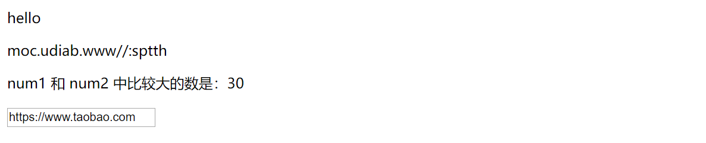
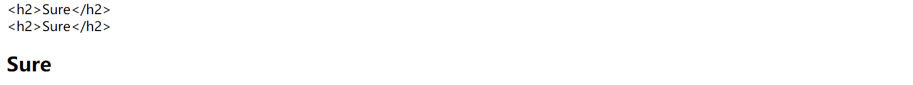
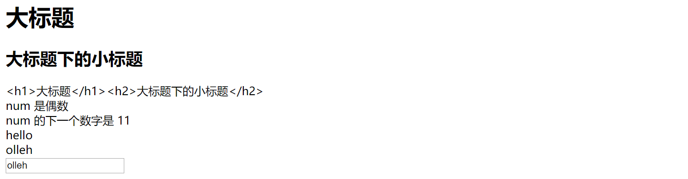
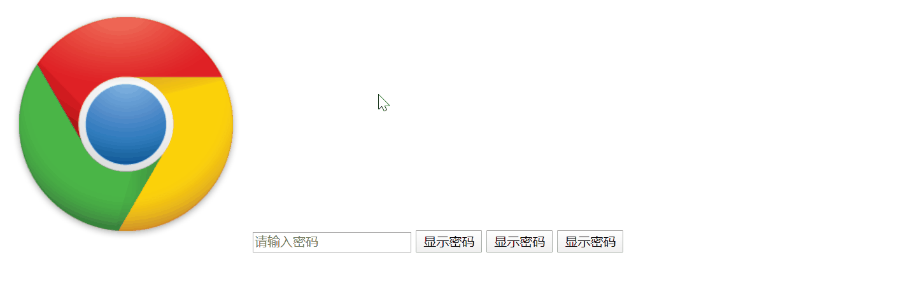
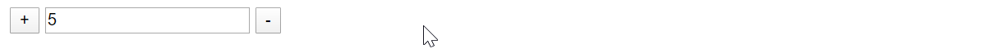
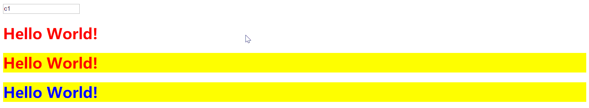
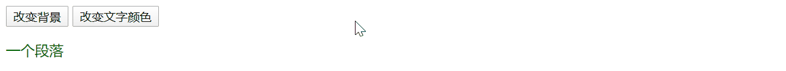
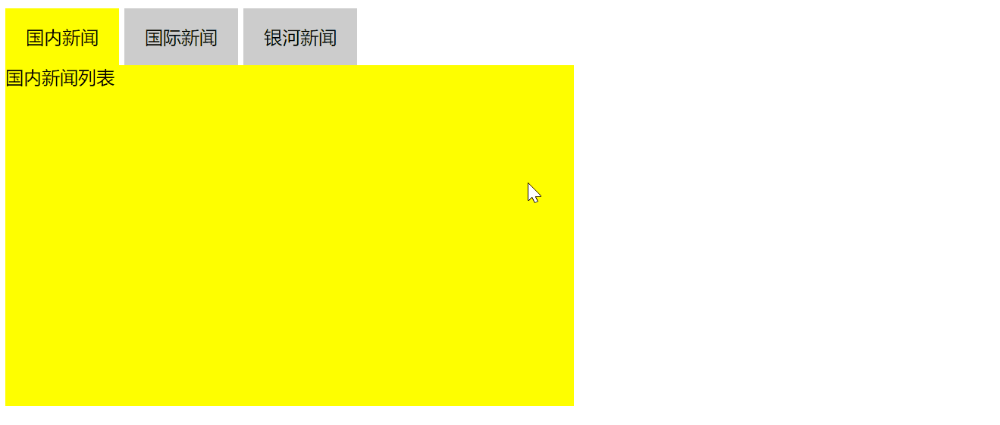
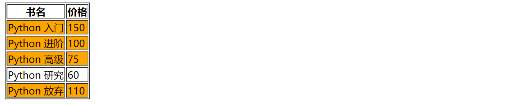

## Vue 指令系统的常用指令

[TOC]


vue 中的指令（Directives）是带有“v-”前缀的特殊属性。每一个指令在 vue 中都有固定的作用。

在 vue 中，提供了很多指令，常用的有：v-if、v-model、v-for 等等。

在 vm 对象的 data 属性的数据发生改变时，网页内容中与其相关的内容或属性也会相应发生变化。

因为 vue 的历史版本原因，所以有一部分指令都有两种写法：

```
vue1.x写法             vue2.x的写法
v-html         ---->   {{ 普通文本 }}   # vue2.x 也支持v-html，输出html代码的内容
v-bind:属性名   ---->   :属性
v-on:事件名     ---->   @事件名
```

### 双花括号显示数据和 v-model 双向数据绑定

1. 在双标签中显示数据要通过一对花括号来完成数据显示
2. 在表单输入框中显示数据要使用 v-model 来完成数据显示

```html
<!DOCTYPE html>
<html lang="zh-CN">
<head>
    <meta charset="UTF-8">
    <title>Title</title>
    <script src="js/vue.js"></script>
</head>
<body>
<div id="app">
    <p>{{ str1 }}</p>
    <p>{{ url1.split('').reverse().join('') }}</p>
    <p>num1 和 num2 中比较大的数是：{{ num1>num2?num1:num2 }}</p>
    <input type="text" v-model="url2">
</div>
</body>
<script>
    let vm = new Vue({
        el: '#app',
        data: {
            str1: 'hello',
            num1: 20,
            num2: 30,
            url1: 'https://www.baidu.com',
            url2: 'https://www.taobao.com',
        }
    })
</script>
</html>
```

上面代码执行出来的效果为：



### 文本指令 v-html 和 v-text

v-text 相当于 js 代码的 innerText，相当于我们上面说的模板语法，直接在 HTML 页面中插入值，插的就是文本。如果 data 里面写了个标签，那么通过模板语法渲染的是文本内容。这个大家不陌生，v-text 就是辅助我们使用模板语法的。事实上，双花括号也是这种，直接把文本显示出来，而不会解析里面的 HTML 代码。

如果要输出能够解析出来的 HTML 代码，则不能使用双花括号或 v-text，而要使用 v-html 来输出。v-html 相当于js 代码中的 innerHtml。

v-text 和 v-html 需要在 HTML 标签里面作为属性写出来，其用法如下：

```html
<!DOCTYPE html>
<html lang="zh-CN">
<head>
    <meta charset="UTF-8">
    <title>Title</title>
    <script src="js/vue.js"></script>
</head>
<body>
<div id="app">
    <div>{{ msg }}</div>
    <div v-text="msg"></div>
    <div v-html="msg"></div>
</div>
</body>
<script>
    let vm = new Vue({
        el: '#app',
        data () {  // 组件中的data必须是函数，vm对象中的data可以是自定义对象也可以是函数
            // 此时的data是一个函数，函数中return一个对象，可以是一个空对象，但必须return
            return {
                msg: '<h2>Sure</h2>' // 后端返回的是标签，可以通过v-html渲染出来标签效果
            }
        }
    })
</script>
</html>
```

上面的代码执行效果为：



### vue 显示数据的方式小结

1. 双花括号、v-text 和 v-html 是将数据放到一对标签中间，操作的标签将数据包裹起来；v-model 双向数据绑定是针对 input 标签的显示，会根据输入框中的内容即时修改数据的值

2. 可以在普通标签中使用双花括号或者 v-text 来输出 data 里面的数据：

   ```vue
   <div>{{ msg }}</div>
   <div v-text="msg"></div>
   ```

3. 若代码中含有需要解析渲染的 HTML 标签语句，则需要使用 v-html 让数据中的 HTML 标签生效：

   ```html
   <div v-html="msg"></div>
   ```

4. 可以在表单标签中使用 v-model 属性来输出 data 里面的数据，data 里面的数据会随着输入框中数据的修改而自动更新：

   ```html
   <input type="text" v-model="username">
   ```

### vue 指令中的 JavaScript 代码

双花括号、v-model、v-html 或者 v-text 等 vue 提供的属性都支持 js 代码。

在这里补充一点 js 知识：三元运算符。

三元运算符是 if 条件语句的简要写法，其基本结构为：

```js
判断条件 ? 条件为true : 条件为false的结果
```

最左侧写的是判断条件。若条件为真，则返回问号后面冒号左侧的值；若条件为假，则返回冒号右侧的值。

对比 Python 中三元表达式（三目运算符）的写法：

```
a if 条件 else b
```

若条件为真则返回 a，为假则返回 b。

具体使用，比如返回 a 和 b 两个数字中最大的那个值，用三元运算符可以这样表示：

```js
a > b ? a : b
```

现在回到我们的主题，在 vue 的指令中可以写入 js 代码。不过一般我们只会写一些简单的表达式，复杂逻辑还是要写在函数中去。

接下来，我们通过实例，深入了解一下这个功能：

```vue
<!DOCTYPE html>
<html lang="zh-CN">
<head>
    <meta charset="UTF-8">
    <title>Title</title>
    <script src="js/vue.js"></script>
</head>
<body>
<div id="app">
    <div v-html="text + '<h2>大标题下的小标题</h2>'"></div>
    <div v-text="text + '<h2>大标题下的小标题</h2>'"></div>
    <div>num 是{{ num%2?'奇数':'偶数' }}</div>
    <div>num 的下一个数字是 {{ num + 1 }}</div>
    <div>{{ msg }}</div>
    <div>{{ msg.split('').reverse().join('') }}</div>
    <input type="text" v-model="msg.split('').reverse().join('')">
</div>
</body>
<script>
    let vm = new Vue({
        el: '#app',
        data () {
            return {
                text: '<h1>大标题</h1>',
                num: 10,
                msg: 'hello'
            }
        }
    })
</script>
</html>
```

上面的代码的执行效果为：



### 操作属性 v-bind

通过 vue 可以直接操作 HTML 标签中的各种属性，其格式为：

```vue
<标签名 :标签属性="data属性"></标签名>
```

举例来说，可以写成这样：

```vue
<p :title="str1">{{ str1 }}</p> <!-- 也可以使用v-html显示双标签的内容，{{  }} 是简写 -->
<a :href="url2">淘宝</a>
<a v-bind:href="url1">百度</a>  <!-- v-bind是vue1.x版本的写法 -->
```

我们可以通过控制 input 标签的 type 属性，实现通过点击按钮，显示或隐藏密码的效果（这里面的 `@click` 是鼠标点击之后会进行的操作，我们稍后会讲到）：

```vue
<!DOCTYPE html>
<html lang="zh-CN">
<head>
    <meta charset="UTF-8">
    <title>Title</title>
    <script src="js/vue.js"></script>
</head>
<body>
<div id="app">
    
    <input :type="type" :placeholder="pwd_msg">
    <!--切换密码显示或隐藏的写法。但是一般不建议将这么复杂的逻辑直接写到属性值里面，一般通过事件操作来玩，接下来很快就会说到事件操作-->
    <button @click="type==='text'?type='password':type='text'">显示/隐藏密码</button>
</div>
</body>
<script>
    let vm = new Vue({
        el: '#app',
        data () {
            return {
                img_url: 'https://addons.cdn.mozilla.net/user-media/previews/thumbs/160/160430.png',
                title: 'Chrome logo',
                pwd_msg: '请输入密码',
                type: 'password'
            }
        }
    })
</script>
</html>
```

上面的代码的执行效果为：


上面的列子也可以用类似于下面这种通过类值控制的写法来实现，但必须是一对花括号包裹，因为它的数据类型需要是自定义对象，这一点我们过会儿也会谈到，此时先了解一下即可：

```vue
<p v-bind:class="{active:status===false}">你是个 p</p>
<p v-bind:class="{active:status}">你是个 p</p>
```

### 事件绑定 v-on 和 vue 中的方法

vue 事件操作的写法有两种，`@事件名` 和 `v-on:事件名`。具体来说，就是写成这样：

```html
<button v-on:click="num++">按钮</button>   <!-- v-on 是vue1.x版本的写法 -->
<button @click="num+=5">按钮2</button>
```

总结起来说，事件绑定的规则为：

1. 使用 `@事件名` 的形式来进行事件的绑定，其语法为（所有标签都支持点击事件，不仅仅是按钮和链接）：

   ```vue
   <h1 @click="num++">{{num}}</h1>
   ```

2. 几乎所有的 js 事件都有其对应的 vue 事件，只需要把 js 事件名前的 `on` 改为 `@` 即可：

   ```
   @submit   --->  onsubmit
   @focus    --->  onfocus
   ...
   ```

3. 点击事件中既可以直接写 js 语句，也可以通过事件调用 vm 对象中的方法。若调用的方法不需要参数，可以直接写方法名而不加括号；若调用的方法需要参数，可以使用一般函数调用的方式，即 `函数名(参数)` 的形式调用：

   ```vue
   <h1 @click="num++">{{num}}</h1>
   <h1 @click="add">{{num}}</h1>    <!-- 若无参数，可以直接写方法名 -->
   <h1 @click="add(2)">{{num}}</h1>    <!-- 若有参数，可以写括号带参数 -->
   ```

   vue 的方法写在 vm 对象的 methods 中，例如：

   ```js
   let vm = new Vue({
       el: '#app',
       data: {
           num: 10
       },
       methods: {
           add(n){    // 这是add:function(){}的简写
               this.num += n    // this指代vue对象
           }
       }
   })
   ```

接下来，我们通过两个实例，更加深入了解 vue 的事件绑定的写法

#### 实例 1：wifi 密码切换显示

这个例子我们在前面的 [操作属性 v-bind](#操作属性 v-bind) 中已经有所讨论。在这里我们为其增加一点功能，能够在每一次点击后，改变按钮中显示的文字内容：

```vue
<!DOCTYPE html>
<html lang="zh-CN">
<head>
    <meta charset="UTF-8">
    <title>Title</title>
    <script src="js/vue.js"></script>
</head>
<body>
<div id="app">
    
    <input :type="type" :placeholder="pwd_msg">
    <button @click="pwd_action">{{ btn_msg }}</button>
    <!--vue1版本的写法-->
    <button v-on:click="pwd_action">{{ btn_msg }}</button>
    <!--事件名称都是按照js中的事件名称来的，所以可以使用的事件很多，都可以用类似的格式来写-->
    <button @mouseover="pwd_action">{{ btn_msg }}</button>
</div>
</body>
<script>
    let vm = new Vue({
        el: '#app',
         // 在data可以定义当前vue对象调用的属性，调用格式: this.变量名，例如：this.title
        data () {
            return {
                img_url: 'https://addons.cdn.mozilla.net/user-media/previews/thumbs/160/160430.png',
                title: 'Chrome logo',
                pwd_msg: '请输入密码',
                type: 'password',
                btn_msg: '显示密码'
            }
        },
        methods: {  // 在methods中可以定义当前vue对象调用的方法，调用格式：this.方法名()，例如： this.pwd_action()
            pwd_action(){
                // alert(this.type); // 调用上面的data里面的数据
                if (this.type === 'password') {
                    this.type = 'text';
                    this.btn_msg = '隐藏密码';
                } else {
                    this.type = 'password';
                    this.btn_msg = '显示密码'
                }
            }
        }
    })
</script>
</html>
```

上面代码的执行效果为：



#### 实例2：完成商城购物车中的商品增加减少数量

这个例子完成一共可以分为两个步骤：

1. 给vue对象添加操作数据的方法（js）
2. 在标签中使用指令调用操作数据的方法（HTML）

有了思路，我们就可以完成我们的代码了：

```vue
<!DOCTYPE html>
<html lang="zh-CN">
<head>
    <meta charset="UTF-8">
    <title>Title</title>
    <script src="js/vue.js"></script>
</head>
<body>
<div id="box">  <!-- 这里是box所以下面vue的el绑定的也应该用box -->
    <button @click="num++">+</button>
    <input type="number" v-model="num">
    <button @click="sub">-</button>
    <!-- 像上面那样直接写--也可以实现自减的效果，但是单纯地使用--时，数据会出现负数。负数是不合理的，所以要加判断。因为逻辑复杂一些，直接写在属性值里面不太好，就将其写成事件放到方法里 -->
</div>
</body>
<script>
    let vm = new Vue({
        el: '#box',
        data () {
            return {
                num: 5,
            }
        },
        methods: {
            sub(){    // 这是sub:function(){}的缩写
                this.num = this.num<=1?0:(this.num - 1)
            }
        }
    })
</script>
</html>
```

顺便介绍一个简便的创建上面多个标签的方式，对于包括 PyCharm 在内的很多编辑工具都适用：

1. 在需要的位置输入 `#box>(button+input+button)`
2. 按下 tab 键

上面的代码执行效果为：



### 操作样式

#### 控制标签 class 类名

这个原理就是 class 本身就是标签的属性，所以可以直接由 v-bind 来控制，其格式为：

```vue
<h1 :class="值">元素</h1>  <!-- 值可以是字符串、对象、对象名、数组 -->
```

若 class 的值只有一个，可以将其设置成某个值，将其作为变量存放在 vm 对象的 data 中：

```vue
<div :class='cls'>...</div>

    ...

data:{
    cls: 'classname',
},
```

若 class 有多个值，可以通过数组的方式传递：

```vue
<div :class='cls'>...</div>

    ...

data:{
    cls: ['classname1', 'classname2', 'classname3'],
},
```

更常用的方式还是通过自定义对象来控制 class 的某一个特定类值是否生效。自定义对象的键为类名，值为真则类名生效，为假则类名不生效（下面的例子中，只有 classname2 生效）：

```vue
<div :class='cls'>...</div>
<p :class="{box1:myclass1}">一个段落</p>

    ...

data:{
    myclass1: false,
    cls: {'classname1': false, 'classname2': true, 'classname3': false},
},
```

下面的代码演示了如上三种控制标签 class 类名的方法：

```vue
<!DOCTYPE html>
<html lang="zh-CN">
<head>
    <meta charset="UTF-8">
    <title>Title</title>
    <script src="js/vue.js"></script>
    <style>
        .c1{
            color: red;
        }
        .c2{
            color: blue;
        }
        .c3{
            background-color: yellow;
        }
    </style>
</head>
<body>
<div id="app">
    <input type="text" v-model="cls">
    <h1 :class="cls">Hello World!</h1>
    <h1 :class="cls_array">Hello World!</h1>
    <h1 :class="cls_obj">Hello World!</h1>
</div>
</body>
<script>
    let vm = new Vue({
        el: '#app',
        data(){
            return {
                cls: 'c1',   // 单个类名
                cls_array: ['c1', 'c3'],  // 多个类名
                cls_obj: {'c1': true, 'c2': false, 'c3': true} // 多个可控类名
            }
        }
    })
</script>
</html>
```

上面的代码执行效果为：



接下来，再通过一个实例，加深第三种通过自定义对象控制类值的用法理解。点击按钮改变文字样式：

```vue
<!DOCTYPE html>
<html lang="zh-CN">
<head>
    <meta charset="UTF-8">
    <title>Title</title>
    <script src="js/vue.js"></script>
    <style>
        .c1{
            background-color: indianred;
        }
        .c2{
            color: green;
        }
    </style>
</head>
<body>
<div id="app">
    <!--- 添加class类名，值是一个对象
    {
    class类1:布尔值变量1,
    class类2:布尔值变量2,
    }
    -->
    <button @click="cls.c1=!cls.c1">改变背景</button>
    <button @click="cls.c2=!cls.c2">改变文字颜色</button>
    <p :class="cls">一个段落</p>
</div>
</body>
<script>
    let vm = new Vue({
        el: '#app',
        data(){
            return {
                cls: {
                    c1: false, // 布尔值变量如果是false，不会添加对象的属性名作为样式
                    c2: true,  // 布尔值变量如果是true，则不会添加对象的属性名作为样式
                },
            }
        }
    })
</script>
</html>
```

上面的代码执行效果为：



我们还可以批量给元素增加多个 class 样式类对象：

```vue
<style>
    .box6{
        background-color: red;
    }
    .box7{
        color: green;
    }
    .box8{
        border: 1px solid yellow;
    }
</style>
<div id="app2">
    <p :class="[mycls1,mycls2]">第三个段落</p>
</div>
<script>
    let vm3 = new Vue({
        el:"#app2",
        data:{
            mycls1:{
                box6:true,
                box7:true,
            },
            mycls2:{
                box8:true,
            }
        }
    })
</script>
```

给元素绑定 class 类名，最常用的就是将 class 信息作为自定义对象存储在 data 中。HTML 标签以变量的形式调用。比如，vue 对象的 data 数据存储为这样：

```js
data:{
    myObj:{
        complete:true,
        uncomplete:false,
    }
}
```

在 HTML 中通过这种方式调用：

```vue
<div class="box" :class="myObj">2222</div>
```

最终浏览器中得到的效果为：

```html
<div class="box complete">2222</div>
```

#### 控制标签 style 样式

首先提一嘴，在正常的工作开发环境中，一般要尽量避免直接在标签中写 style 属性来控制样式。因为这对后期维护很不友好。样式一般都写在专门的 css 文件中，最不济也要写在文档头部的 style 标签中。

因此，前面的通过 class 类名控制样式的方式在正常的工作环境中最为常用。不太建议通过这个 style 来控制样式。这里简要介绍一下通过操作标签中的 style 属性控制样式的方式。

道理同 class 类值的操控类似，本质上还是操作标签中的 style 属性，所以格式是 `:style="样式对象"`。样式以对象键值对的形式存储在样式对象中，CSS 样式名为键，样式值为值。需要注意的是，样式名中或许会存在 `-`，比如 `background-color`、`margin-top` 等。如果将他们直接写到对象的键里面是非法的，因为减号有特殊的含义。此时，有两种改进方式。第一种，是用引号把键名包裹起来，让其成为字符串的形式，比如 `'margin-top'`。第二种，就是将有特殊意义的 `-` 去掉，把样式写成驼峰体，比如 `marginTop`。

通过控制 style 操作样式的写法有三种格式：

1. 值是 js 对象，对象写在元素的 `:style` 属性中：

   ```vue
   <div :style="{color: activeColor, fontSize: fontSize + 'px' }"> ... </div>
   
       ...
   
   data: {
       activeColor: 'red',
       fontSize: 30,
   }
   ```

2. 值是对象变量名，对象在 data 中进行声明：

   ```vue
   <div v-bind:style="styleObject"> ... </div>
   
       ...
   
   data: {
       styleObject: {
           color: 'red',
           fontSize: '13px',
       }
   }
   ```

3. 值是数组，数组里面存放的是 js 对象：

   ```vue
   <div v-bind:style="[style1, style2]"> ... </div>
   
       ...
   
   data: {
       style1:{
           color:"red"
       },
       style2:{
           background:"yellow",
           fontSize: "21px"
       }
   }
   ```

#### 实例：vue 版本选项卡

```html
<!DOCTYPE html>
<html lang="zh-CN">
<head>
    <meta charset="UTF-8">
    <title>Title</title>
    <script src="js/vue.js"></script>
    <style>
        #card{
            width: 500px;
            height: 350px;
        }
        .title{
            height:50px;
        }
        .title span{
            width: 100px;
            height: 50px;
            background-color:#ccc;
            display: inline-block;
            line-height: 50px; /* 设置行和当前元素的高度相等,就可以让文本内容上下居中 */
            text-align:center;
        }
        .content .list{
            width: 500px;
            height: 300px;
            background-color: yellow;
            display: none;
        }
        .content .active{
            display: block;
        }

        .title .current{
            background-color: yellow;
        }
    </style>
</head>
<body>

    <div id="card">
        <div class="title">
            <span @click="num=0" :class="num==0?'current':''">国内新闻</span>
            <span @click="num=1" :class="num==1?'current':''">国际新闻</span>
            <span @click="num=2" :class="num==2?'current':''">银河新闻</span>
            <!--<span>{{num}}</span>-->
        </div>
        <div class="content">
            <div class="list" :class="num==0?'active':''">国内新闻列表</div>
            <div class="list" :class="num==1?'active':''">国际新闻列表</div>
            <div class="list" :class="num==2?'active':''">银河新闻列表</div>
        </div>
    </div>
    <script>
        // 思路：
        // 当用户点击标题栏的按钮（span标签）时，显示对应索引下标的内容块[.list]
        // 代码实现：
        var card = new Vue({
            el:"#card",
            data:{
                num:0,
            },
        });
    </script>

</body>
</html>
```

代码运行效果：



### 条件渲染指令

vue 中提供了两个指令可以用于判断是否要显示元素，分别是 v-if 和 v-show。

#### v-if

若对应的值为真，则会显示标签；若为假，则标签不显示（其实是干脆不会生成，可以在浏览器中检查标签结构）。其写法为：

```vue
<h1 v-if="ok">Yes</h1>    <!-- vue对象最终会把条件的结果变成布尔值 -->

    ...

data:{
    ok:false    // true则是显示，false是隐藏
}
```

#### v-else

v-else 指令来表示 v-if 的“else 块”。v-else 元素必须紧跟在带 v-if 或者 v-else-if 的元素的后面，否则它将不会被识别，其用法为：

```vue
<h1 v-if="ok">Yes</h1>
<h1 v-else>No</h1>    <!-- 这个标签会在v-if标签显示时隐藏，在v-if隐藏时显示 -->

    ...

data:{
    ok:false
}
```

#### v-else-if

在 vue2.1.0 版本之后，又添加了 v-else-if。v-else-if，顾名思义，就是充当 v-if 的“else-if 块”，可以连续使用，类似于 Python 中的 elif 的作用。

可以出现多个 v-else-if 语句，但是 v-else-if 之前必须有一个 v-if 开头。后面可以跟着 v-else，也可以没有。

```vue
<h1 v-if="num===1">num 的值为 1</h1>
<h1 v-else-if="num===2">num 的值为 2</h1>
<h1 v-else>num 的值是 {{num}}</h1>

    ...

data:{
    num: 2
}
```

#### v-show

用法和 v-if 大致一样，区别在于 2 点：

1. v-show 后面不能 v-else 或者 v-else-if
2. v-show 隐藏元素时，使用的是 `display:none` 来隐藏的，而 v-if 是直接从 HTML 文档中移除元素（DOM 操作中的 remove）

```vue
<h1 v-show="ok">Hello!</h1>

    ...

data:{
    ok:false    // true则是显示，false是隐藏
}
```

#### v-if 和 v-show 总结

1. v-show 后面不能使用 v-else 或者 v-else-if

2. v-show 隐藏元素时，使用的是 `display:none` 来隐藏的，而 v-if 是直接从 HTML 文档中移除元素（DOM 操作中的 remove）

3. v-if 是“真正”的条件渲染，因为它会确保在切换过程中条件块内的事件监听器和子组件适当地被销毁和重建。

4. v-if 也是惰性的：如果在初始渲染时条件为假，则什么也不做——直到条件第一次变为真时，才会开始渲染条件块

5. 相比之下，v-show 就简单得多——不管初始条件是什么，元素总是会被渲染，并且只是简单地基于 CSS 进行切换

6. 一般来说，v-if 有更高的切换开销，而 v-show 有更高的初始渲染开销。因此，如果需要非常频繁地切换，则使用 v-show 较好；如果在运行时条件很少改变，则使用 v-if 较好

### 列表渲染指令 v-for

在 vue 中，可以通过 v-for 指令可以将一组数据渲染到页面中，数据可以是数组或者对象。因为我们常常用这个指令生成列表，所以也被称作列表渲染指令。

当数据是数组时，其用法为：

```vue
<ul>
    <!--v-for写在需要循环的标签中，book是列表的每一个元素-->
    <li v-for="book in book_list" :key="book.id">{{book.title}}</li>
</ul>

<ul>
    <!--可以多加一个参数接收第二个变量index，index是列表中每个元素的下标-->
    <li v-for="(book, index) in book_list" :key="book.id">第{{ index + 1 }}本图书：{{ book.title }}</li>
    <!--  <li v-for="(item,index) in book_list" :key="item.id" @click=" ... "> 还可以给每一个元素绑定事件 -->
</ul>

    ...

data:{
    book_list:[
        {"id": 1,"title": "图书名称 1","price": 200},
        {"id": 2,"title": "图书名称 2","price": 300},
        {"id": 3,"title": "图书名称 3","price": 400},
        {"id": 4,"title": "图书名称 4","price": 500},
    ]
}
```

建议大家按照上面的写法中，在 v-for 的标签里面加一个东西 `:key`，也就是 `v-bind:key`，虽然一般不写也不会影响显示效果。这个 key 是为了给现在已经渲染好的 li 标签做个标记。以后即便是有数据更新了，也可以在这个 li 标签里面进行数据的更新，不需要再让 Vue 做重新生成 li 标签的 DOM 操作，提高页面渲染的性能。因为我们知道频繁地添加删除 DOM 操作对性能是有影响的。我现在将数据中的 id 绑定到这里。如果数据里面有 id，一般都用 id，如果没有 id，就绑定 v-for 里面那个 index（当然看你给这个索引取的变量名是什么，我这里给索引取的名字是 index）。这里面它用的是 diff 算法，可以去了解一下。

v-for 的优先级最高。先把 v-for 遍历完，然后给 `:key` 加数据。还有，如果没有 bind 这个 key，有可能你的页面都后期用动态数据渲染的时候，会出现问题。所以以后在写条件渲染指令时，尽量写上 `v-bind:key`。

v-for 不仅可以遍历数组，还可以遍历对象。其用法和数组类似，也有两个返回值，第一个为对象的每一个值，第二个为对象的键：

```vue
<ul>
    <!--value是对象中的每一个值-->
    <li v-for="value in book">{{value}}</li>
</ul>
<ul>
    <!-- value是每一个值，attr是每一个键名，建议按照这种写法，加上:key的属性 -->
    <li v-for="(value, attr) in book" :key="attr">{{attr}}:{{value}}</li>
</ul>

    ...

data:{
    book: {
        // "attr属性名":"value属性值"
        "id":11,
        "title":"图书名称1",
        "price":200
    },
}
```

实例：输出数据到表格中

由如下数据信息：

```js
goods:[
	{"name": "Python 入门", "price": 150},
	{"name": "Python 进阶", "price": 100},
	{"name": "Python 高级", "price": 75},
	{"name": "Python 研究", "price": 60},
	{"name": "Python 放弃", "price": 110},
]
```

要求：把上面的数据采用 table 表格输出到页面，价格大于 60 的数据需要添加背景色橙色（orange）。

使用列表渲染指令配合条件，很容易就能实现要求中的功能，代码如下：

```vue
<!DOCTYPE html>
<html lang="zh-CN">
<head>
    <meta charset="UTF-8">
    <title>Title</title>
    <script src="js/vue.js"></script>
    <style>
        .orangeColor {
                background-color: orange;
            }
    </style>
</head>
<body>
<div id="app">
    <table border="1px">
        <thead>
        <tr>
            <th>书名</th>
            <th>价格</th>
        </tr>
        </thead>
        <tbody>
        <!-- 循环加判断，若价格高于60，则增加背景颜色 -->
        <tr v-for="(info, index) in goods" :key="index" :class="{orangeColor: info.price>60}">
            <td>{{ info.name }}</td>
            <td>{{ info.price }}</td>
        </tr>
        </tbody>
    </table>
</div>
</body>
<script>
    let vm = new Vue({
        el: '#app',
        data: {
            goods:[
                {"name": "Python 入门", "price": 150},
                {"name": "Python 进阶", "price": 100},
                {"name": "Python 高级", "price": 75},
                {"name": "Python 研究", "price": 60},
                {"name": "Python 放弃", "price": 110},
            ],
        }
    })
</script>
</html>
```

代码的执行效果如下：

