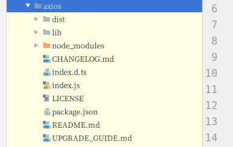
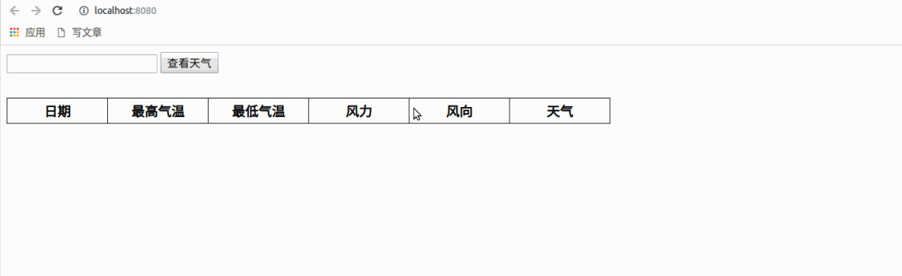

## 在组件中使用 axios 获取数据

### axios 的安装和导入

默认情况下，我们的项目中并没有对 axios 包的支持，所以需要下载安装。

在项目根目录中使用 npm 安装 axios 包（npm 的换源操作可以参考 [Vue 自动化工具（VueCLI）脚手架](vue-cli.md#npm)）：

```bash
npm install axios -S
```

安装好之后，在项目文件夹下的 node_module 文件夹中，就可以找到 axios 的安装包了。



接着在 `main.js` 文件中，导入 axios 并把 axios 对象挂载到 vue 属性中多为一个子对象，这样我们才能在组件中使用。

```js
// The Vue build version to load with the `import` command
// (runtime-only or standalone) has been set in webpack.base.conf with an alias.
import Vue from 'vue'
import App from './App'    // 这里表示从别的目录下导入 单文件组件
import axios from 'axios'    // 从node_modules目录中导入包

Vue.config.productionTip = false;

Vue.prototype.$axios = axios;    // 把对象挂载vue中

/* eslint-disable no-new */
new Vue({
  el: '#app',
  components: { App },
  template: '<App/>'
});
```

### 在组件中使用 axios 获取数据

使用的时候，因为本质上来说，我们还是原来的 ajax，所以也会收到同源策略的影响。

在组件中使用 axios 的基本用法为：

```html
<script>
  export default{
	...
	methods:{
      get_data:function(){
         // 使用axios请求数据
        this.$axios.get("http://wthrcdn.etouch.cn/weather_mini?city=深圳").then((response)=>{
            console.log(response);
        }).catch(error=>{
            console.log(error);
        })
      }
    }
  }
</script>
```

完整版使用 axios 获取天气的 Vue 单文件组件代码：

```html
<template>
  <div>
		<input type="text" v-model="city">
		<button @click="get_weather">查看天气</button>
      <table>
        <thead>
        <tr>
          <th>日期</th>
          <th>最高气温</th>
          <th>最低气温</th>
          <th>风力</th>
          <th>风向</th>
          <th>天气</th>
        </tr>
        </thead>
        <tbody>
        <tr v-for="(weather,key) in weather_list" :key="key">
          <td>{{ weather.date }}</td>
          <td>{{ weather.high|get_temperature }}</td>
          <td>{{ weather.low|get_temperature }}</td>
          <td>{{ weather.fengli|get_fengli }}</td>
          <td>{{ weather.fengxiang }}</td>
          <td>{{ weather.type }}</td>
        </tr>
        </tbody>
      </table>
	</div>
</template>

<script>
    export default {
        name: "get_weather",
        data () {
            return {
                city: '',
                weather_list: [],
            }
        },
        methods: {
            get_weather(){
                this.$axios.get('http://wthrcdn.etouch.cn/weather_mini',{
                    params: {
                        city: this.city
                    }
                }).then((response) => {
                    this.weather_list = response.data.data.forecast;
                }).catch((error) => {
                    console.log(error)
                })
            },
        },
        filters: {
            get_fengli(fengli){
                // 	<![CDATA[4-5级]]>
                let fengli_list = fengli.split('');
                fengli_list.splice(0, 9);
                fengli_list.pop();
                fengli_list.pop();
                fengli_list.pop();
                return fengli_list.join('')
            },
            get_temperature(temperature){
                let tem_list = temperature.split('');
                tem_list.splice(0, 3);
                return tem_list.join('')
            }
        }
    }
</script>

<style scoped>
  table{
    margin-top: 30px;
  }
  th, td{
    text-align: center;
    margin: 0;
    width: 120px;
    height: 30px;
  }
  table, th, td {
    padding: 0;
    border: 1px solid #000;
    border-collapse: collapse;
  }
</style>
```

代码的运行效果为：

