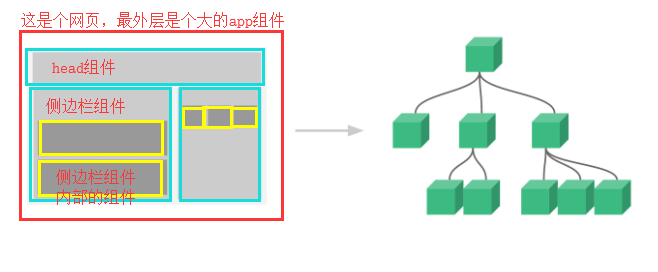
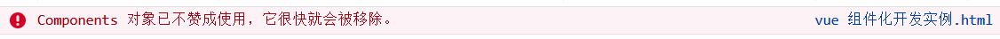
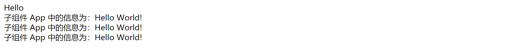
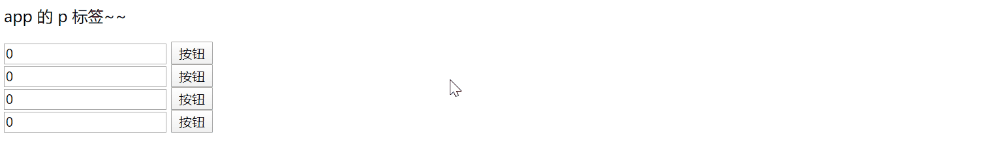
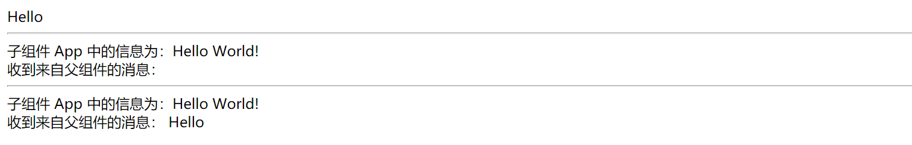
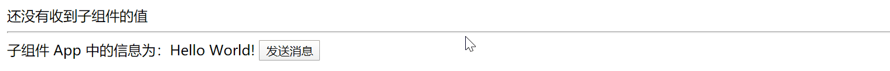
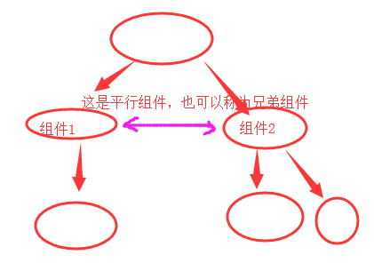
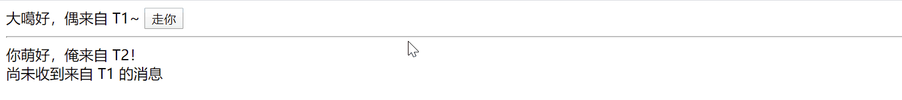

# Vue 的组件化开发

## 组件（component）

组件（Component）是自定义封装的功能。在前端开发过程中，经常出现多个网页的功能是重复的，而且很多不同的网站之间，也存在同样的功能。

而在网页中实现一个功能，需要使用 html 定义功能的内容结构，使用 css 声明功能的外观样式，还要使用 js 来定义功能的特效，因此就产生了把一个功能相关的（HTML、css 和 javascript）代码封装在一起组成一个整体的代码块封装模式，我们称之为“组件”。

所以，组件就是一个 html 网页中的功能，一般就是一个标签。标签中有自己的 html 内容结构、css 样式和 js 特效。

这样，前端人员就可以在开发时，只需要书写一次代码，随处引入即可使用。

还记得我们在进行 vue 开发的时候创建的 vm 对象吗？这个 vm 对象我们称为一个大组件，根组件（页面上叫Root）。在一个网页的开发中，根据网页上的功能区域我们又可以细分成其他组件，或称为子组件。



组件有两种：默认组件（全局组件）和 单文件组件。等一下，我们接下来要讨论的局部组件为什么没有放在这里面呀？这是因为局部组件功能官方已经不支持使用，这里仅仅是为了加深对后面的理解而做的介绍。当我们用火狐浏览器运行带有局部组件的代码时，会有提示的。



这里重点要看的是默认组件，单文件组件不在这里讨论。

### 局部组件

局部组建的使用可分三步：声子、用子、挂子

```html
<!DOCTYPE html>
<html lang="zh-CN">
<head>
    <meta charset="UTF-8">
    <title>vue 局部组件实例</title>
    <script src="js/vue.js"></script>
</head>
<body>
<div id="app">
    <div>{{ msg }}</div>
    <App></App>   <!--3 使用子组件-->
    <App></App>
    <App></App>
</div>
</body>
<script>
    //  1 声明子组件
    let App = {
        data () {
            return {
                AppMsg: 'Hello World!'
            }
        },
        template: `<div>子组件 App 中的信息为：{{ AppMsg }}</div>`
    };
    let vm = new Vue({
        el: '#app',
        data () {
            return {
                msg: 'Hello'
            }
        },
        components: {  // 2 挂载子组件
            App,  // 这个是App:App的简写。如果键名和值名相同，可以省略冒号和值
        },
        // vm 的这里也可以写template，但是会覆盖掉div#app中的内容
        // template:`
        //     <div class="vheader">
        //         这是头部
        //     </div>`
    })
</script>
</html>
```

上面代码执行的结果为：



### 默认组件（全局组件）

直接看代码，局部组件使用时需要挂载，全局组件使用时不需要挂载。那么他们两个什么时候用呢？局部组件就在某个局部使用的时候；全局组件是大家公用的，或者说每个页面都有这么一个功能的时候，在哪里可能都会用到的时候。

来看一个全局组件的实例，从这个例子中我们也能看见，组件之间的数据是独立的，互不影响的：

```html
<!DOCTYPE html>
<html lang="zh-CN">
<head>
    <meta charset="UTF-8">
    <title>vue 默认组件实例</title>
    <script src="js/vue.js"></script>
</head>
<body>
<div id="app">
    <p>app 的 p 标签~~</p>
    <add-num></add-num>
    <add-num></add-num>
    <add-num></add-num>
    <add-num></add-num>
</div>
</body>
<script>
    Vue.component ('add-num', {
        data () {
            return {
                // 写在这里的数据只有当前组件可以使用
                num: 0
            }
        },
        // 组件中的template一定要有一个总的标签包裹，一般是一个div
        template: `<div>
                    <input type="text" v-model="num">
                    <button @click="num++">按钮</button>
                    </div>`
    });
    let vm = new Vue({
        el: '#app',
        data: {},  // 这里写的数据是全局公用的，整个文件共享
    })
</script>
</html>
```

上面代码的效果为：



## 组件传值

### 父组件往子组件传值 

通过 prop 属性进行传值的操作总共可分为两步：

1. 在子组件中使用 props 属性声明，然后可以直接在子组件中任意使用

2. 父组件要定义自定义的属性

来看下面的示例：

```html
<!DOCTYPE html>
<html lang="zh-CN">
<head>
    <meta charset="UTF-8">
    <title>vue 组件传值之父传子</title>
    <script src="js/vue.js"></script>
</head>
<body>
<div id="app">
    <div>{{ msg }}</div>
    <hr>
    <App></App>
    <hr>
    <App :xx="msg"></App>
</div>
</body>
<script>
    let App = {
        data () {
            return {
                AppMsg: 'Hello World!'
            }
        },
        template: `<div>
                子组件 App 中的信息为：{{ AppMsg }}
                <br/>
                收到来自父组件的消息： {{ xx }}
                </div>`,
        props: ['xx',]
    };
    let vm = new Vue({
        el: '#app',
        data () {
            return {
                msg: 'Hello'
            }
        },
        components: {
            App,
        }
    })
</script>
</html>
```

代码运行效果为：




使用父组件传递数据给子组件时，需注意一下几点：

1. 传递数据是变量，则需要在属性左边添加冒号。

   传递数据是变量，这种数据称之为“动态数据传递”

   传递数据不是变量，这种数据称之为”静态数据传递“

2. 父组件中修改了数据，在子组件中会被同步修改，但是子组件中的数据修改了，是不是影响到父组件中的数据。

   这种情况在开发时也被称为“单向数据流”


### 子组件父组件传值 

将值从子组件中传到父组件，总共分两步：

1. 子组件中使用 `this.$emit('fatherHandler',val);`，其中 `fatherHandler` 是父组件中使用子组件的地方添加的绑定自定义事件，

   注意，如果 fatherHandler 报错了，那么可能是你的 vue 版本不支持自定义键名称 fatherHandler 中有大写字母，改成 father-handler 或者直接就全部小写就可以了。

2. 父组件中的 methods 中写一个自定义的事件函数：`appFatherHandler(val){}`，在函数里面使用这个 val，这个 val 就是上面子组件传过来的数据

废话不多说，直接看代码：

```html
<!DOCTYPE html>
<html lang="zh-CN">
<head>
    <meta charset="UTF-8">
    <title>vue 组件传值之子传父</title>
    <script src="js/vue.js"></script>
</head>
<body>
<div id="app">
    <div>{{ son_data }}</div>
    <hr>
    <!-- <子组件标签 @子组件抛出的方法=“父组件方法”></子组件标签> -->
    <App @son="son_data_handler"></App>
</div>
</body>
<script>
    let App = {
        data () {
            return {
                msg: 'Hello World!'
            }
        },
        template: `<div>
                子组件 App 中的信息为：{{ msg }}
                <button @click="send_msg">发送消息</button>
                </div>`,
        methods: {
            send_msg () {
                this.$emit('son', this.msg)    // 函数调用后，把数据抛出
            }
        }
    };
    let vm = new Vue({
        el: '#app',
        data () {
            return {
                son_data: '还没有收到子组件的值'
            }
        },
        methods: {
            son_data_handler (val) {    // 接收到值后，自动触发方法
                this.son_data = val
            }
        },
        components: {
            App,
        }
    })
</script>
</html>
```

代码执行效果为：



### 平行组件传值

什么是平行组件，看图



看代码：声明两个全局组件 T1 和 T2，T1 组件将数据传送给 T2 组件

```html
<!DOCTYPE html>
<html lang="zh-CN">
<head>
    <meta charset="UTF-8">
    <title>vue 组件传值之平行传值</title>
    <script src="js/vue.js"></script>
</head>
<body>
<div id="app">
    <T1></T1>
    <T2></T2>
</div>
</body>
<script>
    let bus = new Vue();    // 公交车，用来传递平行组件间的值
    Vue.component('T1', {
        template: `<div>{{ t1msg }} <button @click="send_msg">走你</button><hr/></div>`,
        data () {
            return {
                t1msg: '大噶好，偶来自 T1~',
                data: 123456,
            }
        },
        methods: {
            send_msg() {
                bus.$emit('t1_data', this.data)    // 把值传给公交车
            }
        }
    });
    Vue.component('T2', {
        template: `<div>{{ msg }}<br/>{{ t1_data }}</div>`,
        data () {
            return {
                msg: '你萌好，俺来自 T2！',
                t1_data: '尚未收到来自 T1 的消息'
            }
        },
        created () {    // 组件对象创建时就要绑定公交车
            bus.$on('t1_data', (val)=>{    // 绑定事件，一旦有值传来，就调用方法接收
                this.t1_data = '已接受到来自 T1 的值：' + val
            })
        }
    });
    let vm = new Vue({el: '#app'})
</script>
</html>
```

代码执行效果为：

