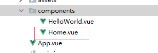
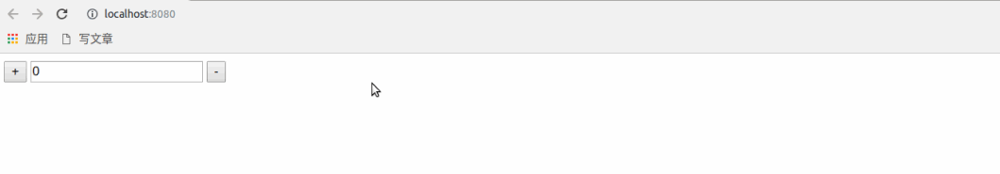
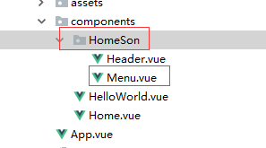
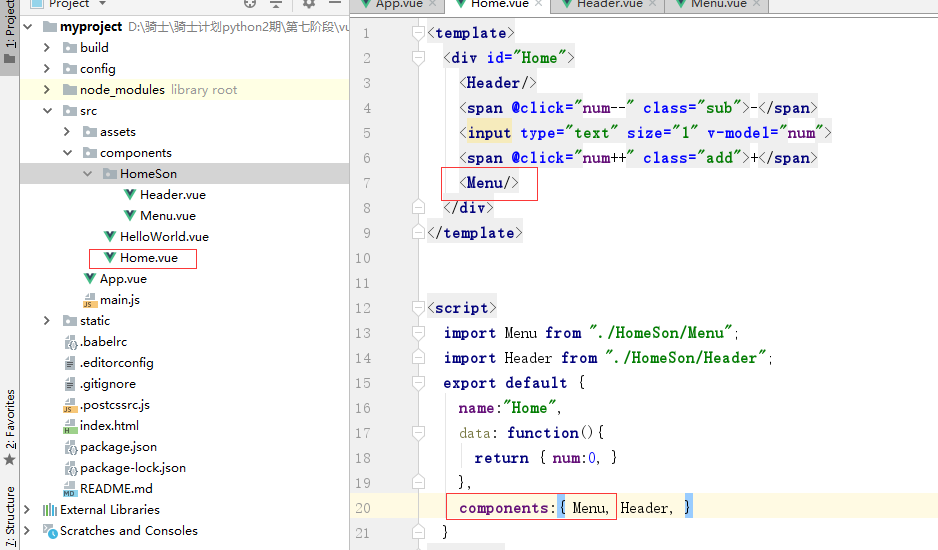
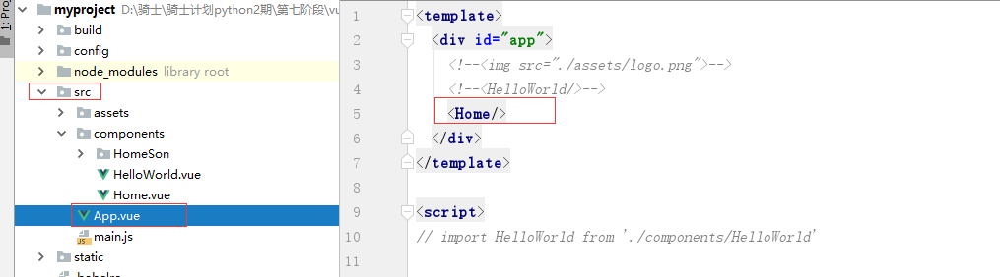
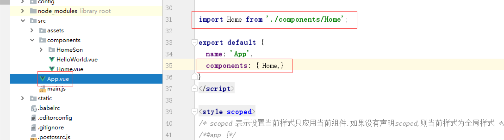
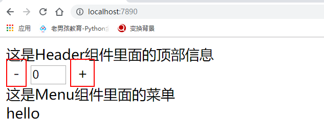
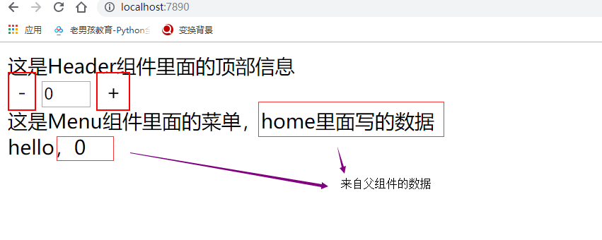
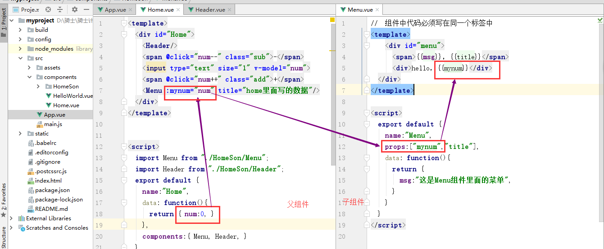

## Vue 单文件组件的使用

在谈论 [Vue 的组件化开发](vue-component-dev.md) 时，我们已经提到过，组件有两种：普通组件和单文件组件。

普通组件的缺点：

1. html 代码是作为 js 的字符串进行编写，所以组装和开发的时候不易理解，而且没有高亮效果。
2. 普通组件用在小项目中非常合适，但是复杂的大项目中，如果把更多的组件放在 html 文件中，那么维护成本就会变得非常昂贵。
3. 普通组件只是整合了 js 和 html，但是 css 代码被剥离出去了。使用的时候的时候不好处理。

将一个组件相关的 html 结构，css 样式，以及交互的 JavaScript 代码从 html 文件中剥离出来，合成一个文件，这个文件就是单文件组件。相当于一个组件具有了结构、表现和行为的完整功能，方便组件之间随意组合以及组件的重用，这种文件的扩展名为“.vue”，比如："Home.vue"。



在组件文件中通常有三个标签，分别用来编写视图、vm 对象（js 代码）和 css 样式代码。

### template 编写 html 代码

```html
<template>
  <div id="Home">
    <span @click="num--" class="sub">-</span>
    <input type="text" size="1" v-model="num">
    <span @click="num++" class="add">+</span>
  </div>
</template>
```

### script 编写 vue.js 代码

```html
<script>
  export default {
    name:"Home",
    data: function(){
      return {
        num:0,
      }
    }
  }
</script>
```

### style 编写当前组件的样式代码

```html
<style scoped>    /* 这里的scoped的含义为，样式效果仅对当前vue文件组件有效 */
  .sub,.add{
    border: 1px solid red;
    padding: 4px 7px;
  }
</style>
```

### 完成案例：点击加减数字

创建 `Homes.vue`

```html
<template>
  <div class="add_num">
    <button @click="num++">+</button>
    <input type="text" v-model="num">
    <button @click="num--">-</button>
  </div>
</template>

<script>
    export default {
        name: "Home",
        data () {
            return {
                num: 0,
            }
        }
    }
</script>

<style scoped>
</style>
```

在 `App.vue` 组件中调用上面的组件

```html
<template>
  <div id="app">
    <Home></Home>
  </div>
</template>

<script>
import Home from "./components/Home";

export default {
  name: 'App',
  components: {
      Home,
  }
}
</script>

<style>
</style>
```

在开发 vue 项目之前，需要手动把 `App.vue` 的 HelloWorld 组件代码以及默认的 css 样式清除掉。

上面的代码效果：



### 组件的嵌套

有时候开发 vue 项目时，页面也可以算是一个大组件，同时页面也可以分成多个子组件。

这就会产生父组件调用子组件的情况。例如，我们可以声明一个组件 `Home.vue` 作为父组件。

在 components/ 下创建一个保存子组件的目录 HomeSon。



在 HomeSon 目录下，可以创建当前页面的子组件。例如，`Menu.vue`。

```html
//  组件中代码必须写在同一个标签中
<template>
    <div id="menu">
      <span>{{msg}}</span>
      <div>hello</div>
  </div>
</template>

<script>
  export default {
    name:"Menu",
    data: function(){
      return {
        msg:"这是Menu组件里面的菜单",
      }
    }
  }
</script>
```

然后，在父组件中调用上面声明的子组件。



最后，父组件被 `App.vue` 调用。就可以看到页面效果。





效果：




### 传递数据

#### 父组件的数据传递给子组件

例如,我们希望把父组件的数据传递给子组件.

可以通过 props 属性来进行数据传递.

传递数据三个步骤：

1. 在父组件中，调用子组件的组名处，使用属性值的方式往下传递数据

   ```vue
   <Menu :mynum="num" title="home里面写的数据"/>
   ```

   上面的例子展示了在父组件调用 Menu 子组件的时候传递数据可以是变量和普通字符串两种形式：

   - 如果要传递变量（变量可以各种类型的数据），属性名左边必须加上冒号 `:`。同时，属性名是自定义的，会在子组件中使用
   - 如果要传递普通字符串数据，则不需要加上冒号

2. 在子组件中接受上面父组件传递的数据，需要在 vm 组件对象中，使用 props 属性类接受。

   ```html
   <script>
     export default {
       name:"Menu",
       props:["mynum","title"],    // 这里接收了两个数据
       data: function(){
         return {
           msg:"这是Menu组件里面的菜单",
         }
       }
     }
   </script>
   ```
   
3. 在子组件中的 template 中使用父组件传递过来的数据。

   ```html
   <template>
       <div id="menu">
         <span>{{msg}}，{{title}}</span>
         <div>hello，{{mynum}}</div>
     </div>
   </template>
   ```

效果：



步骤流程：




使用父组件传递数据给子组件时，需要注意以下几点：

1. 如果传递的数据是变量，则需要在属性左边添加冒号

   - 传递数据是变量，这种数据称之为“动态数据传递”

   - 传递数据不是变量，这种数据称之为“静态数据传递”

2. 父组件中修改了数据，在子组件中会被同步修改。但是子组件中的数据修改了，是不是影响到父组件中的数据的。这种情况在开发时也被称为“单向数据流”


#### 子组件传递数据给父组件

1. 在子组件中，通过 `this.$emit()` 来调用父组件中定义的事件.

   ```html
   <template>
       <div>
         <p>Post的子组件</p>
         <h2>{{fnum}}</h2>
         <p>data={{data}}</p>
         <p>fnum={{fnum}}</p>
         <div><input type="text" v-model="fnum"></div>
       </div>
   </template>
   
   <script>
       export default {
           name: "PostSon",
           // 父组件传递数据给子组件: 1. 在父组件中调用子组件的组件名称标签上面声明属性和传递值，2. 在子组件中通过props进行接收
           props:["data","fnum"],  // 接受父组件中传递过来的数据
           // 子组件传递数据给父组件[事件的方式进行传递]：
           watch:{
             fnum(){
               console.log(this.fnum);
               // this.$emit("父元素的自定义事件","要传递的数据");  // 通过this.$emit()方法，子组件可以把数据传递给父组件
               this.$emit("postparentdata",this.fnum);
             }
           }
       }
   </script>
   <style scoped>
   </style>
   ```
   
2. 父组件中声明一个和子组件中 `this.$emit("自定义事件名称")` 对应的事件属性。

   ```vue
   <template>
       <div>
         <h1>num={{num}}</h1>
         <Son data="我是父组件里面的内容" :fnum="num" @postparentdata="getsondata"></Son>
       </div>
   </template>
   ```
   
3. 父组件中声明一个自定义方法，在自定义事件被调用时执行。

   ```vue
   <script>
       import Son from "./PostSon"
       export default {
           name: "Post",
           data(){
             return {
               num: 100,
             }
           },
           components:{
             Son:Son,
           },
           methods:{
             getsondata(message){
               console.log("父组件"+message);
               this.num = message;
             }
           }
       }
   </script>
   ```

