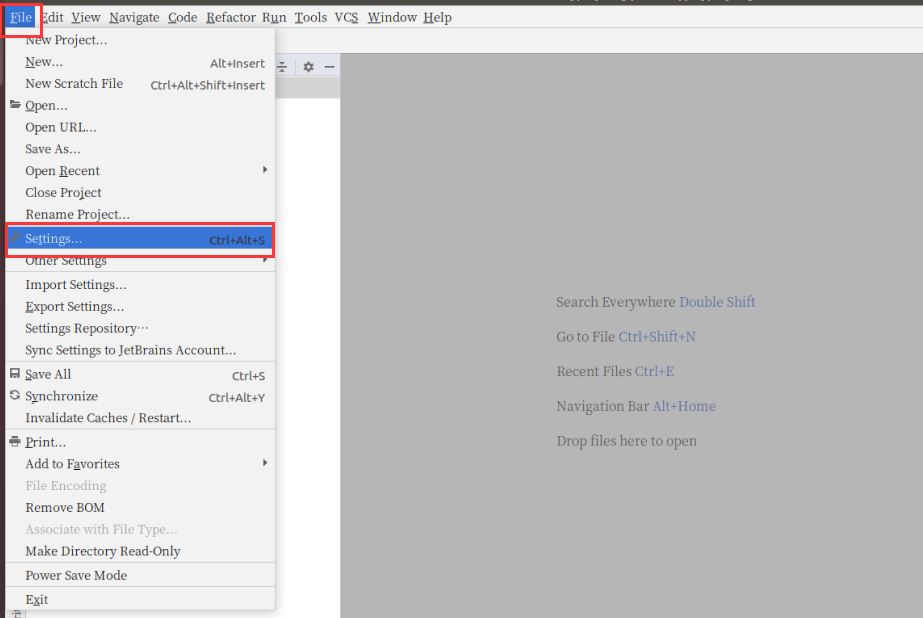
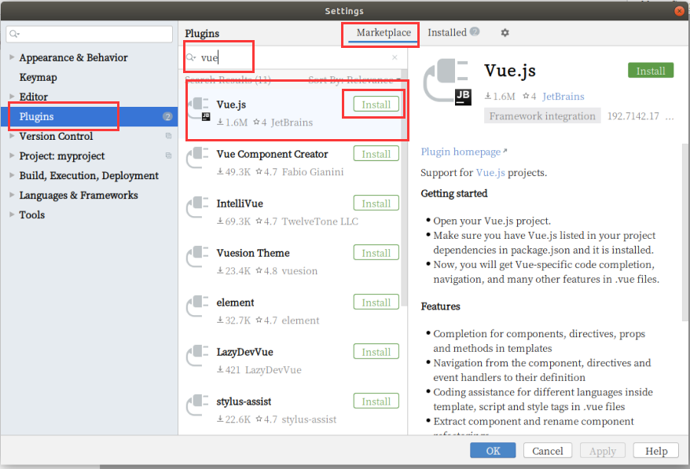
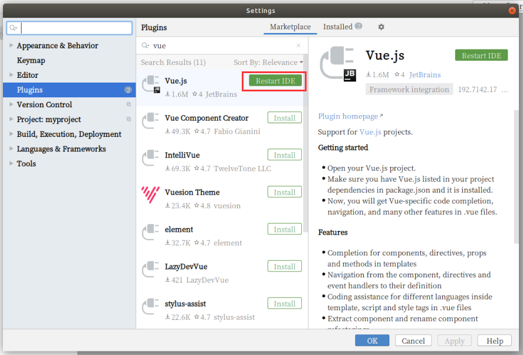
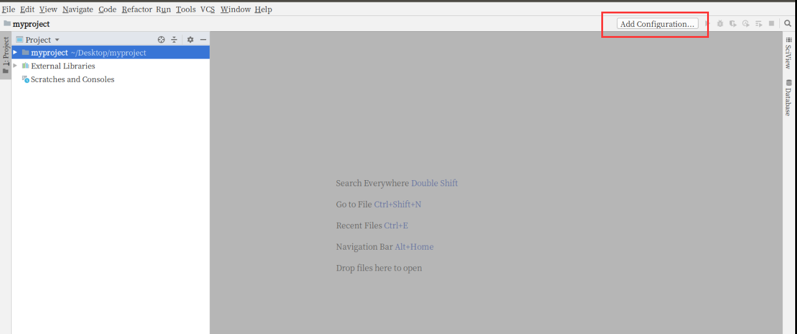
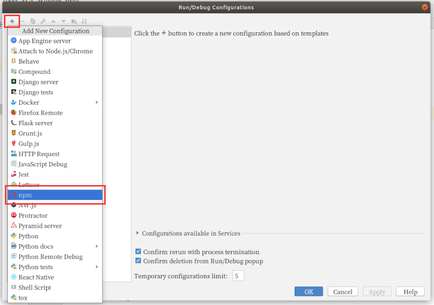
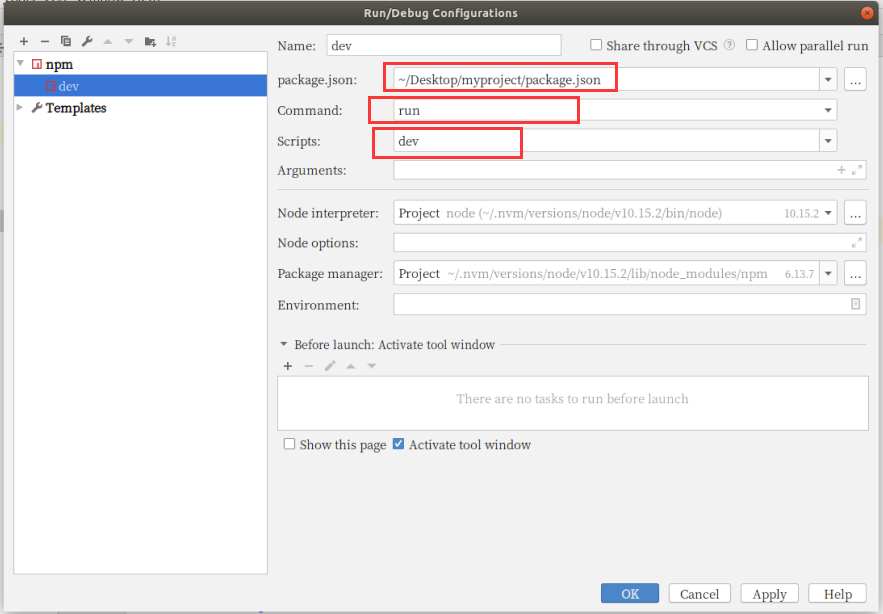
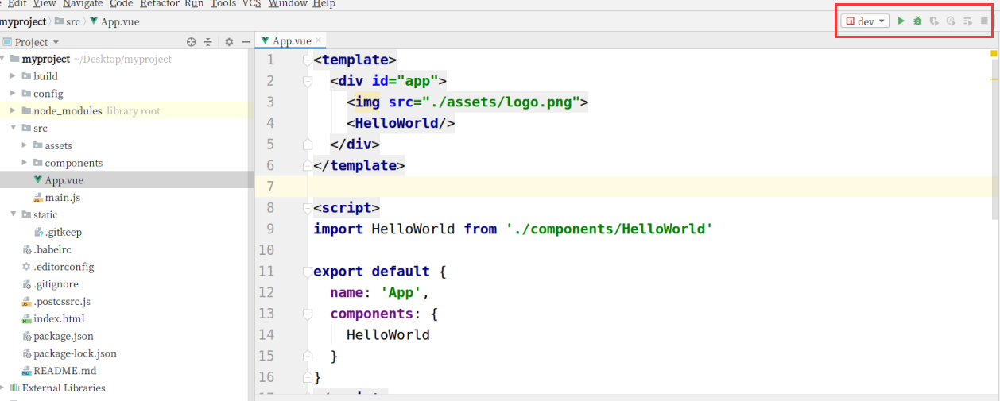
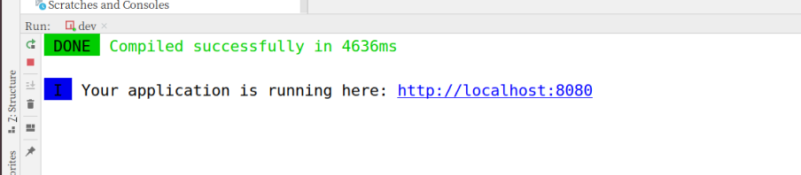
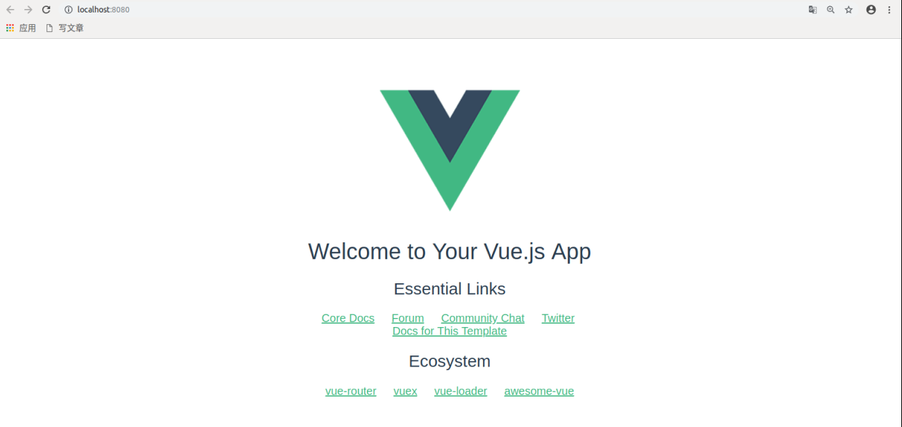

## PyCharm 配置 Vue 开发环境

### 安装 Vue 插件

首先，打开 PyCharm 的设置。

在设置菜单中，点击 Plugins。然后选择上面的 Marketplace，搜索 vue。点击 Vue.js 插件旁边的 Install 按钮，安装插件。

安装好之后，点击 Restart IDE 按钮，重启 PyCharm。

### 设置 npm 运行 vue 项目命令

每次调试时，如果都要通过终端输入命令 `npm run dev` 来启动项目的话，似乎太过麻烦。如果能像启动 django 项目那样，在 PyCharm 中直接按启动按钮就能运行 Vue 将会很方便。好消息是，PyCharm 刚好支持这个功能。有时候这个功能或许不会自动应用，需要我们手动配置一下。

使用 PyCharm 打开 Vue 项目。

点击右上角的 Add Configuration... 按钮。

在弹出的配置窗口中，点击左上角的加号，选择 npm。

确保 `package.json` 是当前项目的 `package.json` 文件。另外，Command 和 Scripts 分别是 run 和 dev。

点击 OK 保存退出后，发现，右上角有了可以启动项目的按钮，点击之后，项目即可顺利运行。

