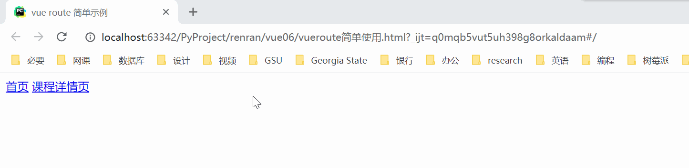

## Vue Router 的简单使用

### 介绍

首先声明，这篇是 Vue Router 的简单使用，更详细的 Vue Router 的使用方法请移步  [Vue 客户端项目搭建](vue-client-build.md#安装路由 vue-router)。

Vue 就是我们前面学习的 Vue 基础，Vue + Vue Router 主要用来做 SPA（Single Page Application），即单页面应用。

为什么要使用单页面应用呢？因为传统的路由跳转，如果后端资源过多，会导致页面出现“白屏现象”，所以我们希望让前端来做路由，在某个生命周期的钩子函数中，发送ajax来请求数据，进行数据驱动，之前比如我们用django的MTV模式，我们是将后端的数据全部渲染给了模板，然后模板再发送给前端进行浏览器页面的渲染，一下将所有的数据都给了页面，而我们现在使用vue，我可以在组件的钩子函数中发送对应的ajax请求去获取对应的数据，而不是裤衩一下子就把数据都放到页面上了，单页面应用给我们提供了很多的便利，说起来大家可能没有什么切实的体会，来，给大家推荐一个 [稀土掘金网站](https://juejin.im/)，这个网站就是一个单页面应用，是一个开发者技术社区网站，里面的资源会有很多，他长这个样子：

　　　　

这样的网站我们通过django是可以来完成页面的渲染的，模板渲染嘛，但是这个论坛的数据资源有很多，我们通过django的MTV模式是一下子就将数据全部放到页面里面了，那么页面通过浏览器渲染的时候，浏览器可能没有那么快渲染出来，会出现几秒钟的白屏现象，也就是说几秒钟之后用户才看到页面的内容，这样体验起来就不好，为了用户体验好，就用到了我们说的单页面应用，django模板渲染做大型应用的时候，也就是页面很复杂，数据量很大的页面的时候，是不太合适的，当然如果你够nb，你也可以优化，但是一般它比较适合一些页面数据比较小的应用。

　　那么解释一下什么是单页应用，看下图：(react、angular也都是做单页面应用，很多大型的网站像网易云音乐，豆瓣等都是react写的单页面应用)

　　　　　　

　　　　

vue + vue-router 就是完成单页面应用的，vue-router（路由）是 vue 的核心插件，其用法可以参考 [Vue Router 官方文档](https://router.vuejs.org/zh/)。

下面我们来下载一下 vue-router。vue-router 的 cnd 链接地址：https://unpkg.com/vue-router/dist/vue-router.js

### 官网简单操作

如果使用模块化机制编程，导入 Vue 和 Vue Router，要调用  `Vue.use(VueRouter)`，参见 [Vue 客户端项目搭建](vue-client-build.md)。

Vue Router 的操作步骤为：

1. 定义（路由）组件。

   ```js
   // 下面两个组件在实际应用中可以从其他文件 import 进来
   const Foo = { template: '<div>foo</div>' }
   const Bar = { template: '<div>bar</div>' }
   ```

2. 定义路由。每个路由应该映射一个组件。 其中 component 可以是通过 `Vue.extend()` 创建的组件构造器，也可以只是一个组件配置对象。

   ```js
   const routes = [
     { path: '/foo', component: Foo },
     { path: '/bar', component: Bar }
   ]
   ```

3. 创建 router 实例，然后传 `routes` 配置。也可以传别的配置参数，不过先这么简单着吧。

   ```js
   const router = new VueRouter({
     routes    // 缩写，相当于 routes: routes
   })
   ```

4. 创建和挂载根实例。记得要将 router 配置参数注入路由，从而让整个应用都有路由功能。

   ```js
   const app = new Vue({
     router
   }).$mount('#app')
   
   // 上面这种写法比较陌生，写成下面这样会好点
   let vm = new Vue({
       el: '#app',
       router，
   })
   ```

5. 接下来，就可以启动项目测试了！

### 简单示例：通过不同的路径访问到不同的组件

代码如下：

```html
<!DOCTYPE html>
<html lang="zh-CN">
<head>
    <meta charset="UTF-8">
    <title>vue route 简单示例</title>
    <!--<script src="js/vue.js"></script>-->
    <!--<script src="js/vue-router.js"></script>-->
    <!-- 注意：测试的时候可能因为你的vue或者vue-router文件有些版本上的冲突问题，导致router-link不能生成a标签，所以建议用下面这两个进行测试，然后再找对应的版本存到本地 -->
    <script src="https://unpkg.com/vue/dist/vue.js"></script>
    <script src="https://unpkg.com/vue-router/dist/vue-router.js"></script>
</head>
<body>
<div id="app">
    <App></App>
</div>
</body>
<script>
    // import VueRouter from 'node_modules/vue-router/dist/vue-router'
    Vue.use(VueRouter);
    let Home = {
        data(){
            return {
                'msg':'hello home',
            }
        },
        template:`
                <div class="home">
                    {{msg}}
                </div>`
    };
    let Course = {
        data(){
            return {
                'msg':'hello course',
            }
        },
        template:`
                <div class="course">
                    {{msg}}
                </div>`
    };
    let App = {
        data(){
            return {}
        },
        template:`
            <div>
                <router-link to="/home">首页</router-link>
                <router-link to="/course">课程详情页</router-link>
                <router-view></router-view>
            </div>`
    };
    let router = new VueRouter({
       // mode:'history',    // 默认链接后面会有#符号，加上这个参数会去掉#号
        routes:[
            // {path:'/',redirect},
            {path:'/home',component:Home},
            {path:'/course',component:Course},
        ]
    });
    let vm = new Vue({
        el:'#app',
        router,
        components:{
            App,
        }
    })
</script>
</html>
```

代码运行的效果为，注意观察链接的变化：

