## HTML 基础

[TOC]

### web 前端开发基础

1. HTML
2. css
3. js
4. jquery
5. bootstrap

我们从前学的网络编程，都是基于C/S 架构的。即，我们写客户端的同时，还要写一个服务端。通过客户端和服务端的交互，实现各种功能。

从今天开始，我们要学习前端开发。前端是基于 B/S 架构的。我们开发的东西以网页的形式呈现。浏览器作为客户端，我们只需要写好服务器的逻辑就可以了。

从本质上讲，浏览器也是基于 socket 开发的。于是，我们就可以写一个服务端，来接收网页访问的数据：

```python
from socket import socket
skt = socket()
addr = ('127.0.0.1', 8001)    # 监听本地8001端口
skt.bind(addr)
skt.listen(5)
while True:
    conn, client_addr = skt.accept()
    acq = conn.recv(1024).decode()
    print(acq)
    conn.send(b'HTTP/1.1 200 ok\r\n\r\n')    # http协议的回应格式，表示连接成功
    conn.send(b'<h1>Hello World!</h1>')    # 一段浏览器能读懂的语句
    conn.close()
```

将程序运行起来后，在浏览器中输入地址 `127.0.0.1:8001`，就可以看到浏览器中看到输出的内容了。

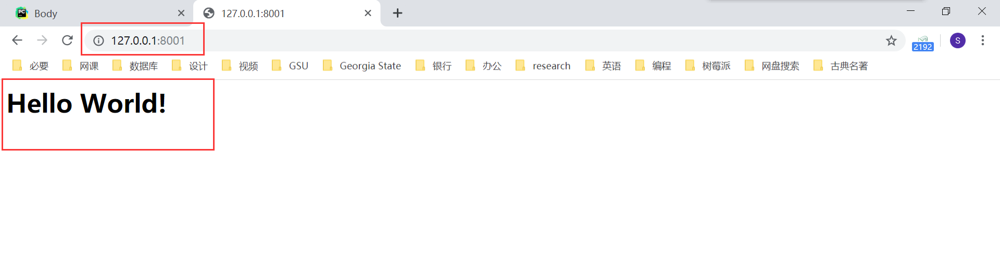

不过我们自己写的 socket 服务端太过简单，以后我们都是在 PyCharm 中打开网页。PyCharm 会自动帮我们配置 socket 服务端。在将来，我们还会通过 web 框架作为服务器。

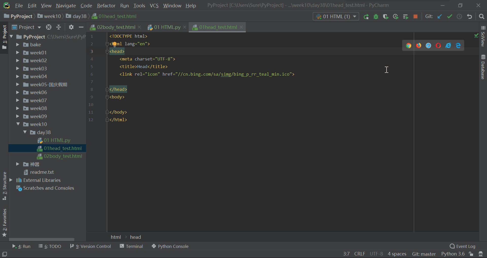

### 文档结构

HTML 语言是一种超文本标记语言（hypertext mark-up language），通过使用一个个标签，实现标记的效果。

其基本的文档结构如下：

```html
<!DOCTYPE html>  <!-- 文档声明 -->
<html lang="en">  <!-- 语言 -->
<head>  <!-- 网站配置信息 -->
    <meta charset="UTF-8">  <!-- 解码方式 -->
    <title>皇家赌场</title>  <!-- 网站标题 -->
</head>
<body>   <!-- 网站显示内容 -->
    <h1>
        <!-- 26期 皇家赌场 -->
    </h1>
</body>
</html>
```

其每个部分的含义为：

- 最开头的 `<!DOCTYPE html>` 用来声明文档类型为 HTML
- 整个文档部分被包含在一对 `<html>` 标签中
- 文档分为 head 和 body 两个部分
- head 标签用来声明文档中的各种属性（比如解码方式，网站标题等，下面会详谈），不会显示在网页中
- body 标签是网页中真正显示的内容，我们的大部分操作也都是在这里进行

### 标签写法分类

```html
全封闭标签  <h1 xx='ss'>xxx</h1>  
标签属性   <h1 xx='ss'>xxx</h1>    xx:属性名  ss:属性值
自封闭标签  <meta charset="UTF-8">
```

### head标签

#### meta 文档字符编码

```html
<!DOCTYPE html>
<html lang="en">
    <head>
        <meta charset="UTF-8">
        <title>我的网页</title>
    </head>
    <body>
        <h1>叫爸爸</h1>
    </body>
</html>
```

#### meta 页面刷新

```html
<!DOCTYPE html>
<html lang="en">
    <head>
        <meta charset="UTF-8">
        <title>世上最牛逼的页面标题</title>
        <meta http-equiv="Refresh" content="2" />    <!--每2秒钟刷新依此页面-->
    </head>
    <body>
        <h1>这是个栗子，快尼玛给我运行起来。</h1>
    </body>
</html>
```

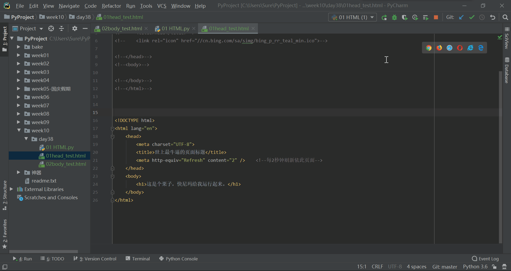

#### meta 关键字

meta 标签可以设置关键字，用于搜索引擎收录和关键字搜索。

```html
<!DOCTYPE html>
<html lang="en">
    <head>
        <meta charset="UTF-8">
        <title>世上最牛逼的页面标题</title>
        <meta name="keywords" content="欧美，日韩，国产，网红,直播" />
    </head>
    <body>
        <h1>这个栗子就别运行老子了，随便去看一个网站的源代码吧。</h1>
    </body>
</html>
```

#### meta 网站描述

meta 标签可以设置网站描述信息，用于在搜索引擎搜索时，显示网站基本描述信息。

```html
<!DOCTYPE html>
<html lang="en">
    <head>
        <meta charset="UTF-8">
        <title>野鸭子</title>
        <meta name="keywords" content="欧美，日韩，国产，网红" />
        <meta name="description" content="野鸭子是一个面向全球的皮条平台。" />
    </head>
    <body>
        <h1>这个栗子就别运行老子了，随便去看一个网站的源代码吧。</h1>
    </body>
</html>
```

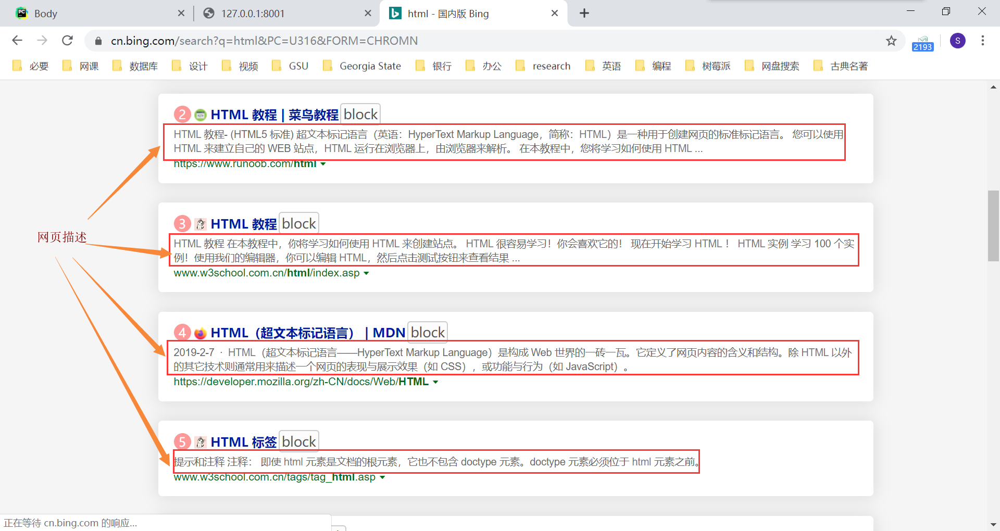

#### meta 触屏缩放

meta 标签可以设置页面是否支持触屏缩放功能，其中各元素的含义如下：

- `width=device-width` ，表示宽度按照设备屏幕的宽度。
- `initial-scale=1.0`，初始显示缩放比例。
- `minimum-scale=0.5`，最小缩放比例。
- `maximum-scale=1.0`，最大缩放比例。
- `user-scalable=yes`，是否支持可缩放比例（触屏缩放）

```html
<!DOCTYPE html>
<html lang="en">
<head>
    <meta charset="UTF-8">
    <title>标题标题标题标题</title>
    
    <!--支持触屏缩放-->
    <meta name="viewport" content="width=device-width, initial-scale=1, user-scalable=yes">

    <!--不支触屏持缩放-->
    <!--<meta name="viewport" content="width=device-width, initial-scale=1, maximum-scale=1, user-scalable=no">-->
</head>
<body>
    <h1 style="width: 1500px;background-color: green;">一起为爱鼓掌吧</h1>
</body>
</html>
```

#### link 图标

```html
<!DOCTYPE html>
<html lang="en">
    <head>
        <meta charset="UTF-8">
        <title>野鸭子</title>
		<link rel="icon" href="图标文件路径">
    </head>
    <body>
        <h1>隔壁王老汉的幸福生活</h1>
    </body>
</html>
```

例如，将图标文件路径设置为必应的图标（按 F12，在控制台中可以找到链接地址）链接 `//cn.bing.com/sa/simg/bing_p_rr_teal_min.ico`，就可以将我们的网页图标替换为必应的了。

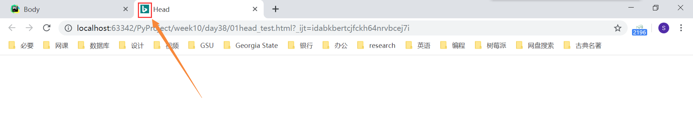

#### 简单 head 内部标签总结

```html
<!DOCTYPE html>
<html lang="en">
<head>
    <meta charset="UTF-8">
    <title>野鸡平台</title>
    <meta name="keywords" content="欧美，日韩，国产，网红"/>
    <meta name="description" content="野鸡是一个面向全球的皮条平台。"/>
    <meta http-equiv="X-UA-Compatible" content="IE=edge">
    
    <meta name="viewport" content="width=device-width, initial-scale=1, user-scalable=yes">
    <link rel="icon" href="//cn.bing.com/sa/simg/bing_p_rr_teal_min.ico">

</head>
<body>
    <h1 style="width: 1500px;background-color: green;">我们一起为爱鼓掌呀！！！</h1>
</body>
</html>
```

### body 标签

#### 直接在 body 中写内容

body 标签里面的没有其他标签包裹的内容，就是**普通文本**显示

```html
<body>
    Hello World!
</body>
```

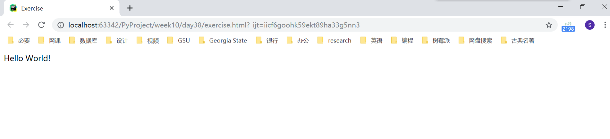

#### 特殊符号

```html
&nbsp; 空格
&gt;  >
&lt;  <
```
#### h1 - h6 标题

与 MarkDown 语言类似，HTML 也只支持六级标题。

```html
<body>
    <h1>一级标题</h1>
    <h2>二级标题</h2>
    <h3>三级标题</h3>
    <h4>四级标题</h4>
    <h5>五级标题</h5>
    <h6>六级标题</h6>
</body>
```

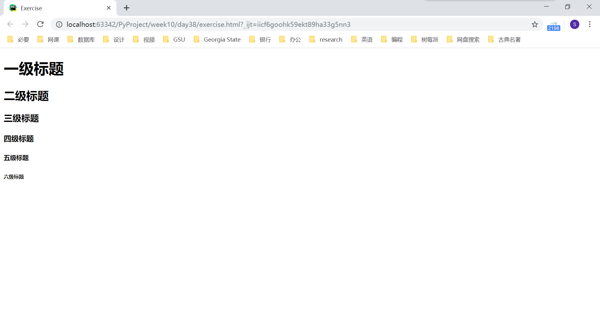

#### br 换行

```html
<h1>一级标题</h1>
<h2>二级<br>标题</h2>
```

注意点:**所有的回车空格等空白内容都被认为是一个空格**

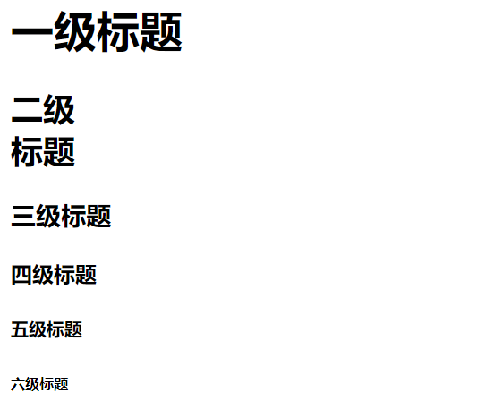

#### hr 一行横线

```html
<h2>三级<hr>标题</h2>
```

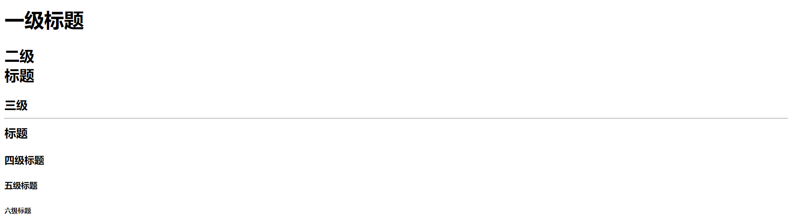

#### a 标签  超链接

1. 不加 href 属性，就是普通文本显示

```html
<a>python短片</a>
```

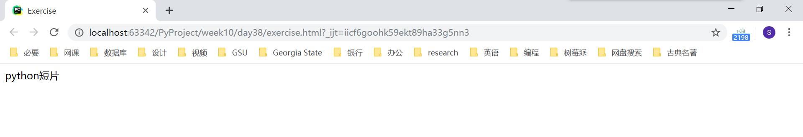

2. 加上 href 属性，不加值，文字有颜色效果，还有下划线，并且点击后会刷新当前的 html 页面

```
<a href="">python短片</a>

```

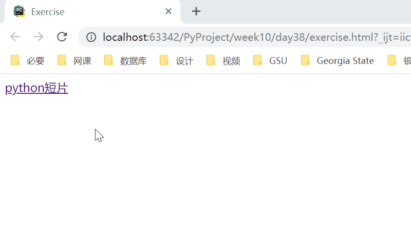

3. 加上 href 属性，并且加上值，跳转对应网址的页面

```html
<a href="https://www.python.org" target="_self">python短片</a>
```

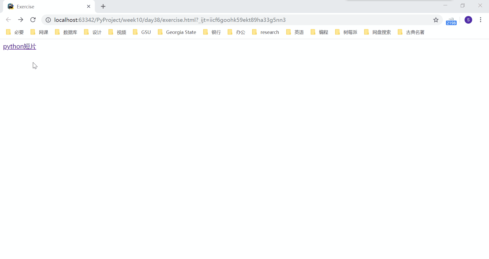

未访问之前是蓝色的字体颜色

访问之后是紫色的字体颜色

我们可以通过设置 target 属性控制是否在新窗口打开链接：

- _self：在当前标签页打开 href 属性值的那个网址
- _blank：在新的标签页打开 href 属性值的那个网址

例如，如果我们将 target 属性值设定为 `_blank`，就会在新窗口打开网页了。


4. 锚点，页面内容进行跳转，可以跳转到页面指定位置

```html
<!DOCTYPE html>
<html lang="en">
<head>
    <meta charset="UTF-8">
    <title>Title</title>
</head>
<body>

<div id="top">这是顶部</div>

<a href="#i1">第一章 初入贵境</a>
<a href="#i2">第二章 开局一人一条狗</a>
<a href="#i3">第三章 就是干</a>
<a href="#i4">第四章 大结局</a>


<div id="i1" style="background-color: red;">第一章 初入贵境</div>
<p>
    没干啥好事儿!!
</p>
<p>
    没干啥好事儿!!
</p>
<p>
    没干啥好事儿!!
</p>
<p>
    没干啥好事儿!!
</p>
<div id="i2" style="background-color: red;">第二章 开局一人一条狗</div>
<p>
    给狗洗澡!!
</p>
<p>
    给狗洗澡!!
</p>
<p>
    给狗洗澡!!
</p>
<p>
    给狗洗澡!!
</p>
<div id="i3" style="background-color: red;">第三章 就是干</div>
<p>
    干狗!!!
</p>
<p>
    干狗!!!
</p>
<p>
    干狗!!!
</p>
<p>
    干狗!!!
</p>
<p>
    干狗!!!
</p>
<div id="i4" style="background-color: red;">第四章 大结局</div>
<p>
    中毒身亡!!!
</p>
<p>
    中毒身亡!!!
</p>
<p>
    中毒身亡!!!
</p>
<p>
    中毒身亡!!!
</p>
<p>
    中毒身亡!!!
</p>
<p>
    中毒身亡!!!
</p>
<p>
    中毒身亡!!!
</p>
<p>
    中毒身亡!!!
</p>
<p>
    中毒身亡!!!
</p>
<p>
    中毒身亡!!!
</p>
<p>
    中毒身亡!!!
</p>
<p>
    中毒身亡!!!
</p>
<p>
    中毒身亡!!!
</p>
<p>
    中毒身亡!!!
</p>
<p>
    中毒身亡!!!
</p>
<p>
    中毒身亡!!!
</p>
<p>
    中毒身亡!!!
</p>

<a href="#top">返回顶部</a>

</body>
</html>
```

描述：标签设置 id 或 name 属性的值(假设为 xx)，a 标签 href 属性的值写法：`href='#xx'`。点击这个 a 标签就能跳转到 id 或 name 属性为 xx 的那个标签所在位置。

在这个例子中，每一章的标题位置都设置了锚点，点击开头的目录，就会跳转到相应的标题。同样，也在顶部设置了锚点，当点击返回顶部的连接时，会直接跳转回顶部。

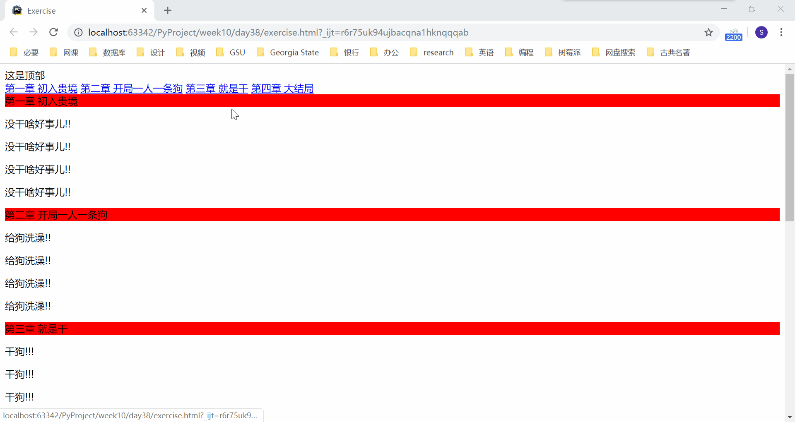

#### img 图片

img 标签用来向页面中插入图片，其基本格式为：

```html


```

我们可以控制 img 标签中的几个属性，来调节图片的显示状态：

- src 属性：图片路径，必须写啊。可以是网络路径，也可以是本地路径。

- alt 属性：图片加载失败或者正在加载时提示的内容

  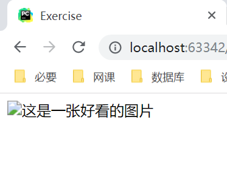

- title 属性：鼠标悬浮时显示的内容

  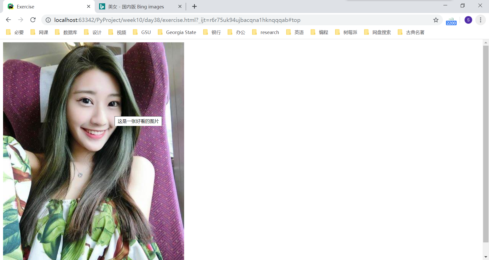

还有两条不常用，日后我们主要会通过css来控制

- width：设置宽度
- height：设置高度

#### div 标签和 span 标签

这两个标签没有任何的文本修饰效果。

正因为这两个标签没有任何文本修饰效果，所以日后我们会大量使用它们。

就好比我们用一张白纸画画要比在一张已经画好的画中修改更舒服。

在新版本的 HTML 5 中又有了更多的没有样式的标签，比如 header、footer 等，若有需要可以去了解一下。

#### 标签分类

- 块级标签（行外标签）：独占一行，比如，h1-h6、p、br、hr、div、ul、li
  - 块级标签能够包含内联标签，和某些块级标签，块级标签能够设置高度宽度
- 内联标签（行内标签）：不独占一行，比如，img、a、span
  - 只能包含内联标签，不能包含块级标签，不能自主设置高度宽度，高度宽度由内容决定

#### ul 和 ol 列表

```html
<!-- 示例：-->
兴趣爱好：
<ul>
    <li>抽烟</li>
    <li>喝酒</li>
    <li>烫头</li>

</ul>

喜欢的姑娘：
<ol type="I" start="2">
    <li>韩红</li>
    <li>贾玲</li>
    <li>李宇春</li>
</ol>

<!-- dl标签了解 -->
<dl>
    <dt>河北省</dt>
    <dd>邯郸</dd>
    <dd>石家庄</dd>
    <dt>山西省</dt>
    <dd>太原</dd>
    <dd>平遥</dd>
</dl>
```

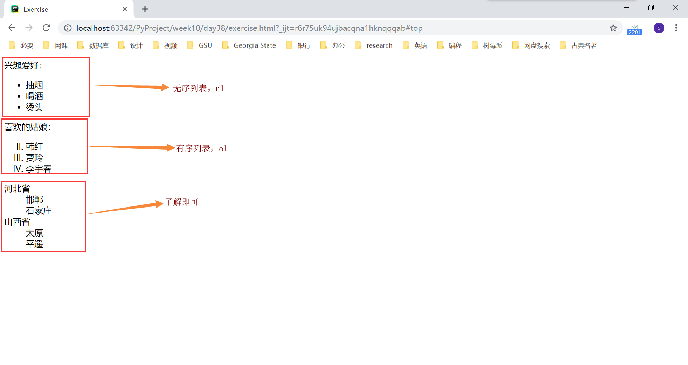

#### table 表格

```html
<table border="1">
    <thead>
        <tr>
            <th>id</th>
            <th>name</th>
            <th>hobby</th>
        </tr>
    </thead>
    <tbody>
        <tr>
            <td>1</td>
            <td>李晨浩</td>
            <td>看电影</td>
        </tr>
        <tr>
            <td>2</td>
            <td>冯俊</td>
            <td>迟到</td>
        </tr>
        <tr>
            <td>3</td>
            <td>大圣</td>
            <td>玩棍儿</td>
        </tr>
    </tbody>
</table>
```

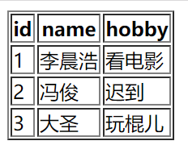

表格合并（`rowspan="2"`：纵行合并；`colspan='2'`：横列合并）

```html
<table border="1">
    <thead>
        <tr>
            <th>id</th>
            <th>name</th>
            <th>hobby</th>
        </tr>
    </thead>
    <tbody>
        <tr>
            <td>1</td>
            <td>李晨浩</td>
            <td rowspan="2">看电影</td>
            <!--<td>看电影</td>-->
        </tr>
        <tr>
            <td>2</td>
            <td>冯俊</td>
            <!--<td>迟到</td>-->
        </tr>
        <tr>
            <td>3</td>
            <td colspan="2">大圣</td>
            <!--<td>玩棍儿</td>-->
        </tr>
    </tbody>
</table>
```

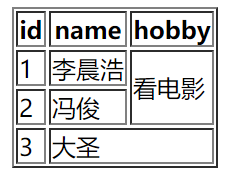

#### form 表单

用来提交表单中的数据

```html
<form action="http://127.0.0.1:8001" method="post" novalidate autocomplete="off">
</form>
```

- action 属性：指定提交路径，要把数据提交到哪里去。
- method 属性：提交的方法，可以是 post 或 get
- novalidate 属性：不要浏览器对数据进行校验
- autocomplete 属性：根据历史输入的内容，提示用户输入，on 开启，off 关闭

form 表单标签会将嵌套在 form 标签里面的输入框的数据全部提交到指定路径。

#### input 输入框

input 标签，如果要提交数据，别忘了写 **name 属性**  例如：`name='username' username='zhangjianzhi'`，name 属性将作为键传给后端，用来标记值。

```html
<input type="text">   普通文本输入框
<input type="password"> 密文输入框
<input type="submit" value="登录">  提交按钮  触发form表单提交数据的动作
<input type="reset"> 重置按钮 清空输入的内容
<input type="button" value="注册"> 普通按钮  不会触发form表单提交数据的动作
<input type="date">  时间日期输入框
<input type="file">  文件选择框
<input type="number">  纯数字输入框

单选框
    性别
    <input type="radio" name="sex" value="1">男  
    <input type="radio" name="sex" value="2">女
复选框(多选框)
    喜欢的明星:
    <input type="checkbox" name="hobby" value="1"> 波多 
    <input type="checkbox" name="hobby" value="2"> 小泽
    <input type="checkbox" name="hobby" value="3"> 仓井
```

我们使用下面的代码进行测试：

```html
<form action="http://127.0.0.1:8001">
    请输入用户名：<input type="text" name="username">
    请输入密码：<input type="password" name="password">
    <input type="submit" value="提交">
    <input type="reset">
</form>
```

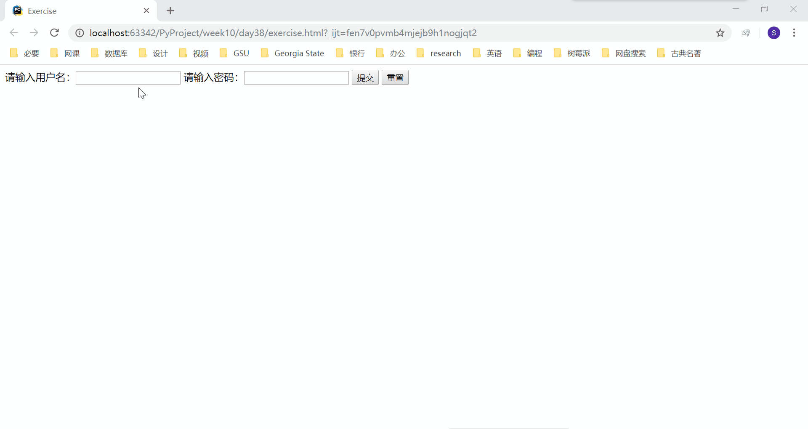

顺利在 socket 端接收到我们输入的用户名和密码信息。

#### label 标签

给输入框加上标签，这样当用户点击标签内容的时候，输入框就会自动获取光标。

```html
<label >用户名: 
    <input type="text" name="username" id="username">
</label>
<label for="password">密码: </label>
<input type="password" name="password" id="password">
```

#### button 按钮

```html
普通按钮,没有提交效果
<input type="button">
<button type="button">注册</button>

下面两个能够提交form表单数据。如果不写，button默认为submit
<input type="submit" value='登录'>
<button type="submit">注册</button>
```

#### select 下拉框

```html
<!--单选下拉框-->
<select name="city" id="city">
    <option value="1">北京</option>
    <option value="2">上海</option>
    <option value="3">深圳</option>
    <option value="4">惠州</option>

</select>
<!--多选下拉框-->
<select name="citys" id="citys" multiple>
    <option value="1">北京</option>
    <option value="2">上海</option>
    <option value="3">深圳</option>
    <option value="4">惠州</option>
</select>

```

操作多选下拉框，需要按住 `ctrl` 键进行多选。

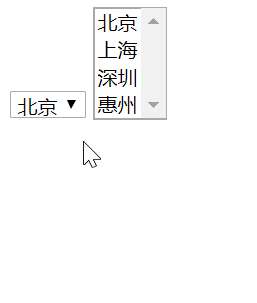

#### textarea 多行文本输入框

```html
<textarea name="comment" id="comment" cols="20" rows="10"></textarea>
```

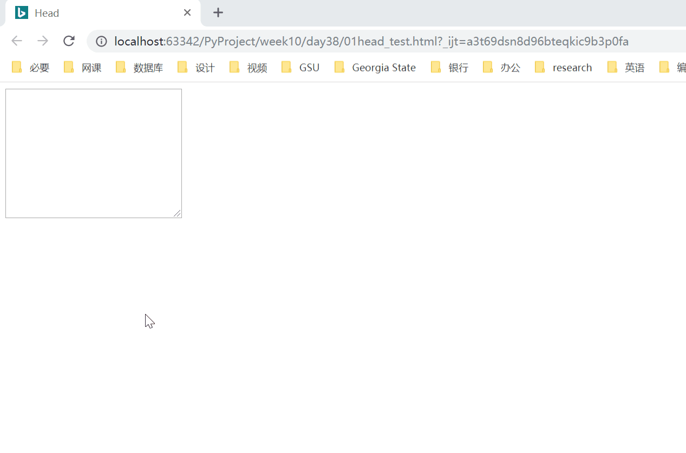
