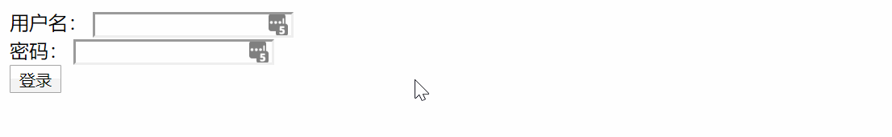
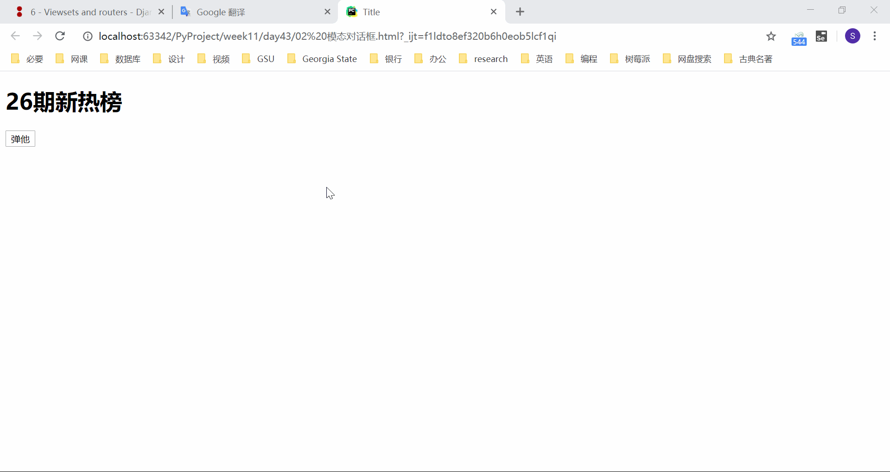
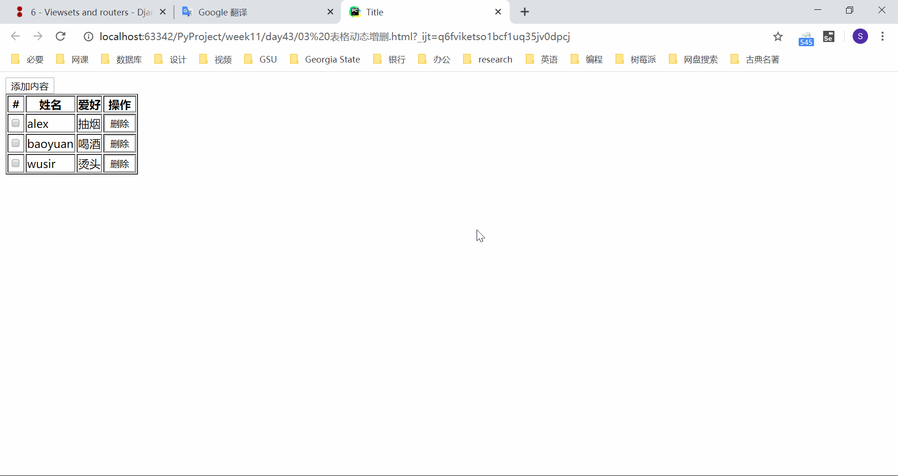
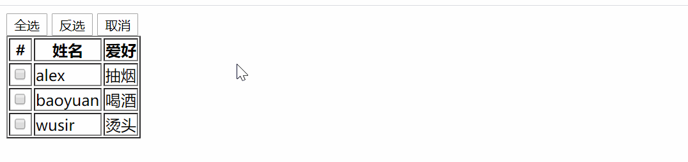
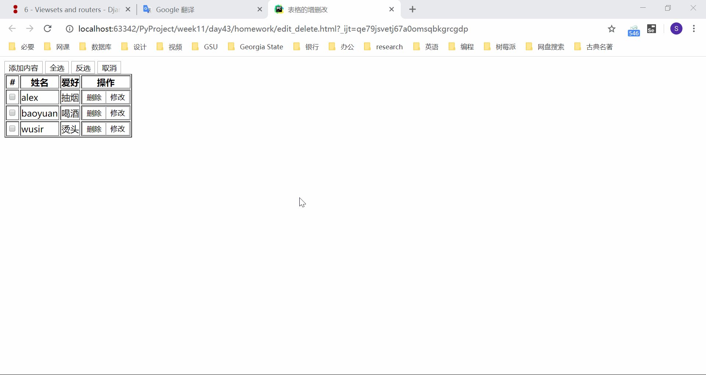
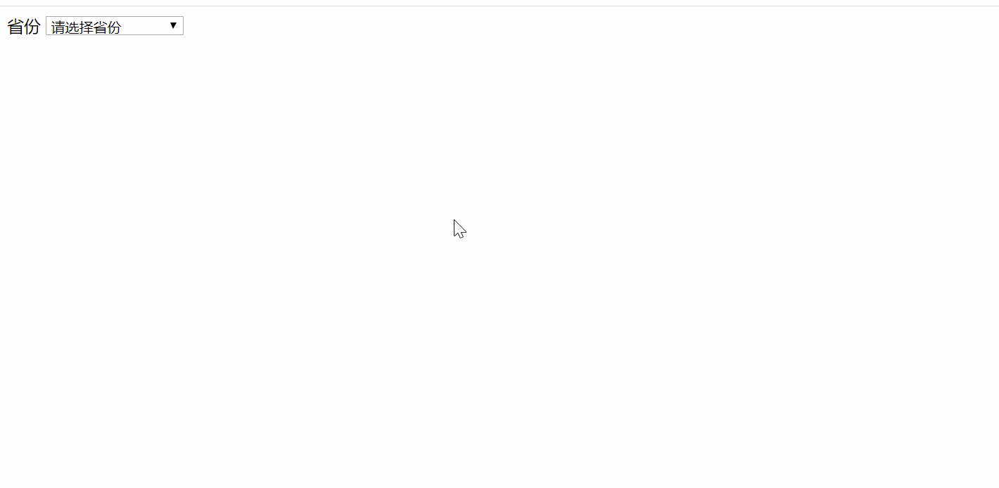

## js 小脚本集合

练习用的 js 脚本，或许用得上。

### 原生 js 验证用户名和密码不能为空

```html
<!DOCTYPE html>
<html lang="zh-CN">
<head>
    <meta charset="UTF-8">
    <title>Title</title>
</head>
<body>
<form action="">
    <span id="ss"></span>
    <div>
        <label for="username">用户名：</label>
        <input type="text" name="username" id="username">
        <span class="error" style="font-size: 12px; color: red;"></span>
    </div>
    <div>
        <label for="password">密码：</label>
        <input type="password" name="password" id="password">
        <span class="error" style="font-size: 12px; color: red;"></span>
    </div>
    <button type="button" id="btn">登录</button>
</form>

<script>
    var btnEle = document.getElementById('btn');
    btnEle.onclick = function () {
        document.getElementById('ss').innerText = '';
        var unameEle = document.getElementById('username');
        var uname = unameEle.value;
        unameEle.nextElementSibling.innerHTML = '';
        var pwdEle = document.getElementById('password');
        var pwd = pwdEle.value;
        pwdEle.nextElementSibling.innerHTML = '';
        if (uname.trim().length === 0) {
            unameEle.nextElementSibling.innerHTML = '用户名不能为空！'
        }
        else if (pwd.trim().length === 0) {
            pwdEle.nextElementSibling.innerHTML = '密码不能为空！'
        }
        else{
            document.getElementById('ss').innerText = '登陆成功！'
        }
    }
</script>
</body>
</html>
```

代码执行效果：



### jQuery 模态对话框

```html
<!DOCTYPE html>
<html lang="zh-CN">
<head>
    <meta charset="UTF-8">
    <title>Title</title>
    <style>
        .shadow{
            position: fixed;  /* 固定定位 */
            top:0;
            left: 0;
            right: 0;
            bottom: 0;
            background-color: rgba(0,0,0,0.8);
            z-index: 90; /* 控制定位的元素的层级,数字越大越在上层显示 */
            display: none;
        }
        .login{
            position: fixed;
            top:50%;
            left: 50%;
            background-color: white;
            width: 300px;
            height: 360px;
            z-index: 100;
            margin-left: -150px;
            margin-top: -180px;
            display: none;
        }
    </style>
</head>
<body>
<h1>26期新热榜</h1>
<button id="btn">弹他</button>

<div class="login">
    <!--<form action="">-->
        <h3 style="text-align: center">欢迎来到王者荣耀</h3>

        <div>
            用户名:<input type="text">
        </div>
        <div>
             密码:<input type="text">
        </div>
        <div>
            <button id="login-btn">登录</button>
            <button id="login-cancel">取消</button>
        </div>
    <!--</form>-->
</div>

<div class="shadow"></div>

</body>
<script src="jquery.js"></script>
<script>
    $('#btn').click(function () {
        $('.login').css('display', 'block');
        $('.shadow').css('display', 'block')
    })
</script>
<script>
    $('#login-cancel').click(function () {
        $('.login').css('display', 'none');
        $('.shadow').css('display', 'none')
    })
</script>
</html>
```

代码执行效果：



### jQuery 表格动态增删

```html
<!DOCTYPE html>
<html lang="en">
<head>
    <meta charset="UTF-8">
    <title>Title</title>
        <style>
        .shadow{
            position: fixed;  /* 固定定位 */
            top:0;
            left: 0;
            right: 0;
            bottom: 0;
            background-color: rgba(0,0,0,0.8);
            z-index: 90; /* 控制定位的元素的层级,数字越大越在上层显示 */
            display: none;
        }
        .insert-win{
            position: fixed;
            top:50%;
            left: 50%;
            background-color: white;
            width: 300px;
            height: 360px;
            z-index: 100;
            margin-left: -150px;
            margin-top: -180px;
            display: none;
        }

    </style>
</head>
<body>
<button type="button" class="insert-btn">添加内容</button>
<table border="1">
    <thead>
    <tr>
        <th>#</th>
        <th>姓名</th>
        <th>爱好</th>
        <th>操作</th>
    </tr>
    </thead>
    <tbody>
    <tr>
        <td><input type="checkbox" name="select" value="1"></td>
        <td>alex</td>
        <td>抽烟</td>
        <td><button type="button" class="delete">删除</button></td>
    </tr>
    <tr>
        <td><input type="checkbox" name="select" value="2"></td>
        <td>baoyuan</td>
        <td>喝酒</td>
        <td><button type="button" class="delete">删除</button></td>
    </tr>
    <tr>
        <td><input type="checkbox" name="select" value="3"></td>
        <td>wusir</td>
        <td>烫头</td>
        <td><button type="button" class="delete">删除</button></td>
    </tr>
    </tbody>
</table>
<div class="insert-win">
    <!--<form action="">-->
        <h3 style="text-align: center">请输入要插入的数据内容</h3>

        <div>
            姓名:<input type="text" name="name" id="name">
        </div>
        <div>
             爱好:<input type="text" name="hobby" id="hobby">
        </div>
        <div>
            <button id="insert">插入</button>
            <button id="insert-cancel">取消</button>
        </div>
    <!--</form>-->
</div>

<div class="shadow"></div>
</body>
<script src="jquery.js"></script>
<script>
    $('.insert-btn').click(function () {
        $('.insert-win').css('display', 'block');
        $('.shadow').css('display', 'block')
    });
    $('#insert-cancel').click(function () {
        $('.insert-win').css('display', 'none');
        $('.shadow').css('display', 'none');
        $('#name').val('');
        $('#hobby').val('');
    });
    $('tbody').on('click', '.delete', function () {
        $(this).parent().parent().remove()
    });
    $('#insert').click(function () {
        var name = $('#name').val();
        var hobby = $('#hobby').val();
        var code = `<tr><td><input type="checkbox" name="select" value="3"></td><td>${name}</td><td>${hobby}</td><td><button type="button" class="delete">删除</button></td></tr>`;
        $('tbody').append(code);
        $('.insert-win').css('display', 'none');
        $('.shadow').css('display', 'none');
        $('#name').val('');
        $('#hobby').val('');
    })
</script>
</html>
```

代码示例：



### jQuery 全选反选取消选择

```html
<!DOCTYPE html>
<html lang="zh-CN">
<head>
    <meta charset="UTF-8">
    <title>Title</title>
</head>
<body>
<button type="button" id="select_all">全选</button>
<button type="button" id="reverse_select">反选</button>
<button type="button" id="cancel_select">取消</button>
<table border="1">
    <thead>
    <tr>
        <th>#</th>
        <th>姓名</th>
        <th>爱好</th>
    </tr>
    </thead>
    <tbody>
    <tr>
        <td><input type="checkbox" name="select" value="1"></td>
        <td>alex</td>
        <td>抽烟</td>
    </tr>
    <tr>
        <td><input type="checkbox" name="select" value="2"></td>
        <td>baoyuan</td>
        <td>喝酒</td>
    </tr>
    <tr>
        <td><input type="checkbox" name="select" value="3"></td>
        <td>wusir</td>
        <td>烫头</td>
    </tr>
    </tbody>
</table>

</body>
<script src="jquery.js"></script>
<script>
    $('#select_all').click(function () {
        $(':checkbox').prop('checked', true)
    });
    $('#cancel_select').click(function () {
        $(':checkbox').prop('checked', false)
    });
    $('#reverse_select').click(function () {
        for (var i = 0; i < $(':checkbox').length; i++) {
            if ($(':checkbox').eq(i).prop('checked')) {
                $(':checkbox').eq(i).prop('checked', false)
            }
            else {
                $(':checkbox').eq(i).prop('checked', true)
            }
        }
    })
</script>

</html>
```



### jQuery 表格动态增删改查 + 全选反选取消选择

```html
<!DOCTYPE html>
<html lang="en">
<head>
    <meta charset="UTF-8">
    <title>表格的增删改</title>
    <style>
        .shadow{
            position: fixed;
            left: 0;
            top: 0;
            right: 0;
            bottom: 0;
            background-color: rgba(0, 0, 0, 0.9);
        }
        .win{
            background-color: #ffffff;
            height: 350px;
            width: 300px;
            position: fixed;
            top: 50%;
            left: 50%;
            margin-left: -150px;
            margin-top: -175px;
            z-index: 10;
        }
        .hide{
            display: none;
        }
    </style>
</head>
<body>
<div class="shadow hide"></div>
<div class="insert-win win hide">
    <h3 style="text-align: center">请输入要插入的数据内容</h3>
    <div>
        姓名:<input type="text" name="name" id="insert-name">
    </div>
    <div>
         爱好:<input type="text" name="hobby" id="insert-hobby">
    </div>
    <div>
        <button id="insert">插入</button>
        <button id="insert-cancel">取消</button>
        </div>
</div>
<div class="edit-win win hide">
    <h3 style="text-align: center">请输入要修改的数据内容</h3>
    <div>
        姓名:<input type="text" name="name" id="edit-name">
    </div>
    <div>
         爱好:<input type="text" name="hobby" id="edit-hobby">
    </div>
    <div>
        <button id="edit">修改</button>
        <button id="edit-cancel">取消</button>
        </div>
</div>
<button type="button" class="insert-btn">添加内容</button>
<button type="button" class="select-all">全选</button>
<button type="button" class="reverse-select">反选</button>
<button type="button" class="cancel-select">取消</button>
<table border="1">
    <thead>
    <tr>
        <th>#</th>
        <th>姓名</th>
        <th>爱好</th>
        <th>操作</th>
    </tr>
    </thead>
    <tbody>
    <tr>
        <td><input type="checkbox" name="select" value="1" class="check"></td>
        <td>alex</td>
        <td>抽烟</td>
        <td><button type="button" class="delete">删除</button><button type="button" class="edit">修改</button></td>
    </tr>
    <tr>
        <td><input type="checkbox" name="select" value="2" class="check"></td>
        <td>baoyuan</td>
        <td>喝酒</td>
        <td><button type="button" class="delete">删除</button><button type="button" class="edit">修改</button></td>
    </tr>
    <tr>
        <td><input type="checkbox" name="select" value="3" class="check"></td>
        <td>wusir</td>
        <td>烫头</td>
        <td><button type="button" class="delete">删除</button><button type="button" class="edit">修改</button></td>
    </tr>
    </tbody>
</table>
</body>
<script src="jquery.js"></script>
<script>
    $('.insert-btn').click(function () {
        $('.shadow').removeClass('hide');
        $('.insert-win').removeClass('hide')
    });
    $('#insert-cancel').click(function () {
        $('.shadow').addClass('hide');
        $('.insert-win').addClass('hide');
        $('#insert-name').val('');
        $('#insert-hobby').val('')
    });
    $('#edit-cancel').click(function () {
        $('.shadow').addClass('hide');
        $('.edit-win').addClass('hide');
        $('#edit-name').val('');
        $('#edit-hobby').val('')
    });
    $('#insert').click(function () {
        var name = $('#insert-name').val();
        var hobby = $('#insert-hobby').val();
        var tag_cbox = $('<td>').append($('<input>', {type: "checkbox", name: "select", value: "3", class: "check"}));
        var tag_name = $('<td>').text(name);
        var tag_hobby = $('<td>').text(hobby);
        var button_delete = $('<button>', {type: "button", class: "delete"}).text('删除');
        var button_edit = $('<button>', {type: "button", class: "edit"}).text('修改');
        var tag_operation = $('<td>').append(button_delete).append(button_edit);
        var new_tag = $('<tr>').append(tag_cbox).append(tag_name).append(tag_hobby).append(tag_operation);
        $('tbody').append(new_tag);
        $('#insert-name').val('');
        $('#insert-hobby').val('');
        $('.shadow').addClass('hide');
        $('.insert-win').addClass('hide');
    });
    $('#edit').click(function () {
        var name = $('#edit-name').val();
        var hobby = $('#edit-hobby').val();
        edit_tag.parent().prev().text(hobby);
        edit_tag.parent().prev().prev().text(name);
        $('.shadow').addClass('hide');
        $('.edit-win').addClass('hide');
        $('#edit-name').val('');
        $('#edit-hobby').val('')
    });
    $('tbody').on('click', '.delete', function () {
        $(this).parent().parent().remove()
    });
    $('tbody').on('click', '.edit', function () {
        $('.shadow').removeClass('hide');
        $('.edit-win').removeClass('hide');
        edit_tag = $(this)
    });
    $('.select-all').click(function () {
        $('.check').prop('checked', true)
    });
    $('.cancel-select').click(function () {
        $('.check').prop('checked', false)
    });
    $('.reverse-select').click(function () {
        for (var i = 0; i < $('.check').length; i++) {
            var check_status = $('.check').eq(i).prop('checked');
            $('.check').eq(i).prop('checked', !check_status)
        }
    })
</script>
</html>
```

代码执行效果



### jQuery 联动标签

```html
<!DOCTYPE html>
<html lang="zh-CN">
<head>
    <meta charset="UTF-8">
    <title>联动标签</title>
    <style>
        .hide{
            display: none;
        }
    </style>
</head>
<body>
<label for="province">省份</label>
<select name="province" id="province">
    <option value="0">请选择省份</option>
</select>
<label for="city" class="city hide">城市</label>
<select name="city" id="city" class="city hide">
    <option value="0">请选择城市</option>
</select>
</body>
<script src="jquery.js"></script>
<script>
    var data = {
        北京: ["东城区", "西城区", "崇文区", "宣武区", "朝阳区", "海淀区", "丰台区", "石景山区", "房山区", "通州区", "顺义区", "昌平区", "大兴区", "怀柔区", "平谷区", "门头沟区", "密云县", "延庆县"],
        天津: ["和平区", "河东区", "河西区", "南开区", "河北区", "红桥区", "东丽区", "西青区", "北辰区", "津南区", "武清区", "宝坻区", "滨海新区", "静海县", "宁河县", "蓟县"],
        上海: ["黄浦区", "卢湾区", "徐汇区", "长宁区", "静安区", "普陀区", "闸北区", "虹口区", "杨浦区", "闵行区", "宝山区", "嘉定区", "浦东新区", "金山区", "松江区", "青浦区", "奉贤区", "崇明县"],
        重庆: ["渝中区", "大渡口区", "江北区", "南岸区", "北碚区", "渝北区", "巴南区", "长寿区", "双桥区", "沙坪坝区", "万盛区", "万州区", "涪陵区", "黔江区", "永川区", "合川区", "江津区", "九龙坡区", "南川区", "綦江县", "潼南县", "荣昌县", "璧山县", "大足县", "铜梁县", "梁平县", "开县", "忠县", "城口县", "垫江县", "武隆县", "丰都县", "奉节县", "云阳县", "巫溪县", "巫山县", "石柱土家族自治县", "秀山土家族苗族自治县", "酉阳土家族苗族自治县", "彭水苗族土家族自治县"],
        河北: ["石家庄", "唐山", "秦皇岛", "邯郸", "邢台", "保定", "张家口", "承德", "沧州", "廊坊", "衡水"],
        山西: ["太原", "大同", "阳泉", "长治", "晋城", "朔州", "晋中", "运城", "忻州", "临汾", "吕梁"],
        辽宁: ["沈阳", "大连", "鞍山", "抚顺", "本溪", "丹东", "锦州", "营口", "阜新", "辽阳", "盘锦", "铁岭", "朝阳", "葫芦岛"],
        吉林: ["长春", "吉林", "四平", "辽源", "通化", "白山", "松原", "白城", "延边朝鲜族自治州"],
        黑龙江: ["哈尔滨", "齐齐哈尔", "鹤岗", "双鸭山", "鸡西", "大庆", "伊春", "牡丹江", "佳木斯", "七台河", "黑河", "绥化", "大兴安岭"],
        江苏: ["南京", "苏州", "无锡", "常州", "镇江", "南通", "泰州", "扬州", "盐城", "连云港", "徐州", "淮安", "宿迁"],
        浙江: ["杭州", "宁波", "温州", "嘉兴", "湖州", "绍兴", "金华", "衢州", "舟山", "台州", "丽水"],
        安徽: ["合肥", "芜湖", "蚌埠", "淮南", "马鞍山", "淮北", "铜陵", "安庆", "黄山", "滁州", "阜阳", "宿州", "巢湖", "六安", "亳州", "池州", "宣城"],
        福建: ["福州", "厦门", "莆田", "三明", "泉州", "漳州", "南平", "龙岩", "宁德"],
        江西: ["南昌", "景德镇", "萍乡", "九江", "新余", "鹰潭", "赣州", "吉安", "宜春", "抚州", "上饶"],
        山东: ["济南", "青岛", "淄博", "枣庄", "东营", "烟台", "潍坊", "济宁", "泰安", "威海", "日照", "莱芜", "临沂", "德州", "聊城", "滨州", "菏泽"],
        河南: ["郑州", "开封", "洛阳", "平顶山", "安阳", "鹤壁", "新乡", "焦作", "濮阳", "许昌", "漯河", "三门峡", "南阳", "商丘", "信阳", "周口", "驻马店"],
        湖北: ["武汉", "黄石", "十堰", "荆州", "宜昌", "襄樊", "鄂州", "荆门", "孝感", "黄冈", "咸宁", "随州", "恩施"],
        湖南: ["长沙", "株洲", "湘潭", "衡阳", "邵阳", "岳阳", "常德", "张家界", "益阳", "郴州", "永州", "怀化", "娄底", "湘西"],
        广东: ["广州", "深圳", "珠海", "汕头", "韶关", "佛山", "江门", "湛江", "茂名", "肇庆", "惠州", "梅州", "汕尾", "河源", "阳江", "清远", "东莞", "中山", "潮州", "揭阳", "云浮"],
        海南: ["海口", "三亚"],
        四川: ["成都", "自贡", "攀枝花", "泸州", "德阳", "绵阳", "广元", "遂宁", "内江", "乐山", "南充", "眉山", "宜宾", "广安", "达州", "雅安", "巴中", "资阳", "阿坝", "甘孜", "凉山"],
        贵州: ["贵阳", "六盘水", "遵义", "安顺", "铜仁", "毕节", "黔西南", "黔东南", "黔南"],
        云南: ["昆明", "曲靖", "玉溪", "保山", "昭通", "丽江", "普洱", "临沧", "德宏", "怒江", "迪庆", "大理", "楚雄", "红河", "文山", "西双版纳"],
        陕西: ["西安", "铜川", "宝鸡", "咸阳", "渭南", "延安", "汉中", "榆林", "安康", "商洛"],
        甘肃: ["兰州", "嘉峪关", "金昌", "白银", "天水", "武威", "酒泉", "张掖", "庆阳", "平凉", "定西", "陇南", "临夏", "甘南"],
        青海: ["西宁", "海东", "海北", "海南", "黄南", "果洛", "玉树", "海西"],
        内蒙古: ["呼和浩特", "包头", "乌海", "赤峰", "通辽", "鄂尔多斯", "呼伦贝尔", "巴彦淖尔", "乌兰察布", "锡林郭勒盟", "兴安盟", "阿拉善盟"],
        广西: ["南宁", "柳州", "桂林", "梧州", "北海", "防城港", "钦州", "贵港", "玉林", "百色", "贺州", "河池", "来宾", "崇左"],
        西藏: ["拉萨", "那曲", "昌都", "林芝", "山南", "日喀则", "阿里"],
        宁夏: ["银川", "石嘴山", "吴忠", "固原", "中卫"],
        新疆维吾尔自治区: ["乌鲁木齐", "克拉玛依", "吐鲁番", "哈密", "和田", "阿克苏", "喀什", "克孜勒苏", "巴音郭楞", "昌吉", "博尔塔拉", "伊犁", "塔城", "阿勒泰"],
        香港: ["香港岛", "九龙东", "九龙西", "新界东", "新界西"],
        澳门: ["澳门半岛", "离岛"],
        台湾: ["台北", "高雄", "基隆", "新竹", "台中", "嘉义", "台南市"]
    };
    var pro = $('#province');
    for (var i in data) {
        pro.append(`<option value="${i}">${i}</option>`)
    }
    pro.change(function () {
        var city = $('#city');
        city.empty();
        city.append('<option value="0">请选择城市</option>');
        var pro_val = pro.val();
        if (pro_val === '0') {
            $('.city').addClass('hide')
        }
        else {
            $('.city').removeClass('hide');
            for (j in data[pro_val]) {
                city.append(`<option value="${data[pro_val][j]}">${data[pro_val][j]}</option>`)
            }
        }
    })
</script>
</html>
```

代码执行效果：

